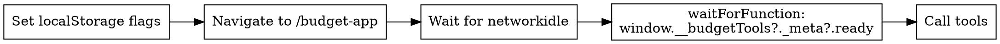

# Browser Budget Testing via WebMCP Bridge

## Overview

The budget app exposes 9 tool handlers on `window.__budgetTools` in dev mode, giving Playwright full read/write access to budget data through the React context layer. This bridge bypasses API routes entirely — tools run inside the browser against IndexedDB.

## When to Use

- Testing budget app features end-to-end via Playwright
- Querying budget data programmatically (transactions, categories, balances)
- Writing automated e2e tests for budget functionality
- Using Playwright MCP (`browser_navigate`, `browser_evaluate`) to interact with budget data

## When NOT to Use

- Unit testing individual hooks (use Vitest + `fake-indexeddb`)
- Testing API routes directly (use `fetch` or Supertest)
- Non-budget pages in the LMS app

## Prerequisites

```
Dev server running:     npm run dev  (port 3000)
Playwright headless:    --headless in .mcp.json args (required for WSL2)
Chrome user-data clean: rm -rf ~/.cache/ms-playwright/mcp-chrome-*
```

## Bridge Activation Sequence



**Required localStorage flags:**

| Flag | Value | Purpose |
|------|-------|---------|
| `budget-playwright-bridge` | `"true"` | Enables bridge in dev mode (bypasses compile-time feature flag) |
| `budget_app_onboarding_completed` | `"true"` | Skips onboarding step-through modal |
| `budget-app-wizard-completed` | `"true"` | Dismisses the OnboardingTour full-screen overlay (z-100, blocks all interaction) |
| `budget-app-onboarding` | `{"completed":true,"skipped":false}` | Dismisses the WelcomeBanner component |

**In Playwright tests**, use `addInitScript` so flags are set before page load:

```typescript
async function setupBridge(page: Page) {
  await page.addInitScript(() => {
    localStorage.setItem("budget-playwright-bridge", "true");
    localStorage.setItem("budget_app_onboarding_completed", "true");
    localStorage.setItem("budget-app-wizard-completed", "true");
    localStorage.setItem("budget-app-onboarding", '{"completed":true,"skipped":false}');
  });
  await page.goto("/budget-app");
  await page.waitForLoadState("networkidle");
}

async function waitForBridge(page: Page) {
  await page.waitForFunction(
    () => window.__budgetTools?._meta?.ready === true,
    null,
    { timeout: 15_000 },
  );
}
```

**Via Playwright MCP** (`browser_evaluate`), set flags then reload:

```javascript
// Step 1: Set flags
localStorage.setItem('budget-playwright-bridge', 'true');
localStorage.setItem('budget_app_onboarding_completed', 'true');
localStorage.setItem('budget-app-wizard-completed', 'true');
localStorage.setItem('budget-app-onboarding', '{"completed":true,"skipped":false}');
// Step 2: browser_navigate to /budget-app again
// Step 3: Verify
window.__budgetTools?._meta  // { ready: true, toolCount: 9, ... }
```

## Tool Reference

### Read-Only Tools

| Tool | Input | Returns |
|------|-------|---------|
| `list_categories` | `{ type: "all"\|"expense"\|"income" }` | `{ categories: [...], count }` |
| `get_budget_summary` | `{ month?: "YYYY-MM" }` | `{ month, totalIncome, totalExpenses, netSavings, transactionCount, topCategories }` |
| `get_spending_by_category` | `{ month?: "YYYY-MM", type?: "expense"\|"income" }` | `{ month, categories: [...] }` |
| `get_account_balances` | `{ accountId?: string }` | `{ accounts: [...] }` |
| `get_subscriptions` | `{ status?: "active"\|"paused"\|"cancelled"\|"all" }` | `{ subscriptions: [...] }` |
| `search_transactions` | `{ query?, category?, limit? (1-100), ... }` | `{ transactions: [...], count }` |

### Write Tools

| Tool | Input | Returns |
|------|-------|---------|
| `add_transaction` | `{ accountId, date, description, amount, category?, ... }` | `{ success: true, action: "created", ... }` or `{ error }` |
| `categorize_transaction` | `{ transactionId, category, subcategory? }` | `{ success: true, action: "updated", ... }` or `{ error }` |
| `set_budget_limit` | `{ categoryId, amount (positive), period?, rollover? }` | `{ success: true, action: "created\|updated", ... }` or `{ error }` |

### Utilities

| Property | Type | Purpose |
|----------|------|---------|
| `_meta` | `BudgetToolsMeta` | `{ ready, toolCount, privacyMode, dataLoaded, lastRefresh }` |
| `refresh()` | `() => Promise<void>` | Force reload data from IndexedDB |

## Error Handling

**Zod validation errors THROW, they do not return `{ error }`.**

```typescript
// WRONG: Expects { error } return
const result = await page.evaluate(() =>
  window.__budgetTools!.get_budget_summary({ month: "bad" })
);
expect(result.error).toBeDefined(); // This never runs — evaluate throws

// CORRECT: Catch the thrown ZodError
const error = await page.evaluate(async () => {
  try {
    await window.__budgetTools!.get_budget_summary({ month: "bad" });
    return null;
  } catch (e) { return (e as Error).message; }
});
expect(error).toContain("invalid");
```

**Business logic errors return `{ error: string }`** (nonexistent account, missing transaction).

**Privacy mode** returns `{ error: "Privacy mode is active. Financial data is hidden." }` from all tools.

## Common Pitfalls

| Pitfall | Cause | Fix |
|---------|-------|-----|
| Chrome timeout in WSL2 | Missing `--headless` flag | Add `--headless` to Playwright args in `.mcp.json` |
| Bridge not activating | Flag set after page load | Use `addInitScript` or set flag then re-navigate |
| `__budgetTools` is undefined | Bridge flag missing or not in dev mode | Check `localStorage.budget-playwright-bridge === "true"` and `NODE_ENV === "development"` |
| Empty categories/transactions | Fresh browser context = empty IndexedDB | Don't assert `count > 0` in clean state; check structure instead |
| Dev server lock conflict | Running `playwright test` while `npm run dev` holds `.next/dev/lock` | Use `BASE_URL=http://localhost:3000` with root `playwright.config.ts` instead of `tests/e2e/playwright.config.ts` |
| Stale Chrome profile | Previous non-headless session left lock files | `rm -rf ~/.cache/ms-playwright/mcp-chrome-*` |
| Data not refreshed after write | Write tools trigger async refresh | Call `window.__budgetTools.refresh()` then wait before reading |
| Onboarding overlay blocks page | Missing `budget-app-wizard-completed` flag | Set all 4 localStorage flags listed above; the OnboardingTour renders at z-100 and captures all clicks |

## Running the E2E Tests

```bash
# Against existing dev server on port 3000 (recommended)
BASE_URL=http://localhost:3000 npx playwright test tests/e2e/webmcp-bridge.spec.ts \
  --config playwright.config.ts --project chromium

# Via e2e config (starts own server on port 3007 — dev server must NOT be running)
npx playwright test tests/e2e/webmcp-bridge.spec.ts \
  --config tests/e2e/playwright.config.ts
```

## Key Source Files

| File | Role |
|------|------|
| `src/hooks/webmcp/WebMCPToolsRegistrar.ts` | Loads data, registers 9 tools, exposes `window.__budgetTools` |
| `src/hooks/webmcp/useWebMCPEnabled.ts` | Feature detection — bridge flag bypass for dev mode |
| `src/hooks/webmcp/schemas.ts` | Zod input schemas for all 9 tools |
| `src/hooks/webmcp/use*.ts` | Individual tool handler hooks |
| `src/types/playwright-bridge.d.ts` | TypeScript declarations for `window.__budgetTools` |
| `tests/e2e/webmcp-bridge.spec.ts` | Playwright test suite (21 tests) |
