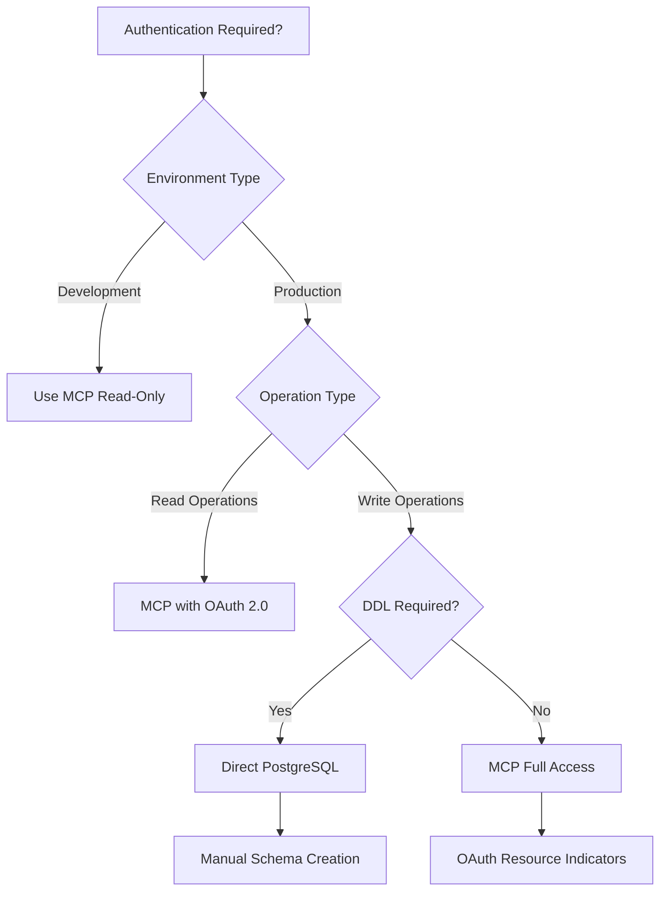
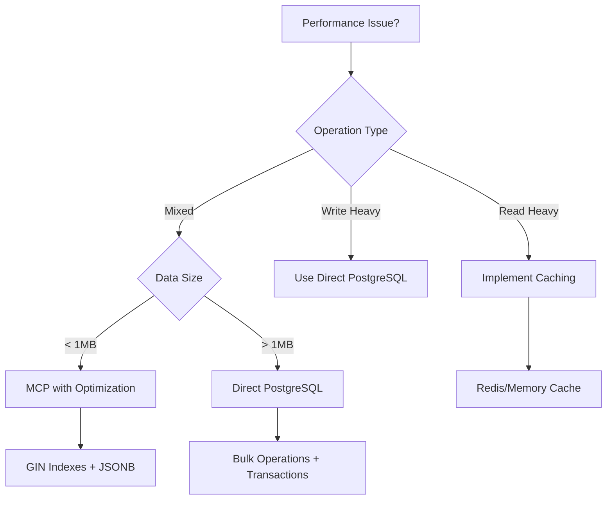

# Integration Patterns Guide: Supabase MCP vs PostgreSQL Native

## Overview

This guide provides decision frameworks and integration patterns for choosing between Supabase MCP and direct PostgreSQL client approaches in the Tanium TCO Study Platform development.

## 🤔 Decision Matrix

### When to Use Supabase MCP

| Scenario                    | MCP Advantage                          | Use Case Examples                     |
| --------------------------- | -------------------------------------- | ------------------------------------- |
| **Content Retrieval**       | Standardized protocol, built-in auth   | Fetching study modules, user progress |
| **Read-Only Operations**    | Safe, controlled access                | Analytics dashboards, reporting       |
| **AI Tool Integration**     | Native LLM compatibility               | Content generation, smart search      |
| **Development Environment** | Quick setup, no credentials management | Local development, testing            |
| **Multi-Client Support**    | Protocol standardization               | Web app, mobile app, desktop tools    |

**Optimal MCP Use Cases**:

```javascript
// Content queries through MCP
const studyModules = await mcp_supabase.query({
  table: "study_modules",
  select: "id, title, content, metadata",
  filter: { "metadata->status": "published" },
  limit: 50,
});

// Real-time subscriptions
const subscription = mcp_supabase.subscribe({
  table: "user_progress",
  event: "UPDATE",
  callback: updateProgressUI,
});
```

### When to Use Direct PostgreSQL Client

| Scenario                  | PostgreSQL Advantage      | Use Case Examples                   |
| ------------------------- | ------------------------- | ----------------------------------- |
| **Schema Operations**     | Full DDL support          | Database migrations, table creation |
| **Bulk Operations**       | Direct performance        | Content migration, data seeding     |
| **Complex Transactions**  | ACID compliance           | Multi-table updates, data integrity |
| **Production Deployment** | No protocol overhead      | High-performance queries, caching   |
| **Custom Functions**      | Native PL/pgSQL execution | Complex business logic, triggers    |

**Optimal PostgreSQL Use Cases**:

```javascript
// Schema creation and migrations
await pg.query(`
  CREATE TABLE study_modules (
    id UUID DEFAULT uuid_generate_v4() PRIMARY KEY,
    metadata JSONB DEFAULT '{}',
    search_vector TSVECTOR
  )
`);

// Bulk data operations
const batchInsert = await pg.query(
  `
  INSERT INTO study_modules (title, content, metadata)
  SELECT * FROM unnest($1::text[], $2::text[], $3::jsonb[])
`,
  [titles, contents, metadataArray]
);

// Complex analytics queries
const analytics = await pg.query(`
  WITH progress_stats AS (
    SELECT user_id, AVG(progress_percentage) as avg_progress
    FROM user_progress
    WHERE created_at >= NOW() - INTERVAL '30 days'
    GROUP BY user_id
  )
  SELECT COUNT(*), percentile_cont(0.5) WITHIN GROUP (ORDER BY avg_progress)
  FROM progress_stats
`);
```

## 🔐 Authentication Decision Flow

### Authentication Complexity Assessment



### Authentication Configuration Patterns

**Development Environment (MCP Read-Only)**:

```json
{
  "supabase-mcp": {
    "command": "npx",
    "args": ["@supabase/mcp-server-supabase@latest", "--read-only"],
    "env": {
      "SUPABASE_ACCESS_TOKEN": "sbp_development_token",
      "SUPABASE_PROJECT_REF": "project_ref"
    }
  }
}
```

**Production Environment (Direct PostgreSQL)**:

```javascript
import { createClient } from "@supabase/supabase-js";

const supabase = createClient(
  process.env.NEXT_PUBLIC_SUPABASE_URL,
  process.env.SUPABASE_SERVICE_ROLE_KEY
);

// Direct database access for complex operations
const { data, error } = await supabase
  .from("study_modules")
  .select("*")
  .filter("metadata->difficulty", "eq", "advanced");
```

## 🚨 Error Pattern Recognition & Resolution

### Common Error Patterns

#### MCP Authentication Errors

**Pattern**: `Unauthorized. Please provide a valid access token`

```javascript
// Resolution Strategy
const troubleshootMCPAuth = async () => {
  // 1. Verify token validity
  const tokenValid = await verifySupabaseToken(process.env.SUPABASE_ACCESS_TOKEN);

  // 2. Check OAuth endpoints
  const oauthEndpoints = await checkOAuthEndpoints();

  // 3. Validate PKCE flow
  const pkceValid = await validatePKCEImplementation();

  if (!tokenValid) return regenerateToken();
  if (!oauthEndpoints) return implementOAuthEndpoints();
  if (!pkceValid) return fixPKCEFlow();
};
```

**Resolution Priority**:

1. Token regeneration (5 minutes)
2. OAuth endpoint implementation (30 minutes)
3. PKCE flow correction (45 minutes)

#### DDL Operation Errors

**Pattern**: `Cannot apply migration in read-only mode`

```javascript
// Resolution Strategy
const handleDDLOperations = async () => {
  if (environment === "development") {
    // Switch to direct PostgreSQL for DDL
    return await executeWithPostgreSQLClient();
  } else {
    // Remove read-only flag and implement proper auth
    return await configureMCPFullAccess();
  }
};
```

#### Function Discovery Errors

**Pattern**: `Could not find the function public.exec_sql(sql)`

```javascript
// Resolution Strategy
const handleFunctionErrors = (operation) => {
  const availableFunctions = ["search_content", "get_user_progress", "calculate_completion_rate"];

  if (!availableFunctions.includes(operation.function)) {
    // Create function manually or use direct SQL
    return createCustomFunction(operation.function);
  }

  return callAvailableFunction(operation.function);
};
```

## 📊 Performance Optimization Workflows

### Performance Decision Tree



### Caching Strategies

**MCP with Caching**:

```javascript
// Implement smart caching for MCP operations
class MCPCache {
  constructor() {
    this.cache = new Map();
    this.ttl = 300000; // 5 minutes
  }

  async query(params) {
    const cacheKey = JSON.stringify(params);
    const cached = this.cache.get(cacheKey);

    if (cached && Date.now() - cached.timestamp < this.ttl) {
      return cached.data;
    }

    const data = await mcp_supabase.query(params);
    this.cache.set(cacheKey, { data, timestamp: Date.now() });
    return data;
  }
}
```

**PostgreSQL with Connection Pooling**:

```javascript
// Optimize direct PostgreSQL connections
import { Pool } from "pg";

const pool = new Pool({
  connectionString: process.env.DATABASE_URL,
  max: 20,
  idleTimeoutMillis: 30000,
  connectionTimeoutMillis: 2000,
});

// Prepared statements for repeated queries
const getModulesByDifficulty = await pool.query(`
  PREPARE get_modules (text) AS
  SELECT * FROM study_modules 
  WHERE metadata->>'difficulty' = $1
  ORDER BY created_at DESC
`);
```

## 🛡️ Security Compliance Checklist

### Development Environment Security

- [ ] **MCP Read-Only Mode**: Enabled by default
- [ ] **Token Rotation**: Development tokens rotated monthly
- [ ] **Environment Isolation**: Separate tokens for dev/staging/prod
- [ ] **Access Logging**: All MCP operations logged
- [ ] **Error Handling**: No sensitive data in error messages

### Production Environment Security

- [ ] **OAuth 2.0 Resource Indicators**: Implemented and tested
- [ ] **PKCE Flow**: Validated and monitored
- [ ] **Certificate Management**: SSL/TLS certificates current
- [ ] **Access Control**: Row Level Security (RLS) policies active
- [ ] **Audit Trails**: All database operations logged
- [ ] **Data Encryption**: At-rest and in-transit encryption enabled

### Security Implementation Examples

**Row Level Security Setup**:

```sql
-- Enable RLS for all tables
ALTER TABLE study_modules ENABLE ROW LEVEL SECURITY;
ALTER TABLE user_progress ENABLE ROW LEVEL SECURITY;

-- Policies for different user roles
CREATE POLICY "students_view_published" ON study_modules
FOR SELECT USING (metadata->>'status' = 'published');

CREATE POLICY "instructors_view_all" ON study_modules
FOR ALL USING (auth.jwt() ->> 'role' = 'instructor');

-- Audit trigger
CREATE OR REPLACE FUNCTION audit_changes() RETURNS TRIGGER AS $$
BEGIN
  INSERT INTO audit_log (table_name, operation, old_data, new_data, user_id)
  VALUES (TG_TABLE_NAME, TG_OP, to_jsonb(OLD), to_jsonb(NEW), auth.uid());
  RETURN COALESCE(NEW, OLD);
END;
$$ LANGUAGE plpgsql;
```

## 🔄 Migration Patterns

### MCP to PostgreSQL Migration

**Step-by-Step Migration**:

```javascript
// 1. Identify MCP operations
const mcpOperations = analyzeCurrentMCPUsage();

// 2. Categorize operations
const readOperations = mcpOperations.filter((op) => op.type === "SELECT");
const writeOperations = mcpOperations.filter((op) => op.type !== "SELECT");

// 3. Migrate write operations first (higher impact)
for (const operation of writeOperations) {
  await migrateToPGClient(operation);
  await validateMigration(operation);
}

// 4. Migrate read operations gradually
for (const operation of readOperations) {
  await implementPGAlternative(operation);
  await runABTest(operation); // Compare performance
  await switchTraffic(operation); // Gradual rollout
}
```

### Performance Testing Framework

**Comparative Performance Testing**:

```javascript
class PerformanceComparator {
  async compareApproaches(operation, testCases) {
    const results = {
      mcp: await this.benchmarkMCP(operation, testCases),
      postgresql: await this.benchmarkPG(operation, testCases),
    };

    return {
      winner: results.mcp.avgTime < results.postgresql.avgTime ? "MCP" : "PostgreSQL",
      timeDifference: Math.abs(results.mcp.avgTime - results.postgresql.avgTime),
      recommendation: this.generateRecommendation(results),
    };
  }

  generateRecommendation(results) {
    if (results.mcp.avgTime < results.postgresql.avgTime * 0.8) {
      return "Use MCP - significantly faster";
    } else if (results.postgresql.avgTime < results.mcp.avgTime * 0.8) {
      return "Use PostgreSQL - significantly faster";
    } else {
      return "Consider other factors: maintainability, features, complexity";
    }
  }
}
```

## 📈 Monitoring and Observability

### Integration Health Monitoring

**Health Check Implementation**:

```javascript
class IntegrationHealthMonitor {
  async checkMCPHealth() {
    try {
      const response = await mcp_supabase.query({
        table: "health_check",
        select: "status",
        limit: 1,
      });
      return { status: "healthy", latency: response.latency };
    } catch (error) {
      return { status: "unhealthy", error: error.message };
    }
  }

  async checkPostgreSQLHealth() {
    try {
      const result = await pg.query("SELECT NOW()");
      return { status: "healthy", latency: result.duration };
    } catch (error) {
      return { status: "unhealthy", error: error.message };
    }
  }

  async generateHealthReport() {
    const [mcpHealth, pgHealth] = await Promise.all([
      this.checkMCPHealth(),
      this.checkPostgreSQLHealth(),
    ]);

    return {
      mcp: mcpHealth,
      postgresql: pgHealth,
      recommendation: this.getRecommendation(mcpHealth, pgHealth),
      timestamp: new Date().toISOString(),
    };
  }
}
```

### Metrics Collection

**Key Performance Indicators**:

```javascript
const integrationMetrics = {
  // Response time percentiles
  responseTime: {
    p50: "median response time",
    p95: "95th percentile response time",
    p99: "99th percentile response time",
  },

  // Error rates
  errorRate: {
    mcp_auth_failures: "MCP authentication failures per hour",
    pg_connection_failures: "PostgreSQL connection failures per hour",
    query_failures: "Query execution failures per hour",
  },

  // Resource utilization
  resources: {
    connection_pool_usage: "PostgreSQL connection pool utilization %",
    mcp_concurrent_requests: "Concurrent MCP requests",
    memory_usage: "Memory usage for database operations",
  },
};
```

## 🏆 Best Practices Summary

### Integration Architecture Principles

1. **Start with MCP for Development**: Quick setup, safe operations
2. **Migrate to PostgreSQL for Production**: Performance, control, features
3. **Use Hybrid Approach**: MCP for reads, PostgreSQL for writes
4. **Implement Proper Monitoring**: Health checks, performance metrics
5. **Security First**: Always implement proper authentication and authorization
6. **Performance Testing**: Always benchmark before production deployment

### Decision Framework Quick Reference

| Factor                     | MCP Score | PostgreSQL Score | Winner     |
| -------------------------- | --------- | ---------------- | ---------- |
| **Development Speed**      | 🟢 High   | 🟡 Medium        | MCP        |
| **Production Performance** | 🟡 Medium | 🟢 High          | PostgreSQL |
| **Feature Completeness**   | 🟡 Medium | 🟢 High          | PostgreSQL |
| **Security Complexity**    | 🟡 Medium | 🟢 High          | PostgreSQL |
| **Maintenance Overhead**   | 🟢 Low    | 🟡 Medium        | MCP        |
| **Scalability**            | 🟡 Medium | 🟢 High          | PostgreSQL |

### Success Metrics

**Project Success Indicators**:

- Authentication issues resolved within 24 hours
- 95% query performance meets SLA requirements
- Zero security incidents related to database access
- Development velocity maintained or improved
- Production deployment stability >99.9%

---

_This integration guide is maintained for the Tanium TCO Study Platform and should be updated as patterns evolve and new capabilities are added to both MCP and PostgreSQL ecosystems._
