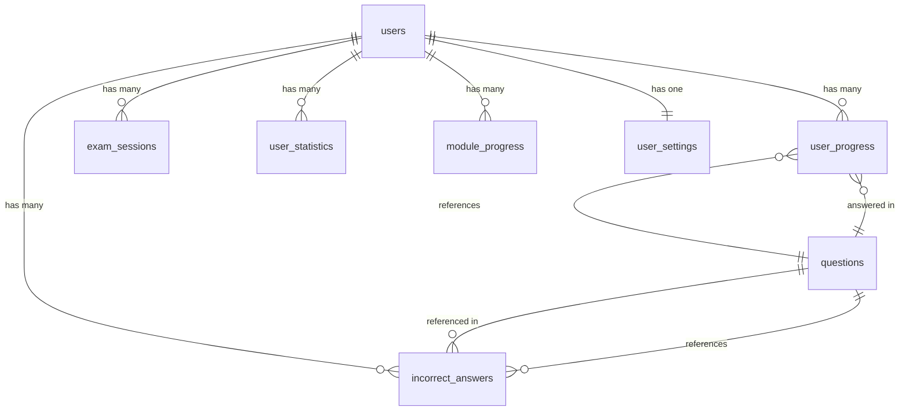

# TCO Database Schema Documentation

## Overview

The Modern TCO application uses a comprehensive Supabase PostgreSQL schema designed for scalable exam preparation and progress tracking. This document details the complete database structure and relationships.

## Database Tables

### 1. Users Table (Extended Profiles)

```sql
CREATE TABLE users (
    id UUID PRIMARY KEY REFERENCES auth.users(id) ON DELETE CASCADE,
    email TEXT UNIQUE NOT NULL,
    name TEXT NOT NULL,
    avatar_url TEXT,
    role TEXT DEFAULT 'student' CHECK (role IN ('student', 'instructor', 'admin')),
    preferences JSONB DEFAULT '{}',
    created_at TIMESTAMP WITH TIME ZONE DEFAULT NOW(),
    updated_at TIMESTAMP WITH TIME ZONE DEFAULT NOW(),
    last_login TIMESTAMP WITH TIME ZONE
);

-- Indexes
CREATE INDEX idx_users_email ON users(email);
CREATE INDEX idx_users_role ON users(role);
CREATE INDEX idx_users_created_at ON users(created_at DESC);
```

**Purpose**: Extended user profiles linked to Supabase Auth
**Key Features**:

- Links to `auth.users` for authentication
- Stores user preferences as JSONB
- Role-based access control
- Activity tracking with `last_login`

### 2. Questions Table (Exam Content)

```sql
CREATE TABLE questions (
    id UUID PRIMARY KEY DEFAULT gen_random_uuid(),
    question TEXT NOT NULL,
    options TEXT[] NOT NULL CHECK (array_length(options, 1) >= 2),
    correct_answer TEXT NOT NULL,
    explanation TEXT NOT NULL,
    difficulty TEXT NOT NULL CHECK (difficulty IN ('easy', 'medium', 'hard')),
    category TEXT NOT NULL CHECK (category IN (
        'asking-questions',
        'refining-questions',
        'taking-action',
        'navigation-modules',
        'reporting-data'
    )),
    tags TEXT[] DEFAULT '{}',
    points INTEGER DEFAULT 1 CHECK (points > 0),
    time_limit INTEGER DEFAULT 60 CHECK (time_limit > 0), -- seconds
    is_active BOOLEAN DEFAULT true,
    created_at TIMESTAMP WITH TIME ZONE DEFAULT NOW(),
    updated_at TIMESTAMP WITH TIME ZONE DEFAULT NOW()
);

-- Indexes for performance
CREATE INDEX idx_questions_category ON questions(category);
CREATE INDEX idx_questions_difficulty ON questions(difficulty);
CREATE INDEX idx_questions_category_difficulty ON questions(category, difficulty);
CREATE INDEX idx_questions_active ON questions(is_active) WHERE is_active = true;
CREATE INDEX idx_questions_tags ON questions USING gin(tags);

-- Full-text search index
CREATE INDEX idx_questions_search ON questions USING gin(
    to_tsvector('english', question || ' ' || explanation)
);
```

**Purpose**: Core exam questions with metadata
**Key Features**:

- Multiple choice format with flexible options
- TCO-specific categories aligned with certification domains
- Difficulty levels for adaptive learning
- Full-text search capabilities
- Point values for scoring
- Time limits per question

### 3. User Progress Table (Individual Responses)

```sql
CREATE TABLE user_progress (
    id UUID PRIMARY KEY DEFAULT gen_random_uuid(),
    user_id UUID NOT NULL REFERENCES users(id) ON DELETE CASCADE,
    question_id UUID NOT NULL REFERENCES questions(id) ON DELETE CASCADE,
    selected_answer TEXT NOT NULL,
    is_correct BOOLEAN NOT NULL,
    time_taken INTEGER NOT NULL CHECK (time_taken > 0), -- seconds
    confidence_level INTEGER CHECK (confidence_level BETWEEN 1 AND 5),
    attempt_number INTEGER DEFAULT 1 CHECK (attempt_number > 0),
    created_at TIMESTAMP WITH TIME ZONE DEFAULT NOW(),

    -- Composite unique constraint to prevent duplicate attempts
    UNIQUE(user_id, question_id, attempt_number)
);

-- Performance indexes
CREATE INDEX idx_user_progress_user_id ON user_progress(user_id);
CREATE INDEX idx_user_progress_question_id ON user_progress(question_id);
CREATE INDEX idx_user_progress_user_created ON user_progress(user_id, created_at DESC);
CREATE INDEX idx_user_progress_user_correct ON user_progress(user_id, is_correct);
CREATE INDEX idx_user_progress_composite ON user_progress(user_id, question_id, created_at DESC);
```

**Purpose**: Individual question responses and performance tracking
**Key Features**:

- Tracks every user response with timing
- Supports multiple attempts per question
- Confidence level for self-assessment
- Optimized for progress queries

### 4. Exam Sessions Table (Test Management)

```sql
CREATE TABLE exam_sessions (
    id UUID PRIMARY KEY DEFAULT gen_random_uuid(),
    user_id UUID NOT NULL REFERENCES users(id) ON DELETE CASCADE,
    session_type TEXT NOT NULL CHECK (session_type IN ('practice', 'mock_exam', 'final_exam')),
    title TEXT NOT NULL,
    total_questions INTEGER NOT NULL CHECK (total_questions > 0),
    questions_answered INTEGER DEFAULT 0 CHECK (questions_answered >= 0),
    correct_answers INTEGER DEFAULT 0 CHECK (correct_answers >= 0),
    time_limit INTEGER, -- seconds, NULL for unlimited
    time_spent INTEGER DEFAULT 0 CHECK (time_spent >= 0),
    score DECIMAL(5,2) CHECK (score >= 0 AND score <= 100),
    percentage DECIMAL(5,2) CHECK (percentage >= 0 AND percentage <= 100),
    status TEXT DEFAULT 'in_progress' CHECK (status IN ('in_progress', 'completed', 'abandoned')),
    started_at TIMESTAMP WITH TIME ZONE DEFAULT NOW(),
    completed_at TIMESTAMP WITH TIME ZONE,
    metadata JSONB DEFAULT '{}', -- Additional session data

    -- Ensure completed sessions have completion timestamp
    CHECK (
        (status = 'completed' AND completed_at IS NOT NULL) OR
        (status != 'completed')
    )
);

-- Performance indexes
CREATE INDEX idx_exam_sessions_user_id ON exam_sessions(user_id);
CREATE INDEX idx_exam_sessions_user_type ON exam_sessions(user_id, session_type);
CREATE INDEX idx_exam_sessions_status ON exam_sessions(status);
CREATE INDEX idx_exam_sessions_started ON exam_sessions(started_at DESC);
CREATE INDEX idx_exam_sessions_completed ON exam_sessions(completed_at DESC) WHERE completed_at IS NOT NULL;
```

**Purpose**: Exam session management and scoring
**Key Features**:

- Different session types (practice, mock, final)
- Real-time progress tracking
- Flexible time limits
- Automatic scoring calculations
- Session state management

### 5. User Statistics Table (Performance Metrics)

```sql
CREATE TABLE user_statistics (
    id UUID PRIMARY KEY DEFAULT gen_random_uuid(),
    user_id UUID NOT NULL REFERENCES users(id) ON DELETE CASCADE,
    category TEXT NOT NULL CHECK (category IN (
        'asking-questions',
        'refining-questions',
        'taking-action',
        'navigation-modules',
        'reporting-data',
        'overall'
    )),
    total_questions INTEGER DEFAULT 0 CHECK (total_questions >= 0),
    correct_answers INTEGER DEFAULT 0 CHECK (correct_answers >= 0),
    total_time INTEGER DEFAULT 0 CHECK (total_time >= 0), -- seconds
    average_time DECIMAL(8,2) DEFAULT 0 CHECK (average_time >= 0),
    success_rate DECIMAL(5,2) DEFAULT 0 CHECK (success_rate >= 0 AND success_rate <= 100),
    streak_current INTEGER DEFAULT 0 CHECK (streak_current >= 0),
    streak_best INTEGER DEFAULT 0 CHECK (streak_best >= 0),
    last_activity TIMESTAMP WITH TIME ZONE DEFAULT NOW(),
    created_at TIMESTAMP WITH TIME ZONE DEFAULT NOW(),
    updated_at TIMESTAMP WITH TIME ZONE DEFAULT NOW(),

    -- Ensure user can have only one record per category
    UNIQUE(user_id, category)
);

-- Performance indexes
CREATE INDEX idx_user_statistics_user_id ON user_statistics(user_id);
CREATE INDEX idx_user_statistics_category ON user_statistics(category);
CREATE INDEX idx_user_statistics_user_category ON user_statistics(user_id, category);
CREATE INDEX idx_user_statistics_success_rate ON user_statistics(success_rate DESC);
CREATE INDEX idx_user_statistics_last_activity ON user_statistics(last_activity DESC);
```

**Purpose**: Aggregated performance metrics by category
**Key Features**:

- Category-based statistics for TCO domains
- Success rate and timing analytics
- Streak tracking for motivation
- Overall performance summaries

### 6. Incorrect Answers Table (Review System)

```sql
CREATE TABLE incorrect_answers (
    id UUID PRIMARY KEY DEFAULT gen_random_uuid(),
    user_id UUID NOT NULL REFERENCES users(id) ON DELETE CASCADE,
    question_id UUID NOT NULL REFERENCES questions(id) ON DELETE CASCADE,
    selected_answer TEXT NOT NULL,
    correct_answer TEXT NOT NULL,
    review_count INTEGER DEFAULT 0 CHECK (review_count >= 0),
    mastered BOOLEAN DEFAULT false,
    first_incorrect TIMESTAMP WITH TIME ZONE DEFAULT NOW(),
    last_reviewed TIMESTAMP WITH TIME ZONE,
    next_review TIMESTAMP WITH TIME ZONE,
    created_at TIMESTAMP WITH TIME ZONE DEFAULT NOW(),

    -- User can have only one incorrect answer record per question
    UNIQUE(user_id, question_id)
);

-- Performance indexes
CREATE INDEX idx_incorrect_answers_user_id ON incorrect_answers(user_id);
CREATE INDEX idx_incorrect_answers_mastered ON incorrect_answers(user_id, mastered);
CREATE INDEX idx_incorrect_answers_next_review ON incorrect_answers(next_review) WHERE next_review IS NOT NULL;
CREATE INDEX idx_incorrect_answers_composite ON incorrect_answers(user_id, mastered, next_review);
```

**Purpose**: Spaced repetition system for incorrect answers
**Key Features**:

- Tracks questions that need review
- Spaced repetition scheduling
- Mastery tracking
- Review frequency monitoring

### 7. Module Progress Table (Learning Paths)

```sql
CREATE TABLE module_progress (
    id UUID PRIMARY KEY DEFAULT gen_random_uuid(),
    user_id UUID NOT NULL REFERENCES users(id) ON DELETE CASCADE,
    module_name TEXT NOT NULL,
    lesson_id TEXT NOT NULL,
    status TEXT DEFAULT 'not_started' CHECK (status IN ('not_started', 'in_progress', 'completed')),
    progress_percentage DECIMAL(5,2) DEFAULT 0 CHECK (progress_percentage >= 0 AND progress_percentage <= 100),
    time_spent INTEGER DEFAULT 0 CHECK (time_spent >= 0), -- seconds
    completion_date TIMESTAMP WITH TIME ZONE,
    metadata JSONB DEFAULT '{}',
    created_at TIMESTAMP WITH TIME ZONE DEFAULT NOW(),
    updated_at TIMESTAMP WITH TIME ZONE DEFAULT NOW(),

    -- User can have only one progress record per module lesson
    UNIQUE(user_id, module_name, lesson_id)
);

-- Performance indexes
CREATE INDEX idx_module_progress_user_id ON module_progress(user_id);
CREATE INDEX idx_module_progress_module ON module_progress(module_name);
CREATE INDEX idx_module_progress_status ON module_progress(user_id, status);
CREATE INDEX idx_module_progress_completion ON module_progress(completion_date DESC) WHERE completion_date IS NOT NULL;
```

**Purpose**: Learning module and lesson progress tracking
**Key Features**:

- Granular progress tracking per lesson
- Time tracking per module
- Completion status management
- Flexible metadata storage

### 8. User Settings Table (Preferences)

```sql
CREATE TABLE user_settings (
    id UUID PRIMARY KEY DEFAULT gen_random_uuid(),
    user_id UUID NOT NULL REFERENCES users(id) ON DELETE CASCADE,
    theme TEXT DEFAULT 'light' CHECK (theme IN ('light', 'dark', 'system')),
    sound_enabled BOOLEAN DEFAULT true,
    notifications_enabled BOOLEAN DEFAULT true,
    difficulty_preference TEXT DEFAULT 'adaptive' CHECK (difficulty_preference IN ('easy', 'medium', 'hard', 'adaptive')),
    study_reminders BOOLEAN DEFAULT true,
    language TEXT DEFAULT 'en' CHECK (language IN ('en', 'es', 'fr')),
    timezone TEXT DEFAULT 'UTC',
    email_notifications JSONB DEFAULT '{"weekly_progress": true, "exam_reminders": true, "new_content": false}',
    ui_preferences JSONB DEFAULT '{"compact_mode": false, "show_explanations": true, "auto_advance": false}',
    created_at TIMESTAMP WITH TIME ZONE DEFAULT NOW(),
    updated_at TIMESTAMP WITH TIME ZONE DEFAULT NOW(),

    -- One settings record per user
    UNIQUE(user_id)
);

-- Performance indexes
CREATE INDEX idx_user_settings_user_id ON user_settings(user_id);
CREATE INDEX idx_user_settings_theme ON user_settings(theme);
```

**Purpose**: User customization and preferences
**Key Features**:

- UI theme and display preferences
- Notification settings
- Adaptive difficulty preferences
- Internationalization support

## Table Relationships

### Primary Relationships



### Key Foreign Keys

- `users.id` ← `auth.users.id` (Supabase Auth integration)
- `user_progress.user_id` → `users.id`
- `user_progress.question_id` → `questions.id`
- `exam_sessions.user_id` → `users.id`
- `user_statistics.user_id` → `users.id`
- `incorrect_answers.user_id` → `users.id`
- `incorrect_answers.question_id` → `questions.id`
- `module_progress.user_id` → `users.id`
- `user_settings.user_id` → `users.id`

## Row Level Security (RLS) Policies

### Users Table Policies

```sql
-- Users can only access their own profile
CREATE POLICY "Users can view own profile" ON users
    FOR SELECT USING (auth.uid() = id);

CREATE POLICY "Users can update own profile" ON users
    FOR UPDATE USING (auth.uid() = id);

CREATE POLICY "Enable insert for authenticated users" ON users
    FOR INSERT WITH CHECK (auth.uid() = id);
```

### User Progress Policies

```sql
-- Users can only access their own progress
CREATE POLICY "Users can view own progress" ON user_progress
    FOR SELECT USING (auth.uid() = user_id);

CREATE POLICY "Users can insert own progress" ON user_progress
    FOR INSERT WITH CHECK (auth.uid() = user_id);

CREATE POLICY "Users can update own progress" ON user_progress
    FOR UPDATE USING (auth.uid() = user_id);
```

### Questions Table Policies

```sql
-- Questions are publicly readable, admin-only write
CREATE POLICY "Anyone can view active questions" ON questions
    FOR SELECT USING (is_active = true);

-- Admin/instructor write access handled via service role
```

### Other Table Policies

All user-owned tables follow the same pattern:

- Users can only access records where `user_id = auth.uid()`
- Full CRUD operations allowed on own data
- No cross-user data access

## Database Functions

### Statistics Update Function

```sql
CREATE OR REPLACE FUNCTION update_user_statistics()
RETURNS TRIGGER AS $$
BEGIN
    -- Update category-specific statistics
    INSERT INTO user_statistics (user_id, category, total_questions, correct_answers, total_time)
    SELECT
        NEW.user_id,
        q.category,
        1,
        CASE WHEN NEW.is_correct THEN 1 ELSE 0 END,
        NEW.time_taken
    FROM questions q
    WHERE q.id = NEW.question_id
    ON CONFLICT (user_id, category)
    DO UPDATE SET
        total_questions = user_statistics.total_questions + 1,
        correct_answers = user_statistics.correct_answers + CASE WHEN NEW.is_correct THEN 1 ELSE 0 END,
        total_time = user_statistics.total_time + NEW.time_taken,
        success_rate = ROUND((user_statistics.correct_answers + CASE WHEN NEW.is_correct THEN 1 ELSE 0 END)::DECIMAL / (user_statistics.total_questions + 1) * 100, 2),
        average_time = ROUND((user_statistics.total_time + NEW.time_taken)::DECIMAL / (user_statistics.total_questions + 1), 2),
        updated_at = NOW();

    -- Update overall statistics
    INSERT INTO user_statistics (user_id, category, total_questions, correct_answers, total_time)
    VALUES (
        NEW.user_id,
        'overall',
        1,
        CASE WHEN NEW.is_correct THEN 1 ELSE 0 END,
        NEW.time_taken
    )
    ON CONFLICT (user_id, category)
    DO UPDATE SET
        total_questions = user_statistics.total_questions + 1,
        correct_answers = user_statistics.correct_answers + CASE WHEN NEW.is_correct THEN 1 ELSE 0 END,
        total_time = user_statistics.total_time + NEW.time_taken,
        success_rate = ROUND((user_statistics.correct_answers + CASE WHEN NEW.is_correct THEN 1 ELSE 0 END)::DECIMAL / (user_statistics.total_questions + 1) * 100, 2),
        average_time = ROUND((user_statistics.total_time + NEW.time_taken)::DECIMAL / (user_statistics.total_questions + 1), 2),
        updated_at = NOW();

    RETURN NEW;
END;
$$ LANGUAGE plpgsql;

-- Trigger to automatically update statistics
CREATE TRIGGER trigger_update_user_statistics
    AFTER INSERT ON user_progress
    FOR EACH ROW
    EXECUTE FUNCTION update_user_statistics();
```

### Incorrect Answer Tracking Function

```sql
CREATE OR REPLACE FUNCTION track_incorrect_answer()
RETURNS TRIGGER AS $$
BEGIN
    IF NEW.is_correct = false THEN
        INSERT INTO incorrect_answers (user_id, question_id, selected_answer, correct_answer)
        SELECT
            NEW.user_id,
            NEW.question_id,
            NEW.selected_answer,
            q.correct_answer
        FROM questions q
        WHERE q.id = NEW.question_id
        ON CONFLICT (user_id, question_id)
        DO UPDATE SET
            selected_answer = NEW.selected_answer,
            review_count = incorrect_answers.review_count + 1,
            last_reviewed = NOW(),
            next_review = NOW() + INTERVAL '1 day' * POWER(2, incorrect_answers.review_count);
    END IF;

    RETURN NEW;
END;
$$ LANGUAGE plpgsql;

CREATE TRIGGER trigger_track_incorrect_answer
    AFTER INSERT ON user_progress
    FOR EACH ROW
    EXECUTE FUNCTION track_incorrect_answer();
```

## Data Migration and Seeding

### Sample Data Structure

```sql
-- Sample TCO questions for asking-questions category
INSERT INTO questions (question, options, correct_answer, explanation, difficulty, category, tags) VALUES
(
    'What is the primary purpose of the Tanium Client?',
    ARRAY[
        'To provide a user interface for administrators',
        'To execute questions and actions on endpoints',
        'To store question results in a database',
        'To generate reports for management'
    ],
    'To execute questions and actions on endpoints',
    'The Tanium Client is the lightweight agent installed on endpoints that executes questions from the Tanium Server and can perform actions as directed.',
    'easy',
    'asking-questions',
    ARRAY['tanium-client', 'endpoints', 'agent']
);
```

### Default User Settings

```sql
-- Create default settings for new users
CREATE OR REPLACE FUNCTION create_user_defaults()
RETURNS TRIGGER AS $$
BEGIN
    INSERT INTO user_settings (user_id)
    VALUES (NEW.id);

    RETURN NEW;
END;
$$ LANGUAGE plpgsql;

CREATE TRIGGER trigger_create_user_defaults
    AFTER INSERT ON users
    FOR EACH ROW
    EXECUTE FUNCTION create_user_defaults();
```

## Performance Considerations

### Index Strategy

1. **Primary Keys**: All tables use UUID primary keys for global uniqueness
2. **Foreign Keys**: All foreign key columns are indexed
3. **Query Patterns**: Composite indexes for common WHERE clause combinations
4. **Search**: GIN indexes for full-text search and array operations
5. **Partial Indexes**: For boolean flag filtering (active records only)

### Query Optimization

1. **Use specific column selection** instead of SELECT \*
2. **Leverage composite indexes** for multi-condition queries
3. **Implement pagination** for large result sets
4. **Use stored procedures** for complex aggregations
5. **Cache frequently accessed data** in application layer

### Scaling Considerations

1. **Horizontal partitioning** potential for user_progress by date
2. **Read replicas** for analytical queries
3. **Connection pooling** for high-concurrency scenarios
4. **Materialized views** for complex reporting queries

This schema provides a robust foundation for the TCO exam preparation system with excellent performance characteristics and maintainability.
