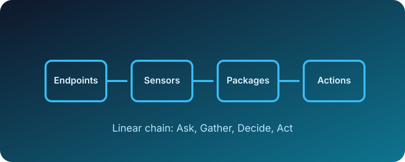

export const meta = {
  id: 'module-tanium-platform-foundation-v2',
  title: 'Tanium Platform Foundation (Beginner Edition)',
  objectives: 4,
  domainSlug: 'platform-foundation'
};

# Tanium Platform Foundation (Beginner Edition)

Welcome! By the end of this module you will understand why Tanium matters, what pieces make it work, how to succeed on your first run, and how it appears on the Tanium Certified Operator (TCO) exam.

## Why this matters

<Callout type="tip" title="Analogy: City-Wide Radio">
Tanium works like a city-wide emergency radio. One signal reaches every neighborhood almost instantly, so IT teams can act fast without waiting for silence on the line.
</Callout>

- Visibility: Respond to questions across every endpoint in seconds.
- Scale: Peer-to-peer communication keeps bandwidth usage low.
- Speed: Issues resolve faster when the whole fleet hears you at once.

Traditional polling tools behave like phone trees—slow, serialized, and prone to missed calls. Tanium’s broadcast-style approach ensures every endpoint hears the request, relays it onward, and reports back before a slow-moving outbreak becomes a major incident.

### Active Recall
- Why does Tanium rely on a peer-to-peer model?
- How does the city-wide radio analogy connect to Tanium's architecture?

### Mini-practice
1. Write down one problem fast visibility solves for your organization.
2. Describe how a slow response could impact an IT incident.

<MicroQuizMDX
  id="module00-why-01"
  question="Which Tanium capability helps you avoid waiting for scheduled scans?"
  answers={[
    "Live peer-to-peer questions",
    "Weekly antivirus updates",
    "Quarterly audit reports",
    "Manual device spot checks"
  ]}
  correct={0}
  rationale="Live peer-to-peer questions let you gather data instantly instead of waiting for scheduled scans."
/>

### One-sentence summary
Tanium broadcasts questions across endpoints almost instantly, giving teams the speed to investigate and act before issues spiral.

## What you need to know

### Key terms (plain language)
- **Endpoint** – Any device managed by Tanium; think of it as a citizen listening to the radio.
- **Sensor** – A question template that collects live data from endpoints.
- **Package** – A set of instructions to change something on endpoints.
- **Action** – The execution of a package across target endpoints.
- **Computer Group** – A saved collection of endpoints you use to scope questions and actions.
- **Question** – A sensor plus targeting; it tells Tanium what to ask and who should respond.

<InfoBox title="Exam Signal" theme="definition">
The TCO exam often asks about how sensors and packages differ. Remember: sensors gather data; packages make changes.
</InfoBox>

### Architecture at a glance

### Where this shows up on the TCO exam

| Subsection | TCO Topic | Question Weight |
| --- | --- | --- |
| Why this matters | Platform value proposition | 5% |
| What you need to know | Platform architecture & terminology | 20% |
| How it works | Console navigation & workflows | 30% |
| Apply it now | Troubleshooting & scenario analysis | 15% |

The TCO exam expects you to connect terminology with impact. Focus on explaining *why* Tanium’s architecture is different, not just reciting definitions. During practice, say each concept aloud in plain language before moving on to the next topic.

### Knowledge Checks

<MicroQuizMDX
  id="module00-what-01"
  question="What does a Tanium sensor do?"
  answers={[
    "Collects live data from endpoints",
    "Deploys software packages",
    "Creates new user accounts",
    "Shuts down endpoints remotely"
  ]}
  correct={0}
  rationale="Sensors gather information; they do not take action on endpoints."
/>

<MicroQuizMDX
  id="module00-what-02"
  question="In the city-wide radio analogy, what represents the endpoints?"
  answers={[
    "The radio announcer",
    "Citizens receiving the message",
    "Street signs",
    "Weather reports"
  ]}
  correct={1}
  rationale="Endpoints are like citizens listening to the broadcast."
/>

### Active Recall
- Summarize the difference between a sensor and a package.
- Which part of the architecture keeps bandwidth low?
- How does Tanium decide which endpoints should answer a question?

### Mini-practice
1. Match each term (sensor, package, action) with a real-world example from your environment.
2. Identify which TCO objective each term aligns with.
3. Sketch the peer-to-peer chain and label where the Tanium Server and endpoints sit.

### One-sentence summary
Know the vocabulary: sensors ask, packages prepare actions, and endpoints respond in seconds.

## How it works (guided steps)

<Steps>
  <Steps.Step title="Step 1: Open Interact">
    Sign into the Tanium console and choose **Interact** from the navigation menu.
  </Steps.Step>
  <Steps.Step title="Step 2: Build your question">
    Select **Computer Name** from the sensor list or search bar.
  </Steps.Step>
<Steps.Step title="Step 3: Ask and observe">
    Click **Ask Question** and watch results flow in as endpoints respond.
  </Steps.Step>
</Steps>

Pause between each step to note what changed on screen. When results arrive, hover over the status indicator to confirm how many endpoints have answered and how many are still pending. This habit helps you spot when a subset of machines might be unreachable.

<Callout type="warning" title="Common pitfalls & how to debug">
- No results? Check that the machine group you targeted has online endpoints.
- Slow responses? Review peer-to-peer health; ensure no blocked ports.
- Unexpected data? Re-run with a filter to narrow the scope.
</Callout>

### Knowledge Checks

<MicroQuizMDX
  id="module00-how-01"
  question="Which navigation area launches the Question Builder?"
  answers={[
    "Home",
    "Deploy",
    "Interact",
    "Dashboards"
  ]}
  correct={2}
  rationale="Interact is where you build and run ad-hoc questions."
/>

<MicroQuizMDX
  id="module00-how-02"
  question="How can you verify why a question returned no results?"
  answers={[
    "Blame DNS cache",
    "Check target groups and endpoint online status",
    "Reboot the server",
    "Delete the sensor"
  ]}
  correct={1}
  rationale="Confirm the target group and endpoint availability before taking further action."
/>

<MicroQuizMDX
  id="module00-how-03"
  question="What filter would you add to scope your first question to lab devices?"
  answers={[
    "Where Computer Name contains LAB",
    "Where Sensor equals LAB",
    "Where Operating System equals Database",
    "Where Package equals LAB"
  ]}
  correct={0}
  rationale="Use the filter clause to target endpoints with names containing the LAB prefix."
/>

### Active Recall
- Which menu launches the Question Builder?
- What steps confirm endpoint availability?
- How do filters change the scope of a question?

### Mini-practice
1. Build a question that lists all machines running Windows.
2. Add a filter for computer name containing `LAB`.
3. Document how many endpoints respond within 10 seconds.
4. Export results to CSV and note the default download location.

### One-sentence summary
A reliable first success comes from targeting the right endpoints, asking a precise question, and watching response flow for signs of trouble.

## Apply it now

<Callout type="lab" title="Scenario: Low Disk Space Alert">
You notice remote laptops dropping off nightly backups. Use Tanium to identify machines with less than 10 GB free disk space and plan next steps.
</Callout>

Start by restating the problem in your own words: “Backups are failing because some laptops are out of space.” This keeps the goal clear as you build the question, triage the results, and communicate next actions back to stakeholders.

### Short checkpoint quiz

<MicroQuizMDX
  id="module00-apply-quiz-01"
  question="Which sensor helps you measure disk capacity during the scenario?"
  answers={[
    "Running Applications",
    "Disk Free Space",
    "Installed Patches",
    "Online Status"
  ]}
  correct={1}
  rationale="Disk Free Space reports the remaining capacity on each endpoint."
/>

<MicroQuizMDX
  id="module00-apply-quiz-02"
  question="After identifying low disk space systems, what is the best next step?"
  answers={[
    "Immediately push new software",
    "Schedule an action to clean temp files",
    "Remove them from the network",
    "Do nothing"
  ]}
  correct={1}
  rationale="Cleaning temp files or requesting end-user cleanup is a targeted remediation before any drastic measures."
/>

<MicroQuizMDX
  id="module00-apply-quiz-03"
  question="How do you document your findings for stakeholders?"
  answers={[
    "Screenshot the console and send without context",
    "Export results to CSV with notes on next actions",
    "Delete the question to keep the console tidy",
    "Send raw JSON logs"
  ]}
  correct={1}
  rationale="Exporting data with commentary provides clarity and auditability."
/>

<MicroQuizMDX
  id="module00-apply-quiz-04"
  question="Which feature helps you rerun the same question after cleanup actions?"
  answers={[
    "Question History",
    "Live Chats",
    "Timeline Dashboard",
    "User Directory"
  ]}
  correct={0}
  rationale="Question History stores prior questions so you can rerun them quickly for validation."
/>

<MicroQuizMDX
  id="module00-apply-quiz-05"
  question="Which targeting approach keeps remediation safe while testing?"
  answers={[
    "Blast to All Endpoints immediately",
    "Start with a pilot computer group before broad deployment",
    "Only target offline machines",
    "Delete the package after one run"
  ]}
  correct={1}
  rationale="Begin with a controlled pilot group, validate results, then scale to the wider fleet."
/>

<MicroQuizMDX
  id="module00-apply-quiz-06"
  question="What documentation should accompany the CSV export?"
  answers={[
    "A changelog describing actions taken and next steps",
    "Animated GIFs of the console",
    "A generic Tanium brochure",
    "Nothing—CSV alone is enough"
  ]}
  correct={0}
  rationale="Stakeholders need context on what was done, what’s next, and who is responsible."
/>

### Active Recall
- What sensor reveals disk capacity?
- Which follow-up action helps you remediate low disk space?
- How will you prove the issue is resolved?

### Mini-practice
1. Draft the exact question syntax you will use for the scenario.
2. Note which computer group you will target first and why.
3. Outline how you will communicate results to stakeholders.

### If stuck, try this ladder
1. Re-run the question with a smaller computer group to verify scope.
2. Use the Question History to confirm the query syntax.
3. Ask a peer to replicate in their environment to compare results.

### One-sentence summary
Apply the workflow end-to-end: detect the issue, run a focused question, and communicate the results with clear remediation steps.
