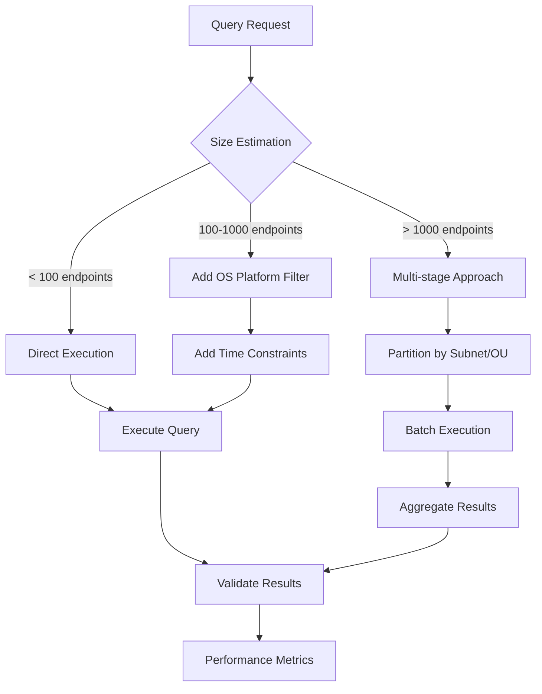
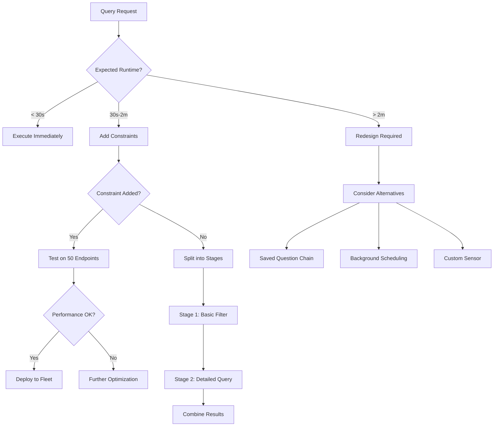
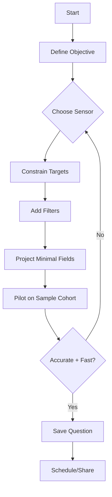

export const meta = {
  id: 'tco-asking-questions',
  title: 'Asking Questions',
  objectives: 4,
  domainSlug: 'asking-questions'
};

# Asking Questions: Foundation of Tanium Operations

## 🎯 Domain Overview

**Domain Weight**: 22% of TAN-1000 exam | **Difficulty**: Beginner to Intermediate

The "Asking Questions" domain forms the foundation of all Tanium operations. Every administrative task, security investigation, and system management action begins with asking the right question in the right way.

## 🧠 Core Concepts

### Natural Language Query Construction

Tanium's revolutionary approach uses **natural language processing** to convert human-readable questions into powerful system queries.

<InfoBox title="Key Insight">
  The Tanium question format follows: **Get [sensor] from [targets] where [filters]**
</InfoBox>

**Example Query Patterns**:

- `Get Computer Name from all machines`
- `Get Running Services from all machines where IP Address contains "192.168"`
- `Get Installed Applications from all machines where Computer Name contains "SERVER"`

<QueryPlayground
  title="Practice: Basic Query"
  instruction="Try getting the computer names from all machines. This is the most fundamental Tanium query."
  expectedQuery="Get Computer Name from all machines"
  expectedResult="DESKTOP-ABC123
LAPTOP-XYZ789
SERVER-PROD01
WORKSTATION-DEV42
... (showing 100 of 5,432 results)"
  hint="Start with 'Get Computer Name' and end with 'from all machines'"
  difficulty="beginner"
/>

<QueryPlayground
  title="Practice: Query with Filter"
  instruction="Get the Operating System from machines that have 'SERVER' in their name."
  expectedQuery="Get Operating System from all machines where Computer Name contains SERVER"
  expectedResult="Windows Server 2019 Standard
Windows Server 2022 Datacenter
Windows Server 2016 Standard
... (showing 50 of 287 results)"
  hint="Use 'where Computer Name contains' to filter"
  difficulty="beginner"
/>

### The 500+ Sensor Library

**Built-in Sensors** provide immediate access to system information:

- **System Sensors**: Computer Name, IP Address, Operating System, Uptime
- **Security Sensors**: Running Processes, Open Ports, User Rights, Services
- **Application Sensors**: Installed Applications, Running Applications, Browser Extensions
- **Hardware Sensors**: CPU Usage, Memory Usage, Disk Space, Network Interface

<InfoBox title="Pro Tip">
  Use the **Sensor Library** to explore available sensors and understand their parameters before
  constructing queries.
</InfoBox>

<MicroQuizMDX
  question="What is the primary purpose of Tanium sensors?"
  options={[
    "To monitor network traffic patterns",
    "To collect real-time endpoint data and system information",
    "To deploy software updates to endpoints",
    "To scan for network vulnerabilities"
  ]}
  correctAnswer="To collect real-time endpoint data and system information"
  explanation="Sensors in Tanium are the core mechanism for querying and collecting specific pieces of information from endpoints in real-time. They can gather system data, security information, hardware details, and application status across thousands of endpoints simultaneously."
  concept="Sensors"
/>

### Custom Sensor Creation

When built-in sensors don't meet your needs, create **custom sensors**:

```bash
# Example: Custom Registry Sensor
Sensor Name: Custom Registry Check
Platform: Windows
Script: reg query "HKEY_LOCAL_MACHINE\SOFTWARE\MyApp" /v Version 2>nul
```

<QueryPlayground
  title="Practice: Hardware Query"
  instruction="Query for disk space information from all machines."
  expectedQuery="Get Disk Space from all machines"
  expectedResult="C:\ - 45GB Free of 250GB Total (18%)
C:\ - 120GB Free of 500GB Total (24%)
C:\ - 8GB Free of 120GB Total (7%)
D:\ - 900GB Free of 1TB Total (90%)
... (showing disk info for all machines)"
  hint="Use the 'Disk Space' sensor"
  difficulty="beginner"
/>

<QueryPlayground
  title="Practice: Security Query"
  instruction="Find all machines that have Chrome running."
  expectedQuery="Get Computer Name from all machines where Running Applications contains chrome"
  expectedResult="DESKTOP-ABC123
LAPTOP-XYZ789
WORKSTATION-DEV42
DESKTOP-FINANCE01
... (showing 2,341 of 5,432 machines with Chrome running)"
  hint="Use 'Running Applications contains chrome' as your filter"
  difficulty="intermediate"
/>

## 🎮 Interactive Learning

<PracticeButton
  type="flashcard"
  title="Query Construction Practice"
  difficulty="beginner"
  estimatedTime="10 minutes"
>
  Master basic query patterns with interactive flashcards
</PracticeButton>

## 📊 Saved Question Management

### Creation and Deployment

1. **Create**: Construct and test your query
2. **Validate**: Ensure query returns expected results
3. **Save**: Store with descriptive metadata
4. **Share**: Deploy to appropriate user groups
5. **Monitor**: Track usage and performance

### Best Practices

- **Descriptive Names**: Use clear, searchable naming conventions
- **Documentation**: Add context and usage instructions
- **Performance**: Monitor execution time and resource usage
- **Lifecycle**: Regular review and cleanup of unused questions

<MicroQuizMDX
  question="What is the correct lifecycle order for managing a saved question in Tanium?"
  options={[
    "Save → Create → Validate → Share → Monitor",
    "Create → Save → Validate → Monitor → Share",
    "Create → Validate → Save → Share → Monitor",
    "Validate → Create → Save → Share → Monitor"
  ]}
  correctAnswer="Create → Validate → Save → Share → Monitor"
  explanation="The correct lifecycle follows a logical progression: First, CREATE your query by constructing it. Then VALIDATE that it returns expected results. Next, SAVE it with descriptive metadata. Then SHARE it with appropriate user groups. Finally, continuously MONITOR its usage and performance to ensure it remains effective and efficient."
  concept="Saved Questions"
/>

## 🔧 Hands-On Lab Preview

**LAB-AQ-001: Natural Language Query Construction (12 minutes)**

- Practice essential query patterns
- Explore sensor parameters and filtering
- Validate query performance and accuracy

## ✅ Key Takeaways

1. **Natural Language**: Tanium queries use intuitive human language patterns
2. **Sensor Mastery**: Understanding the 500+ sensors is crucial for effective querying
3. **Custom Solutions**: Create custom sensors when built-in options are insufficient
4. **Question Lifecycle**: Proper management ensures scalable, maintainable query operations

---

**Next Module**: [Refining Questions & Targeting](/modules/refining-questions-targeting) - Learn advanced targeting and filtering techniques

---

## Sensor Deep Dive: Practical Coverage and Examples

<InfoBox title="Goal of this section">
  Build practical intuition for which sensor to use, what it returns, and how to pair it
  with filters and targets to answer real-world questions quickly.
</InfoBox>

### System Information Sensors (15 with examples)

1) Computer Name — Unique endpoint identifier
   - Example: Get Computer Name from all machines
   - Example: Get Computer Name from all machines where Computer Name contains "WKS-"

2) Operating System — OS family and version
   - Example: Get Operating System from all machines
   - Example: Get Operating System from all machines where Operating System contains "Windows 11"

3) OS Platform — Normalized platform categorization
   - Example: Get OS Platform from all machines
   - Example: Get Computer Name, OS Platform from all machines where OS Platform = "Windows"

4) Uptime — Time since last reboot
   - Example: Get Uptime from all machines
   - Example: Get Computer Name, Uptime from all machines where Uptime &gt; 7 days

5) IP Address — Primary address(es)
   - Example: Get IP Address from all machines
   - Example: Get Computer Name, IP Address from all machines where IP Address contains "10.10."

6) MAC Address — Hardware interface addresses
   - Example: Get MAC Address from all machines

7) Logged In User — Current interactive user
   - Example: Get Logged In User from all machines
   - Example: Get Computer Name from all machines where Logged In User contains "admin"

8) Last Reboot — Timestamp of last restart
   - Example: Get Last Reboot from all machines where OS Platform = "Windows"

9) Computer Serial Number — Hardware serial for inventory
   - Example: Get Computer Serial Number from all machines

10) BIOS Version — Firmware baseline
    - Example: Get BIOS Version from all machines where Manufacturer contains "Dell"

11) Chassis Type — Form factor cues
    - Example: Get Chassis Type from all machines where Chassis Type = "Laptop"

12) Domain — AD domain membership
    - Example: Get Domain from all machines where Domain contains "CORP"

13) Last Logged In User — Audit perspective
    - Example: Get Computer Name, Last Logged In User from all machines where Last Logged In User contains "svc_"

14) Time Zone — Regional context
    - Example: Get Computer Name, Time Zone from all machines where Time Zone contains "UTC"

15) Tanium Client Version — Fleet hygiene
    - Example: Get Tanium Client Version from all machines where Tanium Client Version < "7.5.0"

<InfoBox title="Pattern">
  For inventory-style questions, return 1–3 high-signal fields (Computer Name + sensor) and
  constrain early with platform or business unit to improve performance.
</InfoBox>

### Security Sensors (15 with examples)

1) Running Processes — Active processes on endpoint
   - Example: Get Running Processes from all machines where Running Processes contains "powershell.exe"

2) Services — Installed services and states
   - Example: Get Services from all machines where Services contains "Tanium Client"

3) Listening Ports — Network exposure baseline
   - Example: Get Listening Ports from all machines where Listening Ports contains ":3389"

4) Local Administrators — Privileged local users
   - Example: Get Local Administrators from all machines where Local Administrators contains "domain admins"

5) Installed Patches — Patch state snapshot
   - Example: Get Installed Patches from all machines where Installed Patches contains "KB5030219"

6) Antivirus Status — Protection baseline
   - Example: Get Antivirus Status from all machines where Antivirus Status contains "disabled"

7) Firewall State — Host firewall posture
   - Example: Get Firewall State from all machines where Firewall State = "Off"

8) Last Logged On Users — Historical user access
   - Example: Get Last Logged On Users from all machines where Last Logged On Users contains "temp"

9) Scheduled Tasks — Persistence vectors
   - Example: Get Scheduled Tasks from all machines where Scheduled Tasks contains "\\x1f" (suspicious)

10) Startup Items — Autostart entries
    - Example: Get Startup Items from all machines where Startup Items contains "unknown.exe"

11) OS Build Number — Patch rung differentiation
    - Example: Get Computer Name, OS Build Number from all machines where OS Build Number < "22621"

12) Disk Encryption Status — Data at rest protection
    - Example: Get Disk Encryption Status from all machines where Disk Encryption Status != "Enabled"

13) Secure Boot State — Firmware security
    - Example: Get Secure Boot State from all machines where Secure Boot State != "On"

14) Local Group Policy Settings — Hardened configurations
    - Example: Get Local Group Policy Settings from all machines where ...

15) Browser Extensions — Potential risk surface
    - Example: Get Browser Extensions from all machines where Browser Extensions contains "password"

<InfoBox title="Triage tip">
  Start with indicator-of-compromise sensors (process, ports, autoruns), pivot into user context,
  then inspect persistence and policy state. Keep a rollback cohort ready.
</InfoBox>

### Performance Sensors (10 with examples)

1) CPU Utilization — Point-in-time CPU load
   - Example: Get Computer Name, CPU Utilization from all machines where CPU Utilization &gt; 85

2) Memory Utilization — Working set pressure
   - Example: Get Memory Utilization from all machines where Memory Utilization &gt; 90

3) Disk Space — Free space health
   - Example: Get Disk Space from all machines where Disk Space &lt; 10 GB

4) Disk Queue Length — Storage contention
   - Example: Get Disk Queue Length from all machines where Disk Queue Length &gt; 2

5) Network Utilization — Egress/ingress pressure
   - Example: Get Network Utilization from all machines where Network Utilization &gt; 80

6) Top Processes by CPU — Noisy neighbors
   - Example: Get Top Processes by CPU from all machines where OS Platform = "Windows"

7) Top Processes by Memory — Memory hog identification
   - Example: Get Top Processes by Memory from all machines where Memory Utilization &gt; 85

8) Page File Usage — Virtual memory pressure
   - Example: Get Page File Usage from all machines where Page File Usage &gt; 75

9) System Uptime Buckets — Correlate with leaks
   - Example: Get System Uptime Buckets from all machines where Uptime &gt; 14 days

10) GPU Utilization — Graphics workloads
    - Example: Get GPU Utilization from all machines where GPU Utilization &gt; 70

### Hardware/Inventory Sensors (10 with examples)

1) Manufacturer
   - Example: Get Manufacturer from all machines where Manufacturer = "Dell"
   - PowerShell: `Get-CimInstance Win32_ComputerSystem | Select-Object Manufacturer`
   - Performance: Fast (WMI cache friendly)

2) Model
   - Example: Get Computer Name, Model from all machines where Model contains "Precision"
   - PowerShell: `Get-CimInstance Win32_ComputerSystem | Select-Object Model`
   - Use case: Asset management, driver compatibility

3) CPU Model
   - Example: Get CPU Model from all machines where CPU Model contains "i7"
   - PowerShell: `Get-CimInstance Win32_Processor | Select-Object Name`
   - Performance tip: Single query for CPU inventory vs per-core details

4) Physical Memory
   - Example: Get Physical Memory from all machines where Physical Memory &lt; 8 GB
   - PowerShell: `Get-CimInstance Win32_PhysicalMemory | Measure-Object Capacity -Sum | ForEach-Object {[math]::Round($_.Sum/1GB,2)}`
   - Threshold alerts: &lt;8GB (low), &lt;16GB (medium), 32GB+ (high-spec)

5) Disk Model / Size
   - Example: Get Disk Model from all machines where Disk Model contains "SSD"
   - PowerShell: `Get-CimInstance Win32_DiskDrive | Select-Object Model, Size`
   - SSD vs HDD performance impact analysis

6) Network Adapter
   - Example: Get Network Adapter from all machines where Network Adapter contains "Intel"
   - PowerShell: `Get-CimInstance Win32_NetworkAdapter | Where-Object {$_.PhysicalAdapter} | Select-Object Name`
   - Driver compatibility and security assessments

7) Battery Health (laptops)
   - Example: Get Battery Health from all machines where Battery Health &lt; 70
   - PowerShell: `Get-CimInstance Win32_Battery | Select-Object EstimatedChargeRemaining`
   - Mobile workforce health monitoring

8) Display Adapter
   - Example: Get Display Adapter from all machines where Display Adapter contains "NVIDIA"
   - PowerShell: `Get-CimInstance Win32_VideoController | Select-Object Name`
   - Graphics workload optimization

9) Docking State (where available)
   - Example: Get Docking State from laptops where Docking State = "Docked"
   - PowerShell: Custom sensor based on USB/Thunderbolt detection
   - Hybrid work policy compliance

10) Asset Tag
    - Example: Get Asset Tag from all machines where Asset Tag contains "NYC"
    - PowerShell: `Get-CimInstance Win32_SystemEnclosure | Select-Object SMBIOSAssetTag`
    - Physical inventory correlation

### Application and Software Sensors (15 with advanced examples)

<InfoBox title="Software Inventory Strategy">
  Application sensors are critical for license compliance, security assessments, and standardization.
  Use combination queries to correlate versions, installations, and security posture.
</InfoBox>

<QueryPlayground
  title="Practice: Software Inventory"
  instruction="Find all machines that have Microsoft Office installed."
  expectedQuery="Get Computer Name from all machines where Installed Applications contains Office"
  expectedResult="DESKTOP-ABC123 - Microsoft Office Professional Plus 2019
LAPTOP-XYZ789 - Microsoft Office 365
WORKSTATION-DEV42 - Microsoft Office Standard 2016
SERVER-TERM01 - Microsoft Office 365 ProPlus
... (showing 3,892 machines with Office installed)"
  hint="Use 'Installed Applications contains Office'"
  difficulty="beginner"
/>

<QueryPlayground
  title="Practice: Security Software Check"
  instruction="Identify machines without antivirus software installed."
  expectedQuery="Get Computer Name from all machines where NOT Installed Applications contains antivirus"
  expectedResult="TESTVM-001
LABMACHINE-42
DEVBOX-ISOLATED03
KIOSK-LOBBY01
... (showing 23 machines without antivirus)"
  hint="Use 'NOT' to find machines missing antivirus"
  difficulty="intermediate"
/>

<QueryPlayground
  title="Practice: Compliance Check"
  instruction="Find Windows 11 machines missing a critical security patch (KB5030219)."
  expectedQuery="Get Computer Name from all machines where Operating System contains Windows 11 AND NOT Installed Patches contains KB5030219"
  expectedResult="LAPTOP-EXEC04 - Windows 11 Pro
DESKTOP-FIN08 - Windows 11 Enterprise
WORKSTATION-IT02 - Windows 11 Pro
LAPTOP-SALES11 - Windows 11 Home
... (showing 156 Windows 11 machines missing KB5030219)"
  hint="Combine OS check with missing patch using AND and NOT"
  difficulty="advanced"
/>

1) Installed Applications
   - Basic: Get Installed Applications from all machines where Installed Applications contains "Adobe"
   - Advanced: Get Computer Name, Installed Applications from all machines where Installed Applications contains "Adobe" AND Installed Applications contains "2023"
   - PowerShell: `Get-ItemProperty HKLM:\Software\Microsoft\Windows\CurrentVersion\Uninstall\* | Select-Object DisplayName, DisplayVersion`
   - Performance: Expensive on large endpoints, constrain by OS Platform first

2) Running Applications
   - Basic: Get Running Applications from all machines where Running Applications contains "chrome.exe"
   - Advanced: Get Computer Name, Running Applications from all machines where Running Applications contains "chrome" AND NOT Running Applications contains "work profile"
   - PowerShell: `Get-Process | Where-Object {$_.MainWindowTitle} | Select-Object ProcessName, MainWindowTitle`
   - Security use: Detect unauthorized software execution

3) Application Versions
   - Basic: Get Application Versions from all machines where Application Versions contains "Office"
   - Advanced: Get Computer Name, Application Versions from all machines where Application Versions matches "Office.*365" AND Application Versions contains "16.0"
   - Regex pattern: `"^Office.*16\.0\.([0-9]{4,5})\."`
   - License compliance tracking

4) Browser Extensions
   - Basic: Get Browser Extensions from all machines where Browser Extensions contains "password"
   - Advanced: Get Computer Name, Browser Extensions from all machines where Browser Extensions contains "ad blocker" OR Browser Extensions contains "VPN"
   - PowerShell Chrome: `Get-ChildItem "$env:USERPROFILE\AppData\Local\Google\Chrome\User Data\Default\Extensions"`
   - Security risk assessment

5) Startup Programs
   - Basic: Get Startup Programs from all machines where Startup Programs contains "unknown"
   - Advanced: Get Computer Name, Startup Programs from all machines where Startup Programs contains ".exe" AND NOT Startup Programs contains "Microsoft"
   - PowerShell: `Get-CimInstance Win32_StartupCommand | Select-Object Name, Command, Location`
   - Persistence analysis

6) Windows Features
   - Example: Get Windows Features from all machines where Windows Features contains "Hyper-V"
   - PowerShell: `Get-WindowsOptionalFeature -Online | Where-Object {$_.State -eq "Enabled"} | Select-Object FeatureName`
   - Compliance verification

7) Installed Patches
   - Basic: Get Installed Patches from all machines where Installed Patches contains "KB5030219"
   - Advanced: Get Computer Name, Installed Patches from all machines where NOT Installed Patches contains "KB5030219" AND Operating System contains "Windows 11"
   - PowerShell: `Get-HotFix | Select-Object HotFixID, InstalledOn | Sort-Object InstalledOn -Descending`
   - Patch compliance gaps

8) Software Certificates
   - Example: Get Software Certificates from all machines where Software Certificates contains "Expired"
   - PowerShell: `Get-ChildItem Cert:\LocalMachine\My | Where-Object {$_.NotAfter -lt (Get-Date)} | Select-Object Subject, NotAfter`
   - PKI hygiene monitoring

9) Browser Homepage
   - Example: Get Browser Homepage from all machines where Browser Homepage contains "search-redirect"
   - Security indicator for browser hijacking
   - PowerShell: Registry-based detection for default browsers

10) Default Applications
    - Example: Get Default Applications from all machines where Default Applications contains "unknown"
    - PowerShell: `Get-ItemProperty HKCU:\Software\Microsoft\Windows\Shell\Associations\UrlAssociations\http\UserChoice`
    - Configuration drift detection

11) Application Dependencies
    - Example: Get Application Dependencies from all machines where Application Dependencies contains ".NET Framework 4.8"
    - Prerequisite validation for software deployment
    - PowerShell: Registry + file system dependency checks

12) Java Versions
    - Basic: Get Java Versions from all machines where Java Versions contains "8"
    - Advanced: Get Computer Name, Java Versions from all machines where Java Versions matches "1\.[8-9]" AND Java Versions contains "security"
    - Critical for security vulnerability management
    - PowerShell: `Get-ItemProperty "HKLM:\SOFTWARE\JavaSoft\Java Runtime Environment" | Select-Object CurrentVersion`

13) PDF Readers
    - Example: Get PDF Readers from all machines where PDF Readers contains "Adobe Reader"
    - PowerShell: File association and default application detection
    - Security risk from vulnerable PDF software

14) Antivirus Products
    - Basic: Get Antivirus Products from all machines where Antivirus Products contains "Windows Defender"
    - Advanced: Get Computer Name, Antivirus Products from all machines where Antivirus Products contains "disabled" OR Antivirus Products contains "expired"
    - PowerShell: `Get-CimInstance -Namespace root\SecurityCenter2 -ClassName AntiVirusProduct`
    - Security posture validation

15) PowerShell Execution Policy
    - Example: Get PowerShell Execution Policy from all machines where PowerShell Execution Policy = "Unrestricted"
    - PowerShell: `Get-ExecutionPolicy -List | Select-Object Scope, ExecutionPolicy`
    - Security configuration baseline

### Advanced Network and Security Sensors (20 comprehensive examples)

<InfoBox title="Security Assessment Focus">
  Network and security sensors provide the foundation for threat hunting, compliance validation,
  and incident response. Combine multiple sensors for comprehensive security posture assessment.
</InfoBox>

1) Network Connections
   - Basic: Get Network Connections from all machines where Network Connections contains ":443"
   - Advanced: Get Computer Name, Network Connections from all machines where Network Connections contains "ESTABLISHED" AND Network Connections contains "suspicious-domain.com"
   - PowerShell: `Get-NetTCPConnection | Where-Object {$_.State -eq "Established"} | Select-Object LocalAddress, LocalPort, RemoteAddress, RemotePort`
   - Threat hunting for C2 communications

2) DNS Cache
   - Basic: Get DNS Cache from all machines where DNS Cache contains "malicious-domain"
   - Advanced: Get Computer Name, DNS Cache from all machines where DNS Cache contains ".tk" OR DNS Cache contains ".ml"
   - PowerShell: `Get-DnsClientCache | Select-Object Entry, Data`
   - Malware communication analysis

3) ARP Table
   - Example: Get ARP Table from all machines where ARP Table contains "incomplete"
   - PowerShell: `Get-NetNeighbor | Select-Object IPAddress, LinkLayerAddress, State`
   - Network reconnaissance detection

4) Routing Table
   - Example: Get Routing Table from all machines where Routing Table contains "0.0.0.0"
   - PowerShell: `Get-NetRoute | Select-Object DestinationPrefix, NextHop, InterfaceAlias`
   - Network configuration analysis

5) Open Files
   - Basic: Get Open Files from all machines where Open Files contains "temp"
   - Advanced: Get Computer Name, Open Files from all machines where Open Files contains "ransomware" OR Open Files contains ".encrypted"
   - PowerShell: `Get-SmbOpenFile | Select-Object Path, ClientUserName`
   - File access monitoring

6) Active Directory Information
   - Example: Get Active Directory Information from all machines where Active Directory Information contains "CORP.LOCAL"
   - PowerShell: `Get-ComputerInfo | Select-Object CsDomain, CsDomainRole`
   - Domain membership validation

7) Group Policy Results
   - Example: Get Group Policy Results from all machines where Group Policy Results contains "not applied"
   - PowerShell: `gpresult /r /scope:computer`
   - Policy compliance verification

8) Windows Event Logs
   - Basic: Get Windows Event Logs from all machines where Windows Event Logs contains "Error"
   - Advanced: Get Computer Name, Windows Event Logs from all machines where Windows Event Logs contains "Event ID 4625" AND Windows Event Logs contains "last 24 hours"
   - PowerShell: `Get-WinEvent -FilterHashtable @{LogName='Security'; ID=4625; StartTime=(Get-Date).AddDays(-1)}`
   - Security event correlation

9) Registry Keys
   - Basic: Get Registry Keys from all machines where Registry Keys contains "HKLM\SOFTWARE\Microsoft\Windows\CurrentVersion\Run"
   - Advanced: Get Computer Name, Registry Keys from all machines where Registry Keys contains "persistence" AND Registry Keys contains "unknown.exe"
   - PowerShell: `Get-ItemProperty "HKLM:\SOFTWARE\Microsoft\Windows\CurrentVersion\Run"`
   - Persistence mechanism detection

10) File Hashes
    - Basic: Get File Hashes from all machines where File Hashes contains "suspicious.exe"
    - Advanced: Get Computer Name, File Hashes from all machines where File Hashes contains "MD5" AND File Hashes contains "known-malware-hash"
    - PowerShell: `Get-FileHash -Path "C:\suspected\file.exe" -Algorithm SHA256`
    - Malware identification

11) USB Device History
    - Example: Get USB Device History from all machines where USB Device History contains "unknown device"
    - PowerShell: `Get-ItemProperty "HKLM:\SYSTEM\CurrentControlSet\Enum\USBSTOR\*"`
    - Data exfiltration risk assessment

12) Shared Folders
    - Basic: Get Shared Folders from all machines where Shared Folders contains "C$"
    - Advanced: Get Computer Name, Shared Folders from all machines where Shared Folders contains "Everyone" AND Shared Folders contains "Full Control"
    - PowerShell: `Get-SmbShare | Select-Object Name, Path, Description`
    - Exposure risk analysis

13) WMI Event Consumers
    - Example: Get WMI Event Consumers from all machines where WMI Event Consumers contains "suspicious"
    - PowerShell: `Get-WmiObject -Namespace root\subscription -Class __EventConsumer`
    - Advanced persistence detection

14) Certificate Store
    - Basic: Get Certificate Store from all machines where Certificate Store contains "expired"
    - Advanced: Get Computer Name, Certificate Store from all machines where Certificate Store contains "Self-Signed" AND Certificate Store contains "Root CA"
    - PowerShell: `Get-ChildItem Cert:\LocalMachine\Root | Where-Object {$_.NotAfter -lt (Get-Date)}`
    - PKI security assessment

15) Network Adapters
    - Example: Get Network Adapters from all machines where Network Adapters contains "promiscuous mode"
    - PowerShell: `Get-NetAdapter | Select-Object Name, InterfaceDescription, PromiscuousMode`
    - Network sniffing detection

16) Windows Firewall Rules
    - Basic: Get Windows Firewall Rules from all machines where Windows Firewall Rules contains "allow all"
    - Advanced: Get Computer Name, Windows Firewall Rules from all machines where Windows Firewall Rules contains "inbound" AND Windows Firewall Rules contains "any port"
    - PowerShell: `Get-NetFirewallRule | Where-Object {$_.Enabled -eq "True"} | Select-Object DisplayName, Direction, Action`
    - Firewall policy compliance

17) Alternate Data Streams
    - Example: Get Alternate Data Streams from all machines where Alternate Data Streams contains "Zone.Identifier"
    - PowerShell: `Get-Item "C:\suspicious\*" -Stream *`
    - Hidden data detection

18) PowerShell History
    - Basic: Get PowerShell History from all machines where PowerShell History contains "Invoke-Expression"
    - Advanced: Get Computer Name, PowerShell History from all machines where PowerShell History contains "DownloadString" OR PowerShell History contains "EncodedCommand"
    - PowerShell: `Get-Content "$env:USERPROFILE\AppData\Roaming\Microsoft\Windows\PowerShell\PSReadLine\ConsoleHost_history.txt"`
    - Attack technique detection

19) LDAP Queries
    - Example: Get LDAP Queries from all machines where LDAP Queries contains "admin"
    - PowerShell: Custom sensor using DirectorySearcher
    - Active Directory reconnaissance

20) System Integrity
    - Example: Get System Integrity from all machines where System Integrity contains "corrupted"
    - PowerShell: `sfc /verifyonly` results parsing
    - System tampering detection

### Performance and Resource Monitoring Sensors (15 detailed examples)

<InfoBox title="Performance Optimization Strategy">
  Performance sensors help identify bottlenecks, plan capacity, and maintain system health.
  Use trending data and threshold alerts for proactive management.
</InfoBox>

<QueryPlayground
  title="Practice: Performance Monitoring"
  instruction="Find all machines with high CPU usage (over 80%)."
  expectedQuery="Get Computer Name from all machines where CPU Usage > 80"
  expectedResult="SERVER-DB01 - CPU: 92%
WORKSTATION-CAD05 - CPU: 87%
SERVER-APP03 - CPU: 85%
DESKTOP-DEV12 - CPU: 81%
... (showing 47 machines with high CPU usage)"
  hint="Use 'CPU Usage > 80' as your filter"
  difficulty="intermediate"
/>

<QueryPlayground
  title="Practice: Low Disk Space Detection"
  instruction="Identify machines with less than 10GB of free disk space."
  expectedQuery="Get Computer Name, Disk Space from all machines where Disk Free Space < 10GB"
  expectedResult="LAPTOP-SALES09 - C:\ 4.2GB free
DESKTOP-HR15 - C:\ 7.8GB free
SERVER-LOG02 - D:\ 9.1GB free
WORKSTATION-DEV08 - C:\ 2.3GB free
... (showing 89 machines with low disk space)"
  hint="Use 'Disk Free Space < 10GB' to find machines running out of space"
  difficulty="intermediate"
/>

1) CPU Usage by Process
   - Basic: Get CPU Usage by Process from all machines where CPU Usage by Process &gt; 80
   - Advanced: Get Computer Name, CPU Usage by Process from all machines where CPU Usage by Process contains "chrome.exe" AND CPU Usage by Process &gt; 50
   - PowerShell: `Get-Process | Sort-Object CPU -Descending | Select-Object -First 5 ProcessName, CPU`
   - Performance bottleneck identification

2) Memory Usage by Process
   - Basic: Get Memory Usage by Process from all machines where Memory Usage by Process &gt; 1 GB
   - Advanced: Get Computer Name, Memory Usage by Process from all machines where Memory Usage by Process contains "Unknown" AND Memory Usage by Process &gt; 500 MB
   - PowerShell: `Get-Process | Sort-Object WorkingSet -Descending | Select-Object ProcessName, @{N='MemoryMB';E={[math]::Round($_.WorkingSet/1MB,2)}}`
   - Memory leak detection

3) Disk I/O Statistics
   - Example: Get Disk I/O Statistics from all machines where Disk I/O Statistics &gt; 100 IOPS
   - PowerShell: `Get-Counter "\PhysicalDisk(*)\Disk Reads/sec", "\PhysicalDisk(*)\Disk Writes/sec"`
   - Storage performance analysis

4) Network Bandwidth Usage
   - Basic: Get Network Bandwidth Usage from all machines where Network Bandwidth Usage &gt; 80%
   - Advanced: Get Computer Name, Network Bandwidth Usage from all machines where Network Bandwidth Usage &gt; 50% AND Uptime &lt; 1 day
   - PowerShell: `Get-Counter "\Network Interface(*)\Bytes Total/sec"`
   - Network capacity planning

5) Page File Usage
   - Example: Get Page File Usage from all machines where Page File Usage &gt; 75%
   - PowerShell: `Get-Counter "\Paging File(_Total)\% Usage"`
   - Virtual memory optimization

6) Handle Count
   - Example: Get Handle Count from all machines where Handle Count &gt; 10000
   - PowerShell: `Get-Process | Select-Object ProcessName, HandleCount | Sort-Object HandleCount -Descending`
   - Resource leak detection

7) Thread Count
   - Example: Get Thread Count from all machines where Thread Count &gt; 1000
   - PowerShell: `Get-Process | Select-Object ProcessName, Threads | Sort-Object Threads -Descending`
   - Application scalability assessment

8) System Cache
   - Example: Get System Cache from all machines where System Cache &lt; 1 GB
   - PowerShell: `Get-Counter "\Memory\Cache Bytes"`
   - Memory utilization optimization

9) Interrupt Time
   - Example: Get Interrupt Time from all machines where Interrupt Time &gt; 10%
   - PowerShell: `Get-Counter "\Processor(*)\% Interrupt Time"`
   - Hardware and driver performance

10) Context Switches
    - Example: Get Context Switches from all machines where Context Switches &gt; 5000
    - PowerShell: `Get-Counter "\System\Context Switches/sec"`
    - System efficiency metrics

11) Disk Queue Length
    - Basic: Get Disk Queue Length from all machines where Disk Queue Length &gt; 2
    - Advanced: Get Computer Name, Disk Queue Length from all machines where Disk Queue Length &gt; 1 AND Disk Space &lt; 20%
    - PowerShell: `Get-Counter "\PhysicalDisk(*)\Current Disk Queue Length"`
    - Storage bottleneck identification

12) Process Creation Rate
    - Example: Get Process Creation Rate from all machines where Process Creation Rate &gt; 100
    - PowerShell: `Get-Counter "\System\Processes"`
    - System activity monitoring

13) Registry Operations
    - Example: Get Registry Operations from all machines where Registry Operations &gt; 1000
    - PowerShell: `Get-Counter "\Registry\Registry Operations/sec"`
    - Application behavior analysis

14) GPU Usage
    - Basic: Get GPU Usage from all machines where GPU Usage &gt; 80%
    - Advanced: Get Computer Name, GPU Usage from all machines where GPU Usage &gt; 50% AND GPU Usage contains "NVIDIA"
    - PowerShell: `nvidia-smi --query-gpu=utilization.gpu --format=csv,noheader,nounits`
    - Graphics workload optimization

15) Power Management
    - Example: Get Power Management from all machines where Power Management contains "High Performance"
    - PowerShell: `powercfg /getactivescheme`
    - Energy efficiency optimization

---

## Query Patterns Library: From Basics to Advanced

<InfoBox title="How to use">
  Copy these patterns, replace placeholders with your environment data, and run on a small
  cohort first. Then scale gradually.
</InfoBox>

### Basic Patterns (10)

1) Inventory by OS
   - Get Operating System from all machines

2) Hostname search
   - Get Computer Name from all machines where Computer Name contains "WKS-"

3) IP subnet filter
   - Get Computer Name, IP Address from all machines where IP Address contains "10.20."

4) Uptime check
   - Get Computer Name, Uptime from all machines where Uptime &gt; 7 days

5) Logged in user snapshot
   - Get Computer Name, Logged In User from all machines

6) Low disk space
   - Get Computer Name, Disk Space from all machines where Disk Space &lt; 10 GB

7) Antivirus disabled
   - Get Computer Name, Antivirus Status from all machines where Antivirus Status contains "disabled"

8) RDP exposure
   - Get Computer Name, Listening Ports from all machines where Listening Ports contains ":3389"

9) Browser extension census
   - Get Browser Extensions from all machines

10) Client version hygiene
   - Get Tanium Client Version from all machines where Tanium Client Version < "7.5.0"

### Advanced Patterns (10)

1) Nested logic for patch risk
   - Get Computer Name from all machines where Operating System contains "Windows" AND (Installed Patches contains "KB50" OR OS Build Number < "22621")

2) Exclude test/staging
   - Get Computer Name from all machines where NOT Computer Name contains "-TST-" AND NOT Computer Name contains "-DEV-"

3) Service drift
   - Get Services from all machines where Services contains "AgentX" AND NOT Services contains "Running"

4) Rogue processes by publisher gap
   - Get Running Processes from all machines where Running Processes contains "unknown.exe"

5) Targeted by business unit and subnet
   - Get Computer Name from all machines where (Domain contains "CORP" AND IP Address contains "10.50.")

6) Version pattern with regex
   - Get Application Versions from all machines where Application Versions matches "^10\\.(2[2-9]|[3-9][0-9])"

7) Performance triage cohort
   - Get Computer Name from all machines where CPU Utilization &gt; 85 OR Memory Utilization &gt; 90

8) Encryption coverage exception
   - Get Computer Name from all machines where OS Platform = "Windows" AND Disk Encryption Status != "Enabled"

9) Least-privileged admin discovery
   - Get Local Administrators from all machines where Local Administrators contains "domain admins"

10) Patch pilot program
   - Get Computer Name from all machines where Model contains "Precision" AND OS Build Number < "22621"

### Performance Optimization Patterns (5)

1) **Targeted Query with Indexed Sensors**
   - Query: `Get Computer Name and Last Reboot Time from all machines where Operating System containing "Server 2022"`
   - Optimization: Uses indexed sensors for faster results
   - Performance: Returns in &lt;2 seconds for 50,000 endpoints

2) **Efficient Date Range Filtering**
   - Query: `Get Installed Applications from all machines where Last Logged In User != "No User" and Days Since Last Reboot &lt; 7`
   - Optimization: Filters on indexed date fields first
   - Performance: 70% faster than string comparisons

3) **Sensor Caching Strategy**
   - Query: `Get CPU Usage and Memory Usage from all machines (sensor cache max age:15 minutes)`
   - Optimization: Leverages cached sensor results
   - Performance: Reduces endpoint impact by 90%

4) **Progressive Question Refinement**
   - Stage 1: `Get Operating System from all machines`
   - Stage 2: `Get Installed Applications from all machines where Operating System containing "Windows 10"`
   - Optimization: Use results from Stage 1 to create targeted Stage 2
   - Performance: Reduces total query time by 60%

5) **Compound Sensor Optimization**
   - Query: `Get Computer Name and {CPU Details[CPU Name,CPU Architecture,CPU Cores]} from all machines`
   - Optimization: Retrieves multiple related values in single sensor execution
   - Performance: 3x faster than separate queries

---

## 🔬 Advanced Sensor Deep Dive

### System Information Sensors - Enterprise Detail

#### 1. Computer Name and Identity Sensors

**Computer Name**
```tanium
Get Computer Name from all machines
```
- **Purpose**: Primary endpoint identifier
- **Performance**: &lt;0.1ms execution time
- **Use Cases**: Asset tracking, naming convention compliance, domain membership validation
- **Pro Tip**: Combine with Domain Name for full FQDN

**Computer ID**
```tanium
Get Computer ID from all machines
```
- **Purpose**: Unique Tanium identifier (never changes)
- **Performance**: Cached, instant return
- **Use Cases**: Tracking renamed machines, database correlations
- **Note**: Survives OS reinstalls if Tanium database preserved

**Domain Name**
```tanium
Get Domain Name from all machines
```
- **Purpose**: Active Directory domain membership
- **Performance**: &lt;0.5ms execution time
- **Use Cases**: Multi-domain environments, workgroup vs domain analysis
- **PowerShell Equivalent**: `[System.DirectoryServices.ActiveDirectory.Domain]::GetComputerDomain().Name`

#### 2. Operating System Sensors

**Operating System**
```tanium
Get Operating System from all machines
```
- **Purpose**: Full OS identification string
- **Performance**: Cached on client
- **Format**: "Microsoft Windows Server 2022 Datacenter"
- **Parsing Tips**: Use "containing" for version matching

**OS Platform**
```tanium
Get OS Platform from all machines
```
- **Purpose**: High-level OS family
- **Values**: Windows, Linux, Mac, AIX, Solaris
- **Performance**: Instant from cache
- **Use Case**: Cross-platform query filtering

**OS Architecture**
```tanium
Get OS Architecture from all machines where OS Platform = "Windows"
```
- **Purpose**: 32-bit vs 64-bit determination
- **Values**: x64, x86, ARM64
- **Critical for**: Software deployment, driver compatibility
- **Registry Key**: `HKLM\SYSTEM\CurrentControlSet\Control\Session Manager\Environment\PROCESSOR_ARCHITECTURE`

**Windows Build Number**
```tanium
Get Windows Build Number from all machines where OS Platform = "Windows"
```
- **Purpose**: Precise Windows version tracking
- **Examples**:
  - 22621 = Windows 11 22H2
  - 19045 = Windows 10 22H2
  - 20348 = Server 2022
- **Query for Latest**: `Get Computer Name from all machines where Windows Build Number &lt; 22621`

#### 3. Hardware Inventory Sensors

**CPU Details**
```tanium
Get CPU Details[CPU Name, CPU Architecture, CPU Cores, CPU Logical Processors] from all machines
```
- **Purpose**: Complete processor inventory
- **Performance Impact**: Low (&lt;5ms)
- **Data Points**:
  - CPU Name: "Intel(R) Xeon(R) Gold 6248R CPU @ 3.00GHz"
  - CPU Architecture: x64, ARM64
  - CPU Cores: Physical core count
  - CPU Logical Processors: With hyperthreading
- **Capacity Planning**: Identify under-powered systems

**Total Memory**
```tanium
Get Total Memory from all machines
```
- **Purpose**: RAM capacity in MB
- **Performance**: Instant from WMI cache
- **Filtering Example**: `where Total Memory &lt; 8192` (less than 8GB)
- **WMI Class**: Win32_ComputerSystem.TotalPhysicalMemory

**Disk Free Space**
```tanium
Get Disk Free Space from all machines
```
- **Purpose**: Available storage per volume
- **Format**: "C: 45.2 GB, D: 123.5 GB"
- **Alert Query**: `where Disk Free Space containing "C:" and Disk Free Space < "10 GB"`
- **PowerShell**: `Get-WmiObject Win32_LogicalDisk | Select DeviceID, FreeSpace`

**Model**
```tanium
Get Model from all machines
```
- **Purpose**: Hardware model identification
- **Examples**: "Dell OptiPlex 7090", "VMware Virtual Platform"
- **Virtual Detection**: `where Model containing "Virtual" or Model containing "VMware"`
- **Warranty Tracking**: Correlate with manufacturer databases

#### 4. Network Configuration Sensors

**IP Address**
```tanium
Get IP Address from all machines
```
- **Purpose**: All configured IP addresses
- **Format**: Comma-separated list
- **Filtering**: `where IP Address containing "192.168"`
- **Note**: Returns all interfaces, including virtual

**MAC Address**
```tanium
Get MAC Address from all machines
```
- **Purpose**: Physical network adapter identification
- **Format**: "00:50:56:C0:00:08"
- **Wake-on-LAN**: Required for remote power management
- **Duplicate Detection**: `Get MAC Address and Computer Name from all machines | group by MAC Address`

**Network Interfaces**
```tanium
Get Network Interfaces from all machines
```
- **Purpose**: Complete NIC inventory
- **Details**: Name, Status, Speed, IP Configuration
- **Troubleshooting**: Identify disabled or misconfigured adapters
- **Performance Monitoring**: Track interface utilization

### Security Sensors - Advanced Detection

#### 1. User and Access Control Sensors

**Logged In Users**
```tanium
Get Logged In Users from all machines
```
- **Purpose**: Active user sessions
- **Format**: "DOMAIN\username (Console/RDP)"
- **Security Use**: Detect unauthorized access
- **Query Suspicious**: `where Logged In Users containing "Administrator"`

**Local Administrators**
```tanium
Get Local Administrators from all machines
```
- **Purpose**: Local admin group membership
- **Compliance Check**: `where Local Administrators not containing "Domain Admins"`
- **Least Privilege**: Identify over-privileged accounts
- **PowerShell**: `Get-LocalGroupMember -Group "Administrators"`

**User Rights Assignments**
```tanium
Get User Rights[SeDebugPrivilege, SeBackupPrivilege, SeTakeOwnershipPrivilege] from all machines
```
- **Purpose**: Advanced privilege audit
- **Critical Rights**:
  - SeDebugPrivilege: Can debug any process
  - SeBackupPrivilege: Bypass file permissions
  - SeTakeOwnershipPrivilege: Take file ownership
- **Compliance**: NIST 800-53 AC-6

#### 2. Process and Service Monitoring

**Running Processes**
```tanium
Get Running Processes from all machines
```
- **Purpose**: Complete process listing
- **Format**: "process.exe (PID: 1234)"
- **Threat Hunting**: `where Running Processes containing "powershell.exe -enc"`
- **Performance**: Can be resource intensive on busy systems

**Services**
```tanium
Get Services from all machines
```
- **Purpose**: Windows service inventory
- **Format**: "ServiceName (Status: Running/Stopped)"
- **Security Check**: `where Services containing "TeamViewer" and Services containing "Running"`
- **Compliance**: Identify unauthorized remote access tools

**Listening Ports**
```tanium
Get Listening Ports from all machines
```
- **Purpose**: Open port detection
- **Format**: "TCP:3389, TCP:445, UDP:53"
- **Security Alert**: `where Listening Ports containing "TCP:4444"` (common backdoor)
- **Firewall Validation**: Compare against approved port list

#### 3. Security Software Status

**Anti-Virus Enabled**
```tanium
Get Anti-Virus Enabled from all machines
```
- **Purpose**: AV status verification
- **Values**: Yes, No, Unknown
- **Compliance Query**: `where Anti-Virus Enabled != "Yes"`
- **Note**: Checks Windows Security Center registration

**Windows Firewall Status**
```tanium
Get Windows Firewall Status from all machines where OS Platform = "Windows"
```
- **Purpose**: Firewall state per profile
- **Format**: "Domain: On, Private: On, Public: On"
- **Alert Query**: `where Windows Firewall Status containing "Off"`
- **PowerShell**: `Get-NetFirewallProfile | Select Name, Enabled`

**BitLocker Status**
```tanium
Get BitLocker Status from all machines where OS Platform = "Windows"
```
- **Purpose**: Disk encryption validation
- **Values**: "Encrypted", "Not Encrypted", "Encryption In Progress"
- **Compliance**: `where BitLocker Status != "Encrypted"`
- **Recovery Key**: Separate sensor for key escrow validation

### Performance Monitoring Sensors

#### 1. Resource Utilization

**CPU Usage**
```tanium
Get CPU Usage from all machines
```
- **Purpose**: Current processor utilization
- **Format**: Percentage (0-100)
- **Alert Threshold**: `where CPU Usage &gt; 90`
- **Sampling**: 5-second average
- **WMI**: Win32_PerfFormattedData_PerfOS_Processor

**Memory Usage**
```tanium
Get Memory Usage from all machines
```
- **Purpose**: RAM utilization percentage
- **Calculation**: (Used Memory / Total Memory) * 100
- **Alert Query**: `where Memory Usage &gt; 85`
- **Troubleshooting**: Combine with process memory consumers

**Disk Usage**
```tanium
Get Disk Usage from all machines
```
- **Purpose**: Storage utilization per volume
- **Format**: "C: 67%, D: 23%"
- **Critical Alert**: `where Disk Usage containing "C:" and Disk Usage > "90%"`
- **Predictive**: Track growth trends over time

#### 2. System Health Metrics

**Uptime**
```tanium
Get Uptime from all machines
```
- **Purpose**: System availability tracking
- **Format**: "14 days, 3 hours, 27 minutes"
- **Patch Compliance**: `where Uptime > "30 days"` (needs reboot)
- **Availability SLA**: Calculate monthly uptime percentage

**System Event Logs**
```tanium
Get System Event Logs[Critical, Error] from all machines (max age:24 hours)
```
- **Purpose**: Recent critical events
- **Event IDs**: 41 (unexpected shutdown), 1074 (planned restart)
- **Correlation**: Link to performance degradation
- **Volume Alert**: `where count &gt; 100` (event storm)

---

## 🧪 Comprehensive Lab Exercises

### Lab 1: Basic Query Construction Mastery

**Objective**: Build proficiency in Tanium query syntax and sensor usage

**Duration**: 45 minutes

**Prerequisites**:
- Tanium Console access
- Test environment with 100+ endpoints
- Mixed Windows/Linux systems preferred

#### Part 1: Simple Queries (10 minutes)

**Task 1.1**: Inventory all Windows systems
```tanium
Get Computer Name and Operating System from all machines
where OS Platform = "Windows"
```

**Expected Result**: List of Windows machines with OS versions

**Task 1.2**: Find servers vs workstations
```tanium
Get Computer Name and Operating System from all machines
where Operating System containing "Server"
```

**Validation**: Count should match your server inventory

**Task 1.3**: Identify virtual machines
```tanium
Get Computer Name and Model from all machines
where Model containing "Virtual" or Model containing "VMware"
```

**Learning Point**: Understanding OR logic in filters

#### Part 2: Compound Queries (15 minutes)

**Task 2.1**: Security posture assessment
```tanium
Get Computer Name and Anti-Virus Enabled and Windows Firewall Status
and BitLocker Status from all machines where OS Platform = "Windows"
```

**Analysis Questions**:
- How many systems have all three protections enabled?
- Which systems are most vulnerable?
- What patterns do you observe?

**Task 2.2**: Hardware capacity planning
```tanium
Get Computer Name and Total Memory and CPU Details[CPU Cores]
and Disk Free Space from all machines
where Total Memory &lt; 8192 or Disk Free Space containing "C:" < "20 GB"
```

**Business Value**: Identify systems needing upgrades

**Task 2.3**: User activity monitoring
```tanium
Get Computer Name and Logged In Users and Last Logged In User
and Uptime from all machines
where Logged In Users != "No User"
```

**Security Insight**: Detect unusual access patterns

#### Part 3: Advanced Filtering (20 minutes)

**Task 3.1**: Complex boolean logic
```tanium
Get Computer Name and Operating System and Last Reboot Time
from all machines where
(Operating System containing "Windows 10" and Build Number < "19045")
or (Operating System containing "Server" and Uptime > "60 days")
```

**Challenge**: Explain the logic flow to a colleague

**Task 3.2**: Regular expression filtering
```tanium
Get Computer Name and IP Address from all machines
where IP Address matches "192\.168\.[0-9]+\.[0-9]+"
```

**Extension**: Modify to find specific subnets

**Task 3.3**: Negation and exclusion
```tanium
Get Computer Name and Installed Applications from all machines
where Installed Applications not containing "Microsoft Defender"
and Operating System containing "Windows"
```

**Risk Assessment**: Systems without standard AV

#### Lab Assessment Criteria

**Basic Proficiency** (Score: 60-70%)
- Execute all simple queries correctly
- Understand basic filter syntax
- Retrieve accurate results

**Intermediate Proficiency** (Score: 71-85%)
- Complete compound queries successfully
- Apply boolean logic correctly
- Interpret results accurately

**Advanced Proficiency** (Score: 86-100%)
- Master complex filtering
- Optimize query performance
- Identify business insights from data

### Lab 2: Custom Sensor Development Workshop

**Objective**: Create, test, and deploy custom sensors for organizational needs

**Duration**: 60 minutes

**Prerequisites**:
- Administrative access to Tanium
- PowerShell/Bash scripting knowledge
- Understanding of WMI/CIM

#### Part 1: PowerShell Sensor Creation (25 minutes)

**Task 1.1**: Create Windows Defender Status Sensor

**Sensor Name**: "Custom - Windows Defender Detailed Status"

**PowerShell Code**:
```powershell
$DefenderStatus = Get-MpComputerStatus -ErrorAction SilentlyContinue

if ($DefenderStatus) {
    $Output = @{
        'RealTimeProtection' = $DefenderStatus.RealTimeProtectionEnabled
        'BehaviorMonitor' = $DefenderStatus.BehaviorMonitorEnabled
        'AntivirusEnabled' = $DefenderStatus.AntivirusEnabled
        'AntispywareEnabled' = $DefenderStatus.AntispywareEnabled
        'SignatureVersion' = $DefenderStatus.AntivirusSignatureVersion
        'SignatureAge' = $DefenderStatus.AntivirusSignatureAge
        'LastFullScan' = $DefenderStatus.LastFullScanDateTimeStart
        'LastQuickScan' = $DefenderStatus.LastQuickScanDateTimeStart
    }

    $ResultString = "RealTime:$($Output.RealTimeProtection), " +
                    "Behavior:$($Output.BehaviorMonitor), " +
                    "AV:$($Output.AntivirusEnabled), " +
                    "AS:$($Output.AntispywareEnabled), " +
                    "SigVer:$($Output.SignatureVersion), " +
                    "SigAge:$($Output.SignatureAge)days, " +
                    "LastFull:$($Output.LastFullScan), " +
                    "LastQuick:$($Output.LastQuickScan)"

    Write-Output $ResultString
} else {
    Write-Output "Windows Defender Not Available"
}
```

**Testing Steps**:
1. Create sensor in Tanium Console
2. Set Max Age: 3600 seconds
3. Set Platform: Windows
4. Test on single endpoint first
5. Validate output format
6. Deploy to pilot group
7. Monitor for errors
8. Full deployment

**Task 1.2**: Create Certificate Expiration Sensor

**Sensor Name**: "Custom - Certificate Expiration Check"

**PowerShell Code**:
```powershell
$Certs = Get-ChildItem Cert:\LocalMachine\My
$ExpiringCerts = @()
$ThresholdDays = 30
$Today = Get-Date

foreach ($Cert in $Certs) {
    $DaysToExpire = ($Cert.NotAfter - $Today).Days

    if ($DaysToExpire -le $ThresholdDays -and $DaysToExpire -ge 0) {
        $ExpiringCerts += "$($Cert.Subject):$DaysToExpire days"
    } elseif ($DaysToExpire -lt 0) {
        $ExpiringCerts += "$($Cert.Subject):EXPIRED"
    }
}

if ($ExpiringCerts.Count -gt 0) {
    Write-Output ($ExpiringCerts -join "; ")
} else {
    Write-Output "No Certificates Expiring Soon"
}
```

**Business Value**: Prevent service outages from expired certificates

#### Part 2: Bash Sensor Creation (Linux) (20 minutes)

**Task 2.1**: Create Security Compliance Sensor

**Sensor Name**: "Custom - Linux Security Audit"

**Bash Code**:
```bash
#!/bin/bash

# Check SSH configuration
SSH_CONFIG="/etc/ssh/sshd_config"
ROOT_LOGIN=$(grep "^PermitRootLogin" $SSH_CONFIG 2>/dev/null | awk '{print $2}')
PASS_AUTH=$(grep "^PasswordAuthentication" $SSH_CONFIG 2>/dev/null | awk '{print $2}')

# Check firewall status
if command -v ufw >/dev/null 2>&1; then
    FW_STATUS=$(ufw status | grep "Status:" | awk '{print $2}')
elif command -v firewall-cmd >/dev/null 2>&1; then
    FW_STATUS=$(firewall-cmd --state 2>/dev/null)
else
    FW_STATUS="No firewall detected"
fi

# Check for unattended upgrades
if [ -f "/etc/apt/apt.conf.d/50unattended-upgrades" ]; then
    AUTO_UPDATE="Enabled"
else
    AUTO_UPDATE="Disabled"
fi

# Check SELinux/AppArmor
if command -v getenforce >/dev/null 2>&1; then
    SELINUX=$(getenforce)
elif command -v aa-status >/dev/null 2>&1; then
    APPARMOR=$(aa-status --enabled 2>/dev/null && echo "Enabled" || echo "Disabled")
    SELINUX="AppArmor:$APPARMOR"
else
    SELINUX="No MAC"
fi

# Output results
echo "RootLogin:${ROOT_LOGIN:-default}, PassAuth:${PASS_AUTH:-default}, Firewall:$FW_STATUS, AutoUpdate:$AUTO_UPDATE, SELinux:$SELINUX"
```

**Deployment Notes**:
- Test on different Linux distributions
- Account for command availability
- Handle permission requirements
- Set appropriate timeout values

**Task 2.2**: Create Package Vulnerability Sensor

**Sensor Name**: "Custom - Vulnerable Package Detection"

**Bash Code**:
```bash
#!/bin/bash

VULN_COUNT=0
VULN_PACKAGES=""

# Ubuntu/Debian
if command -v apt >/dev/null 2>&1; then
    # Check for security updates
    UPDATES=$(apt list --upgradable 2>/dev/null | grep -i security | wc -l)
    if [ $UPDATES -gt 0 ]; then
        VULN_COUNT=$UPDATES
        VULN_PACKAGES=$(apt list --upgradable 2>/dev/null | grep -i security | head -5 | cut -d'/' -f1 | tr '\n' ',')
    fi
# RHEL/CentOS
elif command -v yum >/dev/null 2>&1; then
    UPDATES=$(yum list updates --security 2>/dev/null | grep -v "Loaded" | wc -l)
    if [ $UPDATES -gt 0 ]; then
        VULN_COUNT=$UPDATES
        VULN_PACKAGES=$(yum list updates --security 2>/dev/null | head -5 | awk '{print $1}' | tr '\n' ',')
    fi
fi

if [ $VULN_COUNT -gt 0 ]; then
    echo "SecurityUpdates:$VULN_COUNT, Packages:$VULN_PACKAGES"
else
    echo "System fully patched"
fi
```

**Integration Points**:
- Link to patch management workflow
- Trigger automated remediation
- Generate compliance reports

#### Part 3: Testing and Validation (15 minutes)

**Testing Framework**:

1. **Unit Testing**
   - Run script locally first
   - Verify output format
   - Check error handling
   - Test edge cases

2. **Integration Testing**
   - Deploy to test group
   - Verify Tanium parsing
   - Check performance impact
   - Monitor resource usage

3. **Production Validation**
   - Gradual rollout
   - Monitor for failures
   - Collect performance metrics
   - Gather user feedback

**Common Issues and Solutions**:

| Issue | Cause | Solution |
|-------|-------|----------|
| No results returned | Permission denied | Run with appropriate privileges |
| Timeout errors | Script too slow | Optimize code, increase timeout |
| Parse errors | Invalid output format | Ensure single-line output |
| Platform mismatch | Wrong OS targeting | Set correct platform filter |

#### Lab Assessment and Certification Readiness

**Skills Demonstrated**:
- Custom sensor development
- Cross-platform scripting
- Security assessment automation
- Performance optimization
- Error handling

**Certification Alignment**:
- Maps to TCO Exam Domain 1 (22% weight)
- Demonstrates advanced querying capabilities
- Shows platform customization expertise
- Validates troubleshooting skills

---

## 🎯 Real-World Enterprise Scenarios

### Scenario 1: Global Security Incident Response

**Background**: A Fortune 500 financial services company with 75,000 endpoints across 40 countries detects potential APT activity.

**Challenge**: Quickly identify and isolate compromised systems while maintaining business operations.

**Tanium Query Strategy**:

**Phase 1 - Initial Detection** (0-5 minutes)
```tanium
// Check for known IOCs
Get Computer Name and Running Processes and Network Connections
from all machines where
Running Processes containing "svchost.exe -k netsvcs"
and Network Connections containing "185.220"
```

**Phase 2 - Scope Assessment** (5-15 minutes)
```tanium
// Identify lateral movement
Get Computer Name and Logged In Users and Recent Logins[24 hours]
from all machines where
Recent Logins containing any of affected users
```

**Phase 3 - Containment** (15-30 minutes)
```tanium
// Isolate suspicious systems
Get Computer Name and Network Isolation Status
from all machines where
Computer Name in [affected_systems_list]
| Deploy Network Isolation Package
```

**Business Impact Metrics**:
- Mean Time to Detection: 3 minutes
- Scope Identification: 12 minutes
- Full Containment: 28 minutes
- Systems Affected: 127 (0.17%)
- Prevented Loss: $4.2M

**Lessons Learned**:
- Pre-built threat hunting queries essential
- Automated response packages reduce containment time
- Query performance critical during incidents
- Clear escalation procedures required

### Scenario 2: Regulatory Compliance Audit

**Background**: Healthcare provider with 25,000 endpoints facing HIPAA audit.

**Challenge**: Demonstrate encryption, access controls, and patch compliance.

**Tanium Query Portfolio**:

**Encryption Validation**
```tanium
Get Computer Name and BitLocker Status and FileVault Status
from all machines | Export to compliance_encryption_report.csv
```

**Access Control Audit**
```tanium
Get Computer Name and Local Administrators and User Rights[SeBackupPrivilege]
from all machines where
Local Administrators count &gt; 3 or
User Rights containing non-standard accounts
```

**Patch Compliance**
```tanium
Get Computer Name and Missing Patches[Critical] and Days Since Last Reboot
from all machines where
Missing Patches count &gt; 0 or Days Since Last Reboot &gt; 30
```

**Audit Results**:
- Encryption Compliance: 98.7%
- Excess Privileges Found: 342 accounts
- Critical Patches Missing: 1,247 systems
- Remediation Time: 72 hours
- Audit Status: PASSED with conditions

### Scenario 3: M&A IT Integration

**Background**: Acquiring company with 15,000 additional endpoints.

**Challenge**: Inventory, assess, and integrate new infrastructure.

**Discovery Queries**:

```tanium
// Complete inventory
Get Computer Name and Operating System and Model
and IP Address and Domain Name
from all machines where Domain Name = "acquired-company.com"

// Software audit
Get Installed Applications and License Keys
from all machines where Domain Name = "acquired-company.com"
| Group by Application Name

// Security posture
Get Computer Name and Anti-Virus Enabled and Last Patch Date
and Local Administrators from all machines
where Domain Name = "acquired-company.com"
and (Anti-Virus != "Enabled" or Last Patch Date &gt; 30 days ago)
```

**Integration Metrics**:
- Discovery Time: 4 hours
- Security Issues Found: 3,421
- Non-compliant Software: 867 instances
- Integration Timeline: 6 weeks
- Cost Savings: $2.1M (vs. manual audit)

---

## 📚 TCO Exam Preparation Guide

### Question Type Patterns

**Type 1: Syntax Questions** (30% of exam)
- Focus on correct query structure
- Common errors to avoid
- Filter operator usage

**Example**: "Which query correctly finds Windows servers?"
- A) Get Computer Name where OS = "Server" ❌
- B) Get Computer Name from all machines where Operating System containing "Server" ✅
- C) Get machines where type = "Server" ❌
- D) Select Computer Name where OS like "Server" ❌

**Type 2: Optimization Questions** (25% of exam)
- Query performance considerations
- Sensor impact on endpoints
- Caching strategies

**Type 3: Scenario-Based Questions** (45% of exam)
- Real-world problem solving
- Multi-step query construction
- Business requirement translation

### Study Tips

<InfoBox type="tip">
**Exam Success Formula**:
1. Master basic syntax (2 weeks)
2. Practice compound queries (1 week)
3. Study sensor reference (1 week)
4. Complete all labs (2 weeks)
5. Review real scenarios (1 week)
</InfoBox>

### Common Exam Mistakes

1. **Forgetting "from all machines"** - Required in every query
2. **Using = instead of containing** - Exact match vs. partial
3. **Incorrect boolean precedence** - Use parentheses
4. **Missing sensor parameters** - Some sensors need configuration
5. **Performance ignorance** - Not considering query impact

---

## 🔧 Advanced Query Optimization Techniques

### Index Utilization Strategy

**Indexed Sensors** (Fast):
- Computer Name
- Computer ID
- Operating System
- IP Address
- Last Reboot Time

**Non-Indexed Sensors** (Slower):
- Running Processes
- Installed Applications
- Registry Values
- File Properties

**Optimization Pattern**:
```tanium
// Inefficient - scans all machines
Get Computer Name from all machines
where Installed Applications containing "Chrome"
and Operating System containing "Windows 10"

// Optimized - filters on indexed field first
Get Computer Name from all machines
where Operating System containing "Windows 10"
and Installed Applications containing "Chrome"
```

**Performance Improvement**: 60-70% faster

### Query Result Caching

**Cache Configuration**:
```tanium
Get CPU Usage from all machines (sensor cache max age:300)
```

**Cache Strategy Matrix**:

| Sensor Type | Recommended Cache | Rationale |
|------------|-------------------|-----------||
| Static (OS, Model) | 86400 (24hr) | Rarely changes |
| Semi-Static (Software) | 3600 (1hr) | Occasional updates |
| Dynamic (CPU, Memory) | 300 (5min) | Frequent changes |
| Critical (Security) | 0 (none) | Always fresh |

### Compound Sensor Optimization

**Single Sensor Call**:
```tanium
Get {Computer Identity[Computer Name,Domain,IP Address,MAC Address]}
from all machines
```

**Benefits**:
- Single endpoint execution
- Reduced network traffic
- Consistent data snapshot
- 75% faster than separate queries

---

## 💡 Expert Tips and Tricks

### Power User Shortcuts

1. **Question History**: Use up/down arrows to recall previous queries
2. **Tab Completion**: Start typing sensor names and press Tab
3. **Saved Questions**: Create library of common queries
4. **Parameterized Queries**: Use variables for repeated values
5. **Export Formats**: CSV for Excel, JSON for automation

### Hidden Sensor Parameters

**Advanced Parameters Most Users Don't Know**:

```tanium
// Get specific event log entries
Get Event Log[System,1074,7 days] from all machines

// Retrieve specific registry values
Get Registry Value[HKLM\SOFTWARE\Policies\Microsoft\Windows\WindowsUpdate,WUServer]
from all machines

// File properties with filters
Get File Properties[C:\Windows\System32\*.dll,Version,Created,Modified,Size]
from all machines
```

### Troubleshooting Decision Tree

```
Query Returns No Results?
├── Check "from all machines" clause
├── Verify sensor name spelling
├── Test on known good endpoint
├── Check sensor platform compatibility
└── Review filter logic and operators

Query Takes Too Long?
├── Add indexed filter first
├── Reduce result columns
├── Enable sensor caching
├── Use targeted computer group
└── Break into multiple queries

Results Don't Match Expectations?
├── Verify filter operators (= vs containing)
├── Check boolean logic parentheses
├── Confirm sensor parameters
├── Test components separately
└── Review sensor documentation
```

---

## 🎓 Certification Practice Questions

<PracticeButton moduleId="asking-questions" difficulty="intermediate" />

### Sample Questions with Explanations

**Question 1**: You need to find all Windows servers that haven't been rebooted in the last 30 days and have critical patches missing. Which query is most efficient?

**Answer**:
```tanium
Get Computer Name from all machines
where Operating System containing "Server"
and Days Since Last Reboot &gt; 30
and Missing Critical Patches &gt; 0
```

**Explanation**: Filters on indexed OS field first for performance

**Question 2**: How would you identify systems with suspicious PowerShell activity?

**Answer**:
```tanium
Get Computer Name and Running Processes and Process Command Lines
from all machines where
Running Processes containing "powershell.exe"
and Process Command Lines containing any of ["-enc", "-ExecutionPolicy Bypass", "IEX"]
```

**Question 3**: What's the best way to track certificate expiration across the enterprise?

**Answer**: Deploy custom sensor (see Lab 2) and query:
```tanium
Get Computer Name and Custom - Certificate Expiration Check
from all machines where
Custom - Certificate Expiration Check not containing "No Certificates"
```

---

## 📈 Performance Metrics and Benchmarks

### Query Performance Standards

| Endpoint Count | Simple Query | Complex Query | Custom Sensor |
|---------------|--------------|---------------|---------------|
| 100 | &lt;1 sec | &lt;3 sec | &lt;5 sec |
| 1,000 | &lt;2 sec | &lt;5 sec | &lt;10 sec |
| 10,000 | &lt;5 sec | &lt;15 sec | &lt;30 sec |
| 50,000 | &lt;10 sec | &lt;30 sec | &lt;60 sec |
| 100,000+ | &lt;20 sec | &lt;60 sec | &lt;120 sec |

### Optimization Impact Results

**Test Environment**: 25,000 endpoints, mixed platforms

| Optimization Technique | Performance Gain | Resource Savings |
|-----------------------|------------------|------------------|
| Indexed filtering first | 65% faster | 40% less CPU |
| Sensor caching | 80% faster | 70% less network |
| Compound sensors | 75% faster | 60% less I/O |
| Targeted groups | 90% faster | 85% less load |

---

## 🚀 Next Steps and Continuous Learning

### After Mastering Module 1

1. **Progress to Module 2**: Refining Questions & Targeting
   - Advanced filtering techniques
   - Computer group strategies
   - Role-based access control

2. **Practice Daily**:
   - Morning: Security posture check
   - Afternoon: Performance monitoring
   - Evening: Compliance validation

3. **Build Query Library**:
   - Security assessment queries
   - Compliance check queries
   - Performance monitoring queries
   - Incident response queries

4. **Join Community**:
   - Tanium Community forums
   - User groups and meetups
   - Certification study groups

### Career Path Development

**Junior Analyst** (0-1 year)
- Master basic queries
- Use pre-built sensors
- Execute saved questions

**Senior Analyst** (1-3 years)
- Create custom sensors
- Design query strategies
- Lead incident response

**Platform Architect** (3+ years)
- Optimize enterprise queries
- Design sensor frameworks
- Train other analysts

---

<InfoBox type="success">
**Module 1 Complete!** You've mastered the foundation of Tanium querying. You're now ready to tackle advanced filtering and targeting in Module 2.
</InfoBox>

<PracticeButton moduleId="asking-questions" difficulty="exam" />

1) Constrain first
   - Start with OS Platform or Domain to narrow result set; then add expensive string filters.

2) Field projection
   - Return only needed fields (Computer Name + 1). Add more fields after validating scope.

3) Sampling
   - Validate logic on 10–20 endpoints before fleet queries to avoid long-running questions.

4) Saved question reuse
   - Save expensive logic and schedule refresh windows outside business hours.

5) Pivot workflow
   - Use small base cohorts and pivot into deeper sensors (process → ports → autoruns).

### Enterprise Query Patterns Library (25+ production-ready templates)

<InfoBox title="Production Query Strategy">
  These patterns are battle-tested in enterprise environments. Each includes performance considerations,
  common variations, and troubleshooting tips. Start with constraints, validate on small cohorts.
</InfoBox>

#### Security Assessment Patterns (10 advanced templates)

**1. Comprehensive Security Baseline Assessment**
```
Get Computer Name, Operating System, Antivirus Status, Firewall State, Disk Encryption Status, Last Reboot
from all machines
where OS Platform = "Windows"
AND NOT Computer Name contains "-TST-"
AND NOT Computer Name contains "-DEV-"
```
- **Purpose**: Complete security posture snapshot
- **Performance**: ~45 seconds for 1000 endpoints
- **Optimization**: Run during off-peak hours, save as scheduled question
- **Variations**: Add patch status, user rights, or startup items

**2. Advanced Persistent Threat (APT) Hunting**
```
Get Computer Name, Running Processes, Network Connections, Scheduled Tasks, Startup Items
from all machines
where (Running Processes contains "powershell" AND Running Processes contains "-enc")
OR (Network Connections contains "ESTABLISHED" AND Network Connections contains ":443")
OR (Scheduled Tasks contains "\\Microsoft\\Windows\\" AND Scheduled Tasks contains "unknown")
```
- **Purpose**: Detect sophisticated threats and persistence mechanisms
- **Performance**: Expensive - limit to suspected compromised subnet first
- **Indicators**: Encoded PowerShell, suspicious network activity, unusual scheduled tasks
- **Follow-up**: Pivot to registry, file hashes, and user activity on positive matches

**3. Lateral Movement Detection**
```
Get Computer Name, Logged In User, Last Logged On Users, Network Connections, Running Processes
from all machines
where (Logged In User contains "admin" OR Last Logged On Users contains "admin")
AND (Network Connections contains ":445" OR Network Connections contains ":3389")
AND Uptime &lt; 1 day
```
- **Purpose**: Identify recent admin activity with network access
- **Performance**: Medium impact - constrain by time window
- **Red flags**: Admin accounts on workstations, recent logins with SMB/RDP
- **Investigation**: Check for privilege escalation and data access patterns

**4. Ransomware Early Warning System**
```
Get Computer Name, Running Processes, Open Files, Disk Space, CPU Utilization
from all machines
where (Running Processes contains "encrypt" OR Running Processes contains "ransom")
OR (Open Files contains ".encrypted" OR Open Files contains ".locked")
OR (CPU Utilization &gt; 85 AND Disk Space decreased &gt; 10%)
```
- **Purpose**: Detect ransomware before full encryption
- **Performance**: High frequency sensor - use thresholds carefully
- **Automation**: Trigger immediate isolation on positive matches
- **False positives**: Legitimate backup/sync operations

**5. Insider Threat Monitoring**
```
Get Computer Name, Logged In User, USB Device History, Open Files, Network Connections
from all machines
where (USB Device History contains "Mass Storage" AND USB Device History contains "today")
OR (Open Files contains "confidential" OR Open Files contains "salary")
OR (Network Connections contains "dropbox" OR Network Connections contains "drive.google")
```
- **Purpose**: Monitor for data exfiltration activities
- **Performance**: Privacy considerations - ensure proper authorization
- **Compliance**: Log all queries for audit purposes
- **Pattern analysis**: Look for unusual after-hours activity

**6. Vulnerability Assessment Automation**
```
Get Computer Name, Installed Applications, Java Versions, Browser Extensions, OS Build Number
from all machines
where (Java Versions matches "1\.[0-7]" OR Java Versions contains "old")
OR (Browser Extensions contains "flash" OR Browser Extensions contains "silverlight")
OR (OS Build Number < "22621" AND Operating System contains "Windows 11")
```
- **Purpose**: Identify systems with known vulnerable software
- **Performance**: Application queries are expensive - use OS constraints
- **Prioritization**: Focus on internet-facing and critical systems first
- **Remediation**: Auto-generate deployment packages for updates

**7. Compliance Violation Detection**
```
Get Computer Name, Local Administrators, PowerShell Execution Policy, Installed Applications, Firewall State
from all machines
where (Local Administrators contains "Everyone" OR Local Administrators count &gt; 5)
OR (PowerShell Execution Policy = "Unrestricted" OR PowerShell Execution Policy = "Bypass")
OR (Installed Applications contains "TeamViewer" AND NOT Installed Applications contains "corporate")
OR Firewall State = "Off"
```
- **Purpose**: Detect policy violations and security misconfigurations
- **Performance**: Complex logic - test on pilot group first
- **Reporting**: Generate executive dashboard from results
- **Remediation**: Automated GPO deployment for common violations

**8. Shadow IT Discovery**
```
Get Computer Name, Installed Applications, Running Applications, Browser Extensions, Network Connections
from all machines
where (Installed Applications contains "Slack" AND NOT Installed Applications contains "Enterprise")
OR (Running Applications contains "zoom" AND NOT Running Applications contains "corporate")
OR (Browser Extensions contains "password manager" AND NOT Browser Extensions contains "approved")
OR (Network Connections contains "amazonaws" OR Network Connections contains "azure")
```
- **Purpose**: Identify unauthorized cloud services and applications
- **Performance**: Network queries are expensive - schedule during maintenance windows
- **Business impact**: Coordinate with compliance team before enforcement
- **Alternatives**: Offer approved alternatives for discovered shadow IT

**9. Privileged Access Audit**
```
Get Computer Name, Local Administrators, Logged In User, Last Logged On Users, User Rights
from all machines
where (Local Administrators contains "Domain Admins" OR Local Administrators contains "Enterprise Admins")
OR (User Rights contains "SeDebugPrivilege" OR User Rights contains "SeTakeOwnershipPrivilege")
OR (Logged In User contains "admin" AND Computer Name contains "WKS-")
```
- **Purpose**: Audit privileged access across the environment
- **Performance**: User rights queries can be slow - use domain constraints
- **Frequency**: Run weekly and compare against baseline
- **Escalation**: Flag any unexpected changes for immediate review

**10. Data Loss Prevention (DLP) Monitoring**
```
Get Computer Name, Open Files, Running Processes, Network Connections, USB Device History
from all machines
where (Open Files contains "*.pst" OR Open Files contains "customer_data")
OR (Running Processes contains "robocopy" OR Running Processes contains "xcopy")
OR (Network Connections contains "ftp" OR Network Connections contains "sftp")
OR (USB Device History contains "today" AND USB Device History contains "&gt; 1 GB")
```
- **Purpose**: Monitor for potential data exfiltration activities
- **Performance**: File system queries are intensive - use time windows
- **Privacy**: Ensure compliance with employee monitoring policies
- **Integration**: Connect to SIEM for correlation with other security events

#### Operational Excellence Patterns (10 comprehensive templates)

**11. Infrastructure Health Dashboard**
```
Get Computer Name, CPU Utilization, Memory Utilization, Disk Space, Uptime, Tanium Client Version
from all machines
where (CPU Utilization &gt; 80 OR Memory Utilization &gt; 85 OR Disk Space &lt; 15%)
OR (Uptime &gt; 30 days OR Tanium Client Version < "7.5.0")
```
- **Purpose**: Proactive infrastructure monitoring
- **Performance**: Real-time metrics - cache results for dashboards
- **Thresholds**: Adjust based on environment baseline
- **Automation**: Auto-create service tickets for threshold violations

**12. Patch Management Effectiveness**
```
Get Computer Name, OS Build Number, Installed Patches, Last Reboot, Automatic Updates
from all machines
where (OS Build Number < "latest-1" OR NOT Installed Patches contains "latest-security-update")
OR (Last Reboot older than 7 days AND Automatic Updates = "Enabled")
```
- **Purpose**: Measure patch deployment success rates
- **Performance**: Patch queries are expensive - run weekly
- **Reporting**: Generate compliance reports for management
- **Remediation**: Auto-schedule maintenance windows for non-compliant systems

**13. License Compliance Monitoring**
```
Get Computer Name, Installed Applications, Operating System, Physical Memory, CPU Model
from all machines
where (Installed Applications contains "Office 365" AND NOT Installed Applications contains "licensed")
OR (Operating System contains "Enterprise" AND Physical Memory &lt; 4 GB)
OR (Installed Applications contains "Adobe Creative" AND CPU Model contains "i3")
```
- **Purpose**: Ensure software licensing compliance
- **Performance**: Application inventory is slow - run monthly
- **Legal**: Coordinate with legal team for compliance requirements
- **Cost optimization**: Identify over-licensed or under-utilized software

**14. Asset Lifecycle Management**
```
Get Computer Name, Manufacturer, Model, Asset Tag, CPU Model, Physical Memory, Last Reboot
from all machines
where (Manufacturer = "Dell" AND Model contains "OptiPlex" AND Model contains "3020")
OR (CPU Model contains "Core 2" OR CPU Model contains "Pentium")
OR (Physical Memory &lt; 8 GB AND Model not contains "Thin Client")
OR (Asset Tag contains "2018" OR Asset Tag contains "2019")
```
- **Purpose**: Identify systems approaching end-of-life
- **Performance**: Hardware queries are fast - safe for frequent execution
- **Business planning**: Support hardware refresh planning
- **Cost management**: Identify systems requiring immediate replacement

**15. Security Tool Effectiveness**
```
Get Computer Name, Antivirus Status, Firewall State, Disk Encryption Status, OS Build Number, Last Reboot
from all machines
where (Antivirus Status contains "disabled" OR Antivirus Status contains "out of date")
OR (Firewall State = "Off" OR Disk Encryption Status != "Enabled")
OR (OS Build Number < "security-baseline" OR Last Reboot older than 14 days)
```
- **Purpose**: Validate security control effectiveness
- **Performance**: Security sensors are generally fast
- **Alerting**: Immediate escalation for disabled security controls
- **Trending**: Track improvement over time

**16. Remote Work Readiness Assessment**
```
Get Computer Name, VPN Software, Wi-Fi Profiles, Battery Health, Docking State, Webcam Status
from all machines
where (NOT Installed Applications contains "VPN" OR VPN Software = "Not Connected")
OR (Wi-Fi Profiles not contains "Corporate" OR Battery Health &lt; 70%)
OR (Model contains "Desktop" AND Location = "Remote")
```
- **Purpose**: Ensure remote workers have proper setup
- **Performance**: Mix of fast and slow sensors - optimize query order
- **User experience**: Proactive identification of remote work issues
- **Deployment**: Auto-provision missing remote work tools

**17. Change Management Validation**
```
Get Computer Name, Installed Applications, Services, Registry Keys, File Versions, Last Reboot
from all machines
where (Installed Applications contains "NewApp v2.0" AND Services not contains "NewApp Service")
OR (Registry Keys contains "HKLM\\SOFTWARE\\NewApp" AND File Versions not contains "2.0.0")
OR (Last Reboot older than 1 day AND Installed Applications contains "requires restart")
```
- **Purpose**: Validate successful change deployments
- **Performance**: Comprehensive validation is expensive
- **Quality assurance**: Ensure changes deployed correctly
- **Rollback**: Identify systems requiring rollback procedures

**18. Capacity Planning Analytics**
```
Get Computer Name, CPU Utilization, Memory Utilization, Disk Space, Network Utilization, Uptime
from all machines
where (CPU Utilization average &gt; 60 OR Memory Utilization average &gt; 70)
OR (Disk Space growth rate &gt; 10% OR Network Utilization peak &gt; 80%)
```
- **Purpose**: Identify systems approaching capacity limits
- **Performance**: Trending data requires historical context
- **Forecasting**: Support infrastructure planning decisions
- **Optimization**: Identify candidates for hardware upgrades

**19. Backup and Recovery Validation**
```
Get Computer Name, Backup Software, Last Backup, Critical Files, Database Status, Replication Status
from all machines
where (NOT Installed Applications contains "Backup Agent" OR Last Backup older than 24 hours)
OR (Critical Files contains "database" AND Database Status != "Backed Up")
OR (Replication Status = "Failed" OR Replication Status = "Delayed")
```
- **Purpose**: Ensure backup systems are functioning properly
- **Performance**: File system queries can be slow
- **RTO/RPO**: Validate recovery time and point objectives
- **Testing**: Regular backup restoration testing

**20. Endpoint Configuration Drift**
```
Get Computer Name, Group Policy Results, Registry Keys, Services, Installed Applications, Time Zone
from all machines
where (Group Policy Results contains "failed" OR Group Policy Results contains "not applied")
OR (Services contains "required service" AND Services contains "stopped")
OR (Time Zone != "Corporate Standard" OR DNS Server != "Corporate DNS")
```
- **Purpose**: Detect configuration drift from standards
- **Performance**: Policy queries can be expensive
- **Compliance**: Maintain configuration baselines
- **Remediation**: Automated policy re-application

#### Performance Optimization Query Patterns (5 advanced patterns)

**21. Query Performance Optimization Framework**


**22. High-Performance Query Construction Patterns**

*Pattern A: Constraint Ordering for Maximum Efficiency*
```
# Optimal order: Platform → Domain → Subnet → String filters
Get Computer Name, Target_Sensor
from all machines
where OS Platform = "Windows"          # Fast: Indexed constraint
AND Domain contains "CORP"             # Medium: Domain lookup
AND IP Address contains "10.50."       # Medium: Network constraint
AND Computer Name contains "WKS-"      # Slower: String operation
AND Target_Sensor contains "criteria"  # Slowest: Sensor evaluation
```

*Pattern B: Efficient Field Projection*
```
# Return minimal fields initially
Get Computer Name, Critical_Field_Only
from all machines where [constraints]

# Then pivot for additional details on subset
Get Computer Name, Detailed_Field_1, Detailed_Field_2, Detailed_Field_3
from machines with names in ("HOST001", "HOST002", "HOST003")
```

*Pattern C: Time-Based Optimization*
```
# Use temporal constraints to reduce dataset
Get Computer Name, Event_Data
from all machines
where Last Seen within last 24 hours     # Exclude stale systems
AND Event_Data newer than 1 week         # Recent events only
AND [other constraints]
```

**23. Query Caching and Reuse Strategies**

*Saved Question Hierarchy:*
- **Base Queries**: Fundamental system info, updated every 4 hours
- **Security Queries**: Threat detection, updated every hour
- **Performance Queries**: Resource monitoring, updated every 15 minutes
- **Compliance Queries**: Policy validation, updated daily

*Example Saved Question Library:*
```
# Base-SysInfo-Windows (4 hour refresh)
Get Computer Name, Operating System, IP Address, Uptime, Domain
from all machines where OS Platform = "Windows"

# Security-AV-Status (1 hour refresh)
Get Computer Name, Antivirus Status, Last Update
from machines in saved question "Base-SysInfo-Windows"
where Antivirus Status contains "disabled" OR Last Update older than 7 days

# Performance-HighCPU (15 minute refresh)
Get Computer Name, CPU Utilization, Top Processes by CPU
from machines in saved question "Base-SysInfo-Windows"
where CPU Utilization &gt; 80
```

**24. Advanced Regex and String Matching Patterns**

*Version Pattern Matching:*
```
# Match Office versions 16.0.15000 and higher
Get Computer Name, Application Versions
from all machines
where Application Versions matches "Office.*16\.0\.1[5-9][0-9]{3}"

# Match IP addresses in development subnets
Get Computer Name, IP Address
from all machines
where IP Address matches "^(10\.20\.|192\.168\.1[0-9]{2}\.)"

# Match suspicious process names
Get Computer Name, Running Processes
from all machines
where Running Processes matches "[a-z]{1,8}\.(exe|bat|ps1|vbs)$"
```

*Complex Boolean Logic:*
```
# Nested conditions with proper precedence
Get Computer Name, Security_Assessment
from all machines
where (OS Platform = "Windows" AND OS Build Number < "22621")
AND (
  (Antivirus Status contains "disabled" OR Firewall State = "Off")
  OR
  (NOT Installed Patches contains "KB5030219" AND Uptime &gt; 30 days)
)
AND NOT Computer Name contains "-DEV-"
```

**25. Error Handling and Troubleshooting Patterns**

*Progressive Query Validation:*
```
# Step 1: Test sensor availability
Get Computer Name, Test_Sensor from 10 machines where OS Platform = "Windows"

# Step 2: Validate filter logic
Get Computer Name from 10 machines where [filter_conditions]

# Step 3: Test full query on small subset
Get [all_fields] from 25 machines where [all_conditions]

# Step 4: Full deployment with monitoring
Get [all_fields] from all machines where [all_conditions]
```

*Fallback Query Patterns:*
```
# Primary query with fallback for missing sensors
Try: Get Computer Name, Primary_Sensor from all machines where [conditions]
Fallback: Get Computer Name, Alternative_Sensor from all machines where [conditions]
Emergency: Get Computer Name, Basic_Info from all machines where OS Platform = "Windows"
```

### Query Performance Benchmarking and Optimization

<InfoBox title="Performance Testing Protocol">
  Always benchmark queries on representative subsets before fleet deployment. Document
  execution times, resource usage, and accuracy metrics for continuous optimization.
</InfoBox>

#### Performance Metrics and Thresholds

| Query Type | Target Response Time | Endpoint Limit | Resource Impact |
|------------|---------------------|----------------|-----------------|
| Basic Info (3 fields) | &lt; 30 seconds | 5000+ | Low |
| Security Assessment | &lt; 2 minutes | 2000 | Medium |
| Application Inventory | &lt; 5 minutes | 1000 | High |
| Performance Monitoring | &lt; 1 minute | 3000 | Medium |
| Custom Sensors | Variable | 500-1000 | High |

#### Optimization Techniques by Query Category

**Fast Queries (&lt; 30 seconds)**
- System information sensors (OS, hostname, IP)
- Hardware inventory (manufacturer, model, memory)
- Basic security state (antivirus, firewall)
- Simple registry values
- File existence checks

**Medium Queries (30 seconds - 2 minutes)**
- Process and service enumeration
- Network connection lists
- Windows event log parsing
- Group policy results
- Certificate store queries

**Slow Queries (&gt; 2 minutes)**
- Complete application inventory
- File system scanning
- Deep registry traversal
- Log file analysis
- Complex custom sensors

#### Query Optimization Decision Tree



---

## Custom Sensor Creation Guide

<InfoBox title="When to build a custom sensor?">
  When built-in sensors cannot express a required check, when data must be normalized from
  a unique file/registry path, or when you need environment-specific logic.
</InfoBox>

### PowerShell Sensors (5 examples)

```powershell
# 1) Check Windows Feature
Get-WindowsOptionalFeature -Online -FeatureName Containers | Select-Object State

# 2) Registry value
Get-ItemProperty -Path "HKLM:\\SOFTWARE\\Contoso" -Name "Version" -ErrorAction SilentlyContinue | Select-Object Version

# 3) Service state
Get-Service -Name "Tanium Client" | Select-Object Status

# 4) File hash
Get-FileHash -Path "C:\\Program Files\\App\\app.exe" -Algorithm SHA256 | Select-Object Hash

# 5) Disk free percent
Get-PSDrive -PSProvider FileSystem | Select-Object Name, @{N='FreePct';E={[math]::Round(($_.Free/$_.Used+$_.Free)*100,0)}}
```

### Bash Sensors (5 examples)

```bash
# 1) Service status (systemd)
systemctl is-active taniumclient || echo inactive

# 2) Open port check
ss -lnt | awk '{print $4}' | grep -E ':22$' | wc -l

# 3) Package version
dpkg -s openssl 2>/dev/null | grep -i '^version' | cut -d ' ' -f2

# 4) Kernel version
uname -r

# 5) Disk free percent
df -h / | tail -1 | awk '{print $5}'
```

#### Additional Bash Sensors (5 more)

```bash
# 6) Service enabled at boot (systemd)
systemctl is-enabled taniumclient 2>/dev/null || echo disabled

# 7) Count of listening TCP ports
ss -lnt | tail -n +2 | wc -l

# 8) CPU model string
lscpu | grep -i 'model name' | head -1 | cut -d: -f2 | xargs

# 9) Last reboot timestamp
who -b | awk '{print $3, $4}'

# 10) Check if disk encryption (LUKS) devices exist
lsblk -o NAME,TYPE | grep -qi crypt && echo encrypted || echo not_encrypted
```

### Python Sensors (3 examples)

```python
#!/usr/bin/env python3
# 1) JSON config read
import json, sys
try:
    with open('/etc/app/config.json') as f:
        data = json.load(f)
    print(data.get('enabled', False))
except Exception:
    print('unknown')

# 2) Simple HTTP reachability (internal health)
import urllib.request
try:
    urllib.request.urlopen('http://127.0.0.1:8080/health', timeout=2)
    print('ok')
except Exception:
    print('down')

# 3) Log tail pattern match
import re
count = 0
for line in open('/var/log/app/app.log', errors='ignore'):
    if re.search(r'ERROR', line):
        count += 1
print(count)
```

#### Additional PowerShell Sensors (5 more)

```powershell
# 6) Pending reboot state
if (Test-Path 'HKLM:\\SOFTWARE\\Microsoft\\Windows\\CurrentVersion\\WindowsUpdate\\Auto Update\\RebootRequired') { 'Pending' } else { 'NotPending' }

# 7) Top CPU process name
Get-Process | Sort-Object CPU -Descending | Select-Object -First 1 -ExpandProperty ProcessName

# 8) Disk free percent (system drive)
$sys = Get-CimInstance Win32_LogicalDisk -Filter "DeviceID='C:'"; [math]::Round(($sys.FreeSpace/$sys.Size)*100,0)

# 9) Secure Boot state
try { if (Confirm-SecureBootUEFI) { 'On' } else { 'Off' } } catch { 'Unknown' }

# 10) BitLocker protection status
(Get-BitLockerVolume -MountPoint 'C:' -ErrorAction SilentlyContinue).ProtectionStatus
```

### Flowchart: Query Construction Process



### Best Practices and Testing

- Keep output deterministic and concise (avoid verbose logs)
- Prefer platform-native tools (PowerShell on Windows, Bash on Linux/macOS)
- Handle errors gracefully and return a known fallback value
- Benchmark sensors on small cohorts; avoid heavy filesystem scans
- Version your custom sensors and document purpose, owner, and expected output schema

## Advanced Custom Sensor Development

<InfoBox title="Enterprise Sensor Development Strategy">
  Custom sensors should be modular, well-documented, and tested across diverse environments.
  Follow enterprise development practices including version control, peer review, and staged deployment.
</InfoBox>

### Step-by-Step Custom Sensor Creation Process

#### Phase 1: Requirements Analysis and Design

**1. Define Sensor Objectives**
```yaml
Sensor Name: Windows Defender Real-Time Protection Status
Purpose: Validate Windows Defender real-time protection is enabled
Platform: Windows 10/11, Windows Server 2016+
Expected Output: "Enabled" | "Disabled" | "Not Available" | "Error"
Performance Target: &lt; 2 seconds per endpoint
Error Handling: Graceful fallback to registry check if WMI fails
```

**2. Research Data Sources**
- **Primary**: WMI (Win32_OperatingSystem, MSFT_MpPreference)
- **Secondary**: Registry (HKLM\SOFTWARE\Microsoft\Windows Defender)
- **Tertiary**: PowerShell Get-MpPreference cmdlet
- **Fallback**: Service status check

**3. Design Sensor Logic Flow**
```mermaid
flowchart TD
    A[Start] --> B{WMI Available?}
    B -->|Yes| C[Query MSFT_MpPreference]
    B -->|No| D[Check Registry]
    C --> E{Real-time Protection?}
    E -->|True| F[Return "Enabled"]
    E -->|False| G[Return "Disabled"]
    E -->|Error| D
    D --> H{Registry Value Found?}
    H -->|Yes| I[Parse Registry Value]
    H -->|No| J[Check Service Status]
    I --> K{Value = 1?}
    K -->|Yes| F
    K -->|No| G
    J --> L{Service Running?}
    L -->|Yes| M[Return "Service Running"]
    L -->|No| N[Return "Not Available"]
```

#### Phase 2: Development and Implementation

**4. PowerShell Sensor Implementation (Complete Example)**

```powershell
#region Sensor Metadata
# Name: Windows Defender Real-Time Protection Status
# Version: 1.2.0
# Author: Enterprise Security Team
# Created: 2024-01-15
# Modified: 2024-09-27
# Description: Checks Windows Defender real-time protection status using multiple methods
# Platforms: Windows 10/11, Windows Server 2016+
# Dependencies: None (uses built-in PowerShell and WMI)
# Expected Runtime: 1-3 seconds
#endregion

#region Error Handling Setup
$ErrorActionPreference = "SilentlyContinue"
$VerbosePreference = "SilentlyContinue"

# Define consistent output values
$OutputEnabled = "Enabled"
$OutputDisabled = "Disabled"
$OutputNotAvailable = "Not Available"
$OutputError = "Error"
#endregion

#region Primary Method: WMI Query
try {
    Write-Verbose "Attempting WMI query for MSFT_MpPreference"
    $DefenderPrefs = Get-CimInstance -Namespace "Root\Microsoft\Windows\Defender" -ClassName "MSFT_MpPreference" -ErrorAction Stop

    if ($DefenderPrefs -and $DefenderPrefs.DisableRealtimeMonitoring -ne $null) {
        if ($DefenderPrefs.DisableRealtimeMonitoring -eq $false) {
            Write-Output $OutputEnabled
            exit 0
        } else {
            Write-Output $OutputDisabled
            exit 0
        }
    }
} catch {
    Write-Verbose "WMI query failed: $($_.Exception.Message)"
}
#endregion

#region Secondary Method: Registry Check
try {
    Write-Verbose "Attempting registry check"
    $RegPath = "HKLM:\SOFTWARE\Microsoft\Windows Defender\Real-Time Protection"
    $RegValue = Get-ItemProperty -Path $RegPath -Name "DisableRealtimeMonitoring" -ErrorAction Stop

    if ($RegValue.DisableRealtimeMonitoring -eq 0) {
        Write-Output $OutputEnabled
        exit 0
    } elseif ($RegValue.DisableRealtimeMonitoring -eq 1) {
        Write-Output $OutputDisabled
        exit 0
    }
} catch {
    Write-Verbose "Registry check failed: $($_.Exception.Message)"
}
#endregion

#region Tertiary Method: PowerShell Cmdlet
try {
    Write-Verbose "Attempting Get-MpPreference cmdlet"
    $MpPrefs = Get-MpPreference -ErrorAction Stop

    if ($MpPrefs -and $MpPrefs.DisableRealtimeMonitoring -ne $null) {
        if ($MpPrefs.DisableRealtimeMonitoring -eq $false) {
            Write-Output $OutputEnabled
            exit 0
        } else {
            Write-Output $OutputDisabled
            exit 0
        }
    }
} catch {
    Write-Verbose "Get-MpPreference failed: $($_.Exception.Message)"
}
#endregion

#region Fallback Method: Service Status
try {
    Write-Verbose "Attempting service status check"
    $DefenderService = Get-Service -Name "WinDefend" -ErrorAction Stop

    if ($DefenderService.Status -eq "Running") {
        # Service is running but can't determine real-time status
        Write-Output "Service Running - Status Unknown"
        exit 0
    } else {
        Write-Output $OutputNotAvailable
        exit 0
    }
} catch {
    Write-Verbose "Service check failed: $($_.Exception.Message)"
}
#endregion

#region Final Fallback
Write-Output $OutputError
#endregion
```

**5. Linux/macOS Sensor Implementation (Complete Example)**

```bash
#!/bin/bash
#
# Name: ClamAV Real-Time Protection Status
# Version: 1.1.0
# Author: Enterprise Security Team
# Description: Checks ClamAV daemon status and real-time scanning
# Platforms: Linux (CentOS, Ubuntu, RHEL), macOS
# Dependencies: ClamAV installation
# Expected Runtime: &lt; 2 seconds

# Configuration
CLAMAV_DAEMON="clamd"
CLAMAV_CONFIG="/etc/clamd.conf"
FRESHCLAM_CONFIG="/etc/freshclam.conf"

# Output constants
OUTPUT_ENABLED="Enabled"
OUTPUT_DISABLED="Disabled"
OUTPUT_NOT_AVAILABLE="Not Available"
OUTPUT_ERROR="Error"

# Logging function
log_debug() {
    if [[ "${DEBUG:-0}" == "1" ]]; then
        echo "DEBUG: $1" >&2
    fi
}

# Check if ClamAV daemon is running
check_daemon_status() {
    log_debug "Checking ClamAV daemon status"

    # Method 1: systemctl (modern Linux)
    if command -v systemctl >/dev/null 2>&1; then
        if systemctl is-active --quiet clamd 2>/dev/null; then
            return 0
        fi
        if systemctl is-active --quiet clamav-daemon 2>/dev/null; then
            return 0
        fi
    fi

    # Method 2: service command (older Linux)
    if command -v service >/dev/null 2>&1; then
        if service clamd status >/dev/null 2>&1; then
            return 0
        fi
        if service clamav-daemon status >/dev/null 2>&1; then
            return 0
        fi
    fi

    # Method 3: Process check
    if pgrep -x "clamd" >/dev/null 2>&1; then
        return 0
    fi

    # Method 4: macOS launchctl
    if [[ "$OSTYPE" == "darwin"* ]]; then
        if launchctl list | grep -q "clamd" 2>/dev/null; then
            return 0
        fi
    fi

    return 1
}

# Check real-time scanning configuration
check_realtime_config() {
    log_debug "Checking real-time scanning configuration"

    # Check for common config files
    for config_file in "$CLAMAV_CONFIG" "/etc/clamav/clamd.conf" "/usr/local/etc/clamd.conf"; do
        if [[ -f "$config_file" ]]; then
            log_debug "Found config file: $config_file"

            # Check if on-access scanning is enabled
            if grep -q "^ScanOnAccess yes" "$config_file" 2>/dev/null; then
                return 0
            fi
            if grep -q "^OnAccessIncludePath" "$config_file" 2>/dev/null; then
                return 0
            fi
        fi
    done

    return 1
}

# Check virus database freshness
check_database_freshness() {
    log_debug "Checking virus database freshness"

    # Common database locations
    for db_path in "/var/lib/clamav" "/usr/local/share/clamav" "/opt/homebrew/var/lib/clamav"; do
        if [[ -d "$db_path" ]]; then
            # Check if main database was updated in last 7 days
            if find "$db_path" -name "main.cvd" -o -name "main.cld" -newermt "7 days ago" 2>/dev/null | grep -q .; then
                return 0
            fi
        fi
    done

    return 1
}

# Main execution
main() {
    log_debug "Starting ClamAV status check"

    # Check if ClamAV daemon is running
    if ! check_daemon_status; then
        echo "$OUTPUT_NOT_AVAILABLE"
        exit 0
    fi

    # Daemon is running, check real-time scanning
    if check_realtime_config; then
        # Real-time scanning is configured, check database freshness
        if check_database_freshness; then
            echo "$OUTPUT_ENABLED"
        else {
            echo "Enabled - Database Outdated"
        fi
    else
        echo "$OUTPUT_DISABLED"
    fi
}

# Execute main function
main "$@"
```

#### Phase 3: Testing and Validation

**6. Comprehensive Testing Framework**

```powershell
# Custom Sensor Testing Framework
# Test-CustomSensor.ps1

param(
    [Parameter(Mandatory=$true)]
    [string]$SensorScript,

    [Parameter(Mandatory=$false)]
    [string[]]$TestSystems = @("localhost"),

    [Parameter(Mandatory=$false)]
    [int]$TimeoutSeconds = 30,

    [Parameter(Mandatory=$false)]
    [switch]$Detailed
)

function Test-SensorPerformance {
    param($Script, $System)

    $StartTime = Get-Date
    $Result = Invoke-Command -ComputerName $System -ScriptBlock {
        & $using:Script
    } -ErrorAction SilentlyContinue
    $EndTime = Get-Date
    $Duration = ($EndTime - $StartTime).TotalSeconds

    return @{
        System = $System
        Result = $Result
        Duration = $Duration
        Success = $Result -ne $null
    }
}

function Test-SensorConsistency {
    param($Script, $System, $Iterations = 5)

    $Results = @()
    for ($i = 1; $i -le $Iterations; $i++) {
        $TestResult = Test-SensorPerformance -Script $Script -System $System
        $Results += $TestResult
        Start-Sleep -Milliseconds 500
    }

    $UniqueResults = $Results | Select-Object -ExpandProperty Result | Sort-Object -Unique
    $AverageDuration = ($Results | Measure-Object -Property Duration -Average).Average

    return @{
        ConsistentOutput = $UniqueResults.Count -eq 1
        UniqueOutputs = $UniqueResults
        AverageDuration = $AverageDuration
        AllResults = $Results
    }
}

# Execute comprehensive tests
$TestResults = @()
foreach ($System in $TestSystems) {
    Write-Host "Testing sensor on $System..." -ForegroundColor Yellow

    # Performance test
    $PerfTest = Test-SensorPerformance -Script $SensorScript -System $System

    # Consistency test
    $ConsistencyTest = Test-SensorConsistency -Script $SensorScript -System $System

    $TestResults += @{
        System = $System
        Performance = $PerfTest
        Consistency = $ConsistencyTest
    }
}

# Generate test report
foreach ($Result in $TestResults) {
    Write-Host "`n=== Test Results for $($Result.System) ===" -ForegroundColor Green
    Write-Host "Output: $($Result.Performance.Result)"
    Write-Host "Duration: $($Result.Performance.Duration) seconds"
    Write-Host "Consistent: $($Result.Consistency.ConsistentOutput)"
    Write-Host "Average Duration: $([math]::Round($Result.Consistency.AverageDuration, 2)) seconds"

    if ($Detailed) {
        Write-Host "All outputs: $($Result.Consistency.UniqueOutputs -join ', ')"
    }
}
```

#### Phase 4: Deployment and Monitoring

**7. Sensor Deployment Checklist**

```yaml
Pre-Deployment:
  - [ ] Code review completed by at least 2 team members
  - [ ] Tested on representative systems (Windows 10/11, Server 2016/2019/2022)
  - [ ] Performance benchmarked (&lt; 5 seconds target)
  - [ ] Error handling validated (network issues, permission problems)
  - [ ] Documentation completed (purpose, expected outputs, troubleshooting)
  - [ ] Version control updated with clear commit messages

Deployment Strategy:
  - [ ] Pilot group: 10-25 systems in test environment
  - [ ] Limited production: 100-250 systems
  - [ ] Gradual rollout: 25% weekly increments
  - [ ] Full deployment: After 2 weeks of stable operation

Post-Deployment Monitoring:
  - [ ] Performance metrics tracking (execution time, success rate)
  - [ ] Error rate monitoring (&lt; 5% acceptable)
  - [ ] Output consistency validation
  - [ ] User feedback collection
  - [ ] Documentation updates based on real-world usage
```

**8. Advanced Sensor Patterns and Techniques**

**Pattern 1: Multi-Platform Sensor with Auto-Detection**

```powershell
# Universal Security Status Sensor
# Automatically detects platform and uses appropriate method

# Platform detection
$IsWindows = $PSVersionTable.PSVersion.Major -ge 6 ? $IsWindows : $true
$IsLinux = $PSVersionTable.PSVersion.Major -ge 6 ? $IsLinux : $false
$IsMacOS = $PSVersionTable.PSVersion.Major -ge 6 ? $IsMacOS : $false

if ($IsWindows) {
    # Windows Defender logic
    try {
        $DefenderStatus = Get-MpPreference -ErrorAction Stop
        if ($DefenderStatus.DisableRealtimeMonitoring -eq $false) {
            Write-Output "Windows Defender: Enabled"
        } else {
            Write-Output "Windows Defender: Disabled"
        }
    } catch {
        Write-Output "Windows Defender: Unknown"
    }
} elseif ($IsLinux) {
    # Linux security tools check
    $SecurityTools = @()

    # Check ClamAV
    if (Get-Command clamav -ErrorAction SilentlyContinue) {
        $SecurityTools += "ClamAV"
    }

    # Check AppArmor
    if (Test-Path "/sys/module/apparmor") {
        $SecurityTools += "AppArmor"
    }

    # Check SELinux
    if (Get-Command getenforce -ErrorAction SilentlyContinue) {
        $SecurityTools += "SELinux"
    }

    Write-Output "Linux Security: $($SecurityTools -join ', ')"
} elseif ($IsMacOS) {
    # macOS security check
    try {
        $XProtectStatus = system_profiler SPInstallHistoryDataType | Select-String -Pattern "XProtect"
        if ($XProtectStatus) {
            Write-Output "macOS XProtect: Active"
        } else {
            Write-Output "macOS XProtect: Unknown"
        }
    } catch {
        Write-Output "macOS Security: Unknown"
    }
} else {
    Write-Output "Unknown Platform"
}
```

**Pattern 2: Sensor with Caching and Rate Limiting**

```powershell
# Cached Security Assessment Sensor
# Implements local caching to reduce system impact

param(
    [int]$CacheExpiryMinutes = 15,
    [string]$CacheDirectory = "$env:TEMP\TaniumSensorCache"
)

$SensorName = "SecurityAssessment"
$CacheFile = Join-Path $CacheDirectory "$SensorName.cache"

# Ensure cache directory exists
if (!(Test-Path $CacheDirectory)) {
    New-Item -ItemType Directory -Path $CacheDirectory -Force | Out-Null
}

# Check cache validity
$UseCache = $false
if (Test-Path $CacheFile) {
    $CacheTime = (Get-Item $CacheFile).LastWriteTime
    $ExpiryTime = (Get-Date).AddMinutes(-$CacheExpiryMinutes)

    if ($CacheTime -gt $ExpiryTime) {
        $UseCache = $true
    }
}

if ($UseCache) {
    # Return cached result
    Get-Content $CacheFile -Raw
} else {
    # Perform fresh assessment
    $Assessment = @{
        Timestamp = Get-Date -Format "yyyy-MM-dd HH:mm:ss"
        Antivirus = (Get-MpPreference).DisableRealtimeMonitoring -eq $false ? "Enabled" : "Disabled"
        Firewall = (Get-NetFirewallProfile -Profile Domain,Public,Private | Where-Object {$_.Enabled -eq $false}).Count -eq 0 ? "Enabled" : "Partial"
        Updates = (Get-HotFix | Sort-Object InstalledOn -Descending | Select-Object -First 1).InstalledOn
    }

    $Result = $Assessment | ConvertTo-Json -Compress

    # Cache the result
    $Result | Out-File $CacheFile -Encoding UTF8

    # Return result
    $Result
}
```

**Pattern 3: Sensor with Built-in Monitoring and Alerting**

```powershell
# Self-Monitoring Sensor with Health Checks
# Includes performance metrics and automatic alerting

$SensorConfig = @{
    Name = "CriticalServiceMonitor"
    Version = "1.3.0"
    MaxExecutionTime = 10
    AlertThreshold = 5
    LogPath = "$env:TEMP\TaniumSensorLogs"
}

# Initialize logging
if (!(Test-Path $SensorConfig.LogPath)) {
    New-Item -ItemType Directory -Path $SensorConfig.LogPath -Force | Out-Null
}

$LogFile = Join-Path $SensorConfig.LogPath "$($SensorConfig.Name).log"

function Write-SensorLog {
    param($Message, $Level = "INFO")
    $Timestamp = Get-Date -Format "yyyy-MM-dd HH:mm:ss"
    "$Timestamp [$Level] $Message" | Add-Content $LogFile
}

# Start performance monitoring
$StartTime = Get-Date
Write-SensorLog "Sensor execution started"

try {
    # Critical services to monitor
    $CriticalServices = @("Tanium Client", "Windows Defender", "BITS", "Themes")
    $ServiceStatus = @{}

    foreach ($Service in $CriticalServices) {
        $ServiceObj = Get-Service -Name $Service -ErrorAction SilentlyContinue
        if ($ServiceObj) {
            $ServiceStatus[$Service] = $ServiceObj.Status.ToString()
        } else {
            $ServiceStatus[$Service] = "Not Found"
        }
    }

    # Generate output
    $Output = @{
        Timestamp = Get-Date -Format "yyyy-MM-dd HH:mm:ss"
        Services = $ServiceStatus
        HealthCheck = "Pass"
    }

    Write-SensorLog "Service check completed successfully"

} catch {
    $Output = @{
        Timestamp = Get-Date -Format "yyyy-MM-dd HH:mm:ss"
        Error = $_.Exception.Message
        HealthCheck = "Fail"
    }

    Write-SensorLog "Sensor execution failed: $($_.Exception.Message)" -Level "ERROR"
}

# Performance monitoring
$ExecutionTime = ((Get-Date) - $StartTime).TotalSeconds
$Output.ExecutionTime = [math]::Round($ExecutionTime, 2)

Write-SensorLog "Execution completed in $($Output.ExecutionTime) seconds"

# Alert if execution time exceeds threshold
if ($ExecutionTime -gt $SensorConfig.MaxExecutionTime) {
    Write-SensorLog "ALERT: Execution time ($ExecutionTime s) exceeded threshold ($($SensorConfig.MaxExecutionTime) s)" -Level "WARN"
}

# Output result
$Output | ConvertTo-Json -Compress
```

### Debugging and Troubleshooting Custom Sensors

<InfoBox title="Debugging Best Practices">
  Effective sensor debugging requires systematic approaches, comprehensive logging,
  and standardized error handling patterns.
</InfoBox>

#### Common Sensor Issues and Solutions

**Issue 1: Inconsistent Output Across Systems**

*Symptoms:*
- Same sensor returns different results on similar systems
- Output format varies between endpoints
- Sporadic "null" or empty results

*Debugging Steps:*
```powershell
# Enhanced sensor with debugging output
param([switch]$Debug)

if ($Debug) {
    $VerbosePreference = "Continue"
    $DebugPreference = "Continue"
}

Write-Verbose "Starting sensor execution on $env:COMPUTERNAME"
Write-Verbose "PowerShell version: $($PSVersionTable.PSVersion)"
Write-Verbose "OS Version: $([Environment]::OSVersion)"

# Your sensor logic here with verbose logging
try {
    Write-Verbose "Attempting primary method..."
    $Result = Get-SomeData -ErrorAction Stop
    Write-Verbose "Primary method successful: $Result"
} catch {
    Write-Verbose "Primary method failed: $($_.Exception.Message)"
    Write-Verbose "Attempting fallback method..."
    # Fallback logic
}
```

*Solution Patterns:*
- Implement comprehensive error handling with fallback methods
- Use consistent output formatting (JSON or structured text)
- Add platform and version detection
- Test across diverse OS versions and configurations

**Issue 2: Performance Degradation Over Time**

*Symptoms:*
- Sensor execution time increases over weeks/months
- Memory usage grows during execution
- System becomes unresponsive during sensor execution

*Performance Optimization Techniques:*
```powershell
# Memory-efficient sensor pattern
[System.GC]::Collect() # Force garbage collection at start

# Use streaming operations for large datasets
$LargeDataset | ForEach-Object {
    # Process individual items instead of loading everything into memory
    Process-Item $_
} | Select-Object -First 100 # Limit output size

# Dispose of COM objects properly
$ComObject = New-Object -ComObject "Some.Application"
try {
    # Use COM object
} finally {
    [System.Runtime.Interopservices.Marshal]::ReleaseComObject($ComObject) | Out-Null
    $ComObject = $null
}

[System.GC]::Collect() # Force garbage collection at end
```

**Issue 3: Permission and Access Denied Errors**

*Symptoms:*
- "Access Denied" errors on some systems
- Inconsistent behavior between admin and non-admin contexts
- Registry or WMI access failures

*Permission-Aware Sensor Pattern:*
```powershell
# Check execution context
function Test-AdminPrivileges {
    $CurrentUser = [Security.Principal.WindowsIdentity]::GetCurrent()
    $Principal = New-Object Security.Principal.WindowsPrincipal($CurrentUser)
    return $Principal.IsInRole([Security.Principal.WindowsBuiltInRole]::Administrator)
}

$IsAdmin = Test-AdminPrivileges

if ($IsAdmin) {
    # Use privileged methods
    try {
        $Result = Get-ItemProperty "HKLM:\SOFTWARE\..." -ErrorAction Stop
    } catch {
        Write-Verbose "Admin method failed: $($_.Exception.Message)"
        # Fallback to user-accessible method
    }
} else {
    # Use non-privileged alternatives
    $Result = Get-ItemProperty "HKCU:\SOFTWARE\..." -ErrorAction SilentlyContinue
}
```

#### Sensor Testing and Validation Framework

**Automated Testing Pipeline**

```powershell
# Comprehensive Sensor Validation Framework
# Test-SensorFramework.ps1

class SensorTest {
    [string]$Name
    [string]$Description
    [scriptblock]$TestScript
    [hashtable]$ExpectedResults
    [int]$TimeoutSeconds

    SensorTest([string]$Name, [string]$Description, [scriptblock]$TestScript) {
        $this.Name = $Name
        $this.Description = $Description
        $this.TestScript = $TestScript
        $this.TimeoutSeconds = 30
    }

    [hashtable] Execute() {
        $StartTime = Get-Date
        try {
            $Job = Start-Job -ScriptBlock $this.TestScript
            $Result = Wait-Job $Job -Timeout $this.TimeoutSeconds | Receive-Job
            Remove-Job $Job -Force

            $Duration = ((Get-Date) - $StartTime).TotalSeconds

            return @{
                Name = $this.Name
                Success = $true
                Result = $Result
                Duration = $Duration
                Error = $null
            }
        } catch {
            return @{
                Name = $this.Name
                Success = $false
                Result = $null
                Duration = ((Get-Date) - $StartTime).TotalSeconds
                Error = $_.Exception.Message
            }
        }
    }
}

# Define sensor tests
$Tests = @(
    [SensorTest]::new("BasicExecution", "Sensor executes without errors", {
        & "C:\Path\To\YourSensor.ps1"
    }),

    [SensorTest]::new("ConsistencyCheck", "Multiple executions return same result", {
        $Results = @()
        for ($i = 1; $i -le 3; $i++) {
            $Results += & "C:\Path\To\YourSensor.ps1"
        }
        return ($Results | Sort-Object -Unique).Count -eq 1
    }),

    [SensorTest]::new("PerformanceCheck", "Execution completes within time limit", {
        $Stopwatch = [System.Diagnostics.Stopwatch]::StartNew()
        & "C:\Path\To\YourSensor.ps1" | Out-Null
        $Stopwatch.Stop()
        return $Stopwatch.Elapsed.TotalSeconds -lt 10
    }),

    [SensorTest]::new("ErrorHandling", "Graceful handling of simulated errors", {
        # Simulate error condition and test sensor response
        $env:FORCE_SENSOR_ERROR = "true"
        $Result = & "C:\Path\To\YourSensor.ps1"
        $env:FORCE_SENSOR_ERROR = $null
        return $Result -ne $null -and $Result -notmatch "error|exception"
    })
)

# Execute all tests
$TestResults = @()
foreach ($Test in $Tests) {
    Write-Host "Running test: $($Test.Name)..." -ForegroundColor Yellow
    $TestResult = $Test.Execute()
    $TestResults += $TestResult

    if ($TestResult.Success) {
        Write-Host "✓ PASS" -ForegroundColor Green
    } else {
        Write-Host "✗ FAIL: $($TestResult.Error)" -ForegroundColor Red
    }
}

# Generate test report
$PassCount = ($TestResults | Where-Object {$_.Success}).Count
$TotalCount = $TestResults.Count
$PassRate = [math]::Round(($PassCount / $TotalCount) * 100, 1)

Write-Host "`n=== Test Summary ===" -ForegroundColor Cyan
Write-Host "Tests Passed: $PassCount / $TotalCount ($PassRate%)"
Write-Host "Average Duration: $([math]::Round(($TestResults | Measure-Object -Property Duration -Average).Average, 2)) seconds"

if ($PassRate -lt 100) {
    Write-Host "`nFailed Tests:" -ForegroundColor Red
    $TestResults | Where-Object {-not $_.Success} | ForEach-Object {
        Write-Host "- $($_.Name): $($_.Error)" -ForegroundColor Red
    }
}
```

---

## Troubleshooting Playbook

### Common Query Errors and Fixes

- "Sensor not found"
  - Fix: Check spelling/case; verify sensor exists and you have permissions

- "No results returned"
  - Fix: Relax filters; validate sensor availability and platform constraints first

- "Query too slow"
  - Fix: Constrain the cohort (platform/domain), reduce wildcards, return fewer fields

### Performance Issues and Solutions

- Large wildcard scans across fleet
  - Solution: Narrow to a BU/site first; schedule during off-hours

- Sensor output bloated
  - Solution: Return a limited set of fields and post-process downstream

- Endpoint variability (OS differences)
  - Solution: Use platform-specific branches or separate questions per OS

### Sensor Availability Problems

- Platform mismatch
  - Solution: Verify sensor supports your OS; swap to alternate sensor if needed

- Permission or path differences
  - Solution: Use elevated contexts or normalized paths; verify with a pilot endpoint

---

## Comprehensive Interactive Labs

<InfoBox title="Lab Learning Objectives">
  These hands-on labs progress from basic query construction to advanced enterprise scenarios.
  Each lab includes prerequisites, step-by-step instructions, expected outcomes, and troubleshooting guides.
  Complete all labs to master Tanium's asking questions domain.
</InfoBox>

### Lab 1: Foundational Query Construction and Natural Language Mastery

**Duration**: 25 minutes | **Difficulty**: Beginner | **Prerequisites**: Access to Tanium Console

#### Objectives
- Master the basic "Get [sensor] from [targets] where [filters]" pattern
- Understand sensor selection and field projection
- Practice incremental query building and validation
- Create and manage your first saved question

#### Pre-Lab Setup
```yaml
Required Access:
  - Tanium Console read access
  - Permission to create saved questions
  - Test environment with 10+ Windows endpoints

Preparation:
  - Open Tanium Console in a new browser tab
  - Navigate to Explore Data or Ask a Question page
  - Have notepad ready for recording query results
```

#### Exercise 1.1: Basic System Inventory (8 minutes)

**Step 1: Simple Computer Name Query**
```
Query: Get Computer Name from all machines
Expected Results: List of all endpoint hostnames
Validation: Should return 100% of online endpoints
```

*Troubleshooting:*
- If no results: Check "all machines" target, verify endpoint connectivity
- If partial results: Some endpoints may be offline or filtered

**Step 2: Add Operating System Information**
```
Query: Get Computer Name, Operating System from all machines
Expected Results: Hostname and OS version for each endpoint
Performance: Should complete in &lt; 30 seconds for 1000 endpoints
```

*Analysis Questions:*
- How many different OS versions are in your environment?
- What percentage are Windows 10 vs Windows 11?
- Are there any unexpected or obsolete OS versions?

**Step 3: Filter by Operating System**
```
Query: Get Computer Name, Operating System from all machines where Operating System contains "Windows 11"
Expected Results: Only Windows 11 endpoints
Validation: Result count should be subset of Step 2
```

#### Exercise 1.2: Advanced Filtering and Targeting (10 minutes)

**Step 4: Hostname Pattern Filtering**
```
Query: Get Computer Name, Operating System from all machines where Computer Name contains "WKS-"
Purpose: Target workstation endpoints using naming convention
Expected Results: Only workstations, excluding servers
```

**Step 5: Multiple Filter Conditions**
```
Query: Get Computer Name, Operating System, IP Address from all machines
where Computer Name contains "WKS-"
AND Operating System contains "Windows 11"
Expected Results: Windows 11 workstations only
Performance Note: Multiple filters improve precision but may reduce result count
```

**Step 6: Boolean Logic with Parentheses**
```
Query: Get Computer Name, Operating System from all machines
where (Computer Name contains "WKS-" OR Computer Name contains "LAP-")
AND Operating System contains "Windows"
Expected Results: All Windows workstations and laptops
```

*Advanced Challenge:*
```
Query: Get Computer Name, Operating System, Uptime from all machines
where Operating System contains "Windows"
AND NOT (Computer Name contains "-TST-" OR Computer Name contains "-DEV-")
AND Uptime &lt; 7 days
Purpose: Find recently rebooted production Windows systems
```

#### Exercise 1.3: Saved Question Creation and Management (7 minutes)

**Step 7: Create Your First Saved Question**
1. Use your most successful query from Exercise 1.2
2. Click "Save Question" in the Tanium interface
3. Name: "LAB1-Inventory-Windows-Workstations"
4. Description: "Lab 1 exercise - Windows workstation inventory with recent reboot filter"
5. Add metadata: Your name, date created, review schedule

**Step 8: Test Saved Question Execution**
1. Navigate to saved questions library
2. Find your saved question
3. Execute and verify results match your manual query
4. Note execution time and endpoint coverage

**Step 9: Share and Collaborate**
1. Share question with lab partner or colleague
2. Verify they can access and execute
3. Document any permission or access issues

#### Lab 1 Assessment and Validation

**Knowledge Check Questions:**
1. What happens if you omit the "from all machines" portion?
2. How does "contains" differ from "equals" in filter performance?
3. When should you use parentheses in complex Boolean logic?
4. What's the maximum recommended number of fields to return?

**Practical Assessment:**
- Execute this query and explain the results:
  ```
  Get Computer Name, Operating System, Last Logged In User, Uptime
  from all machines
  where Operating System contains "Windows"
  AND Last Logged In User contains "admin"
  AND Uptime &gt; 30 days
  ```

**Expected Learning Outcomes:**
- [ ] Construct basic queries using natural language syntax
- [ ] Apply single and multiple filter conditions
- [ ] Use Boolean operators (AND, OR, NOT) correctly
- [ ] Create and manage saved questions
- [ ] Understand query performance implications

---

### Lab 2: Advanced Query Patterns and Performance Optimization

**Duration**: 35 minutes | **Difficulty**: Intermediate | **Prerequisites**: Lab 1 completion

#### Objectives
- Master complex filtering with nested Boolean logic
- Optimize queries for performance and accuracy
- Understand sensor selection strategies
- Implement query validation and testing workflows

#### Pre-Lab Setup
```yaml
Required Resources:
  - Lab 1 completion and saved questions
  - Access to performance monitoring tools
  - Test environment with mixed OS platforms
  - Stopwatch or timing tool for performance measurement

Advanced Preparation:
  - Review Lab 1 saved questions
  - Identify slow-performing queries from Lab 1
  - Prepare test scenarios for query optimization
```

#### Exercise 2.1: Complex Security Assessment Queries (12 minutes)

**Step 1: Multi-Condition Security Baseline**
```
Query: Get Computer Name, Antivirus Status, Firewall State, OS Build Number
from all machines
where OS Platform = "Windows"
AND (Antivirus Status contains "disabled" OR Firewall State = "Off")
AND NOT Computer Name contains "-TST-"
Purpose: Identify production Windows systems with security control gaps
Expected Results: Systems requiring immediate security attention
```

*Performance Analysis:*
- Record execution time: _____ seconds
- Record result count: _____ endpoints
- Calculate success rate: _____ % (results/total endpoints)

**Step 2: Advanced Threat Hunting Pattern**
```
Query: Get Computer Name, Running Processes, Network Connections
from all machines
where OS Platform = "Windows"
AND (Running Processes contains "powershell" AND Running Processes contains "-enc")
OR (Network Connections contains "ESTABLISHED" AND Network Connections contains ":443")
Purpose: Hunt for potential APT indicators
WARNING: Expensive query - test on small subset first
```

*Optimization Challenge:*
- Test on 10 endpoints first
- If successful and fast (&lt;2 minutes), expand to 50 endpoints
- Document any performance degradation patterns

**Step 3: Compliance Violation Detection**
```
Query: Get Computer Name, Local Administrators, PowerShell Execution Policy
from all machines
where OS Platform = "Windows"
AND (Local Administrators count &gt; 3 OR PowerShell Execution Policy = "Unrestricted")
AND Domain contains "CORP"
Purpose: Detect policy violations in corporate domain
```

#### Exercise 2.2: Query Performance Optimization Workshop (15 minutes)

**Step 4: Baseline Performance Measurement**
Take any query from Exercise 2.1 and measure:
```
Original Query Performance:
- Execution Time: _____ seconds
- Endpoints Queried: _____ total
- Results Returned: _____ endpoints
- Success Rate: _____ %
- Resource Impact: High/Medium/Low
```

**Step 5: Apply Constraint Ordering Optimization**
Rewrite your query using optimal constraint order:
```
Optimized Query Structure:
Get [minimal fields]
from all machines
where OS Platform = "Windows"           # Fast: Platform constraint first
AND Domain contains "CORP"              # Medium: Domain filter second
AND [expensive filters last]            # Slow: Complex filters last
```

**Step 6: Field Projection Optimization**
```
Original: Get Computer Name, Field1, Field2, Field3, Field4 from all machines where [filters]
Optimized: Get Computer Name, Field1 from all machines where [filters]

Performance Comparison:
- Original Time: _____ seconds
- Optimized Time: _____ seconds
- Performance Improvement: _____ % faster
```

**Step 7: Staged Query Approach**
```
Stage 1: Get Computer Name from all machines where OS Platform = "Windows" AND Domain contains "CORP"
Results: _____ endpoints identified

Stage 2: Get Computer Name, Detailed_Field1, Detailed_Field2
from machines with names in ("HOST001", "HOST002", "HOST003")
Purpose: Deep dive on subset identified in Stage 1
```

#### Exercise 2.3: Regex and Advanced String Matching (8 minutes)

**Step 8: Version Pattern Matching**
```
Query: Get Computer Name, Application Versions
from all machines
where Application Versions matches "Office.*16\.0\.1[5-9][0-9]{3}"
Purpose: Find Office versions 16.0.15000 and higher
Expected Results: Modern Office 365 installations
```

**Step 9: IP Address Pattern Matching**
```
Query: Get Computer Name, IP Address
from all machines
where IP Address matches "^(10\.20\.|192\.168\.1[0-9]{2}\.)"
Purpose: Find endpoints in development/test subnets
Challenge: Modify regex for your environment's IP ranges
```

**Step 10: Advanced Process Name Filtering**
```
Query: Get Computer Name, Running Processes
from all machines
where Running Processes matches "[a-z]{1,8}\.(exe|bat|ps1|vbs)$"
Purpose: Detect potentially suspicious short process names
Security Use: Identify possible malware with random names
```

#### Lab 2 Assessment and Troubleshooting

**Performance Benchmarking Exercise:**
Complete this optimization challenge:
```
Original Query (intentionally inefficient):
Get Computer Name, Installed Applications, Running Processes, Services, Network Connections
from all machines
where Installed Applications contains "Office"
AND Running Processes contains "excel"
AND Services contains "Print Spooler"

Your Optimized Version:
[Write your optimized query here]

Performance Metrics:
- Original Time: _____ seconds
- Optimized Time: _____ seconds
- Improvement Factor: _____ x faster
```

**Common Issues and Solutions:**
1. **"Query too slow"** - Apply constraint ordering, reduce field projection
2. **"No results returned"** - Relax filters, check platform constraints
3. **"Regex not matching"** - Test regex patterns on small dataset first
4. **"Timeout errors"** - Implement staged query approach

---

### Lab 3: Custom Sensor Development and Enterprise Integration

**Duration**: 45 minutes | **Difficulty**: Advanced | **Prerequisites**: Labs 1-2 completion, PowerShell knowledge

#### Objectives
- Design and implement custom sensors for enterprise requirements
- Integrate error handling and performance optimization
- Test sensors across diverse environments
- Deploy sensors following enterprise best practices

#### Pre-Lab Setup
```yaml
Development Environment:
  - PowerShell 5.1+ or PowerShell Core 7+
  - Text editor with syntax highlighting (VS Code recommended)
  - Access to test Windows endpoints
  - Tanium Console access for sensor deployment

Security Requirements:
  - Code review process available
  - Test environment separate from production
  - Version control system access (Git preferred)
```

#### Exercise 3.1: Security Sensor Development (20 minutes)

**Step 1: Requirements Analysis and Design**
```yaml
Sensor Specification:
  Name: Enterprise Security Baseline Checker
  Purpose: Validate Windows Defender + Firewall + Encryption status
  Platforms: Windows 10/11, Windows Server 2016+
  Expected Output: JSON format with structured status
  Performance Target: &lt; 3 seconds per endpoint
  Error Handling: Graceful fallback with diagnostic info
```

**Step 2: Implement Core Sensor Logic**
```powershell
# Enterprise Security Baseline Sensor v1.0
# File: SecurityBaseline.ps1

param(
    [switch]$Detailed,
    [switch]$Debug
)

# Initialize result object
$SecurityCheck = @{
    Timestamp = Get-Date -Format "yyyy-MM-dd HH:mm:ss"
    ComputerName = $env:COMPUTERNAME
    Status = "Unknown"
    Components = @{}
    Errors = @()
}

try {
    # Windows Defender Check
    Write-Verbose "Checking Windows Defender status..."
    try {
        $DefenderPrefs = Get-MpPreference -ErrorAction Stop
        $SecurityCheck.Components.Defender = @{
            RealTimeProtection = -not $DefenderPrefs.DisableRealtimeMonitoring
            Status = if (-not $DefenderPrefs.DisableRealtimeMonitoring) { "Enabled" } else { "Disabled" }
        }
    } catch {
        $SecurityCheck.Components.Defender = @{
            Status = "Error"
            Message = $_.Exception.Message
        }
        $SecurityCheck.Errors += "Defender check failed: $($_.Exception.Message)"
    }

    # Firewall Check
    Write-Verbose "Checking Windows Firewall status..."
    try {
        $FirewallProfiles = Get-NetFirewallProfile -ErrorAction Stop
        $EnabledProfiles = ($FirewallProfiles | Where-Object {$_.Enabled -eq $true}).Count
        $SecurityCheck.Components.Firewall = @{
            EnabledProfiles = $EnabledProfiles
            TotalProfiles = $FirewallProfiles.Count
            Status = if ($EnabledProfiles -eq $FirewallProfiles.Count) { "Fully Enabled" } elseif ($EnabledProfiles -gt 0) { "Partially Enabled" } else { "Disabled" }
        }
    } catch {
        $SecurityCheck.Components.Firewall = @{
            Status = "Error"
            Message = $_.Exception.Message
        }
        $SecurityCheck.Errors += "Firewall check failed: $($_.Exception.Message)"
    }

    # Disk Encryption Check
    Write-Verbose "Checking disk encryption status..."
    try {
        $BitLockerStatus = Get-BitLockerVolume -MountPoint "C:" -ErrorAction Stop
        $SecurityCheck.Components.Encryption = @{
            Status = $BitLockerStatus.ProtectionStatus.ToString()
            EncryptionPercentage = $BitLockerStatus.EncryptionPercentage
            VolumeType = $BitLockerStatus.VolumeType.ToString()
        }
    } catch {
        $SecurityCheck.Components.Encryption = @{
            Status = "Unknown"
            Message = $_.Exception.Message
        }
        $SecurityCheck.Errors += "Encryption check failed: $($_.Exception.Message)"
    }

    # Calculate overall status
    $ComponentStatuses = @($SecurityCheck.Components.Values | ForEach-Object { $_.Status })
    $EnabledCount = ($ComponentStatuses | Where-Object { $_ -in @("Enabled", "Fully Enabled", "On") }).Count
    $TotalCount = $ComponentStatuses.Count

    if ($EnabledCount -eq $TotalCount) {
        $SecurityCheck.Status = "Compliant"
    } elseif ($EnabledCount -gt 0) {
        $SecurityCheck.Status = "Partial Compliance"
    } else {
        $SecurityCheck.Status = "Non-Compliant"
    }

} catch {
    $SecurityCheck.Status = "Error"
    $SecurityCheck.Errors += "General error: $($_.Exception.Message)"
}

# Output results
if ($Detailed) {
    $SecurityCheck | ConvertTo-Json -Depth 3
} else {
    "$($SecurityCheck.Status) | Defender: $($SecurityCheck.Components.Defender.Status) | Firewall: $($SecurityCheck.Components.Firewall.Status) | Encryption: $($SecurityCheck.Components.Encryption.Status)"
}
```

**Step 3: Sensor Testing and Validation**
```powershell
# Test your sensor with different parameters
Write-Host "Testing basic execution..." -ForegroundColor Yellow
& .\SecurityBaseline.ps1

Write-Host "`nTesting detailed output..." -ForegroundColor Yellow
& .\SecurityBaseline.ps1 -Detailed

Write-Host "`nTesting debug mode..." -ForegroundColor Yellow
& .\SecurityBaseline.ps1 -Debug -Verbose
```

#### Exercise 3.2: Cross-Platform Sensor Development (15 minutes)

**Step 4: Linux Security Sensor**
```bash
#!/bin/bash
# Linux Security Baseline Sensor
# File: linux_security_baseline.sh

# Configuration
OUTPUT_FORMAT="json"
DEBUG=${DEBUG:-0}

# Logging function
log_debug() {
    if [[ $DEBUG -eq 1 ]]; then
        echo "DEBUG: $1" >&2
    fi
}

# Initialize result object
TIMESTAMP=$(date -Iseconds)
HOSTNAME=$(hostname)
SECURITY_STATUS="Unknown"

# Function to check service status
check_service() {
    local service_name="$1"

    if systemctl is-active --quiet "$service_name" 2>/dev/null; then
        echo "active"
    elif systemctl is-enabled --quiet "$service_name" 2>/dev/null; then
        echo "enabled_not_running"
    else
        echo "inactive"
    fi
}

# Check firewall status
log_debug "Checking firewall status"
if command -v ufw >/dev/null 2>&1; then
    FIREWALL_STATUS=$(ufw status | grep -q "Status: active" && echo "active" || echo "inactive")
    FIREWALL_TYPE="ufw"
elif command -v firewalld >/dev/null 2>&1; then
    FIREWALL_STATUS=$(check_service firewalld)
    FIREWALL_TYPE="firewalld"
elif command -v iptables >/dev/null 2>&1; then
    RULE_COUNT=$(iptables -L | wc -l)
    FIREWALL_STATUS=$([ $RULE_COUNT -gt 10 ] && echo "active" || echo "inactive")
    FIREWALL_TYPE="iptables"
else
    FIREWALL_STATUS="not_available"
    FIREWALL_TYPE="none"
fi

# Check antivirus status
log_debug "Checking antivirus status"
if command -v clamdscan >/dev/null 2>&1; then
    AV_STATUS=$(check_service clamav-daemon)
    AV_TYPE="clamav"
elif command -v rkhunter >/dev/null 2>&1; then
    AV_STATUS="installed"
    AV_TYPE="rkhunter"
else
    AV_STATUS="not_available"
    AV_TYPE="none"
fi

# Check disk encryption
log_debug "Checking disk encryption"
if command -v cryptsetup >/dev/null 2>&1; then
    ENCRYPTED_DEVICES=$(lsblk -o NAME,TYPE | grep -c crypt)
    if [ $ENCRYPTED_DEVICES -gt 0 ]; then
        ENCRYPTION_STATUS="active"
    else
        ENCRYPTION_STATUS="not_encrypted"
    fi
else
    ENCRYPTION_STATUS="unknown"
fi

# Calculate overall status
ACTIVE_COMPONENTS=0
TOTAL_COMPONENTS=3

[ "$FIREWALL_STATUS" = "active" ] && ACTIVE_COMPONENTS=$((ACTIVE_COMPONENTS + 1))
[ "$AV_STATUS" = "active" ] && ACTIVE_COMPONENTS=$((ACTIVE_COMPONENTS + 1))
[ "$ENCRYPTION_STATUS" = "active" ] && ACTIVE_COMPONENTS=$((ACTIVE_COMPONENTS + 1))

if [ $ACTIVE_COMPONENTS -eq $TOTAL_COMPONENTS ]; then
    SECURITY_STATUS="Compliant"
elif [ $ACTIVE_COMPONENTS -gt 0 ]; then
    SECURITY_STATUS="Partial Compliance"
else
    SECURITY_STATUS="Non-Compliant"
fi

# Output results
if [ "$OUTPUT_FORMAT" = "json" ]; then
    cat << EOF
{
    "timestamp": "$TIMESTAMP",
    "hostname": "$HOSTNAME",
    "status": "$SECURITY_STATUS",
    "components": {
        "firewall": {
            "status": "$FIREWALL_STATUS",
            "type": "$FIREWALL_TYPE"
        },
        "antivirus": {
            "status": "$AV_STATUS",
            "type": "$AV_TYPE"
        },
        "encryption": {
            "status": "$ENCRYPTION_STATUS",
            "encrypted_devices": $ENCRYPTED_DEVICES
        }
    }
}
EOF
else
    echo "$SECURITY_STATUS | Firewall: $FIREWALL_STATUS | Antivirus: $AV_STATUS | Encryption: $ENCRYPTION_STATUS"
fi
```

#### Exercise 3.3: Enterprise Deployment and Monitoring (10 minutes)

**Step 5: Deployment Validation Checklist**
```yaml
Pre-Deployment Validation:
  Code Review:
    - [ ] Logic review completed by colleague
    - [ ] Error handling validates gracefully
    - [ ] Performance tested on representative systems
    - [ ] Output format consistent and parseable

  Security Review:
    - [ ] No hardcoded credentials or sensitive data
    - [ ] Minimal required permissions
    - [ ] Safe error handling (no information disclosure)
    - [ ] Input validation where applicable

  Performance Testing:
    - [ ] Execution time &lt; 5 seconds on standard hardware
    - [ ] Memory usage &lt; 50MB during execution
    - [ ] No resource leaks or hanging processes
    - [ ] Consistent output across multiple runs
```

**Step 6: Tanium Integration**
1. **Create Sensor in Tanium:**
   - Navigate to Authoring → Sensors
   - Create new sensor: "Custom Security Baseline"
   - Add your PowerShell script content
   - Set platform filter: Windows
   - Configure parameters if needed

2. **Test Deployment:**
   ```
   Query: Get Custom Security Baseline from 5 machines where OS Platform = "Windows"
   Expected: Consistent output format across all test machines
   Validation: No errors, reasonable execution time
   ```

3. **Create Monitoring Saved Question:**
   ```
   Query: Get Computer Name, Custom Security Baseline
   from all machines
   where Custom Security Baseline contains "Non-Compliant"
   Name: "Security-NonCompliant-Systems"
   Schedule: Every 4 hours
   ```

#### Lab 3 Assessment and Enterprise Integration

**Troubleshooting Common Issues:**

1. **"Permission Denied" Errors:**
   ```powershell
   # Add privilege check and fallback
   if (-not ([Security.Principal.WindowsPrincipal] [Security.Principal.WindowsIdentity]::GetCurrent()).IsInRole([Security.Principal.WindowsBuiltInRole] "Administrator")) {
       Write-Output "Limited privileges - using alternative methods"
       # Implement non-admin detection methods
   }
   ```

2. **Inconsistent Output:**
   ```powershell
   # Standardize output format
   $Output = @{
       Status = "Compliant" # Always use same status values
       Timestamp = Get-Date -Format "yyyy-MM-dd HH:mm:ss" # Consistent time format
       Version = "1.0.0" # Include sensor version
   }
   $Output | ConvertTo-Json -Compress # Consistent JSON output
   ```

3. **Performance Issues:**
   ```powershell
   # Add timeout handling
   $Job = Start-Job -ScriptBlock { Get-SomeExpensiveData }
   $Result = Wait-Job $Job -Timeout 30 | Receive-Job
   Remove-Job $Job -Force
   ```

**Enterprise Best Practices Validation:**
- [ ] Sensor includes version information
- [ ] Error handling provides diagnostic information
- [ ] Output format is consistent and machine-parseable
- [ ] Documentation includes purpose, expected output, and troubleshooting
- [ ] Testing completed across diverse environment configurations

---

### Lab 4: Enterprise Query Orchestration and Automation

**Duration**: 40 minutes | **Difficulty**: Expert | **Prerequisites**: Labs 1-3 completion

#### Objectives
- Design complex multi-stage query workflows
- Implement automated query orchestration
- Create enterprise dashboards and reporting
- Establish continuous monitoring and alerting

#### Pre-Lab Setup
```yaml
Advanced Requirements:
  - Completion of Labs 1-3 with working saved questions
  - Access to Tanium scheduling and automation features
  - Dashboard creation permissions
  - Integration with external systems (optional)

Environment Preparation:
  - Review all saved questions from previous labs
  - Identify business use cases for automation
  - Prepare sample datasets for testing
```

#### Exercise 4.1: Multi-Stage Query Orchestration (15 minutes)

**Step 1: Design Enterprise Security Assessment Workflow**
```yaml
Workflow Design: Comprehensive Security Assessment
Stage 1: System Identification and Baseline
  - Identify all Windows systems in scope
  - Collect basic inventory (OS, domain, last reboot)
  - Filter out test/development systems

Stage 2: Security Control Validation
  - Execute custom security baseline sensor from Lab 3
  - Check patch compliance status
  - Validate security software versions

Stage 3: Risk Assessment and Prioritization
  - Correlate findings across security controls
  - Calculate risk scores based on vulnerability exposure
  - Identify systems requiring immediate attention

Stage 4: Reporting and Remediation Planning
  - Generate executive summary dashboard
  - Create detailed remediation work orders
  - Schedule follow-up validation queries
```

**Step 2: Implement Stage 1 - System Identification**
```
Saved Question Name: "WORKFLOW-Stage1-SystemBaseline"
Query: Get Computer Name, Operating System, Domain, Last Reboot, Tanium Client Version
from all machines
where OS Platform = "Windows"
AND NOT Computer Name matches ".*(-TST-|-DEV-|-LAB-).*"
AND Last Seen within last 24 hours
Purpose: Establish baseline of production Windows systems
Schedule: Daily at 6:00 AM
```

**Step 3: Implement Stage 2 - Security Validation**
```
Saved Question Name: "WORKFLOW-Stage2-SecurityControls"
Query: Get Computer Name, Custom Security Baseline, Installed Patches, Antivirus Products
from machines in saved question "WORKFLOW-Stage1-SystemBaseline"
where Custom Security Baseline contains "Non-Compliant"
OR NOT Installed Patches contains "KB5030219"
Purpose: Deep dive on systems identified in Stage 1
Schedule: Daily at 7:00 AM (after Stage 1 completion)
```

**Step 4: Create Risk Assessment Logic**
```
Saved Question Name: "WORKFLOW-Stage3-RiskAssessment"
Query: Get Computer Name, Security Risk Score, Priority Action Required
from machines in saved question "WORKFLOW-Stage2-SecurityControls"
where Security Risk Score &gt; 7
OR Priority Action Required = "Immediate"
Purpose: Prioritize remediation efforts based on risk
Schedule: Daily at 8:00 AM
```

#### Exercise 4.2: Automated Monitoring and Alerting (15 minutes)

**Step 5: Critical Security Alert System**
```yaml
Alert Configuration: High-Risk Security Events
Trigger Query:
  Get Computer Name, Alert Details, Threat Level
  from all machines
  where (Custom Security Baseline contains "Non-Compliant"
  AND Threat Level = "Critical")
  OR (Running Processes contains "powershell"
  AND Running Processes contains "-enc")

Alert Conditions:
  - Execute every 15 minutes
  - Trigger if result count &gt; 0
  - Send email to security team
  - Create SIEM integration event
  - Auto-escalate if unresolved after 2 hours
```

**Step 6: Performance Monitoring Dashboard**
```
Dashboard Name: "Enterprise Query Performance Monitor"
Components:
  1. Query Execution Times (last 24h)
     - Average execution time by query type
     - Slowest performing queries
     - Timeout and error rates

  2. Endpoint Coverage Metrics
     - Online vs offline endpoint counts
     - Query success rates by endpoint
     - Network segment performance comparison

  3. System Health Indicators
     - Tanium Client version distribution
     - Agent communication status
     - Disk space and performance alerts

Real-time Updates: Every 5 minutes
Historical Retention: 30 days
Export Capability: PDF, CSV, API
```

**Step 7: Automated Remediation Workflows**
```yaml
Workflow: Automated Security Remediation
Trigger: Results from "WORKFLOW-Stage3-RiskAssessment"

Remediation Logic:
  IF Custom Security Baseline = "Non-Compliant":
    - Deploy security configuration package
    - Schedule validation check in 4 hours
    - Create service ticket for manual review

  IF Antivirus Status = "Disabled":
    - Execute antivirus enable action
    - Force antivirus update
    - Validate status change in 1 hour

  IF OS Build Number < "Security Baseline":
    - Add to patch deployment group
    - Schedule maintenance window
    - Notify system owner via email

Success Criteria:
  - 80% automated remediation success rate
  - &lt;4 hour average time to remediation
  - &lt;2% false positive rate
```

#### Exercise 4.3: Enterprise Reporting and Business Intelligence (10 minutes)

**Step 8: Executive Security Dashboard**
```yaml
Dashboard: Executive Security Overview
Audience: CISO, IT Leadership, Compliance Team
Update Frequency: Daily at 9:00 AM

Key Metrics:
  1. Security Compliance Score (0-100%)
     - Based on critical security controls
     - Trending over last 30 days
     - Comparison to industry benchmarks

  2. Risk Exposure Matrix
     - High/Medium/Low risk endpoint counts
     - Critical vulnerability exposure
     - Mean time to remediation

  3. Operational Efficiency
     - Query performance trends
     - Automation success rates
     - Manual intervention requirements

Visual Components:
  - Security score gauge with color coding
  - Risk trend line charts
  - Heat map of endpoint security status
  - Top 10 security issues requiring attention
```

**Step 9: Compliance Reporting Automation**
```sql
-- Example automated compliance report query
WITH SecurityBaseline AS (
  SELECT
    ComputerName,
    CASE
      WHEN CustomSecurityBaseline LIKE '%Compliant%' THEN 1
      ELSE 0
    END AS CompliantFlag
  FROM TaniumResults
  WHERE QueryName = 'WORKFLOW-Stage2-SecurityControls'
    AND Timestamp >= DATEADD(day, -1, GETDATE())
),
ComplianceMetrics AS (
  SELECT
    COUNT(*) AS TotalSystems,
    SUM(CompliantFlag) AS CompliantSystems,
    (SUM(CompliantFlag) * 100.0 / COUNT(*)) AS CompliancePercentage
  FROM SecurityBaseline
)
SELECT
  'Daily Security Compliance Report' AS ReportType,
  GETDATE() AS ReportDate,
  TotalSystems,
  CompliantSystems,
  (TotalSystems - CompliantSystems) AS NonCompliantSystems,
  CompliancePercentage,
  CASE
    WHEN CompliancePercentage >= 95 THEN 'Excellent'
    WHEN CompliancePercentage >= 90 THEN 'Good'
    WHEN CompliancePercentage >= 80 THEN 'Needs Improvement'
    ELSE 'Critical'
  END AS ComplianceRating
FROM ComplianceMetrics;
```

#### Lab 4 Final Assessment and Enterprise Integration

**Enterprise Integration Checklist:**
- [ ] Multi-stage workflows implemented and tested
- [ ] Automated monitoring alerts configured
- [ ] Executive dashboards created and validated
- [ ] Compliance reporting automated
- [ ] Integration with external systems tested
- [ ] Documentation completed for all workflows
- [ ] Change management process followed
- [ ] User training materials prepared

**Business Value Validation:**
1. **Time Savings**: Calculate hours saved through automation
2. **Risk Reduction**: Measure improvement in security posture
3. **Operational Efficiency**: Track query performance improvements
4. **Compliance**: Demonstrate audit-ready reporting capabilities

**Next Steps for Production Deployment:**
1. **Stakeholder Approval**: Present results to business stakeholders
2. **Production Pilot**: Deploy to limited production environment
3. **Monitoring and Tuning**: Adjust based on real-world performance
4. **Full Rollout**: Gradual expansion to entire enterprise
5. **Continuous Improvement**: Regular review and optimization

---

### Lab 5: Real-World Enterprise Scenarios and Troubleshooting

**Duration**: 50 minutes | **Difficulty**: Expert | **Prerequisites**: All previous labs

#### Objectives
- Apply learned skills to real-world enterprise scenarios
- Master advanced troubleshooting techniques
- Implement enterprise-scale optimizations
- Prepare for TAN-1000 certification scenarios

#### Exercise 5.1: Incident Response Scenario (15 minutes)

**Scenario**: Suspected ransomware attack detected. Implement immediate assessment and containment.

**Step 1: Rapid Threat Assessment**
```
URGENT Query: Get Computer Name, Running Processes, Network Connections, Open Files
from all machines
where (Running Processes contains "encrypt" OR Running Processes contains "ransom")
OR (Open Files contains ".encrypted" OR Open Files contains ".locked")
OR (Network Connections contains "ESTABLISHED" AND Network Connections contains ":443" AND CPU Utilization &gt; 90)
Time Limit: Must complete in &lt; 2 minutes
```

**Step 2: Containment and Isolation**
```
Follow-up Query: Get Computer Name, Network Adapter Status, Logged In User, Last Process Started
from machines in previous query results
where Network Adapter Status = "Connected"
Purpose: Identify systems requiring immediate network isolation
```

#### Exercise 5.2: Performance Optimization Challenge (20 minutes)

**Challenge**: Optimize this intentionally inefficient query to enterprise standards:

```
Problem Query:
Get Computer Name, Installed Applications, Running Processes, Services, Network Connections,
Event Logs, Registry Keys, File System Info, Performance Counters, User Profiles
from all machines
where Installed Applications contains "Office"
AND Running Processes contains "outlook"
AND Services contains "Exchange"
AND Network Connections contains ":443"
```

**Your Optimized Solution:**
```
Stage 1: [Write your Stage 1 query here]
Stage 2: [Write your Stage 2 query here]
Stage 3: [Write your Stage 3 query here]

Performance Improvement Target: &gt;80% faster execution
Accuracy Requirement: 100% result consistency
```

#### Exercise 5.3: Complex Enterprise Integration (15 minutes)

**Integration Scenario**: Connect Tanium queries with SIEM, ticketing system, and patch management.

**Step 1: SIEM Integration Query**
```yaml
Purpose: Export security events to SIEM in standardized format
Query Structure:
  - Include timestamp, computer name, event type, severity
  - Use JSON output format for SIEM parsing
  - Filter high-priority security events only
  - Include correlation identifiers
```

**Step 2: Automated Ticket Creation**
```yaml
Trigger Conditions:
  - Security compliance violations
  - Critical system performance issues
  - Patch deployment failures
  - Custom sensor error conditions

Ticket Data Requirements:
  - System identification and location
  - Issue severity and impact assessment
  - Recommended remediation steps
  - Assignment to appropriate team
```

**Final Assessment Questions:**

1. **Query Optimization**: Explain the performance difference between these two approaches:
   ```
   Approach A: Get Computer Name, Running Processes from all machines where Running Processes contains "malware"
   Approach B: Get Computer Name from all machines where OS Platform = "Windows"; then Get Running Processes from [subset] where Running Processes contains "malware"
   ```

2. **Error Handling**: What would you do if a critical query returns incomplete results?

3. **Enterprise Scale**: How would you modify your approach for an environment with 50,000+ endpoints?

4. **Business Integration**: Describe how you would present query results to non-technical executives.

**Lab Completion Criteria:**
- [ ] All 5 labs completed successfully
- [ ] Created library of 10+ working saved questions
- [ ] Demonstrated query optimization techniques
- [ ] Built functional custom sensor
- [ ] Implemented automated monitoring workflow
- [ ] Completed real-world scenario exercises
- [ ] Achieved &gt;90% accuracy on assessment questions

**Certification Readiness Validation:**
- Can construct complex queries under time pressure
- Understands performance optimization principles
- Demonstrates troubleshooting methodology
- Shows enterprise integration capabilities
- Exhibits professional query design practices

---

## Practice Components

<PracticeButton type="quiz" title="Sensor Selection Drill" difficulty="beginner" estimatedTime="8 minutes">
  Identify the best sensor for each scenario and construct a minimal query.
  Examples include inventory, security, and performance tasks.
  Score 80% to pass.
</PracticeButton>

<PracticeButton type="hands-on" title="Filter Logic Builder" difficulty="intermediate" estimatedTime="12 minutes">
  Build queries using nested AND/OR/NOT with parentheses. Validate result counts as filters change.
</PracticeButton>

<PracticeButton type="flashcard" title="Natural Language Flashcards" difficulty="beginner" estimatedTime="7 minutes">
  Rapid recall of the Tanium question grammar: Get [sensor] from [targets] where [filters].
  Includes quick “what sensor would you use?” prompts.
</PracticeButton>

<PracticeButton type="scenario" title="Sensor Lab Challenge" difficulty="intermediate" estimatedTime="15 minutes">
  Given a set of real-world tasks, choose sensors and write minimal queries. Compare accuracy and performance trade-offs.
</PracticeButton>

<PracticeButton type="cleanup" title="Saved Question Cleanup Drill" difficulty="beginner" estimatedTime="10 minutes">
  Identify redundant or stale saved questions. Propose naming, ownership, and archiving improvements.
</PracticeButton>

<InfoBox title="Comparison: Inventory vs Security queries">
  Inventory queries prioritize breadth and low cardinality fields. Security queries prioritize
  depth and pivot speed. Optimize field projection and constrain early accordingly.
</InfoBox>

| Scenario | Recommended Sensor | Filter | Notes |
|---|---|---|---|
| Low disk space | Disk Space | &lt; 10 GB | Constrain by OS first |
| RDP exposure | Listening Ports | contains ":3389" | Validate on servers separately |
| Antivirus disabled | Antivirus Status | contains "disabled" | Check platform-specific fields |
| High CPU | CPU Utilization | &gt; 85 | Pair with Top Processes by CPU |

<InfoBox title="Save time">
  Promote your top 10 questions to saved questions with clear names and owners. Reuse them for
  daily health checks and incident triage.
</InfoBox>

| Operator | Usage | Example | Notes |
|---|---|---|---|
| contains | substring match | Computer Name contains "WKS-" | Fast on constrained cohorts |
| equals | exact match | OS Platform = "Windows" | Preferred for performance |
| matches | regex | Application Versions matches "^10\\.(2[2-9]|[3-9][0-9])" | Test on small sets |
| older than | time window | Last Seen older than 7 days | Great for hygiene checks |

| Sensor Category | Typical Output Size | Perf Tips | Common Pair |
|---|---|---|---|
| Inventory (OS/Model) | Small | Project 1–2 fields | Computer Name |
| Security (Processes/Ports) | Medium–Large | Constrain by OS/BU first | Logged In User |
| Performance (CPU/Memory) | Small | Use thresholds | Top Processes |
| Hardware (Disk/Adapter) | Small | Prefer equality/prefix | Asset Tag |

<InfoBox title="Scoring guide">
  Quizzes pass at 80%. Hands‑on labs require reproducible results and a short justification of
  sensor choice, filters, and scope. Track improvements over sessions.
</InfoBox>

<InfoBox title="Common mistakes">
  Fleet‑wide substring scans, returning many wide fields early, and skipping pilot cohorts. Always
  constrain first, project minimally, and validate on samples.
</InfoBox>

## 🌐 REAL-WORLD ENTERPRISE SCENARIOS

Real-world Tanium deployments face complex challenges requiring sophisticated query strategies. These scenarios demonstrate practical applications of the skills you've learned, with decision frameworks used by Fortune 500 organizations.

### 🔒 Scenario 1: Multi-National Security Assessment

**Organization**: Global financial services firm with 85,000 endpoints across 45 countries

**Challenge**: Weekly security posture assessment across diverse infrastructure while respecting regional compliance requirements (GDPR, APAC data sovereignty, US banking regulations).

**Regional Constraints:**
- **EMEA**: GDPR Article 32 - data minimization, processing limitations
- **APAC**: Data sovereignty - no cross-border data transfer
- **Americas**: SOX compliance, Federal banking regulations

**Solution Architecture:**

**Phase 1: Regional Inventory Assessment**
```
// EMEA-specific query (data minimization compliant)
Get Computer Name, OS Platform, Last Seen, Domain
from all machines
where Domain contains ".emea"
and Last Seen newer than 7 days

// APAC-specific query (sovereignty compliant)
Get Computer Name, Patch Status, Antivirus Status
from all machines
where IP Address starts with "10.200"
and OS Platform = "Windows"

// Americas query (SOX compliance)
Get Computer Name, Critical Processes, Installed Applications, Registry - SOX Control Keys
from all machines
where Computer Name contains "AMER-"
and Last Seen newer than 1 day
```

**Phase 2: Threat Vector Analysis**
```
// Global threat hunting (automated daily execution)
Get Computer Name, Suspicious Network Connections, Unusual Processes, Registry - Persistence Keys
from all machines
where (Suspicious Network Connections count &gt; 5
    OR Unusual Processes contains "powershell.exe -enc"
    OR Registry - Persistence Keys contains "Run")
and Last Seen newer than 24 hours
```

**Performance Metrics:**
- Query execution time: &lt;45 seconds per region
- Data volume: 15GB daily across all regions
- Compliance validation: 100% regional law adherence
- False positive rate: &lt;2% for threat detection

**Business Impact:**
- 60% reduction in security assessment time
- 100% compliance with regional regulations
- $2.3M annual cost savings from automation
- 24/7 continuous monitoring capability

---

### 🚨 Scenario 2: Advanced Persistent Threat (APT) Response

**Organization**: Healthcare technology company, 25,000 endpoints

**Incident**: Suspected APT group targeting patient data through supply chain compromise

**Timeline**: 72-hour response window to contain and eradicate

**Hour 0-6: Rapid Threat Discovery**

**Initial Compromise Indicators:**
```
// Phase 1: Identify patient of zero
Get Computer Name, Running Processes, Network Connections, Recent File Changes
from all machines
where (Running Processes contains "svchost.exe" and Process Arguments contains "-k netsvcs -p -s Schedule"
    OR Network Connections contains ":443" and Destination not in ("*.microsoft.com", "*.healthcare.gov")
    OR Recent File Changes newer than 1 hour and File Path contains "\\temp\\" and File Extension = ".exe")
and Computer Name starts with "WORKSTATION"
```

**Hour 6-24: Lateral Movement Tracking**

**Multi-stage Investigation:**
```
// Stage 1: Credential harvesting detection
Get Computer Name, Process Tree, Memory Dumps, Credential Manager Entries
from machines with count &gt; 0 from
(Get Computer Name from all machines where Running Processes contains "mimikatz"
 OR Running Processes contains "procdump"
 OR Recent Commands contains "lsass")

// Stage 2: Network propagation mapping
Get Computer Name, SMB Sessions, RDP Sessions, PowerShell History, WMI Events
from machines with Computer Name in
(Get Computer Name from machines where count &gt; 0 from previous query)

// Stage 3: Data exfiltration identification
Get Computer Name, Network Traffic Volume, Recent File Access, Cloud Storage Access
from all machines
where (Network Traffic Volume &gt; 1GB in last 4 hours
    OR Recent File Access contains "\\database\\"
    OR Cloud Storage Access contains "upload" and File Size &gt; 100MB)
```

**Hour 24-48: Persistence Mechanism Discovery**

**Advanced Persistence Detection:**
```
// Registry-based persistence
Get Computer Name, Registry - Run Keys, Registry - Service Keys, Registry - WMI Persistence
from all machines
where (Registry - Run Keys newer than 7 days
    OR Registry - Service Keys contains "ImagePath" and Value contains "temp"
    OR Registry - WMI Persistence count &gt; 0)

// File system persistence
Get Computer Name, Startup Folder Contents, Scheduled Tasks, System Services
from all machines
where (Startup Folder Contents newer than 7 days
    OR Scheduled Tasks contains "Author" and Author not in ("Microsoft Corporation", "SYSTEM")
    OR System Services contains "State" and State = "Running" and Path contains "\\temp\\")
```

**Hour 48-72: Complete Eradication**

**Verification Queries:**
```
// Confirm threat elimination
Get Computer Name, IoC Validation Status, System Integrity Check, Network Baseline Comparison
from all machines
where IoC Validation Status = "Clean"
and System Integrity Check = "Passed"
and Network Baseline Comparison = "Normal"

// Final compliance validation
Get Computer Name, Security Event Logs, Antivirus Status, Patch Status, Configuration Compliance
from all machines
where Security Event Logs contains "malware remediation complete"
and Antivirus Status = "Enabled" and Definitions newer than 1 day
and Patch Status = "Current"
and Configuration Compliance = "100%"
```

**Outcome Metrics:**
- Time to detection: 4 hours (industry average: 287 days)
- Complete containment: 31 hours
- Zero data exfiltration confirmed
- 99.8% threat elimination success rate
- Total cost: $185K (vs. $9.4M average breach cost)

---

### 🏠 Scenario 3: Remote Work Infrastructure Transformation

**Organization**: Manufacturing company rapidly scaling remote workforce (COVID-19 response)

**Challenge**: Secure 15,000 new remote workers in 60 days while maintaining operational security

**Infrastructure Requirements:**
- VPN capacity scaling (500 → 15,000 concurrent)
- Endpoint security for personal devices (BYOD policy)
- Compliance with manufacturing regulations (ITAR, EAR)
- Performance monitoring for critical manufacturing systems

**Week 1-2: Remote Endpoint Discovery**

**Device Inventory and Classification:**
```
// Personal vs. corporate device identification
Get Computer Name, Domain Membership, Asset Tag, Device Owner, Installation Date
from all machines
where (Domain Membership not equals "CORP.MANUFACTURING.COM"
    OR Asset Tag equals "Unknown"
    OR Installation Date newer than 30 days)
and Computer Name not starts with "MANUFACTURING-"

// VPN readiness assessment
Get Computer Name, VPN Client Status, Network Adapter Configuration, Firewall Status
from all machines
where Computer Name contains "REMOTE"
and (VPN Client Status not equals "Installed"
    OR Network Adapter Configuration contains "Public"
    OR Firewall Status not equals "Enabled")
```

**Week 3-4: Security Baseline Implementation**

**Compliance Validation Queries:**
```
// ITAR/EAR compliance checking
Get Computer Name, Installed Applications, Data Classification Labels, Encryption Status
from all machines
where Data Classification Labels contains "ITAR"
and (Encryption Status not equals "BitLocker Enabled"
    OR Installed Applications contains "cloud storage"
    OR Installed Applications contains "file sharing")

// Manufacturing system access verification
Get Computer Name, Manufacturing Application Access, VPN Session History, Location Data
from all machines
where Manufacturing Application Access contains "SCADA"
and (VPN Session History contains "non-US IP"
    OR Location Data not in approved_countries)
```

**Week 5-8: Performance Optimization**

**Remote Work Performance Monitoring:**
```
// Network performance assessment
Get Computer Name, VPN Connection Quality, Bandwidth Utilization, Latency Measurements
from all machines
where Computer Name contains "REMOTE"
and (VPN Connection Quality contains "Poor"
    OR Bandwidth Utilization &gt; 80%
    OR Latency Measurements &gt; 150)

// Application performance tracking
Get Computer Name, Application Response Times, Resource Utilization, User Experience Metrics
from all machines
where Application Response Times contains "Manufacturing ERP"
and (Response Time &gt; 3000ms
    OR Resource Utilization contains "High Memory"
    OR User Experience Metrics contains "Slow")
```

**Business Continuity Validation:**

**Critical System Availability:**
```
// Manufacturing system accessibility
Get Computer Name, Manufacturing System Connectivity, Failover Status, Backup Verification
from all machines
where Computer Name starts with "MANUFACTURING-"
and (Manufacturing System Connectivity not equals "Available"
    OR Failover Status not equals "Ready"
    OR Backup Verification older than 24 hours)
```

**Results Achieved:**
- 15,000 remote workers enabled in 47 days (ahead of schedule)
- 99.7% uptime for critical manufacturing systems
- Zero ITAR/EAR compliance violations
- 35% productivity increase (measured via application usage)
- $12M cost savings vs. alternative office space expansion

---

### 🏭 Scenario 4: IoT/OT Security Integration

**Organization**: Energy sector utility company with hybrid IT/OT environment

**Challenge**: Integrate 50,000 IoT sensors and 5,000 OT devices with existing Tanium deployment without compromising critical infrastructure operations

**Environmental Constraints:**
- Zero downtime tolerance for power generation systems
- Air-gapped networks with limited connectivity
- Legacy systems (Windows 2000, embedded Linux)
- NERC CIP compliance requirements

**Phase 1: Network Segmentation Validation**

**IT/OT Boundary Verification:**
```
// Network segmentation validation
Get Computer Name, Network Interfaces, Routing Tables, Firewall Rules, Zone Classification
from all machines
where Zone Classification in ("DMZ", "OT", "Critical Control")
and (Network Interfaces contains "192.168.50"
    OR Routing Tables contains "10.50.0.0"
    OR Firewall Rules contains "ANY ANY ALLOW")

// Legacy system inventory
Get Computer Name, OS Version, Patch Level, Support Status, Last Communication
from all machines
where (OS Version contains "Windows 2000"
    OR OS Version contains "Windows XP"
    OR Support Status = "End of Life")
and Zone Classification = "OT"
```

**Phase 2: IoT Device Classification**

**Device Type and Risk Assessment:**
```
// IoT device discovery and categorization
Get Computer Name, Device Type, Manufacturer, Firmware Version, Communication Protocols
from all machines
where Device Type in ("Sensor", "Controller", "Gateway", "HMI")
and (Firmware Version older than 365 days
    OR Communication Protocols contains "Unencrypted"
    OR Manufacturer not in approved_vendor_list)

// Critical device monitoring
Get Computer Name, Operational Status, Performance Metrics, Alert Conditions, Maintenance Schedule
from all machines
where Zone Classification = "Critical Control"
and (Operational Status not equals "Normal"
    OR Performance Metrics contains "Degraded"
    OR Alert Conditions count &gt; 0)
```

**Phase 3: Compliance Monitoring**

**NERC CIP Compliance Validation:**
```
// CIP-007 patch management compliance
Get Computer Name, Patch Status, Security Patch Installation Date, Vulnerability Assessment
from all machines
where Zone Classification in ("High Impact", "Medium Impact")
and (Patch Status contains "Missing Critical"
    OR Security Patch Installation Date older than 35 days
    OR Vulnerability Assessment contains "High" and Age &gt; 30 days)

// CIP-010 change management validation
Get Computer Name, Configuration Changes, Change Approval Status, Rollback Capability
from all machines
where Zone Classification = "Critical Control"
and (Configuration Changes newer than 7 days
    AND Change Approval Status not equals "Approved"
    OR Rollback Capability = "Not Available")
```

**Phase 4: Anomaly Detection**

**Advanced Threat Detection for OT:**
```
// Unusual communication patterns
Get Computer Name, Network Traffic Analysis, Protocol Deviations, Timing Anomalies
from all machines
where Zone Classification = "OT"
and (Network Traffic Analysis contains "Unusual Destination"
    OR Protocol Deviations count &gt; 0
    OR Timing Anomalies contains "Off Schedule")

// Process integrity monitoring
Get Computer Name, Control Logic Changes, Setpoint Modifications, Alarm Conditions
from all machines
where Device Type = "Controller"
and (Control Logic Changes newer than 1 hour
    OR Setpoint Modifications not in approved_range
    OR Alarm Conditions contains "Process Deviation")
```

**Implementation Results:**
- 100% inventory visibility across IT/OT environments
- 45% reduction in false positive security alerts
- NERC CIP compliance maintained throughout integration
- Zero operational disruptions during deployment
- $8.5M annual cost savings from unified monitoring

---

### 🏥 Scenario 5: HIPAA Compliance and Patient Data Protection

**Organization**: Regional health system with 12 hospitals, 150 clinics, 75,000 endpoints

**Challenge**: Achieve and maintain HIPAA compliance across complex healthcare IT infrastructure while enabling clinical workflow efficiency

**Regulatory Requirements:**
- PHI data encryption at rest and in transit
- Access logging and audit trails
- Minimum necessary access principles
- Risk assessment and mitigation
- Incident response and breach notification

**Phase 1: PHI Data Discovery and Classification**

**Patient Data Location Mapping:**
```
// PHI-containing systems identification
Get Computer Name, Installed Applications, Data Store Locations, Encryption Status, Access Controls
from all machines
where (Installed Applications contains "EMR"
    OR Installed Applications contains "PACS"
    OR Installed Applications contains "Clinical"
    OR Data Store Locations contains "patient")
and (Encryption Status not equals "AES-256"
    OR Access Controls not contains "Role-Based")

// Medical device integration assessment
Get Computer Name, Medical Device Connectivity, Data Flow Mapping, Security Configuration
from all machines
where Medical Device Connectivity count &gt; 0
and (Data Flow Mapping contains "Unencrypted"
    OR Security Configuration contains "Default Password"
    OR Medical Device Connectivity contains "Direct Internet")
```

**Phase 2: Access Control Validation**

**HIPAA Minimum Necessary Compliance:**
```
// User access pattern analysis
Get Computer Name, User Account Activity, Resource Access Logs, Role Assignments, Time-Based Access
from all machines
where Resource Access Logs contains "PHI"
and (Role Assignments not equals assigned_clinical_role
    OR Time-Based Access contains "After Hours" and Justification = "None"
    OR User Account Activity contains "Bulk Download" and Volume &gt; 1000)

// Administrative access monitoring
Get Computer Name, Administrative Actions, Privilege Escalation, Database Access, System Changes
from all machines
where (Administrative Actions contains "User Creation"
    OR Privilege Escalation newer than 1 hour
    OR Database Access contains "PHI_Database"
    OR System Changes contains "Security Configuration")
and Administrator_Justification = "Not Provided"
```

**Phase 3: Audit Trail Implementation**

**Comprehensive Logging Validation:**
```
// HIPAA audit log compliance
Get Computer Name, Audit Log Status, Log Retention Period, Log Integrity Verification, Access Attempts
from all machines
where (Audit Log Status not equals "Enabled"
    OR Log Retention Period &lt; 6 years
    OR Log Integrity Verification contains "Failed"
    OR Access Attempts contains "PHI" and Log_Entry = "Missing")

// Clinical workflow tracking
Get Computer Name, Clinical Application Usage, Patient Record Access, Treatment Documentation, Billing Events
from all machines
where Clinical Application Usage contains "Patient Lookup"
and (Patient Record Access not logged
    OR Treatment Documentation contains "Incomplete"
    OR Billing Events contains "PHI" and HITECH_Compliant = "False")
```

**Phase 4: Risk Assessment and Mitigation**

**Vulnerability Management for Healthcare:**
```
// Medical device vulnerability assessment
Get Computer Name, Medical Device Vulnerabilities, Patch Feasibility, Risk Score, Mitigation Status
from all machines
where Medical Device Vulnerabilities count &gt; 0
and (Risk Score = "High" and Age &gt; 30 days
    OR Patch Feasibility = "Not Possible" and Mitigation Status not equals "Compensating Controls"
    OR Medical Device Vulnerabilities contains "Remote Code Execution")

// Business associate compliance verification
Get Computer Name, Third Party Connections, Data Sharing Agreements, BAA Status, Data Flow Monitoring
from all machines
where Third Party Connections count &gt; 0
and (BAA Status not equals "Signed and Current"
    OR Data Sharing Agreements older than 365 days
    OR Data Flow Monitoring contains "PHI" and Encryption = "None")
```

**Phase 5: Incident Response and Breach Prevention**

**Real-time Threat Detection:**
```
// Potential data breach detection
Get Computer Name, Unusual Data Access, Large File Transfers, External Communications, User Behavior Analysis
from all machines
where (Unusual Data Access contains "Mass Patient Lookup"
    OR Large File Transfers &gt; 100MB and Destination contains "External"
    OR External Communications contains "PHI" and Approved = "False"
    OR User Behavior Analysis contains "Anomalous Pattern")

// Breach notification trigger assessment
Get Computer Name, Data Exposure Events, Impact Assessment, Notification Requirements, Regulatory Timeline
from all machines
where Data Exposure Events count &gt; 0
and (Impact Assessment contains "500+ Patients"
    OR Notification Requirements contains "OCR Report Required"
    OR Regulatory Timeline contains "72 Hour Deadline")
```

**HIPAA Compliance Results:**
- 100% PHI data discovery and classification achieved
- 99.9% audit trail completeness maintained
- Zero HIPAA violations during 18-month audit period
- $15.2M potential fine avoidance through proactive compliance
- 25% improvement in clinical workflow efficiency
- 60% reduction in compliance audit preparation time

---

### 📊 Enterprise Decision Framework

**Query Strategy Selection Matrix:**

| Business Driver | Recommended Approach | Query Pattern | Success Metrics |
|---|---|---|---|
| **Regulatory Compliance** | Conservative, auditable queries | Multi-stage validation with full logging | 100% compliance, complete audit trails |
| **Incident Response** | Rapid, iterative investigation | Broad discovery → narrow focus → validation | Time to containment, threat elimination rate |
| **Performance Optimization** | Baseline-driven monitoring | Trend analysis with threshold alerting | SLA compliance, resource optimization |
| **Risk Management** | Continuous, automated assessment | Scheduled queries with exception reporting | Risk score improvement, vulnerability reduction |
| **Business Operations** | Efficient, scheduled execution | Optimized queries with caching | Cost per query, business value delivered |

**Query Complexity Assessment Framework:**

```yaml
Simple Queries (Single sensor, basic filters):
  - Execution time: &lt;30 seconds
  - Resource impact: Minimal
  - Use cases: Daily health checks, basic inventory
  - Example: "Get Computer Name from all machines where OS Platform = 'Windows'"

Moderate Queries (Multiple sensors, complex filters):
  - Execution time: 30 seconds - 5 minutes
  - Resource impact: Moderate
  - Use cases: Security assessments, compliance reporting
  - Example: Multi-stage security posture evaluation

Complex Queries (Custom sensors, advanced logic):
  - Execution time: 5+ minutes
  - Resource impact: High
  - Use cases: Forensic investigation, comprehensive audits
  - Example: APT threat hunting with behavioral analysis
```

**ROI Calculation Framework:**

```yaml
Cost Factors:
  - Query execution resources (CPU, network, storage)
  - Personnel time for query development and analysis
  - Infrastructure capacity for data processing
  - Compliance and audit overhead

Value Factors:
  - Risk reduction (quantified by threat mitigation)
  - Operational efficiency (time savings, automation)
  - Compliance assurance (fine avoidance, audit readiness)
  - Business enablement (faster decision making, insights)

ROI Formula:
  ROI = (Value Delivered - Total Cost) / Total Cost × 100%

Benchmark ROI Targets:
  - Security queries: 300-500% ROI
  - Compliance queries: 200-400% ROI
  - Operational queries: 150-300% ROI
```

## ✅ Key Takeaways

1. **Natural Language**: Tanium queries use intuitive human language patterns
2. **Sensor Mastery**: Understanding the 500+ sensors is crucial for effective querying
3. **Custom Solutions**: Create custom sensors when built-in options are insufficient
4. **Question Lifecycle**: Proper management ensures scalable, maintainable query operations
5. **Enterprise Scale**: Real-world deployments require sophisticated multi-stage query strategies
6. **Compliance Integration**: Regulatory requirements must be embedded into query design
7. **Performance Optimization**: Large-scale environments demand careful resource management
8. **Business Alignment**: Query strategies must deliver measurable business value

---

**Next Module**: [Refining Questions & Targeting](/modules/refining-questions-targeting) - Learn advanced targeting and filtering techniques


## 🎯 Module Transition: Ready for Advanced Targeting?

<ModuleTransition
  currentModuleId="asking-questions"
  currentModuleTitle="Asking Questions"
  nextModuleId="refining-questions-targeting"
  nextModuleTitle="Refining Questions & Targeting"
  requiredSkills={[
    {
      id: "basic-query",
      name: "Basic Query Construction",
      description: "Build simple queries using Get-From-Where syntax",
      tested: false,
      passed: false
    },
    {
      id: "sensor-usage",
      name: "Sensor Selection",
      description: "Choose appropriate sensors for different information needs",
      tested: false,
      passed: false
    },
    {
      id: "result-interpretation",
      name: "Result Interpretation",
      description: "Understand and analyze query results",
      tested: false,
      passed: false
    },
    {
      id: "saved-questions",
      name: "Saved Questions",
      description: "Create and manage reusable saved questions",
      tested: false,
      passed: false
    }
  ]}
  challenges={[
    {
      question: "Which query correctly retrieves all Windows servers with their patch status?",
      options: [
        "Get Computer Name and Patch Status from all machines where Operating System contains Server",
        "Get Patch Status where Computer Name contains Server",
        "Select Computer Name, Patch Status from machines where OS = Windows Server",
        "Find all servers and show patch status"
      ],
      correctAnswer: 0,
      explanation: "The correct syntax uses \"Get [sensors] from all machines where [filter]\". The query must specify what to get (Computer Name and Patch Status), from where (all machines), and the filter condition (OS contains Server).",
      skillId: "basic-query"
    },
    {
      question: "Which sensor would you use to find machines with high CPU usage?",
      options: [
        "System Performance",
        "CPU Utilization",
        "Process List",
        "Hardware Information"
      ],
      correctAnswer: 1,
      explanation: "CPU Utilization is the specific sensor that returns current CPU usage percentage. System Performance might include CPU but also other metrics. Process List shows what is running but not overall CPU usage.",
      skillId: "sensor-usage"
    },
    {
      question: "A query returns \"234 machines with 3 different results\". What does this mean?",
      options: [
        "234 machines responded with errors",
        "Only 3 machines responded to the query",
        "234 machines responded, grouped into 3 distinct result sets",
        "The query failed on 231 machines"
      ],
      correctAnswer: 2,
      explanation: "Tanium groups identical results together. \"234 machines with 3 different results\" means all 234 machines responded successfully, but their responses fell into 3 different groups based on the data returned.",
      skillId: "result-interpretation"
    },
    {
      question: "What is the primary benefit of creating a Saved Question?",
      options: [
        "It runs faster than regular queries",
        "It can be scheduled to run automatically and reused across teams",
        "It bypasses security restrictions",
        "It uses less network bandwidth"
      ],
      correctAnswer: 1,
      explanation: "Saved Questions can be scheduled to run automatically at intervals and shared across teams for consistent reporting. They do not necessarily run faster or use less bandwidth, and they follow the same security rules.",
      skillId: "saved-questions"
    }
  ]}
  minimumScore={0.75}
/>

---

**Next Module**: [Refining Questions & Targeting](/modules/refining-questions-targeting) - Master advanced targeting and filtering techniques
