import InfoBox from '../../components/mdx/InfoBox';
import PracticeButton from '../../components/mdx/PracticeButton';
import QueryPlayground from '../../components/mdx/QueryPlayground';

# Learn

## Key Concepts

- RBAC principles and content sets
- Group types: dynamic vs static; performance implications
- Advanced filters: AND/OR/NOT; nested conditions

<InfoBox title="Exam Relevance">
  This domain carries the highest weight on the blueprint (≈23%). Mastery of
  targeting logic and safety practices is essential to pass the real exam.
</InfoBox>

## Advanced Filtering Deep‑Dive

<QueryPlayground
  title="Practice: Basic Filtering"
  instruction="Find all Windows machines in the production environment."
  expectedQuery="Get Computer Name from all machines where Operating System contains Windows AND Environment equals Production"
  expectedResult="PROD-WEB01 - Windows Server 2022
PROD-DB02 - Windows Server 2019
PROD-APP03 - Windows Server 2022
... (showing 234 production Windows machines)"
  hint="Use AND to combine OS and environment filters"
  difficulty="intermediate"
/>

<QueryPlayground
  title="Practice: Parentheses for Complex Logic"
  instruction="Find Windows servers that are either missing critical patches OR have antivirus disabled, but exclude test environments."
  expectedQuery="Get Computer Name from all machines where Operating System contains Server AND (Missing Critical Patches > 0 OR Antivirus Status equals Disabled) AND NOT Computer Name contains TEST"
  expectedResult="PROD-WEB01 - Missing 3 patches
PROD-DB02 - Antivirus Disabled
PROD-APP05 - Missing 1 patch
... (showing 42 servers needing attention)"
  hint="Use parentheses to group OR conditions, then apply AND and NOT"
  difficulty="intermediate"
/>

<QueryPlayground
  title="Practice: Using NOT Operators"
  instruction="Find all production servers that are NOT running Windows and NOT in the DMZ network zone."
  expectedQuery="Get Computer Name from all machines where Computer Name contains PROD AND NOT Operating System contains Windows AND NOT Network Zone equals DMZ"
  expectedResult="PROD-LINUX01 - Ubuntu 22.04 - Internal
PROD-RHEL02 - Red Hat 8.5 - Internal
PROD-CENTOS03 - CentOS 7.9 - Internal
... (showing 127 non-Windows production servers)"
  hint="Chain multiple NOT conditions with AND"
  difficulty="intermediate"
/>

- Boolean logic ordering and short‑circuit behavior (AND before OR; use parentheses generously)
- Common patterns:
  - OS "Windows" AND (Patch Status = "Missing" OR Last Scan &gt; 14 days)
  - Regex filters for version ranges (e.g., `^10\.(2[2-9]|[3-9][0-9])`)
  - NOT filters to exclude test/staging cohorts
- Performance tactics:
  - Prefer indexed sensor data when available; avoid overly broad string contains on huge datasets
 - Constrain with pre‑filters first (e.g., platform or ownership) then add specifics
 - Validate result set with sampled cohorts before scaling

### Operator Precedence, Truth Tables, and Parentheses

<InfoBox title="Key rule">
  Parentheses explicitly control evaluation order. Without parentheses, AND binds tighter than OR.
</InfoBox>

- Precedence: NOT > AND > OR
- Use parentheses whenever mixing AND and OR to express intent
- Short‑circuit behavior: evaluation may stop when result is known

#### Truth Table Reference (simplified)

- A AND B is true only if both A and B are true
- A OR B is true if either A or B is true
- NOT A inverts truth value of A

#### Parentheses Patterns (15+ examples)

1) Windows servers missing patch OR outdated build
   - Get Computer Name from all machines where Operating System contains "Windows" AND (Installed Patches contains "KB50" OR OS Build Number < "22621")

2) Include workstations in BU1 or BU2, exclude labs
   - Get Computer Name from all machines where (Domain contains "BU1" OR Domain contains "BU2") AND NOT Computer Name contains "-LAB-"

3) Patch OR AV issue, Windows only
   - Get Computer Name from all machines where OS Platform = "Windows" AND (Antivirus Status contains "disabled" OR Patch Status = "Missing")

4) Network zone + server role
   - Get Computer Name from all machines where (IP Address contains "10.50." AND Computer Name contains "SRV-")

5) Exclude test and staging explicitly
   - Get Computer Name from all machines where NOT (Computer Name contains "-TST-" OR Computer Name contains "-STG-")

6) Mixed condition with version regex
   - Get Computer Name from all machines where Application Versions matches "^10\\.(2[2-9]|[3-9][0-9])" AND (Domain = "CORP" OR Domain = "HQ")

7) Multiple port exposure conditions
   - Get Listening Ports from all machines where (Listening Ports contains ":22" OR Listening Ports contains ":3389") AND NOT OS Platform = "macOS"

8) Production servers only (tag‑based)
   - Get Computer Name from all machines where (Tags contains "prod" AND NOT Tags contains "canary")

9) High resource usage cohort
   - Get Computer Name from all machines where (CPU Utilization &gt; 85 OR Memory Utilization &gt; 90) AND Uptime &gt; 7 days

10) Risk posture by encryption or secure boot
    - Get Computer Name from all machines where (Disk Encryption Status != "Enabled" OR Secure Boot State != "On")

11) Browser extension blocklist
    - Get Browser Extensions from all machines where Browser Extensions contains "password" AND NOT Browser Extensions contains "manager"

12) Regional group with OS inclusion
    - Get Computer Name from all machines where (Time Zone contains "UTC" OR Time Zone contains "EST") AND Operating System contains "Windows"

13) App presence but missing dependency
    - Get Computer Name from all machines where Installed Applications contains "AcmeApp" AND NOT Installed Applications contains "AcmeDependency"

14) Service state drift
    - Get Services from all machines where Services contains "AgentX" AND NOT Services contains "Running"

15) Hybrid ownership filter
    - Get Computer Name from all machines where (Owner contains "secops" OR Owner contains "itops") AND NOT Owner contains "contractor"

### Regular Expressions: Practical Patterns

<InfoBox title="Regex tips">
  Anchor with ^ and $ for exact matches; escape dots and parentheses; test patterns on a small cohort first.
</InfoBox>

<QueryPlayground
  title="Practice: Regex for Computer Names"
  instruction="Find all servers that follow the naming convention: PRD-[LOCATION]-SRV[NUMBER] where location is 2-3 letters and number is 3-4 digits."
  expectedQuery="Get Computer Name from all machines where Computer Name matches ^PRD-[A-Z]{2,3}-SRV[0-9]{3,4}$"
  expectedResult="PRD-NYC-SRV001
PRD-LON-SRV0042
PRD-TKY-SRV103
... (showing 156 correctly named production servers)"
  hint="Use ^ and $ to anchor the pattern, {2,3} for letter count"
  difficulty="advanced"
/>

<QueryPlayground
  title="Practice: Regex for Version Detection"
  instruction="Find all machines running Chrome version 120 through 129 (any sub-version)."
  expectedQuery="Get Computer Name and Installed Applications from all machines where Installed Applications matches Chrome.*12[0-9]\.[0-9]+\.[0-9]+"
  expectedResult="DESKTOP-001 - Google Chrome 120.0.6099.71
LAPTOP-042 - Google Chrome 125.0.6422.113
WORKSTATION-15 - Google Chrome 129.0.6668.89
... (showing 892 machines with Chrome 120-129)"
  hint="Use 12[0-9] to match 120-129, and \.[0-9]+ for version parts"
  difficulty="advanced"
/>

- Version ranges: `^10\.(2[2-9]|[3-9][0-9])` matches 10.22 or higher
- IP in 10.50.x.x: `^10\.50\.`
- Hostnames with suffix: `-SRV-(\d{2,4})$`
- Exclude lab assets: `(?!.*-LAB-)` negative lookahead when supported

#### Regex Cookbook (additional)

- Mac models: `^Mac(Book|Pro|Mini)`
- Windows build: `^22H[2-5]$`
- Chrome versions 120–129: `^12[0-9]\.`
- IPv6 link‑local: `^fe80::`
- Serial prefix: `^(DEL|LEN|HP)[A-Z0-9]+`
- App semantic version &lt; 2.5.x: `^2\.(0|1|2\.[0-4])`

### Performance Considerations for Filtering

- Constrain by OS or business unit first; avoid fleet‑wide contains on high‑cardinality sensors
- Return minimal fields initially; expand after validating scope
- Prefer equality or prefix matches to broad substring scans when possible
- Use saved questions for heavy logic; schedule non‑peak refresh windows

### Dynamic vs Static Groups (When and Why)

<QueryPlayground
  title="Practice: Dynamic Group Creation"
  instruction="Create a query to identify all high-risk endpoints that need immediate patching (Windows servers missing patches in production with external exposure)."
  expectedQuery="Get Computer Name from all machines where Operating System contains Server AND Missing Critical Patches > 0 AND Environment equals Production AND (External IP equals Yes OR Network Zone equals DMZ)"
  expectedResult="PROD-WEB01 - 3 patches missing - DMZ
PROD-API02 - 1 patch missing - External IP
PROD-FTP03 - 5 patches missing - DMZ
... (showing 28 high-risk servers)"
  hint="Combine OS, patch status, environment, and exposure conditions"
  difficulty="advanced"
/>

<QueryPlayground
  title="Practice: Hybrid Group Strategy"
  instruction="Build a query for a patch pilot group: Include all IT department Windows workstations, but exclude any with 'EXEMPT' in the computer name."
  expectedQuery="Get Computer Name from all machines where Department equals IT AND Operating System contains Windows 10 AND Chassis Type equals Laptop AND NOT Computer Name contains EXEMPT"
  expectedResult="IT-LAPTOP-001 - Windows 10 22H2
IT-LAPTOP-042 - Windows 10 21H2
IT-LAPTOP-089 - Windows 10 22H2
... (showing 45 IT laptops eligible for pilot)"
  hint="Combine department, OS, form factor, and exclusion"
  difficulty="intermediate"
/>

- Dynamic: rules‑based, auto‑updated membership; ideal for posture and fleet segmentation
- Static: manually curated; ideal for change windows, high‑risk actions, or incident cohorts
- Hybrid: seed a static cohort, then gate with a dynamic condition for increased safety

### RBAC & Content Sets

<QueryPlayground
  title="Practice: RBAC-Safe Targeting"
  instruction="Create a query for patch operators that targets only Windows workstations in the 'Test' environment, respecting RBAC boundaries."
  expectedQuery="Get Computer Name from all machines where Operating System contains Windows 10 AND Environment equals Test AND Content Set equals Patch Management"
  expectedResult="TEST-WKS-001 - Windows 10 - Patch Content Set
TEST-WKS-024 - Windows 10 - Patch Content Set
TEST-WKS-067 - Windows 10 - Patch Content Set
... (showing 89 test workstations in patch scope)"
  hint="Include environment, OS, and content set restrictions"
  difficulty="intermediate"
/>

- Separate duties: who can create groups vs who can target actions
- Content sets per domain of control (e.g., Patch, Asset, Deploy) with limited scope
- Checklist for least‑privilege:
  1. Content set alignment verified for group owners
  2. Reviewer role assigned for change approval
  3. Audit trail enabled for group edits and action usage

<InfoBox title="Common mistakes">
  Over‑broad content sets, missing reviewer roles, and unclear ownership of dynamic groups lead to
  unsafe deployments. Tie every permission to a tangible responsibility and audit outcome.
</InfoBox>

## Safety Guardrails (Real‑World)

<QueryPlayground
  title="Practice: Dry-Run Validation"
  instruction="Create a safety validation query to check if target servers have recent backups and sufficient disk space before patching."
  expectedQuery="Get Computer Name and Last Backup and Disk Free Space from all machines where Computer Name in Target Group AND (Last Backup > 24 hours OR Disk Free Space < 5GB)"
  expectedResult="PROD-DB01 - Last Backup: 36 hours ago - 3.2GB free
PROD-APP02 - Last Backup: 2 hours ago - 4.8GB free
PROD-WEB03 - Last Backup: 48 hours ago - 12GB free
... (showing 8 servers that need attention before patching)"
  hint="Check both backup recency and disk space constraints"
  difficulty="intermediate"
/>

1. Start narrow → expand gradually; never blast unbounded groups
2. Use labels or tags on groups to indicate risk level and owner
3. Add a "dry‑run" question to verify the membership before deploying actions
4. Establish rollback cohorts (static) for all high‑risk activities
5. Document assumptions and data sources per group rule

## Console Steps

1. Navigate to Computer Groups → Create Dynamic Group
2. Define conditions (e.g., OS contains "Windows" AND Patch Status = "Missing")
3. Save to appropriate content set and assign roles
4. In Interact, select the group under Targeting
5. Validate scope on a small cohort before full rollout

> Tip: Document group criteria and owners; review performance on large estates.

## Troubleshooting Playbook

- Over‑scoped group? Add exclusion rules with explicit NOT filters and confirm with sample devices
 - Under‑scoped? Verify sensor freshness and rule logic; check operator precedence
 - Slow queries? Reduce wildcards and `contains` scans; limit to platform or subnet first
 - Inconsistent membership? Confirm sensor availability across OS variants; verify permissions

---

## Computer Groups Mastery

<InfoBox title="Why groups matter">
  Groups encode scope and intent. They are the backbone of safe targeting and repeatable operations.
</InfoBox>

### Dynamic Groups: Step‑by‑Step

1) Define Purpose and Owner
   - Document why the group exists and who maintains it
2) Choose Base Constraints
   - OS Platform, Domain/BU, Region to narrow scope early
3) Add Specific Criteria
   - Patch Status, Application Version, Build Number, etc.
4) Validate Membership
   - Run a dry‑run question to list Computer Name for sampling (10–25 endpoints)
5) Apply Labels and Risk Tier
   - Tag groups with risk and business criticality
6) Save to Correct Content Set
   - Align with RBAC boundaries (e.g., Patch, Asset)

### Static Groups: Management Patterns

- Use for change windows, rollback cohorts, incident containment
- Keep membership small, explicit, and time‑boxed
- Review regularly; archive when purpose completes

### Hybrid Approaches

- Seed a static cohort → gate with a dynamic condition (e.g., OS Platform = Windows)
- Use static allowlists for exceptions while keeping dynamic logic for baseline

### Group Performance Optimization

- Reduce complex text filters; segment by site/region
- Split one mega‑group into layered groups per capability domain
- Monitor evaluation time; refactor rules if they grow slowly over time

### Membership Validation Techniques

- Dry‑run saved questions comparing group membership before/after rule edits
- Sample endpoints from each site/region for spot checks
- Create a “negative control” group to ensure exclusivity where intended

### Group Rule Examples (10)

1) Windows servers missing critical patch: OS contains "Windows" AND (Computer Name contains "SRV-" AND Patch Status = "Missing")
2) Workstations in Region EU: (OS Platform = "Windows" OR OS Platform = "macOS") AND Time Zone contains "CET"
3) High‑risk exposure cohort: (Listening Ports contains ":3389" OR Antivirus Status contains "disabled")
4) Legacy OS decommission list: Operating System contains "Windows 7" OR Operating System contains "2008 R2"
5) GPU‑capable design pool: Display Adapter contains "NVIDIA" AND Physical Memory >= 16 GB
6) Secure baseline exception: Disk Encryption Status != "Enabled" OR Secure Boot State != "On"
7) Canary cohort: Tags contains "canary" AND NOT Computer Name contains "PROD"
8) Remote workforce laptops: Chassis Type = "Laptop" AND NOT Docking State = "Docked"
9) Finance BU endpoints: Domain contains "FIN" OR Owner contains "finance"
10) Pilot wave for patch: Model contains "Precision" AND OS Build Number < "22621"

---

## RBAC Deep Dive

<InfoBox title="Separation of duties">
  Distinguish who defines groups, who deploys actions, and who reviews outcomes. Enforce via roles and content sets.
</InfoBox>

### Role Hierarchies

- Viewer → Operator → Publisher → Administrator (example progression)
- Map responsibilities: inquiry, group creation, action deployment, audit

### Content Set Configuration

- Partition content by domain (Patch, Asset, Deploy, Interact)
- Assign least privilege; avoid global wildcard rights
- Use reviewer/approver roles where change control is required

### Permission Scenarios (10+)

1) Operator can create dynamic groups in “Patch” set but cannot deploy actions
2) Publisher can deploy within Patch set to pre‑approved groups only
3) Admin can approve cross‑domain actions with additional logging enabled
4) Auditor role can read groups and actions but not modify
5) Interact‑only role can run read‑only questions but not save groups
6) Group Owner can edit rules within a content set but cannot deploy actions to the group
7) Incident Responder can target only the “IR” content set groups with time‑boxed approval
8) Change Manager can approve deployments but cannot author packages or groups
9) Regional Operator can deploy within BU/Region content sets but cannot cross regions
10) Automation Service Account can run scheduled read‑only questions; no action permissions
11) Patch Engineer can create packages in Patch content set; deployment requires Publisher approval

### Audit and Compliance

- Enable action and group change logging; retain per policy
- Require ticket/justification fields for high‑risk actions
- Run quarterly RBAC reviews to prune unused privileges

---

## Targeting Safety Procedures

<InfoBox title="Non‑negotiables">
  Always validate scope, maintain a rollback cohort, and document assumptions before deployment.
</InfoBox>

### Pre‑deployment Validation

- Confirm group owner and last review date
- Run a dry‑run question listing Computer Name for target cohort
- Verify business calendar for blackout windows

### Dry‑run Techniques

- Use no‑op packages or read‑only checks to simulate impact
- Compare membership to historical runs; investigate deltas
- Limit to pilot sites first; expand in phases

### Rollback Planning

- Pre‑create static rollback cohort and uninstall packages
- Define stop criteria (e.g., &gt;10% failure within first 15 minutes)
- Assign on‑call approver and communication channels

### Risk Assessment Matrix (quick guide)

- Low: read‑only, no change; proceed with small pilot
- Medium: reversible changes; require rollback plan and pilot
- High: potentially disruptive; CAB review, staged rollout, enhanced monitoring

### Safety Runbook (template)

1) Scope verification: dry‑run question output archived with timestamp
2) Stakeholder comms: notify BU owners with scope and timing
3) Rollback ready: uninstall package and static cohort pre‑created and tested
4) Guardrails: deployment window, concurrency caps, network QoS considered
5) Post‑checks: success criteria, telemetry review, and issue triage channel

---

## Performance Optimization

### Query Optimization Techniques

- Constrain early (OS/BU/Region) before expensive filters
- Project minimal fields; avoid wide outputs during validation
- Break monolithic questions into staged pivots

### Sensor Strategy

- Prefer structured sensors with normalized outputs
- Avoid heavy filesystem scans or recursive globbing
- Cache intermediate results with saved questions when appropriate

### Caching and Scheduling Considerations

- Use saved questions to pre‑compute heavy filters during low‑traffic windows
- Stagger refresh times across content sets to avoid spikes
- Archive or retire unused saved questions to reduce background load

### Load Distribution

- Phase rollouts by site/region/time zone
- Schedule heavy queries/actions off‑hours
- Monitor endpoint and infrastructure metrics during scale‑outs

### Watchouts

- Regex across huge datasets can be expensive; anchor patterns and test first
- Broad contains on multi‑value sensors can explode cardinality; narrow scope

---

## Interactive Elements

### Labs

1) Filt‑201 Boolean Mastery with Parentheses
   - Build three queries mixing AND/OR/NOT; record evaluated scope vs intended scope

2) CG‑301 Dynamic Group Lifecycle
   - Create, validate, label, and publish a dynamic group; add owner metadata and review date

3) RBAC‑401 Scenario Permissions
   - Map roles to capabilities for 4 scenarios; propose content set adjustments for least‑privilege

4) SAF‑101 Dry‑Run and Rollback
   - Execute a no‑op action on a pilot cohort; define rollback triggers and validate cohorts

5) PER‑202 Performance Profiling
   - Measure runtime and output size across variants; document before/after improvements

### Practice

<PracticeButton
  moduleId="module-refining-questions-targeting"
  domainEnum="REFINING_QUESTIONS"
  targetTags={["Filters", "Groups", "RBAC", "Safety"]}
  objectiveIds={["obj-refining-groups", "obj-refining-filters", "obj-refining-rbac"]}
  difficulty="intermediate"
>
  Start Advanced Targeting Practice
</PracticeButton>

<InfoBox title="Quick checklist">
  1) Parentheses correct? 2) Scope constrained? 3) Owner recorded? 4) Rollback prepared? 5) Audit trail enabled?
</InfoBox>

### Real‑World Scenarios

1) An over‑scoped dynamic group includes lab machines. Identify the rule error and correct it.
2) A regional operator needs to deploy only within EU. Propose RBAC and content set boundaries.
3) Regex filter slows queries during business hours. Optimize with constraints and scheduling.
4) A dry‑run shows unexpected macOS devices in a Windows‑only cohort. Diagnose sensor/platform mismatch.
5) A rollback cohort lacks some impacted endpoints. Improve identification and validation steps.

### More Practice

<PracticeButton
  moduleId="module-refining-questions-targeting"
  domainEnum="REFINING_QUESTIONS"
  targetTags={["BooleanLogic", "Parentheses", "Regex"]}
  objectiveIds={["obj-refining-filters"]}
  difficulty="intermediate"
>
  Boolean Logic Drills
</PracticeButton>

<PracticeButton
  moduleId="module-refining-questions-targeting"
  domainEnum="REFINING_QUESTIONS"
  targetTags={["Groups", "Validation", "Safety"]}
  objectiveIds={["obj-refining-groups"]}
  difficulty="intermediate"
>
  Group Validation Scenarios
</PracticeButton>

<PracticeButton
  moduleId="module-refining-questions-targeting"
  domainEnum="REFINING_QUESTIONS"
  targetTags={["RBAC", "ContentSets"]}
  objectiveIds={["obj-refining-rbac"]}
  difficulty="intermediate"
>
RBAC Permission Mapping
</PracticeButton>

---

## Visuals and Tables

### Flowchart: Targeting Safety Flow


### Flowchart: Dynamic Group Creation


### Group Types Comparison

| Type   | Membership | Best For | Risks | Notes |
|---|---|---|---|---|
| Dynamic | Rule-based | Posture, segmentation | Drift if rules broad | Requires owner + review |
| Static  | Manual     | Change windows, rollback | Stale membership | Keep small and time-boxed |
| Hybrid  | Static + dynamic gate | Safety with control | Complexity | Seed static, gate with platform |

### Operator Precedence Quick Reference

| Operator | Precedence | Notes |
|---|---|---|
| NOT | Highest | Apply first |
| AND | Middle  | Binds tighter than OR |
| OR  | Lowest  | Use parentheses to control |

### RBAC Capabilities Mapping (example)

| Role | Create Groups | Deploy Actions | Approve | Audit |
|---|---|---|---|---|
| Viewer | No | No | No | Yes |
| Operator | Yes (within set) | No | No | Yes |
| Publisher | Yes | Yes (within set) | No | Yes |
| Admin | Yes | Yes | Yes | Yes |

## Videos

Use these short clips to solidify concepts (also visible on the domain page):

- Targeting with Filters (15m)
- Groups at Scale: Dynamic vs Static (8m)
- Safety Guardrails: Rollbacks and Dry‑Runs (6m)

# Practice

<PracticeButton
  moduleId="module-refining-questions-targeting"
  domainEnum="REFINING_QUESTIONS"
  targetTags={["RBAC", "Groups", "DynamicGroups", "StaticGroups", "Filters"]}
  objectiveIds={["obj-refining-groups", "obj-refining-filters", "obj-refining-rbac"]}
  difficulty="intermediate"
>
  Start Module Practice
</PracticeButton>

- Drills on complex filters and nested conditions; map items to `REFINING_QUESTIONS` and `RBAC`, `Groups` tags.
- Include troubleshooting items for over/under-scoped groups.

### Knowledge Checks (sample)

1. Given `OS = Windows AND (Patch Missing OR AV Disabled)`, which change yields the largest
   reduction in scope? Why?
2. You must target only servers in `us-east` with an approved change window. Propose a hybrid
   static+dynamic strategy and validation steps.
3. A group unexpectedly includes macOS devices. Identify the likely rule flaw and fix it.

# Assess

- 10-12 items covering group creation, targeting flow, and RBAC alignment.
- Passing threshold: 80%; remediation suggested for missed logic patterns.

# References

- RBAC and Content Sets (official docs)
- Targeting best practices and performance notes

---

# Labs

1) RT‑101 Dynamic Groups: Windows servers missing critical patch
   - Build dynamic rule; verify with dry‑run question
   - Add owner metadata; publish in correct content set

2) RT‑201 Advanced Filtering: Regex and nested logic
   - Create filtered cohort by version pattern and last‑seen recency
   - Validate sample devices and performance

3) RT‑301 Scope Validation and Rollback
   - Establish static rollback cohort
   - Run safe no‑op action across dynamic group; confirm telemetry

---

## 🎯 Advanced Filtering Mastery Guide

### Boolean Logic Deep Dive

#### Understanding Operator Precedence

**Precedence Order** (Highest to Lowest):
1. Parentheses `()`
2. NOT operators
3. AND operators
4. OR operators

**Example: Complex Security Filter**
```tanium
Get Computer Name from all machines where
(
  (Operating System containing "Server 2019" or Operating System containing "Server 2022")
  and not (Computer Name containing "test" or Computer Name containing "dev")
  and (Last Logged In User != "No User" or Services containing "RDP")
  and Critical Patches Missing = 0
)
```

**Breakdown**:
- First: Evaluate OS version (Server 2019 OR 2022)
- Second: Exclude test/dev systems (NOT)
- Third: Check for activity (user OR RDP)
- Fourth: Ensure fully patched (AND)
- Result: Production servers with activity and no critical patches missing

#### Advanced Filter Patterns

**Pattern 1: Nested Security Validation**
```tanium
Get Computer Name and Security Status from all machines where
(
  (
    Anti-Virus Enabled = "Yes" and
    Windows Firewall Status containing "On" and
    BitLocker Status = "Encrypted"
  ) or (
    OS Platform = "Linux" and
    SELinux Status = "Enforcing" and
    Firewall Status = "Active"
  )
) and not (
  Local Administrators containing "TempAdmin" or
  User Rights[SeDebugPrivilege] containing "Everyone"
)
```

**Pattern 2: Compliance Cascade**
```tanium
Get Computer Name from all machines where
(
  // Tier 1: Critical Security
  (Missing Critical Patches = 0 and Anti-Virus Enabled = "Yes")
  and
  // Tier 2: Access Control
  (Local Administrators count &lt; 5 and Password Policy Compliant = "Yes")
  and
  // Tier 3: Monitoring
  (Event Log Service = "Running" and Remote Management Enabled = "Yes")
)
```

**Pattern 3: Performance-Optimized Filtering**
```tanium
// Inefficient - processes heavy sensor first
Get Computer Name from all machines where
Installed Applications containing "Adobe" and
Operating System containing "Windows"

// Optimized - indexed filter first
Get Computer Name from all machines where
Operating System containing "Windows" and
Installed Applications containing "Adobe"
```

### Regular Expression Mastery

#### Regex Syntax in Tanium

**Basic Patterns**:
```tanium
// IP Address validation
Get Computer Name from all machines where
IP Address matches "^10\\.([0-9]{1,3})\\.([0-9]{1,3})\\.([0-9]{1,3})$"

// Computer naming convention
Get Computer Name from all machines where
Computer Name matches "^(PRD|DEV|TST)-[A-Z]{2}[0-9]{4}$"

// Version number extraction
Get Installed Applications from all machines where
Installed Applications matches "Chrome.*([0-9]{2,3}\\.[0-9]\\.[0-9]{4})"
```

**Advanced Patterns**:
```tanium
// Detect suspicious processes
Get Running Processes from all machines where
Running Processes matches "(powershell|cmd|wscript|cscript)\\.exe.*(hidden|bypass|enc|compressed)"

// Find non-standard services
Get Services from all machines where
Services matches "^[a-z]{1}[0-9]{3,5}$"  // Random service names

// Certificate validation
Get Certificate Details from all machines where
Certificate Subject matches "CN=.*\\.internal\\.company\\.com"
```

#### Regex Performance Optimization

| Pattern Type | Performance Impact | Use Case |
|-------------|-------------------|----------|
| Anchored (^$) | Low | When exact position matters |
| Wildcards (.*) | High | Avoid in large datasets |
| Character classes [A-Z] | Medium | Good for validation |
| Quantifiers {n,m} | Medium | Precise matching |
| Lookahead/Lookbehind | Very High | Use sparingly |

### Complex Filtering Scenarios

#### Scenario 1: Multi-Tier Application Discovery
```tanium
// Find all components of multi-tier application
Get Computer Name and Installed Applications and Services from all machines where
(
  // Web Tier
  (Services containing "IIS" and Installed Applications containing ".NET Framework 4")
  or
  // App Tier
  (Services containing "MyAppService" and Listening Ports containing "8080")
  or
  // Database Tier
  (Services containing "MSSQLSERVER" and Installed Applications containing "SQL Server")
) and (
  // Common requirements
  Domain Name = "production.local" and
  Last Reboot Time &lt; 30 days ago
)
```

#### Scenario 2: Security Exception Handling
```tanium
// Find systems that need security exceptions
Get Computer Name and Justification from all machines where
(
  // Legacy systems that can't be patched
  (Operating System containing "Server 2008" and Business Critical = "Yes")
  or
  // Specialized equipment
  (Model containing "Medical" or Model containing "Manufacturing")
  or
  // Temporary exemptions
  (Exception Expiry Date > Today and Exception Approved = "Yes")
) and not (
  // But never exempt these
  Network Zone = "DMZ" or
  Data Classification = "Top Secret"
)
```

---

## 👥 Computer Groups Mastery

### Dynamic Groups Architecture

#### Creating Intelligent Dynamic Groups

**Basic Dynamic Group**:
```tanium
Name: "Windows Servers - Production"
Definition: Operating System containing "Server"
           and Computer Name not containing "test"
           and Domain Name = "production.local"
Update: Every 5 minutes
Use: Production patch deployment
```

**Advanced Dynamic Group with Multiple Conditions**:
```tanium
Name: "High-Risk Endpoints"
Definition: (
  // Exposed to internet
  (Network Zone = "DMZ" or External IP = "Yes")
  and
  // Sensitive data
  (Data Classification containing "Sensitive" or
   Installed Applications containing "Customer Database")
  and
  // Security gaps
  (Missing Critical Patches &gt; 0 or
   Anti-Virus Out of Date = "Yes" or
   Local Administrators count &gt; 5)
)
Update: Every 1 minute
Use: Priority remediation and monitoring
```

#### Performance Considerations for Dynamic Groups

| Group Size | Update Frequency | Performance Impact | Recommendation |
|-----------|-----------------|-------------------|----------------|
| &lt;1,000 | 1 minute | Minimal | Safe for critical groups |
| 1,000-10,000 | 5 minutes | Low | Standard configuration |
| 10,000-50,000 | 15 minutes | Medium | Use for broad categorization |
| &gt;50,000 | 30 minutes | High | Consider static or hybrid |

### Static Groups Management

#### When to Use Static Groups

**Ideal Use Cases**:
1. **Pilot Programs**: Fixed set of test machines
2. **Compliance Exceptions**: Systems with permanent waivers
3. **Project-Based**: Temporary groupings for migrations
4. **Performance-Critical**: Large groups that rarely change
5. **Manual Override**: Admin-controlled membership

**Static Group Creation via API**:
```python
import tanium

def create_static_group(name, computer_list):
    """
    Create static group from computer list
    """
    group = tanium.ComputerGroup()
    group.name = name
    group.type = "static"
    group.members = []

    for computer in computer_list:
        # Validate computer exists
        result = tanium.query(f"Get Computer ID from all machines where Computer Name = {computer}")
        if result:
            group.members.append(result[0]['Computer ID'])

    group.save()
    return group.id

# Example usage
pilot_machines = [
    "PRD-WEB001",
    "PRD-WEB002",
    "PRD-APP001"
]

group_id = create_static_group("Patch Pilot Group - January", pilot_machines)
```

### Hybrid Group Strategies

#### Combining Static and Dynamic Approaches

**Hybrid Model 1: Base + Exceptions**
```tanium
// Dynamic base group
Base Group: "All Windows Servers"
Definition: Operating System containing "Server"

// Static exception list
Exception Group: "Legacy Servers - Do Not Patch"
Members: [SRV-LEGACY-01, SRV-LEGACY-02]

// Effective group for patching
Target Group: "Patchable Servers"
Definition: In "All Windows Servers" and not in "Legacy Servers - Do Not Patch"
```

**Hybrid Model 2: Progressive Rollout**
```tanium
// Wave 1 - Static pilot
Group: "Deployment Wave 1"
Type: Static
Members: [Hand-picked 100 machines]

// Wave 2 - Dynamic expansion
Group: "Deployment Wave 2"
Type: Dynamic
Definition: Department = "IT" and not in "Deployment Wave 1"

// Wave 3 - Broad deployment
Group: "Deployment Wave 3"
Type: Dynamic
Definition: Not in "Deployment Wave 1" and not in "Deployment Wave 2"
```

#### Group Membership Validation

**Validation Query**:
```tanium
// Verify group membership
Get Computer Name and Computer Groups from all machines
where Computer Groups containing "High-Risk Endpoints"

// Check for membership conflicts
Get Computer Name from all machines where
Computer Groups containing "Production" and
Computer Groups containing "Test"

// Audit empty groups
Get Computer Group Name and Member Count from all groups
where Member Count = 0
```

---

## 🔐 RBAC (Role-Based Access Control) Deep Dive

### Role Architecture

#### Tanium Role Hierarchy

```
Administrator
├── Platform Administrator
│   ├── Content Administrator
│   ├── Computer Group Administrator
│   └── Sensor Administrator
├── Module Administrator
│   ├── Patch Administrator
│   ├── Threat Response Administrator
│   └── Comply Administrator
└── Operator Roles
    ├── Advanced Operator
    ├── Basic Operator
    └── Read-Only Operator
```

#### Custom Role Creation

**Security Analyst Role**:
```yaml
Role Name: Security Analyst
Description: Can investigate threats but not remediate

Permissions:
  Questions:
    - Ask Questions: Yes
    - Save Questions: Yes
    - Use Saved Questions: Yes

  Actions:
    - View Actions: Yes
    - Deploy Actions: No
    - Stop Actions: No

  Sensors:
    - View All Sensors: Yes
    - Create Sensors: No
    - Modify Sensors: No

  Computer Groups:
    - View: All Groups
    - Modify: None
    - Target: Security Investigation Groups Only

  Content Sets:
    - Assigned: Security Content Set
    - Visibility: Read-Only

Advanced Permissions:
  - Live Response: Read-Only
  - Threat Intel: View
  - IOC Detection: Yes
  - Remediation: No
```

**Patch Operator Role**:
```yaml
Role Name: Patch Operator
Description: Can deploy patches to test environments

Permissions:
  Computer Groups:
    - Target: Test Environment Groups
    - Exclude: Production Groups

  Actions:
    - Deploy: Patch Packages Only
    - Schedule: Yes
    - Approve: No (requires Patch Manager)

  Content Sets:
    - Assigned: Patch Management Content

  Restrictions:
    - Max Targets: 1000
    - Time Windows: Business Hours Only
    - Require Approval: For &gt;100 targets
```

### Content Set Configuration

#### Content Set Best Practices

**1. Segregation by Function**:
```yaml
Security Content Set:
  - Sensors: Security-related only
  - Packages: Investigation tools
  - Saved Questions: Threat hunting
  - Dashboards: Security metrics

Operations Content Set:
  - Sensors: Performance, availability
  - Packages: Maintenance tools
  - Saved Questions: Health checks
  - Dashboards: Operational metrics

Compliance Content Set:
  - Sensors: Compliance checks
  - Packages: Audit tools
  - Saved Questions: Regulatory reports
  - Dashboards: Compliance status
```

**2. Geographic/Regional Sets**:
```yaml
APAC Content Set:
  - Computer Groups: APAC-* groups only
  - Time Windows: APAC business hours
  - Languages: English, Japanese, Chinese
  - Compliance: APAC regulations

EMEA Content Set:
  - Computer Groups: EMEA-* groups only
  - Time Windows: EMEA business hours
  - Languages: English, German, French
  - Compliance: GDPR focused
```

#### Permission Scenarios

**Scenario 1: Multi-Team Environment**
```tanium
Team: Security Operations
- Role: SecOps Analyst
- Content Set: Security Operations
- Computer Groups: All endpoints
- Actions: Read-only investigation

Team: IT Operations
- Role: IT Operator
- Content Set: IT Operations
- Computer Groups: Servers only
- Actions: Maintenance packages

Team: Desktop Support
- Role: Desktop Technician
- Content Set: End User Support
- Computer Groups: Workstations only
- Actions: Software deployment
```

**Scenario 2: Contractor Access**
```tanium
Contractor Role Configuration:
- Base Role: Read-Only Operator
- Content Set: Contractor Limited
- Restrictions:
  * No PII sensor access
  * No password-related actions
  * Time-bound access (30 days)
  * Audit logging: Enhanced
- Computer Groups: Non-sensitive systems only
```

### Audit and Compliance

#### RBAC Audit Queries

```tanium
// Users with administrative privileges
Get User Name and Roles from all users
where Roles containing "Administrator"

// Recent permission changes
Get Audit Log[User Management] from system
where Timestamp &gt; 7 days ago
and Action containing "Role Assignment"

// Inactive users with active permissions
Get User Name and Last Login from all users
where Last Login &gt; 90 days ago
and Account Status = "Active"

// Permission creep detection
Get User Name and Role Count and Content Set Count
from all users where
Role Count &gt; 3 or Content Set Count &gt; 5
```

#### Compliance Frameworks

**SOX Compliance**:
- Separation of duties enforced
- Quarterly access reviews
- Privileged access monitoring
- Change approval workflow

**HIPAA Requirements**:
- PHI access restrictions
- Minimum necessary principle
- Access audit trails
- Encryption verification

**Zero Trust Implementation**:
- Just-in-time access
- Least privilege default
- Continuous verification
- Risk-based authentication

---

## 🛡️ Targeting Safety and Validation

### Pre-Deployment Safety Checks

#### The Safety Framework


#### Safety Checklist

**Pre-Deployment Validation**:
- [ ] Target group membership verified
- [ ] Exclusion list applied
- [ ] Business hours check
- [ ] Change window approved
- [ ] Rollback plan documented
- [ ] Success criteria defined
- [ ] Communication sent
- [ ] Monitoring enabled

#### Dry-Run Techniques

**Method 1: No-Op Package**
```tanium
// Create test package that logs but doesn't change
Package: "Dry Run - Windows Update"
Command: powershell.exe -ExecutionPolicy Bypass -File dry_run.ps1

Script Content:
$targetUpdates = Get-WindowsUpdate -IsInstalled $false
$logFile = "C:\Tanium\DryRun_$(Get-Date -Format yyyyMMdd_HHmmss).log"

# Log what would be installed
$targetUpdates | Out-File $logFile
Write-Output "Dry run complete. Would install $($targetUpdates.Count) updates."
Write-Output "See log: $logFile"

# Return success without installing
exit 0
```

**Method 2: Validation Query**
```tanium
// Verify targets before deployment
Get Computer Name and Validation Status from all machines where
Computer Name in Target Group "Production Servers"
and Last Backup &lt; 24 hours ago
and Disk Free Space &gt; 10GB
and Not in Exclusion List "Do Not Patch"
```

### Progressive Rollout Strategies

#### Ring Deployment Model

```yaml
Ring 0 - Canaries (0.1%):
  - Count: 10-50 machines
  - Selection: IT team machines
  - Duration: 24 hours
  - Monitoring: Intensive
  - Rollback: Immediate

Ring 1 - Early Adopters (1%):
  - Count: 100-500 machines
  - Selection: Tech-savvy users
  - Duration: 48 hours
  - Monitoring: Active
  - Rollback: Within 4 hours

Ring 2 - Broad Testing (10%):
  - Count: 1000-5000 machines
  - Selection: Representative sample
  - Duration: 1 week
  - Monitoring: Standard
  - Rollback: Within 24 hours

Ring 3 - Production (89%):
  - Count: Remaining machines
  - Selection: All others
  - Duration: 2-4 weeks
  - Monitoring: Automated
  - Rollback: Per incident
```

#### Rollback Procedures

**Automated Rollback Triggers**:
```tanium
// Monitor for failure conditions
Get Computer Name and Error Count from all machines
where Deployment ID = "DEPLOY-2024-001"
and (Error Count &gt; 5 or Status = "Failed")
| Deploy "Rollback Package" immediately
```

**Manual Rollback Process**:
1. Stop current deployment
2. Identify affected systems
3. Deploy rollback package
4. Verify restoration
5. Document lessons learned

### Risk Assessment Matrices

#### Deployment Risk Calculator

| Factor | Low Risk (1) | Medium Risk (3) | High Risk (5) |
|--------|-------------|-----------------|---------------|
| Target Count | &lt;100 | 100-1000 | &gt;1000 |
| System Criticality | Dev/Test | Standard Prod | Business Critical |
| Change Type | Config | Software Update | OS Upgrade |
| Time of Day | Business Hours | After Hours | Emergency |
| Rollback Complexity | Simple | Moderate | Complex |
| Testing Coverage | &gt;90% | 50-90% | &lt;50% |

**Risk Score Interpretation**:
- 6-10: Standard approval
- 11-20: Manager approval + extended testing
- 21-30: Executive approval + staged deployment

---

## ⚡ Performance Optimization for Large-Scale Targeting

### Query Optimization Techniques

#### Efficient Filter Design

**Optimization Principles**:
1. **Filter Early**: Reduce dataset size immediately
2. **Use Indexes**: Leverage indexed sensors first
3. **Avoid Wildcards**: Especially leading wildcards
4. **Minimize Joins**: Reduce cross-sensor operations
5. **Cache Results**: For repeat queries

**Example: Optimizing Complex Query**
```tanium
// Inefficient - 45 seconds on 50K endpoints
Get Computer Name from all machines where
Installed Applications containing "Java" and
Installed Applications containing "Version 8" and
Operating System containing "Windows" and
Domain Name = "corporate.com"

// Optimized - 8 seconds on 50K endpoints
Get Computer Name from all machines where
Domain Name = "corporate.com" and  // Indexed
Operating System containing "Windows" and  // Indexed
Installed Applications matches "Java.*8\\.[0-9]+"  // Single regex
```

### Load Distribution

#### Shard-Based Targeting

```python
def distribute_deployment(total_targets, shard_size=1000):
    """
    Break large deployments into manageable shards
    """
    shards = []
    for i in range(0, total_targets, shard_size):
        shard = {
            'id': f'SHARD-{i//shard_size}',
            'start': i,
            'end': min(i + shard_size, total_targets),
            'schedule': calculate_schedule(i//shard_size),
            'priority': calculate_priority(i//shard_size)
        }
        shards.append(shard)

    return shards

def calculate_schedule(shard_num):
    """Stagger deployment times"""
    base_time = datetime.now()
    offset_minutes = shard_num * 15  # 15 min between shards
    return base_time + timedelta(minutes=offset_minutes)
```

#### Geographic Distribution

```tanium
// Deploy by timezone to avoid peak hours
Asia Pacific Deployment:
Get Computer Name from all machines where
Time Zone containing "Tokyo" or
Time Zone containing "Sydney" or
Time Zone containing "Singapore"
| Deploy at 02:00 local time

Europe Deployment:
Get Computer Name from all machines where
Time Zone containing "London" or
Time Zone containing "Paris" or
Time Zone containing "Berlin"
| Deploy at 03:00 local time

Americas Deployment:
Get Computer Name from all machines where
Time Zone containing "Eastern" or
Time Zone containing "Central" or
Time Zone containing "Pacific"
| Deploy at 04:00 local time
```

### Caching Strategies

#### Smart Cache Configuration

| Query Type | Cache Duration | Rationale |
|-----------|---------------|-----------||
| Static Groups | 24 hours | Membership rarely changes |
| Dynamic Groups | 5-30 minutes | Based on size and volatility |
| Sensor Results | Variable | Based on sensor type |
| Action Status | No cache | Always need current state |

**Cache-Aware Queries**:
```tanium
// Use cache for static data
Get Computer Name and Operating System from all machines
(cache max age: 86400)  // 24 hour cache
where Operating System containing "Windows"

// Force fresh data for security
Get Running Processes and Network Connections from all machines
(cache max age: 0)  // No cache
where Computer Name in "Compromised Systems"
```

---

## 🧪 Comprehensive Lab Exercises

### Lab 1: Advanced Filtering Challenge

**Objective**: Master complex boolean logic and regex patterns

**Duration**: 45 minutes

#### Task 1: Multi-Condition Security Filter

**Requirement**: Find all Windows servers that are:
- Missing critical patches OR running obsolete OS
- AND have administrative exposure
- BUT exclude development environment

**Solution**:
```tanium
Get Computer Name and Security Score from all machines where
(
  (Missing Critical Patches &gt; 0 or Operating System containing "2012")
  and
  (Local Administrators count &gt; 5 or RDP Enabled = "Yes")
  and not
  (Computer Name containing "DEV" or Domain Name = "development.local")
)
and Operating System containing "Server"
```

**Validation Questions**:
1. How many systems match?
2. What's the average security score?
3. Which condition eliminates the most systems?

#### Task 2: Regex Pattern Matching

**Requirement**: Identify systems not following naming convention:
- Production: PRD-[LOCATION]-[TYPE][NUMBER]
- Test: TST-[LOCATION]-[TYPE][NUMBER]
- Development: DEV-[LOCATION]-[TYPE][NUMBER]

**Solution**:
```tanium
Get Computer Name from all machines where
Computer Name not matches "^(PRD|TST|DEV)-[A-Z]{2,3}-(SRV|WKS|NET)[0-9]{3,4}$"
and Domain Name != "legacy.local"  // Exclude legacy systems
```

### Lab 2: Computer Group Design Workshop

**Objective**: Design and implement a complete group strategy

**Duration**: 60 minutes

#### Part 1: Create Hierarchical Group Structure

**Business Requirement**: Support global patch deployment with regional control

**Implementation**:
```yaml
Level 1 - Global Groups:
  - All-Windows-Systems (Dynamic)
  - All-Linux-Systems (Dynamic)

Level 2 - Regional Groups:
  - APAC-Systems (Dynamic: IP Range)
  - EMEA-Systems (Dynamic: Domain)
  - AMER-Systems (Dynamic: Time Zone)

Level 3 - Functional Groups:
  - Production-Servers (Dynamic: Name + Domain)
  - Test-Environments (Dynamic: Name pattern)
  - Workstations (Dynamic: OS type)

Level 4 - Exclusion Groups:
  - Never-Patch (Static: Critical systems)
  - Patch-Exceptions (Static: Temporary)

Level 5 - Deployment Groups:
  - Patch-Wave-1 (Hybrid: Pilot systems)
  - Patch-Wave-2 (Dynamic: IT Department)
  - Patch-Wave-3 (Dynamic: Remainder)
```

#### Part 2: Implement Targeting Logic

```tanium
// Final patch target calculation
Get Computer Name from all machines where
Computer Groups containing "All-Windows-Systems" and
Computer Groups containing "AMER-Systems" and
Computer Groups containing "Production-Servers" and
Computer Groups not containing "Never-Patch" and
Computer Groups not containing "Patch-Exceptions"
```

### Lab 3: RBAC Implementation

**Objective**: Configure multi-tenant RBAC model

**Duration**: 45 minutes

#### Scenario: Three Business Units

**Requirements**:
- BU1: Full control of their systems
- BU2: Read-only access to all, modify own
- BU3: Compliance reporting only

**Implementation Steps**:

1. **Create Content Sets**:
```yaml
BU1_Content:
  Sensors: All
  Packages: All
  Groups: BU1-*

BU2_Content:
  Sensors: Non-sensitive
  Packages: Approved list
  Groups: BU2-*, All-* (read)

BU3_Content:
  Sensors: Compliance only
  Packages: None
  Groups: All (read-only)
```

2. **Define Roles**:
```yaml
BU1_Admin:
  Base: Administrator
  Scope: BU1_Content
  Restrictions: None

BU2_Operator:
  Base: Operator
  Scope: BU2_Content
  Restrictions: Approval required

BU3_Auditor:
  Base: Read-Only
  Scope: BU3_Content
  Restrictions: No actions
```

3. **Test Access**:
```tanium
// As BU1_Admin - Should work
Deploy Package "Windows Updates" to BU1-Servers

// As BU2_Operator - Should require approval
Deploy Package "Approved-Tool" to BU2-Workstations

// As BU3_Auditor - Should fail
Deploy Package "Any" to Any Group  // Access Denied
```

---

## 📊 Performance Metrics and Monitoring

### Targeting Performance Benchmarks

| Operation | Target Count | Expected Time | Warning Threshold |
|-----------|-------------|---------------|------------------|
| Simple Filter | 1,000 | &lt;1 sec | &gt;3 sec |
| Simple Filter | 10,000 | &lt;2 sec | &gt;5 sec |
| Simple Filter | 50,000 | &lt;5 sec | &gt;10 sec |
| Complex Filter | 1,000 | &lt;3 sec | &gt;8 sec |
| Complex Filter | 10,000 | &lt;8 sec | &gt;20 sec |
| Complex Filter | 50,000 | &lt;20 sec | &gt;60 sec |
| Group Update | Any size | &lt;30 sec | &gt;2 min |
| Action Deploy | 1,000 | &lt;10 sec | &gt;30 sec |
| Action Deploy | 10,000 | &lt;30 sec | &gt;2 min |

### Monitoring Dashboard Queries

```tanium
// Group membership changes
Get Computer Groups and Member Count and Last Updated
from all groups where Last Updated &lt; 1 hour ago
order by Member Count desc

// Failed targeting operations
Get Action Name and Target Count and Success Rate
from all actions where
Success Rate &lt; 95% and
Deployed Time &gt; 24 hours ago

// Performance bottlenecks
Get Question Text and Execution Time and Result Count
from all questions where
Execution Time &gt; 30 seconds
order by Execution Time desc
```

---

## 🎓 Exam Preparation: Module 2

### Key Topics for TCO Certification

**23% of Exam - Critical Focus Areas**:
1. Boolean operator precedence
2. Regular expression syntax
3. Dynamic vs static groups
4. RBAC and content sets
5. Targeting safety procedures
6. Performance optimization

### Sample Exam Questions

**Question 1**: What is the correct operator precedence in Tanium filters?

A) OR > AND > NOT > Parentheses
B) Parentheses > NOT > AND > OR ✓
C) AND > OR > NOT > Parentheses
D) NOT > Parentheses > AND > OR

**Question 2**: Which approach is most efficient for targeting 75,000 endpoints?

A) Single dynamic group updated every minute
B) Multiple static groups with manual updates
C) Hierarchical dynamic groups with caching ✓
D) One large saved question

**Question 3**: How do you safely test a deployment before production?

A) Deploy directly to small group
B) Use dry-run with validation query ✓
C) Deploy outside business hours
D) Target test environment only

### Practice Scenarios

<PracticeButton moduleId="refining-questions" difficulty="expert" />

**Scenario 1**: Design a complete targeting strategy for a global Windows 10 to 11 migration affecting 50,000 endpoints across 6 time zones.

**Scenario 2**: Implement RBAC for a managed service provider supporting 5 different customers on a shared Tanium infrastructure.

**Scenario 3**: Optimize a complex security query that currently takes 3 minutes to run across 100,000 endpoints.

---

## 🚀 Next Steps

After completing Module 2, you should be able to:
- ✅ Build complex multi-condition filters
- ✅ Use regex for advanced pattern matching
- ✅ Design efficient computer group hierarchies
- ✅ Implement secure RBAC models
- ✅ Execute safe targeting procedures
- ✅ Optimize queries for large-scale deployments

**Continue to Module 3**: Taking Action - Packages & Actions

<InfoBox type="success">
**Module 2 Complete!** You've mastered advanced targeting and filtering - the foundation of precise endpoint management. Ready for Module 3: Taking Action!
</InfoBox>

<PracticeButton moduleId="refining-questions" difficulty="certification" />

---

## 🔧 Enterprise Deployment Patterns

### Global Deployment Architecture

#### Multi-Region Deployment Strategy

**Infrastructure Requirements**:
```yaml
Primary Region (US-EAST):
  - Tanium Platform Servers: 3 (HA cluster)
  - Zone Servers: 12 (distributed across AZs)
  - Module Servers: 8 (dedicated per module)
  - Database: PostgreSQL cluster (3 nodes)
  - Load Balancers: 2 (active-passive)
  - Endpoints: 35,000

Secondary Region (EU-WEST):
  - Zone Servers: 8 (GDPR compliance zone)
  - Module Servers: 6 (localized content)
  - Database: Read replica + local cache
  - Endpoints: 25,000

Tertiary Region (APAC):
  - Zone Servers: 10 (distributed across countries)
  - Module Servers: 6 (time zone optimization)
  - Database: Read replica + edge cache
  - Endpoints: 20,000
```

**Query Distribution Logic**:
```python
def optimize_query_distribution(query, endpoint_count, regions):
    """
    Distribute queries based on regional capacity and latency
    """
    distribution = {}

    # Calculate regional weights
    for region in regions:
        weight = calculate_weight(
            endpoint_count=region['endpoints'],
            latency=region['avg_latency'],
            capacity=region['available_capacity'],
            time_zone_offset=region['tz_offset']
        )
        distribution[region['name']] = weight

    # Determine primary execution region
    primary = max(distribution, key=distribution.get)

    # Set fallback regions
    fallbacks = sorted(
        [r for r in distribution if r != primary],
        key=distribution.get,
        reverse=True
    )

    return {
        'primary': primary,
        'fallbacks': fallbacks,
        'distribution': distribution,
        'estimated_time': calculate_execution_time(query, distribution)
    }
```

### Advanced Targeting Patterns

#### Pattern 1: Zero-Day Response Targeting
```tanium
// Immediate threat isolation
Phase 1 - Identify (0-2 minutes):
Get Computer Name and Process Hash and Network Connections
from all machines where
Process Hash in [known_malicious_hashes] or
Network Connections containing [C2_indicators]

Phase 2 - Contain (2-5 minutes):
Get Computer Name from all machines where
Computer Name in [affected_systems]
| Deploy "Network Isolation" package immediately
| Deploy "Process Termination" package with hash list

Phase 3 - Investigate (5-15 minutes):
Get Computer Name and File Creation Events[24 hours] and Registry Changes[24 hours]
from all machines where
Computer Name in [affected_systems]
| Export to SIEM for correlation
```

#### Pattern 2: Compliance Validation Cascade
```tanium
// Progressive compliance checking
Level 1 - Basic Security:
Get Computer Name from all machines where
(Anti-Virus Enabled != "Yes" or
 Windows Firewall Status containing "Off" or
 Password Policy Compliant != "Yes")
and tag as "Basic_NonCompliant"

Level 2 - Enhanced Security:
Get Computer Name from all machines where
Computer Name not in "Basic_NonCompliant" and
(BitLocker Status != "Encrypted" or
 Secure Boot != "Enabled" or
 TPM Status != "Active")
and tag as "Enhanced_NonCompliant"

Level 3 - Advanced Security:
Get Computer Name from all machines where
Computer Name not in "Basic_NonCompliant" and
Computer Name not in "Enhanced_NonCompliant" and
(Application Control != "Enforced" or
 Code Integrity != "Enabled" or
 Credential Guard != "Running")
and tag as "Advanced_NonCompliant"
```

### Performance Tuning Matrix

#### Query Performance Optimization Guide

| Scenario | Optimization Technique | Performance Gain | Implementation |
|----------|----------------------|------------------|----------------|
| Large Dataset (&gt;50K) | Indexed filtering + Sharding | 70-80% | Use Computer ID ranges |
| Complex Logic | Staged queries with caching | 60-70% | Break into sub-queries |
| Real-time Data | Sensor pre-computation | 50-60% | Deploy collection sensors |
| Historical Analysis | Trend data aggregation | 80-90% | Use Trends module |
| Cross-platform | Platform-specific queries | 40-50% | Separate Windows/Linux |
| Network Limited | Result compression | 30-40% | Enable compression |
| High Frequency | Smart caching + deltas | 85-95% | Cache static, stream dynamic |

**Implementation Example - Sharded Query**:
```python
def execute_sharded_query(query_template, total_endpoints=75000, shard_size=5000):
    results = []
    shard_count = (total_endpoints + shard_size - 1) // shard_size

    for shard in range(shard_count):
        # Calculate shard boundaries
        start_id = shard * shard_size
        end_id = min((shard + 1) * shard_size, total_endpoints)

        # Modify query for shard
        sharded_query = f"""
        {query_template}
        and Computer ID >= {start_id}
        and Computer ID < {end_id}
        """

        # Execute with timing
        start_time = time.time()
        shard_results = tanium.execute_query(sharded_query)
        execution_time = time.time() - start_time

        results.append({
            'shard': shard,
            'range': f"{start_id}-{end_id}",
            'count': len(shard_results),
            'time': execution_time,
            'data': shard_results
        })

        # Adaptive delay to prevent overload
        if execution_time &gt; 5:
            time.sleep(2)  # Slow down if queries are taking long

    return consolidate_results(results)
```

---

## 🎓 Advanced Certification Preparation

### TCO Exam Domain 2 Deep Dive (23% of exam)

#### Critical Knowledge Areas

**1. Filter Logic Mastery (35% of domain)**
- Boolean operator precedence
- Complex parenthetical logic
- Negation patterns
- Performance implications

**2. Computer Groups (30% of domain)**
- Dynamic group creation
- Static group use cases
- Hybrid approaches
- Performance tuning

**3. RBAC Implementation (20% of domain)**
- Role hierarchy design
- Content set segregation
- Permission inheritance
- Audit requirements

**4. Safety Procedures (15% of domain)**
- Validation techniques
- Rollback strategies
- Risk assessment
- Change management

### Practice Exam Questions

**Question Set A: Filter Logic**

1. **Which query correctly identifies Windows servers missing critical patches but excludes test systems?**
```tanium
A) Get Computer Name from all machines where
   Missing Critical Patches &gt; 0 and
   Operating System containing "Server" and
   not Computer Name containing "TEST"

B) Get Computer Name from all machines where
   Operating System containing "Server" and
   Missing Critical Patches &gt; 0 and
   not (Computer Name containing "TEST" or Computer Name containing "DEV")

C) Get Computer Name where
   Operating System = "Windows Server" and
   Critical Patches &gt; 0 and
   Computer Name != "TEST*"

D) Get Computer Name from all machines where
   (Operating System containing "Server" and Missing Critical Patches &gt; 0)
   and not Computer Name containing "TEST"
```
**Answer: B** - Proper use of parentheses and complete exclusion logic

2. **What is the performance impact order of these filter types?**
```
I. Regex matching
II. Indexed sensor equality
II. String containing
IV. Numeric comparison
```
**Answer**: II < IV < III < I (Fastest to slowest)

3. **How do you optimize this inefficient query?**
```tanium
// Original (slow)
Get Computer Name from all machines where
Installed Applications containing "Adobe" and
Installed Applications containing "Version 2023" and
Operating System containing "Windows 10"
```
**Answer**:
```tanium
// Optimized
Get Computer Name from all machines where
Operating System containing "Windows 10" and  // Indexed first
Installed Applications matches "Adobe.*2023"  // Single regex
```

**Question Set B: Computer Groups**

4. **When should you use static vs dynamic groups?**

| Scenario | Group Type | Reason |
|----------|------------|--------|
| Pilot program testing | Static | Fixed membership |
| Department-based targeting | Dynamic | Membership changes |
| Compliance exceptions | Static | Permanent exemptions |
| OS-based categorization | Dynamic | Automatic updates |

5. **What's the maximum recommended update frequency for a 50,000 member dynamic group?**
- A) 1 minute
- B) 5 minutes
- C) 15 minutes
- D) 30 minutes ✓

**Question Set C: RBAC Scenarios**

6. **Design an RBAC model for these requirements:**
- Team A: Full control of Windows servers
- Team B: Read-only on all, deploy to Linux
- Team C: Compliance reporting only

**Answer Structure**:
```yaml
Team A:
  Role: Windows Administrator
  Content Set: Windows-Only
  Computer Groups: *-Windows-*
  Actions: All

Team B:
  Role: Linux Operator
  Content Set: Cross-Platform-Read, Linux-Deploy
  Computer Groups: All (read), *-Linux-* (deploy)
  Actions: Deploy to Linux only

Team C:
  Role: Compliance Auditor
  Content Set: Compliance-Reports
  Computer Groups: All (read-only)
  Actions: None
```

### Hands-On Lab Challenges

#### Challenge 1: Emergency Patch Deployment
**Scenario**: Critical zero-day patch must be deployed to 10,000 production servers across 3 time zones within 4 hours.

**Your Task**:
1. Design the targeting strategy
2. Create the computer groups
3. Implement safety checks
4. Plan the rollout schedule
5. Prepare rollback procedures

**Solution Framework**:
```tanium
Step 1: Create targeting groups
- Emergency_Patch_Critical (Domain controllers, Exchange)
- Emergency_Patch_Standard (Application servers)
- Emergency_Patch_Deferred (Dev/Test)

Step 2: Validation query
Get Computer Name and Last Backup and Disk Space
from all machines where
Computer Groups containing "Emergency_Patch_*" and
(Last Backup &gt; 48 hours or Disk Space &lt; 5GB)

Step 3: Phased deployment
Phase 1 (0-30 min): Emergency_Patch_Deferred (test)
Phase 2 (30-60 min): Emergency_Patch_Standard (subset)
Phase 3 (60-120 min): Emergency_Patch_Standard (remainder)
Phase 4 (120-240 min): Emergency_Patch_Critical
```

#### Challenge 2: Multi-Tenant RBAC
**Scenario**: MSP managing 5 different customers on shared Tanium infrastructure.

**Requirements**:
- Complete isolation between customers
- Shared security team with read-only access to all
- Customer-specific operators
- Centralized compliance reporting

**Implementation Guide**:
```python
def create_multitenant_rbac(customers):
    for customer in customers:
        # Create isolated content set
        content_set = f"{customer['name']}_Content"

        # Create computer groups
        groups = [
            f"{customer['name']}_All",
            f"{customer['name']}_Servers",
            f"{customer['name']}_Workstations"
        ]

        # Create customer-specific role
        role = {
            'name': f"{customer['name']}_Operator",
            'content_sets': [content_set],
            'computer_groups': groups,
            'permissions': customer['permissions']
        }

        # Apply isolation rules
        isolation = {
            'sensor_access': 'own_content_only',
            'action_deployment': 'own_groups_only',
            'result_visibility': 'own_queries_only'
        }

        deploy_rbac_config(role, isolation)
```

---

## 🚀 Production Deployment Readiness

### Pre-Production Checklist

#### Technical Validation
- [ ] All target groups tested in dev environment
- [ ] Filter logic validated with subset data
- [ ] RBAC model approved by security team
- [ ] Performance benchmarks meet SLAs
- [ ] Rollback procedures documented
- [ ] Change management tickets created
- [ ] Communication plan activated

#### Operational Readiness
- [ ] Operators trained on new procedures
- [ ] Escalation paths defined
- [ ] Monitoring dashboards configured
- [ ] Alert thresholds set
- [ ] Backup procedures verified
- [ ] Disaster recovery tested

### Go-Live Execution Plan

```mermaid
gantt
    title Production Deployment Timeline
    dateFormat HH:mm
    section Preparation
    Final Testing           :00:00, 30m
    Backup Systems         :00:30, 15m
    Team Briefing          :00:45, 15m

    section Deployment
    Create Groups          :01:00, 20m
    Configure RBAC         :01:20, 20m
    Deploy Sensors         :01:40, 30m

    section Validation
    Test Queries           :02:10, 20m
    Verify Permissions     :02:30, 20m
    Performance Check      :02:50, 20m

    section Go-Live
    Enable Production      :03:10, 10m
    Monitor Metrics        :03:20, 40m
    Success Confirmation   :04:00, 10m
```



### Post-Deployment Monitoring

**Key Metrics to Track**:
```tanium
// Query performance
Get Average Query Time and Query Count and Error Rate
from system metrics where
Time Range = "Last 24 hours"
group by Hour

// Group membership stability
Get Computer Group Name and Member Count and Change Rate
from all groups where
Type = "Dynamic"
order by Change Rate desc

// RBAC audit
Get User Activity and Permission Denials and Success Rate
from audit log where
Time Range = "Last 7 days"
group by User Role
```

### Success Criteria

✅ **Performance Targets Met**:
- 95% of queries complete in &lt;5 seconds
- 99% of group updates complete in &lt;30 seconds
- Zero permission escalation incidents

✅ **Operational Excellence**:
- 100% of operators successfully authenticated
- All computer groups populated correctly
- No unplanned system downtime

✅ **Security Compliance**:
- RBAC model enforces least privilege
- All actions properly audited
- No unauthorized access attempts succeeded

---

## 💡 Expert Tips and Best Practices

### Performance Optimization Secrets

1. **The 80/20 Rule**: 80% of performance gains come from optimizing the top 20% most-used queries
2. **Cache Warming**: Pre-populate caches during maintenance windows
3. **Query Fingerprinting**: Identify and optimize duplicate query patterns
4. **Lazy Evaluation**: Use staged queries for complex logic
5. **Result Streaming**: For large datasets, stream results rather than batch

### Security Hardening

1. **Defense in Depth**: Layer multiple targeting validations
2. **Fail Secure**: Default to no access on permission conflicts
3. **Audit Everything**: Log all targeting changes and query modifications
4. **Regular Reviews**: Monthly RBAC and group membership audits
5. **Least Privilege**: Start restrictive, expand only as needed

### Troubleshooting Guide

**Common Issues and Solutions**:

| Symptom | Likely Cause | Solution |
|---------|--------------|----------|
| Slow queries | Missing indexes | Add indexed sensors to filter |
| Empty groups | Filter too restrictive | Broaden criteria incrementally |
| Permission denied | Content set mismatch | Verify role assignments |
| Inconsistent results | Cache stale | Force cache refresh |
| High CPU on endpoints | Complex sensors | Use sensor throttling |

---

<InfoBox type="success">
**Module 2 Complete!** You've mastered advanced targeting and filtering techniques essential for enterprise Tanium deployments. These skills are critical for the TCO exam and real-world operations.
</InfoBox>

<PracticeButton moduleId="refining-questions-targeting" difficulty="expert" />
