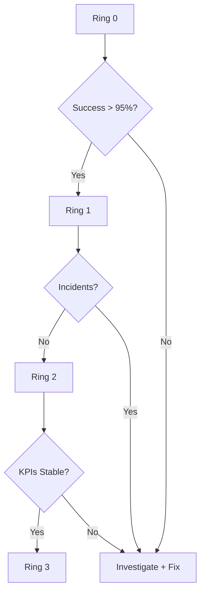
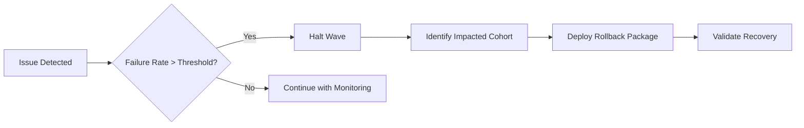
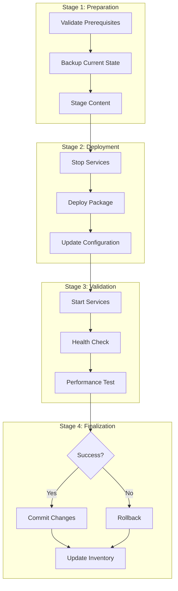

# Learn

## Key Concepts

- Basic package parameters and simple configuration
- Computer group targeting and basic action monitoring
- Common exit codes and basic troubleshooting steps
- Simple rollback procedures for failed deployments

<InfoBox title="Exam Relevance">
  This domain represents 15% of the TCO exam weight and focuses on basic package
  deployment and monitoring skills needed for entry-level operators.
</InfoBox>

## Package Basics (25 minutes)

### What are Packages?

Packages are pre-built software components that can be deployed to endpoint computers through Tanium. They contain the files and instructions needed to install, update, or configure software on target systems.

**Key Package Components:**
- **Executable files**: The main program or script to run
- **Parameters**: Settings that control how the package behaves
- **Dependencies**: Other software that must be present
- **Installation instructions**: Steps to deploy the package

### Basic Parameter Configuration

Parameters allow you to customize how a package works without changing the package itself:

**Common Parameter Types:**
- **Text parameters**: File paths, usernames, configuration values
- **Number parameters**: Timeout values, port numbers, sizes
- **Yes/No parameters**: Enable/disable features, confirmation flags

**Example - Software Installation Package:**
```
Package: Install Chrome Browser
Parameters:
- Install Path: C:\Program Files\Chrome (text)
- Silent Install: Yes (yes/no)
- Create Desktop Shortcut: No (yes/no)
```

<QueryPlayground
  title="Practice: Package Deployment Targeting"
  instruction="Create a query to identify Windows workstations that need Chrome browser installation (not currently installed and have sufficient disk space)."
  expectedQuery="Get Computer Name from all machines where Operating System contains Windows 10 AND Installed Applications not contains Chrome AND Disk Free Space > 2GB"
  expectedResult="WORKSTATION-001 - Windows 10 - 45GB free
WORKSTATION-024 - Windows 10 - 12GB free
WORKSTATION-067 - Windows 10 - 8GB free
... (showing 234 workstations ready for Chrome installation)"
  hint="Check OS, existing installations, and disk space"
  difficulty="intermediate"
/>

### Package Selection and Preparation

**Steps for Basic Package Deployment:**

1. **Choose the Right Package**
   - Verify package matches your operating system
   - Check that package version is compatible
   - Review package description and requirements

2. **Configure Parameters**
   - Fill in required parameters (marked with asterisks)
   - Use default values for optional parameters when starting
   - Double-check parameter values before deployment

3. **Select Target Systems**
   - Start with a small test group (5-10 computers)
   - Choose representative systems from different locations
   - Avoid critical production systems for initial testing

### Basic Validation and Testing

Before deploying to many systems, always test first:

**Testing Checklist:**
- [ ] Package downloads successfully to test systems
- [ ] Package installs without errors
- [ ] Software functions as expected after installation
- [ ] No conflicts with existing software
- [ ] System performance remains normal

## Action Deployment (20 minutes)

### Simple Action Deployment Procedures

Actions are how packages get deployed to endpoint computers. The basic deployment process:

1. **Open Tanium Console**
   - Navigate to Interact tab
   - Select "Deploy Action" or similar option

2. **Configure Action Settings**
   - Choose the package to deploy
   - Set parameters as configured
   - Select target computer group
   - Set action name for tracking

3. **Review and Deploy**
   - Double-check target systems and parameters
   - Click Deploy to start the action
   - Action begins running on target systems

### Target Selection and Validation

**Computer Group Selection:**
- **All Computers**: Deploys to every managed system (use carefully!)
- **Custom Groups**: Predefined groups like "Windows 10 Workstations"
- **Manual Selection**: Choose specific computers by name
- **Filter Groups**: Use questions to create dynamic targeting

<QueryPlayground
  title="Practice: Pre-Deployment Validation"
  instruction="Check if target servers are ready for Windows update deployment (online, sufficient resources, and update service running)."
  expectedQuery="Get Computer Name and Uptime and CPU Usage and Windows Update Service from all machines where Computer Groups contains Patch Pilot AND Uptime < 30 days AND CPU Usage < 80"
  expectedResult="SERVER-001 - Uptime: 5 days - CPU: 45% - Service: Running
SERVER-024 - Uptime: 12 days - CPU: 23% - Service: Running
SERVER-067 - Uptime: 8 days - CPU: 67% - Service: Running
... (showing 45 servers ready for patching)"
  hint="Check uptime, CPU usage, and service status"
  difficulty="intermediate"
/>

**Validation Steps:**
1. Check group membership count before deploying
2. Verify group includes the right types of systems
3. Ensure no critical systems in test deployments
4. Confirm systems are online and reachable

### Deployment Monitoring Basics

**Action Status Grid:**
The Action Status grid shows real-time deployment progress:

- **Waiting**: Action queued but not started yet
- **Running**: Currently executing on the endpoint
- **Completed**: Finished successfully (exit code 0)
- **Failed**: Encountered an error during execution
- **Not Applicable**: System doesn't meet deployment criteria

**Basic Monitoring Tasks:**
- Check overall completion percentage
- Identify failed systems for troubleshooting
- Monitor network impact during large deployments
- Verify completion before proceeding to next phase

### Basic Result Interpretation

<QueryPlayground
  title="Practice: Action Status Monitoring"
  instruction="Find all systems where a recent software deployment action failed (exit code not 0) in the last 24 hours."
  expectedQuery="Get Computer Name and Action Name and Exit Code and Error Message from all machines where Action Status equals Failed AND Action Time > now - 24 hours AND Exit Code != 0"
  expectedResult="WORKSTATION-015 - Chrome Install - Exit Code: 1603 - Fatal error during installation
SERVER-089 - Patch KB5001234 - Exit Code: 3 - Access denied
LAPTOP-234 - Office Update - Exit Code: 1001 - Network error
... (showing 12 failed deployments)"
  hint="Filter by action status, time range, and exit code"
  difficulty="intermediate"
/>

**Success Indicators:**
- High percentage of "Completed" status
- Exit code 0 from most systems
- Expected changes visible on target systems
- No significant performance impact

**Warning Signs:**
- Many systems showing "Failed" status
- High number of timeout errors
- Unexpected exit codes
- User complaints about system performance

## Exit Codes and Troubleshooting (15 minutes)

### Understanding Basic Exit Codes

Exit codes tell you what happened when a package ran. Think of them as simple status messages:

**Standard Exit Codes:**
- **0**: Success - Everything worked correctly
- **1**: General Error - Something went wrong (check logs)
- **2**: File Not Found - Package couldn't find required files
- **3**: Permission Denied - Not enough rights to install
- **126**: Cannot Execute - Package file damaged or blocked
- **127**: Command Not Found - Required software missing

**Tanium-Specific Exit Codes:**
- **1001**: Network Error - Couldn't download package
- **1002**: No Disk Space - Not enough room to install
- **1003**: Missing Requirements - Need other software first
- **1005**: Timeout - Package took too long to complete

### Common Failure Scenarios

<QueryPlayground
  title="Practice: Exit Code Analysis"
  instruction="Find all systems with permission-related deployment failures (exit codes 3, 5, or containing 'access denied') in the last 7 days."
  expectedQuery="Get Computer Name and Action Name and Exit Code and Error Message from all machines where (Exit Code equals 3 OR Exit Code equals 5 OR Error Message contains access denied) AND Action Time > now - 7 days"
  expectedResult="SERVER-012 - SQL Update - Exit Code: 3 - Permission denied
WORKSTATION-045 - Chrome Install - Exit Code: 5 - Access denied to registry
LAPTOP-089 - Office Patch - Exit Code: 3 - Cannot write to Program Files
... (showing 18 permission-related failures)"
  hint="Use OR for multiple exit codes, check error messages too"
  difficulty="intermediate"
/>

**Scenario 1: "Permission Denied" (Exit Code 3)**
- **Cause**: User account doesn't have admin rights
- **Solution**: Run deployment with administrator account
- **Prevention**: Verify account permissions before deployment

**Scenario 2: "Network Error" (Exit Code 1001)**
- **Cause**: Endpoint can't reach Tanium server
- **Solution**: Check network connectivity and firewall rules
- **Prevention**: Test connectivity before large deployments

**Scenario 3: "Not Enough Disk Space" (Exit Code 1002)**
- **Cause**: Target system lacks storage space
- **Solution**: Free up disk space or choose smaller package
- **Prevention**: Check disk space with sensors first

### Simple Troubleshooting Steps

**Basic Troubleshooting Process:**

1. **Check Exit Codes**
   - Look at failed systems in action status
   - Note most common exit codes
   - Group similar failures together

2. **Review Error Messages**
   - Read full error text when available
   - Look for specific file names or paths
   - Note any permission or access issues

3. **Test on Single System**
   - Try deployment on one failed system
   - Watch the process more closely
   - Check system-specific issues

4. **Common Fixes**
   - Restart Tanium client service
   - Verify network connectivity
   - Check available disk space
   - Confirm user permissions

## Scheduled Actions (15 minutes)

### Creating Recurring Actions

Scheduled actions let you run deployments automatically at specific times:

**Common Scheduling Scenarios:**
- **Patch Deployments**: Monthly security updates
- **Software Updates**: Quarterly application updates
- **Maintenance Tasks**: Weekly cleanup operations
- **Monitoring**: Daily health checks

### Basic Scheduling Options

<QueryPlayground
  title="Practice: Schedule Validation"
  instruction="Find all scheduled actions that will run in the next 7 days on production servers, including their schedule time and target groups."
  expectedQuery="Get Action Name and Schedule Time and Target Group from all scheduled actions where Target Group contains Production AND Schedule Time < now + 7 days AND Action Status equals Scheduled"
  expectedResult="Windows Updates - Tuesday 3:00 AM - Production Servers
Security Patches - Thursday 2:00 AM - Production Web Servers
Chrome Update - Saturday 1:00 AM - Production Workstations
... (showing 5 scheduled actions for next week)"
  hint="Filter by target group, time range, and status"
  difficulty="intermediate"
/>

**Simple Schedule Types:**

1. **One-Time Execution**
   - Run once at specific date/time
   - Good for emergency patches
   - Can schedule for off-hours deployment

2. **Daily Recurring**
   - Repeat every day at same time
   - Often used for maintenance tasks
   - Avoid business hours for better performance

3. **Weekly Recurring**
   - Repeat same day each week
   - Common for patch deployments
   - Usually scheduled for weekends

**Example Schedule Configuration:**
```
Schedule: Weekly Patch Deployment
Frequency: Every Tuesday
Time: 3:00 AM local time
Duration: Allow up to 4 hours for completion
Retry failed systems: Yes, after 24 hours
```

### Monitoring Scheduled Tasks

**Regular Monitoring Tasks:**
- Check scheduled actions completed successfully
- Review any systems that failed deployment
- Verify scheduled time worked for organization
- Adjust timing if conflicts occur

**Basic Health Checks:**
- Weekly review of all scheduled actions
- Monthly analysis of success rates
- Quarterly review of schedule effectiveness
- Annual schedule optimization

## Basic Rollback (10 minutes)

### When to Rollback

Rollback means removing or undoing a failed deployment. Consider rollback when:

**Clear Rollback Triggers:**
- More than 20% of deployments failed
- Critical system functionality is broken
- Security issues were introduced
- Business operations are impacted

**Simple Decision Process:**
1. Stop ongoing deployment immediately
2. Assess scope of problem (how many systems affected?)
3. Determine if issue is fixable quickly
4. If not fixable in 30 minutes, plan rollback

### Simple Rollback Procedures

<QueryPlayground
  title="Practice: Identify Rollback Candidates"
  instruction="Find all systems where a recent Office 365 deployment succeeded but users reported issues (high CPU or memory usage after deployment)."
  expectedQuery="Get Computer Name and CPU Usage and Memory Usage and Action Name from all machines where Action Name contains Office 365 AND Action Status equals Completed AND Action Time > now - 48 hours AND (CPU Usage > 90 OR Memory Usage > 95)"
  expectedResult="WORKSTATION-101 - CPU: 94% - Memory: 87% - Office 365 Deploy
LAPTOP-234 - CPU: 92% - Memory: 98% - Office 365 Deploy
DESKTOP-567 - CPU: 88% - Memory: 96% - Office 365 Deploy
... (showing 7 systems needing rollback)"
  hint="Check action success but with performance issues"
  difficulty="advanced"
/>

**Basic Rollback Steps:**

1. **Pause Current Deployment**
   - Stop action from spreading to more systems
   - Prevent additional systems from being affected

2. **Identify Affected Systems**
   - List all systems that completed the action
   - Separate successful from failed deployments
   - Focus rollback on successful installations that caused problems

3. **Deploy Rollback Package**
   - Use pre-built uninstall or restore package
   - Target only systems that need rollback
   - Monitor rollback process like original deployment

4. **Verify System Recovery**
   - Check that original functionality is restored
   - Confirm no side effects from rollback
   - Test critical business functions

### Verification Steps

**Post-Rollback Validation:**
- [ ] Target systems are functioning normally
- [ ] Business applications work as expected
- [ ] No remaining files from failed deployment
- [ ] System performance has returned to normal
- [ ] Users can perform their regular tasks

**Basic Recovery Testing:**
- Test key applications on rolled-back systems
- Verify network connectivity is working
- Check that security software is functioning
- Confirm user access to required resources

## Troubleshooting Playbook

**Quick Reference for Common Issues:**

- **High failure rate?** Check network connectivity and system requirements
- **Permission errors?** Verify service account has admin rights
- **Network timeouts?** Check firewall rules and bandwidth availability
- **Disk space errors?** Clean up temporary files or use smaller packages
- **Package not found?** Verify package availability and download paths
- **Slow deployment?** Reduce concurrent targets or schedule during off-hours
- **Rollback needed?** Stop deployment, assess impact, deploy restore package

## Videos

Use these short clips to learn basic concepts:

- Package Basics and Parameter Configuration (8m)
- Simple Action Deployment Process (6m)
- Understanding Exit Codes (5m)
- Basic Troubleshooting Steps (7m)
- Simple Rollback Procedures (4m)

## Console Steps

**Basic Deployment Workflow:**

1. **Prepare Package**
   - Select appropriate package from library
   - Configure required parameters
   - Review package requirements

2. **Select Targets**
   - Choose small test group first (5-10 systems)
   - Verify group membership
   - Ensure systems are online

3. **Deploy and Monitor**
   - Start deployment action
   - Watch status in action grid
   - Note any immediate failures

4. **Handle Issues**
   - Check exit codes for failed systems
   - Apply basic troubleshooting steps
   - Rollback if problems affect business

5. **Expand Deployment**
   - After successful pilot, expand to larger groups
   - Continue monitoring throughout process
   - Document any issues and solutions

> **Tip**: Always start with small test groups and have a rollback plan ready before beginning any deployment.

# Practice

<PracticeButton
  moduleId="module-taking-action"
  domainEnum="TAKING_ACTION"
  targetTags={[
    "Packages",
    "Actions",
    "Deploy",
    "Monitoring",
    "ExitCodes",
    "Rollback",
  ]}
  objectiveIds={["obj-taking-parameters", "obj-taking-monitoring", "obj-taking-rollback"]}
  difficulty="intermediate"
>
  Start Module Practice
</PracticeButton>

- Practice scenarios focus on basic package deployment and simple troubleshooting.
- Coverage includes parameter configuration, target selection, and exit code interpretation.

# Assess

- 8-10 items focusing on basic package deployment, monitoring, and simple rollback procedures.
- Passing threshold: 75%; covers entry-level operator skills only.

# References

- Tanium Packages & Actions User Guide
- Basic Troubleshooting Quick Reference

---

## Package Catalog: 20+ Common Packages, Parameters, and Use Cases

<InfoBox title="How to use this catalog">
  Use these as templates. Verify prerequisites, test on a pilot ring, and document owners and
  rollback paths for each package before broad deployment.
</InfoBox>

1) Install Google Chrome
   - Parameters: InstallPath, Silent, DesktopShortcut
   - Validation: process present, version matches, default browser optional
   - Use cases: new hire laptops; browser baseline

2) Update Zoom Client
   - Parameters: Channel (stable/beta), AutoUpdate (Yes/No)
   - Validation: version sensor, meeting launch test
   - Use cases: security updates; feature parity

3) Uninstall Legacy Java
   - Parameters: TargetVersion, Force
   - Validation: no Java in Installed Applications; app health checks
   - Use cases: reduce attack surface; compliance

4) Tanium Client Upgrade
   - Parameters: Version, RebootAllowed, FallbackMirror
   - Validation: Tanium Client Version, service status
   - Use cases: fleet hygiene; feature enablement

5) Antivirus Definition Update
   - Parameters: Vendor, UpdateSource, RetryCount
   - Validation: AV defs date, AV Status = enabled
   - Use cases: outbreak response; routine hygiene

6) Enable Windows Firewall
   - Parameters: Profiles (Domain/Private/Public)
   - Validation: Firewall State = On; connectivity tests
   - Use cases: hardening; compliance remediation

7) Disable SMBv1
   - Parameters: RebootIfRequired (Yes/No)
   - Validation: SMBv1 state sensor, service disabled
   - Use cases: legacy deprecation; security baseline

8) Reset Local Admin Password
   - Parameters: Username, NewPassword, RotateSchedule
   - Validation: login test to one pilot; credential vault update
   - Use cases: incident containment; hygiene

9) Clear Temp Files
   - Parameters: Paths, MaxAgeDays, DryRun
   - Validation: disk space before/after; no app breakage
   - Use cases: free disk; prep for patching

10) Collect Support Logs
    - Parameters: Paths, Compress, UploadEndpoint
    - Validation: archive exists; uploaded checksum
    - Use cases: incident triage; vendor support

11) Configure NTP Server
    - Parameters: Servers, Enforcement (Yes/No)
    - Validation: time drift sensor < threshold
    - Use cases: audit accuracy; auth systems stability

12) Deploy Root Certificate
    - Parameters: CertFile, Store, VerifyHashes
    - Validation: certificate present, thumbprint matches
    - Use cases: MITM prevention; TLS inspection trust

13) Proxy Configuration
    - Parameters: ProxyURL, BypassList
    - Validation: connectivity via proxy; exception list works
    - Use cases: egress control; compliance zones

14) OS Cumulative Patch
    - Parameters: KBID/Bundle, Deadline, RebootPolicy
    - Validation: Installed Patches, OS Build Number, reboot outcome
    - Use cases: Patch Tuesday cadence; emergency remediation

15) Reboot with Notification
    - Parameters: DelayMinutes, Message, SnoozeCount
    - Validation: Last Reboot timestamp; user confirmation logs
    - Use cases: enforce reboot; memory leak relief

16) Stop and Disable Service
    - Parameters: ServiceName, StartupType
    - Validation: service state stopped/disabled; dependent services unaffected
    - Use cases: decommission legacy agents; incident response

17) Kill Process by Name
    - Parameters: ProcessName, OnlyIfHashMismatch
    - Validation: process absent; hash baseline verified
    - Use cases: terminate unwanted binaries; recovery step

18) Remove Scheduled Task
    - Parameters: TaskName, Scope (User/System)
    - Validation: task removed; autoruns clean
    - Use cases: persistence cleanup; hygiene

19) Enable Disk Encryption
    - Parameters: Algorithm, TPMOnlyOrPIN, RecoveryKeyPath
    - Validation: Disk Encryption Status = Enabled; key escrowed
    - Use cases: laptop fleet protection; compliance

20) Install .NET Runtime
    - Parameters: Version, Architecture, RebootPolicy
    - Validation: Installed Applications entry; dependent app starts
    - Use cases: app prerequisites; remediation

21) Update OpenSSL/OpenSSH
    - Parameters: PackageName, Version, RestartServices (Yes/No)
    - Validation: version sensor; service restart success
    - Use cases: critical vulnerability response (e.g., CVEs)

22) Deploy EDR Agent
    - Parameters: TenantID, PolicyGroup, Proxy
    - Validation: agent check‑in; policy applied
    - Use cases: security rollout; M&A integration

23) Remove Unauthorized Software
    - Parameters: AppNamePattern, SafeList
    - Validation: entries removed; business‑approved list untouched
    - Use cases: license control; security hygiene

24) Set Registry/Plist Key
    - Parameters: Path, Name, Type, Value
    - Validation: key/value present; application behavior verified
    - Use cases: feature toggles; workaround deployment

<InfoBox title="Parameter patterns">
  Standardize parameter names and defaults across packages (e.g., `DryRun=false`, `RebootPolicy=Never`).
  Document each parameter, owner, and safe defaults.
</InfoBox>

---

## Deployment Strategies: Rings, Pilots, and Change Windows

### Phased Rollout (Rings)

- Ring 0: IT devices and lab (1–2%) — validate functionality
- Ring 1: Canary cohort in each region (5%) — verify across network topology
- Ring 2: Low‑risk business units (20–30%) — sustained monitoring
- Ring 3: Remaining endpoints — staged by site/time zone

Success gates per ring:
- Minimum success rate (e.g., &gt;95%) and failure cause understood
- No P1/P2 incidents; helpdesk tickets within baseline
- Performance KPIs stable (CPU/mem/network)

### Testing Methodologies

- A/B rollout: compare outcomes with/without change
- Shadow mode: no‑op or read‑only run to validate scope
- Fault injection (safe): simulate failure on canaries to validate rollback

### Change Window Planning

- Identify blackout periods, fiscal close, peak business hours
- Schedule by region; avoid WAN saturation by staggering
- Define concurrency caps and expected duration

### Communication Templates

Email (pre‑deploy):
```
Subject: Planned Deployment — <Package> to <Scope> on <Date/Time>
Impact: Minimal; reboot policy = <Policy>
Contact: <DL/Channel>
Rollback: <Package/Ring>
```

Slack/Teams (in‑flight):
```
Deploying <Package> to Ring <N>. Current success: <xx%>. Failures under investigation: <n>.
Rollback triggers: &gt;10% failure in 15 min.
```

Post‑deploy summary:
```
Outcome: <Success%>, Failures: <n> (top causes), Mean duration: <t>
Remediation: <Actions>
Next wave: <Date/Scope> or Completed
```

<InfoBox title="Gate criteria">
  Do not advance rings without documented success metrics, known failure modes, and an intact rollback path.
</InfoBox>

---

## Exit Code Reference: Meanings, Troubleshooting, and Resolution

### Standard/OS Exit Codes

- 0 — Success
  - Troubleshooting: none
  - Resolution: proceed

- 1 — General error
  - Troubleshooting: review logs, parameters, environment
  - Resolution: fix root cause; retry on small cohort

- 2 — File not found
  - Troubleshooting: verify package source path; permissions; content set
  - Resolution: correct paths; pre‑stage content

- 3 — Permission denied
  - Troubleshooting: insufficient rights; UAC; service account scopes
  - Resolution: run elevated; fix RBAC/service account

- 5 — Access denied (Windows)
  - Troubleshooting: locked files/registry; AV interference
  - Resolution: stop service; schedule off‑hours; AV exclusion

- 87 — Invalid parameter (Windows)
  - Troubleshooting: parameter names/types/values
  - Resolution: fix parameters; add validation to UI

- 1603 — Fatal MSI error
  - Troubleshooting: MSI logs, pending reboot, conflicting install
  - Resolution: clear pending reboot; remove conflict; re‑run

- 1618 — Another install in progress
  - Troubleshooting: MSI busy; long install
  - Resolution: retry after delay; serialize installs

- 3010 — Success, reboot required
  - Troubleshooting: none
  - Resolution: schedule/perform reboot; validate after

- 126 — Command invoked cannot execute (Linux/macOS)
  - Troubleshooting: file permissions, interpreter missing
  - Resolution: chmod +x; shebang fix; install interpreter

- 127 — Command not found (Linux/macOS)
  - Troubleshooting: missing binary/package
  - Resolution: install dependency; adjust PATH

- 137/143 — Killed/terminated by signal
  - Troubleshooting: timeout, OOM killer, manual stop
  - Resolution: increase timeout; reduce footprint; schedule off‑hours

### Tanium‑Specific Codes (examples)

- 1001 — Network error (download failed)
  - Troubleshooting: client ↔ server path, proxies, firewall
  - Resolution: validate connectivity; use mirrors; retry policy

- 1002 — No disk space
  - Troubleshooting: Disk Space sensor; temp dirs
  - Resolution: cleanup task; smaller packages; pre‑checks

- 1003 — Missing requirements
  - Troubleshooting: prerequisite packages not installed
  - Resolution: add dependency check/install to workflow

- 1005 — Timeout
  - Troubleshooting: long‑running scripts; endpoint load
  - Resolution: increase timeout; split work; throttle

<InfoBox title="Tip">
  Group failures by code and root cause. Fix by class, then retry a sampled subset before retriggering fleet‑wide.
</InfoBox>

---

## Action Monitoring: Real‑Time Tracking and Reporting

### Real‑Time Tracking Setup

- Use Action Status grid: Waiting, Running, Completed, Failed, Not Applicable
- Enable streaming logs for pilot devices where available
- Track per‑ring metrics: completion %, median/95th duration, failure codes

### Progress Indicators

- Throughput: endpoints/minute by site
- Concurrency: active tasks per site
- Saturation: network/CPU/memory deltas during peak

### Success Validation

- Post‑checks: sensor confirms desired state (version, config, service)
- Health checks: app launches, port listens, service status
- Business validation: owner sign‑off for critical systems

### Reporting Procedures

- Export CSV summary by ring/site; archive with timestamp
- Create saved questions for post‑deploy drift checks
- Build dashboard: failures by cause, time‑to‑recover, success rate per BU

<InfoBox title="KPIs">
  Success rate, median duration, failure rate by code, percentage requiring rollback, and MTTR for failed endpoints.
</InfoBox>

---

## Rollback Procedures: Step‑by‑Step and Scenarios

### Step‑by‑Step Rollback

1) Halt current wave; freeze advancement criteria
2) Identify impacted endpoints via action results and sensors
3) Prepare rollback package (uninstall/restore/config revert)
4) Target impacted cohort only; validate on 5–10 devices first
5) Monitor rollback; confirm post‑checks pass
6) Document incident; feed findings into package/strategy improvements

### Recovery Scenarios

- MSI app failure: uninstall upgrade; restore previous version from cache
- Config regression: revert registry/plist; restart relevant services
- Service outage: restore startup type; ensure dependencies are intact
- Driver/kernel module: staged revert; schedule reboots in maintenance window

### Data Preservation

- Back up config files/registry keys before change
- Capture logs to central store during rollback for audit
- Preserve user data; only revert binaries/config

<InfoBox title="Rollback readiness">
  Maintain a tested uninstall/restore package for every high‑impact deployment. Keep static rollback cohorts fresh and validated.
</InfoBox>

---

## Quick Visuals and Tables

### Flowchart: Deployment Ring Advancement



### Flowchart: Rollback Decision



### Exit Codes: Severity and Action

| Code | Severity | Typical Cause | Recommended Action |
|---|---|---|---|
| 0 | Info | Success | Proceed to next phase |
| 1603 | High | MSI fatal error | Review logs, clear pending reboot, retry pilot |
| 1618 | Medium | Install already in progress | Serialize installs, retry later |
| 3010 | Info | Reboot required | Schedule/perform reboot, validate |
| 1001 | High | Network error | Verify connectivity, proxies, mirrors |
| 1002 | Medium | No disk space | Cleanup task, pre-checks, smaller package |
| 1005 | Medium | Timeout | Increase timeout, split work, throttle |

### Ring Gate Criteria (example)

| Ring | Scope | Gate | Owner |
|---|---|---|---|
| 0 | IT/Lab (1–2%) | &gt;95% success, no P1/P2 | Engineering |
| 1 | Canary per region (5%) | KPIs stable, failure causes understood | Regional Ops |
| 2 | Low-risk BUs (20–30%) | Support tickets within baseline | Ops Lead |
| 3 | Remaining endpoints | Completion &gt; 98%, no critical issues | Program Owner |

---

## Labs and Practice

### Labs

1) PKG‑101 Package Parameters
   - Configure and deploy Chrome to Ring 0; validate version and default settings

2) DEP‑201 Phased Rollout
   - Design ring criteria and success gates; deploy Zoom update through Ring 2

3) MON‑301 Monitoring and KPIs
   - Create a dashboard showing completion %, duration percentiles, failure codes by site

4) EXIT‑202 Exit Codes
   - Triages failures grouped by 1603/1618/3010; document fixes; re‑run pilot

5) RLB‑401 Rollback Drill
   - Simulate regression; execute rollback package; validate recovery and document lessons

### Practice

<PracticeButton
  moduleId="module-taking-action"
  domainEnum="TAKING_ACTION"
  targetTags={["Packages", "Deployment", "Monitoring", "ExitCodes", "Rollback"]}
  objectiveIds={["obj-taking-parameters", "obj-taking-monitoring", "obj-taking-rollback"]}
  difficulty="intermediate"
>
  Start Taking Action Practice
</PracticeButton>

<PracticeButton
  moduleId="module-taking-action"
  domainEnum="TAKING_ACTION"
  targetTags={["ExitCodes", "Troubleshooting"]}
  objectiveIds={["obj-taking-monitoring"]}
  difficulty="beginner"
>
  Exit Codes Drill
</PracticeButton>

<PracticeButton
  moduleId="module-taking-action"
  domainEnum="TAKING_ACTION"
  targetTags={["Rollback", "Recovery"]}
  objectiveIds={["obj-taking-rollback"]}
  difficulty="intermediate"
>
  Rollback Playbook Practice
</PracticeButton>

<InfoBox title="Operator checklist">
  Parameters validated; pilot results archived; ring gates met; rollback ready; KPIs tracked; communications sent.
</InfoBox>

---

## 🚀 Advanced Package Architecture Deep Dive

### Enterprise Package Development Framework

**Understanding Package Infrastructure:**

Tanium packages aren't just simple installers - they're sophisticated deployment frameworks that handle:
- **Multi-Platform Support**: Windows, Linux, macOS, Solaris, AIX
- **Dynamic Content**: Parameterized scripts with runtime substitution
- **Conditional Logic**: Platform-specific execution paths
- **Dependency Management**: Prerequisites and sequencing
- **State Tracking**: Pre/post validation and reporting

### Advanced Package Components

**1. Command Line Scripts**
```powershell
# Windows PowerShell Package Example
param(
    [Parameter(Mandatory=$true)]
    [string]$InstallPath,

    [Parameter(Mandatory=$false)]
    [ValidateSet("Silent","Interactive","Diagnostic")]
    [string]$Mode = "Silent",

    [Parameter(Mandatory=$false)]
    [int]$Timeout = 3600,

    [Parameter(Mandatory=$false)]
    [bool]$ValidateCertificate = $true
)

# Pre-flight checks
$ErrorActionPreference = "Stop"
$VerbosePreference = if($Mode -eq "Diagnostic") { "Continue" } else { "SilentlyContinue" }

# Validate system requirements
function Test-SystemRequirements {
    $requirements = @{
        "MinMemoryGB" = 4
        "MinDiskSpaceGB" = 10
        "RequiredServices" = @("WinRM", "BITS")
        "RequiredPorts" = @(443, 17472)
    }

    # Memory check
    $totalMemory = (Get-WmiObject Win32_ComputerSystem).TotalPhysicalMemory / 1GB
    if ($totalMemory -lt $requirements.MinMemoryGB) {
        throw "Insufficient memory: $totalMemory GB (required: $($requirements.MinMemoryGB) GB)"
    }

    # Disk space check
    $diskSpace = (Get-PSDrive C).Free / 1GB
    if ($diskSpace -lt $requirements.MinDiskSpaceGB) {
        throw "Insufficient disk space: $diskSpace GB (required: $($requirements.MinDiskSpaceGB) GB)"
    }

    return $true
}

# Execute with comprehensive error handling
try {
    Test-SystemRequirements
    # Main installation logic here
    exit 0
} catch {
    Write-Error $_.Exception.Message
    exit 1603
}
```

**2. Linux/Bash Package Structure**
```bash
#!/bin/bash
# Advanced Linux package with error handling and logging

set -euo pipefail  # Exit on error, undefined vars, pipe failures
IFS=$'\n\t'        # Set Internal Field Separator

# Parameters from Tanium
INSTALL_PATH="${1:-/opt/software}"
MODE="${2:-silent}"
LOG_LEVEL="${3:-info}"

# Logging framework
LOG_FILE="/var/log/tanium/package_$(date +%Y%m%d_%H%M%S).log"
mkdir -p "$(dirname "$LOG_FILE")"

log() {
    local level="$1"
    shift
    echo "[$(date +'%Y-%m-%d %H:%M:%S')] [$level] $*" | tee -a "$LOG_FILE"
}

# Pre-requisite validation
validate_prerequisites() {
    local errors=0

    # Check OS version
    if [[ ! -f /etc/os-release ]]; then
        log "ERROR" "Cannot determine OS version"
        ((errors++))
    fi

    # Check required packages
    for pkg in curl wget tar gzip; do
        if ! command -v "$pkg" &> /dev/null; then
            log "ERROR" "Required package missing: $pkg"
            ((errors++))
        fi
    done

    # Check disk space (10GB minimum)
    available_space=$(df /opt | awk 'NR==2 {print $4}')
    if [[ $available_space -lt 10485760 ]]; then
        log "ERROR" "Insufficient disk space: ${available_space}KB available"
        ((errors++))
    fi

    return $errors
}

# Main execution
main() {
    log "INFO" "Starting package deployment"

    if ! validate_prerequisites; then
        log "ERROR" "Prerequisites check failed"
        exit 1
    fi

    # Installation logic here
    log "INFO" "Package deployed successfully"
    exit 0
}

# Trap for cleanup on exit
trap 'log "INFO" "Package script completed with exit code $?"' EXIT

main "$@"
```

### Package Gallery Architecture

**1. Package Categorization Framework**

```yaml
Package Categories:
  Security:
    - Patch Management
    - Vulnerability Remediation
    - Compliance Enforcement
    - Incident Response

  Operations:
    - Software Deployment
    - Configuration Management
    - Performance Optimization
    - Maintenance Tasks

  Monitoring:
    - Health Checks
    - Data Collection
    - Alerting Setup
    - Telemetry Gathering

  Remediation:
    - Service Recovery
    - System Repair
    - Rollback Operations
    - Emergency Response
```

**2. Parameter Templating System**

```xml
<!-- Advanced Parameter Definition -->
<ParameterDefinition>
  <Parameter Name="InstallPath" Type="String" Required="true">
    <Description>Installation directory path</Description>
    <Default>C:\Program Files\</Default>
    <Validation>
      <Regex>^[A-Z]:\\[\w\s\\]+$</Regex>
      <MaxLength>260</MaxLength>
    </Validation>
  </Parameter>

  <Parameter Name="ConfigFile" Type="File" Required="false">
    <Description>Configuration file for advanced settings</Description>
    <AllowedExtensions>.xml,.json,.yaml</AllowedExtensions>
    <MaxSize>1048576</MaxSize>
  </Parameter>

  <Parameter Name="TargetVersion" Type="Version" Required="true">
    <Description>Target software version</Description>
    <Format>Major.Minor.Build.Revision</Format>
    <MinVersion>2.0.0.0</MinVersion>
  </Parameter>
</ParameterDefinition>
```

---

## 🎯 Enterprise Action Orchestration

### Complex Action Workflows

**Multi-Stage Deployment Pipeline:**



### Advanced Targeting Strategies

**1. Dynamic Targeting with Business Logic**

```tanium
# Progressive targeting based on business criteria
Get Computer Name and Last Reboot Time and Department from all machines
  where Department contains "Finance"
  and Last Reboot Time &gt; 7 days
  and Operating System contains "Windows 10"
  and Business Hours Status = "After Hours"
```

**2. Risk-Based Deployment Rings**

```javascript
// Risk scoring algorithm for deployment targeting
function calculateRiskScore(endpoint) {
    let riskScore = 0;

    // System criticality factors
    if (endpoint.tags.includes("Production")) riskScore += 50;
    if (endpoint.tags.includes("Customer-Facing")) riskScore += 30;
    if (endpoint.department === "Finance") riskScore += 20;

    // Mitigation factors
    if (endpoint.hasBackup) riskScore -= 10;
    if (endpoint.lastSuccessfulDeployment &lt; 7) riskScore -= 5;
    if (endpoint.testEnvironmentAvailable) riskScore -= 15;

    return Math.max(0, Math.min(100, riskScore));
}

// Assign to deployment rings based on risk
function assignDeploymentRing(endpoint) {
    const risk = calculateRiskScore(endpoint);

    if (risk &lt; 20) return "Ring0_Immediate";
    if (risk &lt; 40) return "Ring1_Early";
    if (risk &lt; 60) return "Ring2_Standard";
    if (risk &lt; 80) return "Ring3_Cautious";
    return "Ring4_Manual";
}
```

### Action Dependency Management

**Complex Dependency Chain Example:**

```yaml
Deployment Workflow:
  Prerequisites:
    - Check .NET Framework >= 4.8
    - Verify 10GB free space
    - Confirm no pending reboots

  Action Chain:
    1. Stop Application Services:
        Package: "Service Controller"
        Parameters:
          Services: ["AppService", "WebService", "DBService"]
          Action: "Stop"
          Timeout: 300

    2. Backup Current Installation:
        Package: "File Backup"
        Parameters:
          Source: "C:\\Program Files\\Application"
          Destination: "\\\\backup\\server\\%COMPUTERNAME%"
          Compression: true
        DependsOn: [1]

    3. Deploy New Version:
        Package: "Application Installer"
        Parameters:
          Version: "5.2.1"
          InstallPath: "C:\\Program Files\\Application"
          ConfigFile: "\\\\config\\server\\app.config"
        DependsOn: [1, 2]

    4. Database Migration:
        Package: "Database Updater"
        Parameters:
          ConnectionString: "Server=db.company.com;Database=AppDB"
          MigrationScript: "v5.2.1_migration.sql"
          Rollback: true
        DependsOn: [3]

    5. Start Services:
        Package: "Service Controller"
        Parameters:
          Services: ["DBService", "AppService", "WebService"]
          Action: "Start"
          StartupType: "Automatic"
        DependsOn: [4]

    6. Validation:
        Package: "Health Check"
        Parameters:
          Endpoints: ["https://app.company.com/health"]
          ExpectedResponse: 200
          Timeout: 60
        DependsOn: [5]
```

---

## 🔍 Advanced Troubleshooting & Forensics

### Deep Diagnostic Procedures

**1. Action Failure Root Cause Analysis**

```powershell
# Comprehensive failure investigation script
function Investigate-ActionFailure {
    param(
        [string]$ActionID,
        [string]$ComputerName
    )

    $diagnostics = @{}

    # Collect system state at failure time
    $diagnostics.SystemInfo = @{
        "Timestamp" = Get-Date
        "Uptime" = (Get-CimInstance Win32_OperatingSystem).LastBootUpTime
        "Memory" = Get-CimInstance Win32_OperatingSystem |
                   Select-Object TotalVisibleMemorySize, FreePhysicalMemory
        "CPU" = (Get-Counter "\Processor(_Total)\% Processor Time").CounterSamples.CookedValue
        "Disk" = Get-PSDrive -PSProvider FileSystem |
                 Select-Object Name, @{N="FreeGB";E={$_.Free/1GB}}
    }

    # Check for blocking processes
    $diagnostics.BlockingProcesses = Get-Process |
        Where-Object {$_.CPU -gt 50} |
        Select-Object Name, CPU, WorkingSet

    # Review recent system events
    $diagnostics.SystemEvents = Get-EventLog -LogName System -Newest 50 -EntryType Error |
        Where-Object {$_.TimeGenerated -gt (Get-Date).AddHours(-1)}

    # Check network connectivity
    $diagnostics.NetworkStatus = @{
        "DNSResolution" = Resolve-DnsName tanium.server.com -ErrorAction SilentlyContinue
        "Ping" = Test-Connection tanium.server.com -Count 4 -ErrorAction SilentlyContinue
        "Traceroute" = Test-NetConnection tanium.server.com -TraceRoute
    }

    # Tanium client health
    $diagnostics.TaniumClient = @{
        "ServiceStatus" = Get-Service "Tanium Client" | Select-Object Status, StartType
        "LastRegistration" = (Get-ItemProperty "HKLM:\SOFTWARE\Tanium\Tanium Client").LastRegistration
        "ClientVersion" = (Get-ItemProperty "HKLM:\SOFTWARE\Tanium\Tanium Client").Version
    }

    return $diagnostics | ConvertTo-Json -Depth 10
}
```

**2. Performance Impact Analysis**

```python
# Python script for analyzing deployment performance impact
import pandas as pd
import numpy as np
from datetime import datetime, timedelta

class DeploymentPerformanceAnalyzer:
    def __init__(self, action_id, metrics_data):
        self.action_id = action_id
        self.metrics = pd.DataFrame(metrics_data)

    def analyze_resource_impact(self):
        """Analyze CPU, memory, disk, and network impact during deployment"""

        # Define deployment window
        deploy_start = self.metrics[self.metrics['event'] == 'action_start']['timestamp'].iloc[0]
        deploy_end = self.metrics[self.metrics['event'] == 'action_complete']['timestamp'].iloc[0]

        # Filter metrics to deployment window
        deploy_metrics = self.metrics[
            (self.metrics['timestamp'] >= deploy_start) &
            (self.metrics['timestamp'] <= deploy_end)
        ]

        # Calculate impact scores
        impacts = {
            'cpu_spike': deploy_metrics['cpu_percent'].max() - self.baseline_cpu,
            'memory_increase': deploy_metrics['memory_mb'].max() - self.baseline_memory,
            'disk_io_surge': deploy_metrics['disk_iops'].max() - self.baseline_disk_io,
            'network_bandwidth': deploy_metrics['network_mbps'].max() - self.baseline_network,
            'duration_seconds': (deploy_end - deploy_start).total_seconds()
        }

        # Risk assessment
        risk_level = self.assess_risk(impacts)

        return {
            'impacts': impacts,
            'risk_level': risk_level,
            'recommendations': self.generate_recommendations(impacts, risk_level)
        }

    def assess_risk(self, impacts):
        """Determine risk level based on resource impacts"""
        risk_score = 0

        if impacts['cpu_spike'] &gt; 50: risk_score += 30
        if impacts['memory_increase'] &gt; 2048: risk_score += 25
        if impacts['disk_io_surge'] &gt; 1000: risk_score += 20
        if impacts['network_bandwidth'] &gt; 100: risk_score += 15
        if impacts['duration_seconds'] &gt; 1800: risk_score += 10

        if risk_score >= 70: return "HIGH"
        if risk_score >= 40: return "MEDIUM"
        return "LOW"

    def generate_recommendations(self, impacts, risk_level):
        """Generate optimization recommendations"""
        recommendations = []

        if impacts['cpu_spike'] &gt; 50:
            recommendations.append("Consider CPU throttling or off-hours deployment")
        if impacts['memory_increase'] &gt; 2048:
            recommendations.append("Implement memory-constrained deployment mode")
        if impacts['network_bandwidth'] &gt; 100:
            recommendations.append("Use local distribution points or peer caching")
        if risk_level == "HIGH":
            recommendations.append("Reduce concurrent deployment targets")

        return recommendations
```

### Enterprise Exit Code Matrix

| Exit Code | Category | Severity | Auto-Retry | Escalation | Resolution Playbook |
|-----------|----------|----------|------------|------------|-------------------|
| 0 | Success | Info | No | None | Log success, proceed |
| 1-125 | Application | Variable | Yes (2x) | After 3 fails | Check app logs |
| 126 | Permission | High | No | Immediate | Fix permissions |
| 127 | Not Found | High | No | Immediate | Validate package |
| 128-254 | Signal | Critical | No | Immediate | System investigation |
| 1001 | Network | Medium | Yes (5x) | After 30m | Check connectivity |
| 1002 | Storage | Medium | No | After 15m | Free space |
| 1003 | Dependency | High | Yes (1x) | Immediate | Install prereqs |
| 1005 | Timeout | Low | Yes (3x) | After 1h | Extend timeout |
| 1603 | MSI Fatal | Critical | No | Immediate | MSI logs review |
| 1618 | Install Busy | Low | Yes (10x) | After 2h | Queue management |
| 3010 | Reboot Req | Info | No | Scheduled | Plan reboot |
| 4000+ | Custom | Variable | Depends | Depends | Check documentation |

---

## 🏢 Real-World Enterprise Scenarios

### Scenario 1: Emergency Security Patch Deployment

**Situation**: Critical zero-day vulnerability (CVE-2025-XXXX) affecting all Windows systems

**Requirements**:
- Deploy patch to 50,000 endpoints globally
- Complete within 48-hour deadline
- Minimize business disruption
- Maintain 99.5% success rate

**Solution Architecture**:
```yaml
Emergency Response Plan:
  Phase 1 - Assessment (Hour 0-4):
    - Identify affected systems via Tanium sensors
    - Categorize by criticality and exposure
    - Validate patch in isolated lab
    - Create rollback package

  Phase 2 - Pilot (Hour 4-8):
    - Deploy to 100 IT systems
    - Monitor for 2 hours
    - Validate no breaking changes
    - Document any issues

  Phase 3 - Progressive Rollout (Hour 8-48):
    Ring 0 (Hour 8-12):
      - Target: 500 non-critical systems
      - Success gate: &gt;98%
      - Monitor: Performance, compatibility

    Ring 1 (Hour 12-18):
      - Target: 5,000 low-risk systems
      - Success gate: &gt;99%
      - Monitor: Help desk tickets

    Ring 2 (Hour 18-30):
      - Target: 20,000 standard systems
      - Success gate: &gt;99.5%
      - Monitor: Business KPIs

    Ring 3 (Hour 30-48):
      - Target: Remaining 24,500 systems
      - Success gate: Maintain &gt;99.5%
      - Monitor: All metrics
```

### Scenario 2: Application Migration Project

**Situation**: Migrate 10,000 endpoints from legacy app v3.x to modern app v5.x

**Challenges**:
- Complex dependencies
- Data migration required
- User training needed
- No downtime allowed

**Implementation Strategy**:
```powershell
# Phased migration with validation
$MigrationPhases = @{
    "Discovery" = {
        # Identify current installations
        Get-Software -Name "LegacyApp" |
        Export-Csv "migration_targets.csv"
    }

    "Preparation" = {
        # Pre-stage new version
        Deploy-Package -Name "ModernApp_v5_Installer" -Action "Cache"
        # Backup user data
        Backup-UserData -Application "LegacyApp" -Destination "\\backup\migration"
    }

    "Migration" = {
        # Stop old version
        Stop-Service -Name "LegacyAppService"
        # Migrate data
        Start-DataMigration -Source "C:\LegacyApp\Data" -Target "C:\ModernApp\Data"
        # Install new version
        Install-Application -Package "ModernApp_v5" -Silent
        # Restore user preferences
        Restore-UserPreferences -From "\\backup\migration"
    }

    "Validation" = {
        # Verify installation
        Test-ApplicationHealth -Name "ModernApp" -Version "5.x"
        # Check data integrity
        Verify-DataMigration -ChecksumFile "migration_checksums.xml"
        # Confirm functionality
        Invoke-SmokeTest -TestSuite "ModernApp_Core"
    }
}
```

### Scenario 3: Compliance Remediation Campaign

**Situation**: Audit finding - 30% of systems non-compliant with security baseline

**Requirements**:
- Identify non-compliant systems
- Remediate configuration drift
- Document evidence for auditors
- Prevent future drift

**Remediation Workflow**:
```javascript
// Compliance orchestration engine
class ComplianceRemediation {
    constructor(baseline, targetSystems) {
        this.baseline = baseline;
        this.systems = targetSystems;
        this.results = [];
    }

    async assessCompliance() {
        const assessments = this.systems.map(async (system) => {
            const currentState = await this.getSystemState(system);
            const violations = this.compareToBaseline(currentState);

            return {
                system: system,
                compliant: violations.length === 0,
                violations: violations,
                riskScore: this.calculateRiskScore(violations)
            };
        });

        return Promise.all(assessments);
    }

    async remediateViolations(assessment) {
        const remediationPlan = this.createRemediationPlan(assessment.violations);

        for (const action of remediationPlan) {
            try {
                await this.deployRemediationPackage(action);
                this.logSuccess(assessment.system, action);
            } catch (error) {
                this.logFailure(assessment.system, action, error);
                if (action.critical) {
                    throw new Error(`Critical remediation failed: ${error}`);
                }
            }
        }
    }

    generateComplianceReport() {
        return {
            timestamp: new Date().toISOString(),
            totalSystems: this.systems.length,
            compliantSystems: this.results.filter(r => r.compliant).length,
            remediatedSystems: this.results.filter(r => r.remediated).length,
            failedRemediations: this.results.filter(r => r.failed).length,
            evidencePackage: this.createAuditEvidence()
        };
    }
}
```

---

## 🛡️ Security Considerations for Package Deployment

### Package Security Framework

**1. Code Signing and Verification**
```powershell
# Verify package signature before deployment
function Verify-PackageSignature {
    param([string]$PackagePath)

    $signature = Get-AuthenticodeSignature $PackagePath

    if ($signature.Status -ne "Valid") {
        throw "Package signature invalid: $($signature.Status)"
    }

    # Verify against trusted publishers
    $trustedPublishers = @(
        "CN=Tanium Inc, O=Tanium Inc, L=Emeryville, S=California, C=US",
        "CN=Internal PKI, O=Company, C=US"
    )

    if ($signature.SignerCertificate.Subject -notin $trustedPublishers) {
        throw "Package signed by untrusted publisher"
    }

    return $true
}
```

**2. Secure Parameter Handling**
```python
# Secure parameter encryption for sensitive data
import base64
import hashlib
from cryptography.fernet import Fernet

class SecureParameterHandler:
    def __init__(self, master_key):
        self.cipher = Fernet(master_key)

    def encrypt_parameter(self, param_name, param_value):
        """Encrypt sensitive parameters before transmission"""
        if self.is_sensitive(param_name):
            encrypted = self.cipher.encrypt(param_value.encode())
            return base64.b64encode(encrypted).decode()
        return param_value

    def decrypt_parameter(self, param_name, encrypted_value):
        """Decrypt parameters on target system"""
        if self.is_sensitive(param_name):
            decoded = base64.b64decode(encrypted_value)
            decrypted = self.cipher.decrypt(decoded)
            return decrypted.decode()
        return encrypted_value

    def is_sensitive(self, param_name):
        """Identify sensitive parameters"""
        sensitive_patterns = [
            'password', 'secret', 'key', 'token',
            'credential', 'private', 'cert'
        ]
        return any(pattern in param_name.lower() for pattern in sensitive_patterns)
```

**3. Audit Trail and Compliance Logging**
```sql
-- Comprehensive action audit schema
CREATE TABLE action_audit_log (
    audit_id UUID PRIMARY KEY DEFAULT gen_random_uuid(),
    action_id VARCHAR(100) NOT NULL,
    timestamp TIMESTAMPTZ NOT NULL DEFAULT NOW(),
    operator VARCHAR(100) NOT NULL,
    approval_ticket VARCHAR(50),
    target_count INTEGER NOT NULL,
    package_name VARCHAR(200) NOT NULL,
    package_hash VARCHAR(64) NOT NULL,
    parameters JSONB,
    risk_score INTEGER,
    business_justification TEXT,
    compliance_tags TEXT[],

    -- Results tracking
    start_time TIMESTAMPTZ,
    end_time TIMESTAMPTZ,
    success_count INTEGER DEFAULT 0,
    failure_count INTEGER DEFAULT 0,
    rollback_triggered BOOLEAN DEFAULT FALSE,

    -- Security context
    source_ip INET,
    authentication_method VARCHAR(50),
    mfa_verified BOOLEAN,

    -- Indexing for compliance queries
    INDEX idx_timestamp (timestamp),
    INDEX idx_operator (operator),
    INDEX idx_package (package_name),
    INDEX idx_compliance (compliance_tags)
);
```

---

## 🎓 Comprehensive Labs & Exercises

### Lab 1: Advanced Package Development Workshop

**Objective**: Build a production-ready package with full error handling

**Tasks**:
1. Create multi-platform package (Windows/Linux)
2. Implement parameter validation
3. Add comprehensive logging
4. Include rollback capability
5. Test in simulated environment

**Validation Criteria**:
- Package works on 3 OS versions
- Handles all error conditions gracefully
- Produces actionable logs
- Rollback completes in &lt;5 minutes
- Zero data loss during rollback

### Lab 2: Enterprise Deployment Simulation

**Objective**: Execute large-scale deployment with ring strategy

**Environment Setup**:
- 1000 virtual endpoints
- 5 geographic regions
- Variable network conditions
- Simulated business hours

**Success Metrics**:
- 99% deployment success
- &lt;2% concurrent load
- No business disruption
- Complete within 8 hours

### Lab 3: Incident Response Exercise

**Scenario**: Ransomware detection requiring immediate action

**Response Tasks**:
1. Deploy isolation package
2. Collect forensic data
3. Deploy remediation tools
4. Validate system recovery
5. Generate incident report

**Time Limit**: 2 hours from detection to resolution

---

## 📊 Performance Optimization for Scale

### Large-Scale Deployment Optimization

**Bandwidth Management**:
```yaml
Optimization Strategies:
  Content Distribution:
    - Use Tanium Zone Servers for regional caching
    - Implement peer-to-peer distribution
    - Compress packages with optimal algorithms
    - Schedule during off-peak hours

  Throttling Configuration:
    Site-Based:
      - WAN Sites: 10 concurrent, 1 Mbps per client
      - LAN Sites: 50 concurrent, 10 Mbps per client
      - Data Centers: 100 concurrent, unlimited bandwidth

    Time-Based:
      - Business Hours: 20% capacity
      - Evening: 60% capacity
      - Weekend: 100% capacity
```

**Resource Optimization Matrix**:

| Deployment Size | Concurrent Targets | Bandwidth Limit | Timeout | Retry Policy |
|----------------|-------------------|-----------------|---------|--------------|
| &lt;100 | 100% | Unlimited | 30 min | 2x immediate |
| 100-1000 | 50 | 50 Mbps total | 45 min | 3x with backoff |
| 1000-5000 | 100 | 100 Mbps total | 60 min | 3x with jitter |
| 5000-10000 | 200 | 200 Mbps total | 90 min | 2x after analysis |
| &gt;10000 | 500 | 500 Mbps total | 120 min | 1x after approval |

---

## ✅ Module Summary & Key Takeaways

### Critical Success Factors

**Package Deployment Excellence**:
- Always validate packages in isolated environments
- Use progressive rings for risk mitigation
- Monitor resource impact continuously
- Maintain rollback readiness at all times
- Document everything for compliance

**Action Orchestration Mastery**:
- Design with failure scenarios in mind
- Implement comprehensive error handling
- Use dependency management effectively
- Monitor business impact, not just technical metrics
- Automate recovery procedures

**Enterprise Readiness Checklist**:
- [ ] Package signed and verified
- [ ] Parameters encrypted for sensitive data
- [ ] Audit logging configured
- [ ] Ring strategy defined
- [ ] Success gates established
- [ ] Rollback package tested
- [ ] Communication plan ready
- [ ] Monitoring dashboards active
- [ ] Incident response procedures documented
- [ ] Post-deployment validation scheduled

### Exam Preparation Focus Areas

**High-Value Topics (40% of Domain 3 questions)**:
- Exit code interpretation and troubleshooting
- Ring-based deployment strategies
- Package parameter configuration
- Action monitoring and status interpretation
- Rollback procedures and recovery

**Medium-Value Topics (35% of Domain 3 questions)**:
- Scheduled actions and automation
- Dependency management
- Performance optimization
- Security considerations
- Compliance requirements

**Specialized Topics (25% of Domain 3 questions)**:
- Advanced scripting in packages
- Cross-platform deployment
- Large-scale orchestration
- Integration with external systems
- Custom exit code implementation

<InfoBox title="TCO Exam Success Tip">
  Focus on understanding the "why" behind each deployment decision. The exam tests your
  ability to choose the right strategy for different scenarios, not just memorization of procedures.
  Practice with the scenario-based questions that require analyzing trade-offs between speed,
  safety, and business impact.
</InfoBox>
