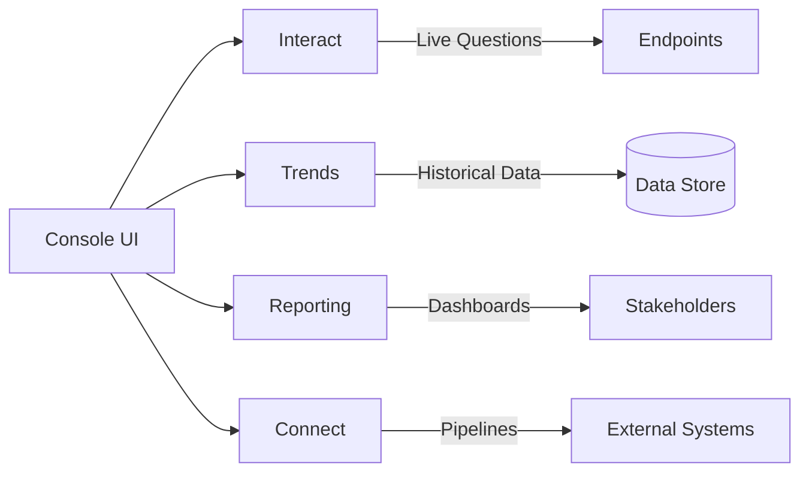
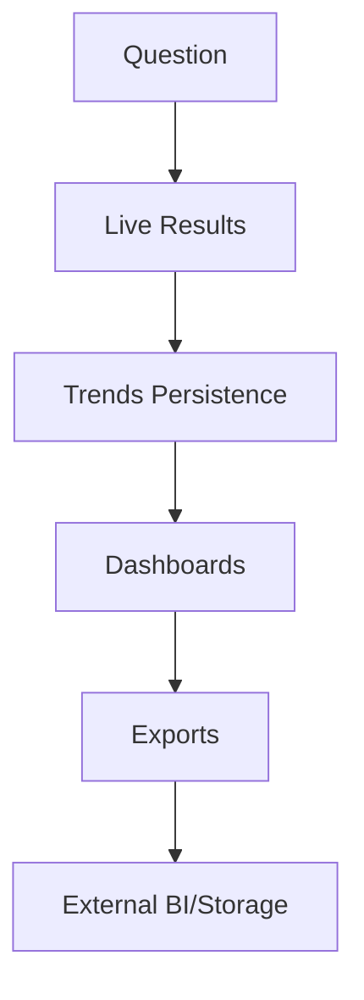
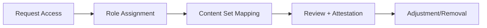
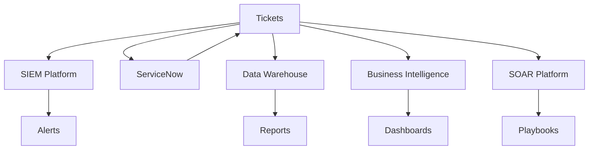

# Learn

## Module Overview & Importance

This comprehensive module covers navigation and the four core modules that form the foundation of daily Tanium operations. With 23% exam weight, mastering these concepts is critical for certification success.

<InfoBox title="Exam Relevance - Critical Success Factor">
  This domain represents 23% of the TCO certification exam - the highest weighted domain.
  You'll face 18-20 questions covering console navigation, module selection decisions,
  workflow optimization, and troubleshooting. Expect scenario-based questions requiring
  you to choose the correct module and navigation path for specific business requirements.
</InfoBox>

## Section 1: Console Layout Deep Dive (45 minutes)

### Global Navigation Architecture

The Tanium console follows a hierarchical navigation structure designed for rapid access to all platform capabilities:

#### Primary Navigation Components

**Top Navigation Bar**
- **Global Search**: Universal search across all data types (sensors, saved questions, groups, users)
- **Notifications Center**: Real-time alerts for system events, scheduled actions, and user mentions
- **User Profile Menu**: Account settings, role information, and session management
- **Help System**: Context-sensitive documentation and support resources

**Left Side Navigation**
- **Module Icons**: Direct access to primary modules (Interact, Trends, Reporting, Connect, etc.)
- **Favorites**: User-customized shortcuts to frequently accessed items
- **Recently Used**: Dynamic list of last 10 accessed screens/objects
- **Administration**: System configuration and management tools (role-dependent visibility)

<InfoBox title="Navigation Best Practice">
  The left navigation auto-collapses to save screen space. Use Ctrl+Shift+N to toggle
  the navigation panel quickly. This keyboard shortcut works in all modules and saves
  significant time during intensive work sessions.
</InfoBox>

#### Panel Management System

**Panel Types and Usage**
- **Question Panels**: Display real-time sensor data with live refresh capabilities
- **Saved Question Panels**: Historical question results with comparison features
- **Chart Panels**: Graphical representations with multiple visualization options
- **List Panels**: Tabular data display with sorting and filtering
- **Summary Panels**: Aggregated metrics with drill-down capabilities

**Panel Customization Options**
1. **Size and Layout**: Resize panels by dragging borders; snap to grid for alignment
2. **Refresh Intervals**: Set automatic refresh from 5 seconds to 24 hours
3. **Data Limits**: Configure row limits (100, 500, 1000, 5000, or unlimited)
4. **Export Options**: CSV, JSON, XML formats with scheduled delivery
5. **Color Themes**: Apply consistent color coding across related panels

**Workspace Organization Strategies**

*Personal Workspaces*
- Create topic-specific workspaces (Security, Compliance, Performance)
- Use naming conventions: [Department]-[Purpose]-[Date] (e.g., "SecOps-IncidentResponse-Q4")
- Archive completed investigation workspaces monthly

*Shared Workspaces*
- Establish team templates for common investigation types
- Document workspace purpose and update procedures
- Implement review cycles for shared content relevance

#### Advanced Search Functionality

**Global Search Capabilities**
- **Fuzzy Matching**: Handles typos and partial matches
- **Scoped Search**: Prefix searches (sensor:, group:, user:, question:)
- **Boolean Logic**: AND, OR, NOT operators for complex queries
- **Wildcard Support**: * and ? characters for pattern matching
- **Historical Search**: Access to previously executed searches

**Search Performance Optimization**
- Use specific prefixes to narrow search scope
- Leverage saved searches for repeated queries
- Clear search history monthly to maintain performance
- Bookmark frequently accessed objects instead of searching

<PracticeButton
  moduleId="module-navigation-basic-modules"
  domainEnum="NAVIGATION_MODULES"
  targetTags={["Navigation", "Console", "Layout", "Search"]}
  objectiveIds={["obj-console-mastery"]}
  difficulty="beginner"
>
  Practice Console Navigation
</PracticeButton>

---

## Visual Appendix

### Console Architecture Overview



### Module Data Flow



### Administrative Workflow



### Module Feature Quick Map

| Module | Primary Purpose | Live vs Historic | Typical Outputs | Notes |
|---|---|---|---|---|
| Interact | Live inquiry | Live | Tables | Great for exploration |
| Trends | Time-series | Historic | Panels/Alerts | Baselines and alerts |
| Reporting | Communication | Both | Dashboards/Exports | Audience-focused |
| Connect | Integration | N/A | Pipelines | Data movement/governance |

#### Widget Configuration and Dashboard Layouts

**Dashboard Design Principles**
1. **Visual Hierarchy**: Most critical information in upper-left quadrant
2. **Color Consistency**: Establish color meanings (red=critical, yellow=warning, green=healthy)
3. **White Space**: Avoid cramming; use spacing for visual separation
4. **Responsive Design**: Ensure readability across different screen sizes

**Widget Types and Applications**
- **KPI Widgets**: Single-value displays for key metrics
- **Trend Widgets**: Time-series data with multiple data sources
- **Table Widgets**: Detailed data with sorting and filtering
- **Chart Widgets**: Bar, line, pie, and scatter plot visualizations
- **Alert Widgets**: Real-time notification displays

## Section 2: Module Decision Framework - Interact vs Trends vs Reporting vs Connect (60 minutes)

### When to Use Each Module: Decision Trees

Understanding when to use each module is crucial for efficient operations and exam success. Each module serves distinct purposes and workflows.

#### Interact Module: Real-Time Investigation

**Primary Use Cases**
- **Incident Response**: Immediate threat hunting and forensic analysis
- **Ad-Hoc Investigations**: One-time data collection for specific questions
- **System Validation**: Verify configurations and policy compliance
- **Live Troubleshooting**: Real-time performance and connectivity issues

**Decision Criteria for Interact**
- Need current/live data (not historical)
- Investigation is exploratory or one-time
- Results needed immediately (within seconds/minutes)
- Data requirements may evolve during investigation

**Interact Workflow Patterns**
1. **Initial Assessment**: Start with broad questions, narrow based on results
2. **Drill-Down Analysis**: Use results to build more specific follow-up questions
3. **Validation Checks**: Confirm findings with alternative data sources
4. **Documentation**: Save significant findings as saved questions

<InfoBox title="Interact Performance Tip">
  Interact questions run against live endpoints. Large-scale questions (&gt;10,000 endpoints)
  should use question scheduling or be broken into smaller batches to avoid performance
  impact. Use computer groups to scope questions appropriately.
</InfoBox>

#### Trends Module: Historical Analysis and Monitoring

**Primary Use Cases**
- **Performance Monitoring**: Track system metrics over time
- **Trend Analysis**: Identify patterns and anomalies in historical data
- **Capacity Planning**: Forecast resource requirements based on usage trends
- **Compliance Reporting**: Generate historical compliance posture reports

**Decision Criteria for Trends**
- Need historical data comparison
- Creating ongoing monitoring solutions
- Building visualizations for stakeholder consumption
- Establishing baseline measurements

**Trends Panel Creation Strategy**
1. **Data Source Selection**: Choose sensors with consistent historical collection
2. **Time Range Definition**: Align with business reporting cycles
3. **Aggregation Methods**: Select appropriate grouping (hourly, daily, weekly)
4. **Threshold Configuration**: Set alert conditions for proactive monitoring

#### Reporting Module: Formatted Output and Distribution

**Primary Use Cases**
- **Executive Dashboards**: High-level KPIs and status indicators
- **Compliance Reports**: Formatted reports for auditors and regulators
- **Operational Summaries**: Regular team and stakeholder communications
- **Data Export**: Structured data delivery to external systems

**Decision Criteria for Reporting**
- Need formatted, presentation-ready output
- Regular/scheduled distribution required
- Multiple data sources must be combined
- Audience includes non-technical stakeholders

**Report Design Best Practices**
1. **Audience-Centric Design**: Tailor content and complexity to viewer expertise
2. **Executive Summary**: Start with key findings and recommendations
3. **Supporting Details**: Provide drill-down data for technical teams
4. **Visual Consistency**: Use standard formatting and color schemes
5. **Action Items**: Include clear next steps and responsibilities

#### Connect Module: External Integration and Data Pipelines

**Primary Use Cases**
- **SIEM Integration**: Stream security events to security platforms
- **ITSM Integration**: Create tickets and update status in service management tools
- **Data Warehousing**: Export structured data for business intelligence systems
- **API Integration**: Push/pull data with third-party applications

**Decision Criteria for Connect**
- External systems require Tanium data
- Real-time or scheduled data delivery needed
- Data transformation/filtering required before export
- Integration with business workflows and processes

<InfoBox title="Connect Security Warning">
  Connect pipelines can expose sensitive data to external systems. Always implement
  proper access controls, data filtering, and encryption. Coordinate with security
  teams before establishing new Connect integrations.
</InfoBox>

### Module Integration Workflows

#### Workflow 1: Interact → Trends → Reporting
**Scenario**: Security team discovers suspicious process execution and needs ongoing monitoring

1. **Interact Phase**: Investigate suspicious processes with real-time questions
   - `Get Running Processes containing "suspicious_process.exe"`
   - Drill down to affected endpoints and user contexts
   - Validate findings and scope of impact

2. **Trends Phase**: Create monitoring panels for ongoing surveillance
   - Build panel tracking process executions over time
   - Set up alerting thresholds for process recurrence
   - Configure automatic data collection schedules

3. **Reporting Phase**: Generate stakeholder communications
   - Create executive summary of findings
   - Schedule weekly reports on remediation progress
   - Export detailed forensic data for security tools

#### Workflow 2: Trends → Connect → Reporting
**Scenario**: IT operations needs automated server health monitoring with ITSM integration

1. **Trends Phase**: Establish baseline monitoring
   - Create panels for CPU, memory, and disk utilization
   - Set performance thresholds based on historical data
   - Validate alert conditions with test scenarios

<QueryPlayground
  id="navigation-practice-1"
  title="Practice: Module Selection Decision Tree"
  description="Given various scenarios, select the most appropriate Tanium module and explain your reasoning."
  initialQuery="Which module would you use to investigate a security incident that happened 3 days ago?"
  expectedAnswers={[
    "Trends Module - For historical analysis of security events that occurred in the past",
    "Look for time-series data showing the incident timeline and impact scope"
  ]}
  difficulty="intermediate"
  category="Module Selection"
/>

2. **Connect Phase**: Integrate with service management
   - Configure Connect to create tickets for threshold violations
   - Set up data filtering to prevent alert fatigue
   - Establish escalation procedures for critical alerts

3. **Reporting Phase**: Provide management visibility
   - Generate monthly infrastructure health reports
   - Track SLA compliance and improvement trends
   - Create cost-benefit analysis of monitoring investments

### Performance Considerations by Module

#### Interact Performance Optimization
- **Question Scoping**: Use computer groups to limit endpoint targets
- **Sensor Selection**: Choose efficient sensors that minimize endpoint resource usage
- **Result Limits**: Set appropriate row limits to prevent browser performance issues
- **Concurrent Questions**: Limit simultaneous questions to prevent endpoint overload

#### Trends Performance Optimization
- **Data Retention**: Configure appropriate retention periods for different data types
- **Panel Refresh**: Set refresh intervals based on data volatility requirements
- **Source Aggregation**: Combine related data sources to reduce query overhead
- **Index Optimization**: Ensure proper database indexing for frequently queried fields

#### Reporting Performance Optimization
- **Schedule Optimization**: Distribute report generation across time periods
- **Data Caching**: Leverage cached results for frequently requested reports
- **Format Selection**: Choose appropriate output formats for data size and complexity
- **Distribution Lists**: Optimize recipient lists to prevent unnecessary processing

#### Connect Performance Optimization
- **Batch Processing**: Group multiple records into single transmission batches
- **Error Handling**: Implement robust retry logic for temporary connection failures
- **Data Filtering**: Apply filters at source to minimize network transmission
- **Connection Pooling**: Reuse connections for multiple data transmissions

<PracticeButton
  moduleId="module-navigation-basic-modules"
  domainEnum="NAVIGATION_MODULES"
  targetTags={["Interact", "Trends", "Reporting", "Connect", "Workflows"]}
  objectiveIds={["obj-module-selection"]}
  difficulty="intermediate"
>
  Practice Module Selection
</PracticeButton>

## Section 3: Module-Specific Procedures (75 minutes)

### Interact: Advanced Question Building and Management

#### Complex Question Construction

**Multi-Sensor Questions**
Complex investigations often require combining data from multiple sensors to build comprehensive understanding:

```
Get Computer Name and IP Address and Last Logged In User and Operating System
from all machines where Last Logged In User contains "admin"
```

**Question Building Best Practices**
1. **Start Simple**: Begin with basic questions and add complexity iteratively
2. **Test Incrementally**: Verify each sensor addition before adding more complexity
3. **Use Filters Strategically**: Apply filters to reduce data volume early in the question
4. **Document Logic**: Add comments to explain complex question logic

**Advanced Filtering Techniques**
- **Regex Patterns**: Use `matches` operator with regular expressions
- **Date Filtering**: Leverage `older than` and `newer than` with time specifications
- **Numeric Comparisons**: Use `greater than`, `less than` for threshold-based filtering
- **Compound Logic**: Combine multiple conditions with `and`, `or` operators

#### Saved Questions Management

**Organizational Strategies**
- **Naming Convention**: [Category]-[Purpose]-[Date] (e.g., "Security-ProcessAnalysis-2024Q4")
- **Folder Structure**: Organize by functional area, not by creator
- **Version Control**: Include version numbers for evolving questions
- **Documentation**: Add descriptions explaining question purpose and expected results

**Saved Question Optimization**
1. **Performance Testing**: Validate question performance across different endpoint counts
2. **Result Validation**: Verify accuracy across different operating systems and configurations
3. **Maintenance Scheduling**: Review and update saved questions quarterly
4. **Access Control**: Apply appropriate permissions based on data sensitivity

#### Drill-Down Investigation Techniques

**Progressive Investigation Methods**
1. **Broad Discovery**: Start with high-level questions to identify scope
2. **Targeted Analysis**: Focus on specific endpoints or time periods
3. **Root Cause Analysis**: Drill into specific configurations or behaviors
4. **Impact Assessment**: Evaluate broader implications of findings

**Question Chaining Strategies**
- Use results from initial questions to build follow-up investigations
- Leverage computer name filtering for endpoint-specific analysis
- Apply time-based filtering to correlate events across questions
- Cross-reference multiple data sources for validation

### Trends: Panel Creation and Data Visualization

#### Advanced Panel Configuration

**Data Source Management**
- **Sensor Selection**: Choose sensors with consistent data types and collection intervals
- **Time Alignment**: Ensure all data sources use compatible time stamps
- **Data Quality**: Implement validation rules for data consistency
- **Performance Impact**: Monitor panel load times and optimize as needed

**Visualization Types and Applications**

*Line Charts*
- **Best For**: Time-series data, trend analysis, performance monitoring
- **Configuration**: Set appropriate time ranges and axis scaling
- **Multiple Series**: Compare up to 10 different metrics simultaneously
- **Annotations**: Add event markers for correlation analysis

*Bar Charts*
- **Best For**: Categorical comparisons, ranking data, distribution analysis
- **Horizontal vs Vertical**: Choose orientation based on label length and data count
- **Stacking Options**: Use stacked bars for component analysis
- **Color Coding**: Apply consistent colors across related charts

*Heat Maps*
- **Best For**: Two-dimensional correlations, geographic data, time-based patterns
- **Color Scales**: Select scales that highlight important variations
- **Grid Configuration**: Optimize cell sizes for data density
- **Interactive Features**: Enable drill-down capabilities where appropriate

#### Threshold and Alert Configuration

**Alert Strategy Development**
1. **Baseline Establishment**: Collect 30+ days of data before setting thresholds
2. **Statistical Analysis**: Use standard deviation and percentile analysis
3. **Business Context**: Align thresholds with business impact levels
4. **False Positive Minimization**: Test thresholds against historical anomalies

**Alert Delivery Methods**
- **Email Notifications**: Configure appropriate recipient lists and escalation procedures
- **Dashboard Alerts**: Visual indicators for real-time monitoring
- **Integration Alerts**: Push notifications to external systems via Connect
- **Mobile Alerts**: Configure mobile-friendly notifications for critical issues

<InfoBox title="Trends Alert Tuning">
  Over-alerting reduces response effectiveness. Start with conservative thresholds
  and tighten based on actual incident patterns. Review alert effectiveness monthly
  and adjust based on true positive rates and response outcomes.
</InfoBox>

### Reporting: Dashboard Development and Distribution

#### Dashboard Architecture and Design

**Information Architecture Principles**
1. **Pyramid Structure**: Executive summary → Department details → Technical specifics
2. **Progressive Disclosure**: Surface most important information first
3. **Consistent Navigation**: Standard menu structures across related reports
4. **Mobile Compatibility**: Ensure readability on various device sizes

**Layout Best Practices**
- **Grid System**: Use consistent spacing and alignment
- **Visual Weight**: Balance information density across dashboard sections
- **Color Psychology**: Leverage colors to guide attention and convey meaning
- **Typography**: Use font hierarchies to establish information importance

#### Advanced Report Creation

**Multi-Source Report Development**
1. **Data Integration Planning**: Map data relationships and join criteria
2. **Refresh Coordination**: Synchronize data collection times across sources
3. **Error Handling**: Implement fallback displays for missing data sources
4. **Performance Testing**: Validate report generation times with full data sets

**Dynamic Content Generation**
- **Parameter-Driven Reports**: Create reports that adapt based on input parameters
- **Conditional Sections**: Show/hide content based on data availability or user roles
- **Interactive Elements**: Enable drill-down and filtering capabilities
- **Export Options**: Provide multiple format options (PDF, Excel, CSV, PowerPoint)

#### Scheduling and Distribution Management

**Schedule Optimization Strategies**
- **Load Balancing**: Distribute report generation across non-peak hours
- **Dependency Management**: Sequence reports that depend on common data sources
- **Failure Recovery**: Implement retry logic and error notification procedures
- **Resource Monitoring**: Track system resource usage during report generation

**Distribution List Management**
- **Role-Based Distribution**: Align report recipients with data access permissions
- **Delivery Preferences**: Accommodate recipient preferences for format and frequency
- **Subscription Management**: Provide self-service subscription capabilities
- **Archive Policies**: Establish retention periods for distributed reports

### Connect: Pipeline Development and Data Integration

#### Pipeline Architecture Fundamentals

**Data Flow Design Patterns**
1. **Extract-Transform-Load (ETL)**: Traditional batch processing for large data volumes
2. **Change Data Capture (CDC)**: Real-time streaming for immediate data availability
3. **Event-Driven Processing**: Trigger-based data transmission for specific conditions
4. **Scheduled Synchronization**: Regular bulk transfers for data consistency

**Data Transformation Capabilities**
- **Field Mapping**: Transform source field names to destination requirements
- **Data Type Conversion**: Convert between different data formats and types
- **Value Translation**: Map categorical values between different system vocabularies
- **Data Enrichment**: Add contextual information from lookup tables or APIs

#### Security and Access Control

**Data Protection Strategies**
1. **Encryption in Transit**: Use HTTPS/TLS for all data transmission
2. **Encryption at Rest**: Ensure destination systems protect stored data
3. **Data Minimization**: Transmit only necessary fields for intended purpose
4. **Access Logging**: Maintain comprehensive audit trails for data access

**Authentication and Authorization**
- **Service Accounts**: Use dedicated accounts with minimal necessary permissions
- **Token Management**: Implement secure token storage and rotation procedures
- **Network Segmentation**: Restrict Connect communications to necessary network paths
- **Regular Access Review**: Audit and update access permissions quarterly

#### Pipeline Monitoring and Troubleshooting

**Performance Monitoring**
- **Throughput Metrics**: Track records processed per hour/day
- **Latency Measurements**: Monitor end-to-end data delivery times
- **Error Rates**: Track and analyze transmission failures and retries
- **Resource Utilization**: Monitor CPU, memory, and network usage

**Common Troubleshooting Scenarios**
1. **Connection Failures**: Network connectivity and authentication issues
2. **Data Format Errors**: Schema mismatches and data type conflicts
3. **Performance Degradation**: Bandwidth limitations and processing bottlenecks
4. **Synchronization Issues**: Timing conflicts and data consistency problems

<PracticeButton
  moduleId="module-navigation-basic-modules"
  domainEnum="NAVIGATION_MODULES"
  targetTags={["Interact", "Trends", "Reporting", "Connect", "Procedures"]}
  objectiveIds={["obj-module-procedures"]}
  difficulty="advanced"
>
  Practice Module Procedures
</PracticeButton>

## Section 4: Navigation Efficiency and Power User Techniques (30 minutes)

### Comprehensive Keyboard Shortcuts Reference

#### Global Navigation Shortcuts
- **Ctrl+Shift+N**: Toggle left navigation panel
- **Ctrl+Shift+S**: Open global search (focus search box)
- **Ctrl+Shift+H**: Return to home dashboard
- **Ctrl+Shift+M**: Switch between modules (cycles through primary modules)
- **Alt+N**: Open notifications center
- **Alt+P**: Open user profile menu
- **Alt+H**: Open context-sensitive help

#### Module-Specific Shortcuts

**Interact Module**
- **Ctrl+N**: New question
- **Ctrl+S**: Save current question
- **Ctrl+R**: Execute/refresh current question
- **Ctrl+E**: Edit selected saved question
- **Ctrl+D**: Duplicate current question
- **F5**: Refresh question results
- **Ctrl+F**: Find in results

**Trends Module**
- **Ctrl+P**: New panel
- **Ctrl+Alt+C**: Copy panel configuration
- **Ctrl+Alt+V**: Paste panel configuration
- **Ctrl+T**: New threshold alert
- **Ctrl+G**: Configure panel grouping
- **Ctrl+L**: Adjust panel layout

**Reporting Module**
- **Ctrl+B**: New dashboard
- **Ctrl+W**: New widget
- **Ctrl+Alt+S**: Schedule current report
- **Ctrl+Alt+E**: Export current report
- **Ctrl+Alt+P**: Preview report layout
- **Ctrl+Alt+D**: Duplicate dashboard

**Connect Module**
- **Ctrl+I**: New integration
- **Ctrl+T**: Test connection
- **Ctrl+M**: Monitor pipeline status
- **Ctrl+Alt+L**: View connection logs
- **Ctrl+Alt+R**: Restart pipeline

#### Advanced Navigation Techniques

**Tab Management**
- **Ctrl+T**: Open new tab within current module
- **Ctrl+W**: Close current tab
- **Ctrl+Tab**: Cycle through open tabs
- **Ctrl+Shift+Tab**: Reverse cycle through tabs
- **Ctrl+1-9**: Jump to specific tab number

**Context Menu Efficiency**
- **Right-click + C**: Copy item (context-dependent)
- **Right-click + E**: Edit item
- **Right-click + D**: Delete item
- **Right-click + P**: View properties
- **Right-click + S**: Share item

### Saved Views and Bookmark Management

#### Saved View Strategies

**Personal Organization System**
1. **Current Projects**: Active investigations and ongoing work
2. **Templates**: Reusable configurations for common tasks
3. **References**: Frequently consulted information and procedures
4. **Archive**: Completed projects maintained for reference

**Shared View Management**
- **Team Standards**: Establish naming conventions and organization principles
- **Access Control**: Apply appropriate sharing permissions based on data sensitivity
- **Version Control**: Maintain version history for evolving saved views
- **Documentation**: Include descriptions and usage instructions

#### Bookmark Optimization

**Bookmark Categories**
- **Daily Tasks**: Most frequently accessed screens and functions
- **Weekly Tasks**: Regular but less frequent operational activities
- **Monthly Tasks**: Reporting and maintenance activities
- **Ad-Hoc Tasks**: Investigation and troubleshooting resources

**Bookmark Management Best Practices**
- **Regular Cleanup**: Remove outdated bookmarks monthly
- **Descriptive Names**: Use clear, searchable bookmark titles
- **Logical Grouping**: Organize bookmarks by workflow or functional area
- **Cross-Reference**: Include related bookmarks for comprehensive task completion

### Workflow Optimization Strategies

#### Time-Saving Techniques

**Pre-Planning Strategies**
1. **Task Batching**: Group similar activities to minimize context switching
2. **Template Creation**: Develop reusable configurations for common tasks
3. **Automation Identification**: Identify repetitive tasks suitable for automation
4. **Tool Integration**: Leverage external tools for enhanced efficiency

**Execution Optimization**
- **Parallel Processing**: Use multiple tabs for concurrent activities
- **Progressive Enhancement**: Start with basic configurations and enhance iteratively
- **Quality Checkpoints**: Implement validation steps to prevent rework
- **Documentation Habits**: Maintain notes for complex procedures and decisions

#### Power User Tips and Advanced Techniques

**Custom Navigation Paths**
- Create bookmark folders that mirror common workflow sequences
- Use browser favorites to maintain cross-session navigation shortcuts
- Implement desktop shortcuts for frequently used deep-linked functions
- Leverage browser session restoration for complex multi-tab workflows

**Data Management Efficiency**
- **Copy/Paste Optimization**: Use clipboard managers for complex data entry
- **Template Libraries**: Maintain libraries of question templates, panel configurations, and report layouts
- **Bulk Operations**: Identify opportunities for bulk configuration changes
- **Cross-Module References**: Maintain references between related objects across modules

**Collaboration Enhancement**
- **Screen Sharing Optimization**: Prepare standard views for team meetings
- **Documentation Integration**: Link Tanium objects to external documentation systems
- **Knowledge Transfer**: Create guided workflows for training new team members
- **Change Management**: Document workflow modifications for team awareness

<InfoBox title="Power User Productivity Metrics">
  Advanced users typically achieve 40-60% time savings through optimized navigation
  and workflow techniques. Track your efficiency improvements by measuring task
  completion times before and after implementing these strategies.
</InfoBox>

<PracticeButton
  moduleId="module-navigation-basic-modules"
  domainEnum="NAVIGATION_MODULES"
  targetTags={["Navigation", "Shortcuts", "Efficiency", "Workflows"]}
  objectiveIds={["obj-navigation-efficiency"]}
  difficulty="advanced"
>
  Practice Navigation Efficiency
</PracticeButton>

## Section 5: Troubleshooting Navigation and Performance Issues (20 minutes)

### Common Navigation Issues and Solutions

#### Browser Compatibility and Configuration

**Supported Browser Requirements**
- **Minimum Versions**: Chrome 90+, Firefox 88+, Safari 14+, Edge 90+
- **JavaScript Requirements**: Modern ES6+ support with enabled JavaScript
- **Cookie Settings**: Third-party cookies enabled for SSO integration
- **Local Storage**: Minimum 10MB available for offline caching

**Browser-Specific Issues**
1. **Chrome**: Excessive memory usage with multiple tabs
   - *Solution*: Enable tab discarding in chrome://flags, use tab management extensions
2. **Firefox**: Slower panel rendering performance
   - *Solution*: Disable unnecessary add-ons, adjust privacy settings for Tanium domains
3. **Safari**: Limited keyboard shortcut support
   - *Solution*: Enable full keyboard access in System Preferences
4. **Edge**: Compatibility mode activation
   - *Solution*: Add Tanium domains to trusted sites, disable compatibility mode

#### Performance Optimization for Large Datasets

**Panel Load Optimization**
- **Data Limits**: Set appropriate row limits (500-1000 for interactive panels)
- **Refresh Intervals**: Use longer intervals (5+ minutes) for large datasets
- **Index Utilization**: Ensure database indexes support common query patterns
- **Caching Strategy**: Leverage browser caching for frequently accessed data

**Question Performance Tuning**
- **Endpoint Scoping**: Use computer groups to limit question targets
- **Sensor Efficiency**: Choose sensors with minimal endpoint resource impact
- **Result Filtering**: Apply filters to reduce network transmission volume
- **Concurrent Limits**: Restrict simultaneous questions per user/group

**Memory Management**
- **Tab Management**: Close unused tabs to free memory resources
- **Cache Clearing**: Clear browser cache weekly for optimal performance
- **Session Management**: Log out of inactive sessions to free server resources
- **Resource Monitoring**: Monitor browser task manager for memory usage patterns

#### Console Timeout and Session Management

**Session Configuration**
- **Timeout Settings**: Understand organizational session timeout policies
- **Activity Detection**: Maintain minimal activity to prevent automatic logout
- **Multi-Session Management**: Coordinate activities across multiple browser sessions
- **Session Recovery**: Understand data retention during session interruptions

**Timeout Troubleshooting**
1. **Premature Timeouts**: Check browser power management settings
2. **Lost Work Recovery**: Leverage browser session restoration capabilities
3. **Authentication Loops**: Clear authentication cookies and restart browser
4. **Network Connectivity**: Verify stable network connection for session maintenance

<InfoBox title="Session Management Best Practice">
  Save work frequently, especially for complex questions and panel configurations.
  Browser crashes or network interruptions can result in lost work. Use drafts
  and temporary saves whenever available.
</InfoBox>

### Error Messages and Resolution Procedures

#### Common Error Categories

**Authentication Errors**
- **Symptoms**: Login failures, permission denied messages, session expired notifications
- **Causes**: Expired credentials, role changes, network authentication issues
- **Resolution Steps**:
  1. Verify username/password accuracy
  2. Check account status with administrator
  3. Clear browser cookies and authentication cache
  4. Attempt login from different browser/device
  5. Contact IT support for account unlock/reset

**Data Access Errors**
- **Symptoms**: "No data available", "Permission denied", "Query timeout"
- **Causes**: Insufficient permissions, data availability issues, performance problems
- **Resolution Steps**:
  1. Verify user role and permissions
  2. Check data source availability and status
  3. Reduce query scope and complexity
  4. Contact administrator for permission review
  5. Schedule query during off-peak hours

**Performance Errors**
- **Symptoms**: Slow loading, browser freezing, partial data display
- **Causes**: Large datasets, network latency, browser resource limitations
- **Resolution Steps**:
  1. Reduce data volume with filters and limits
  2. Close unnecessary browser tabs and applications
  3. Check network connectivity and bandwidth
  4. Clear browser cache and restart
  5. Contact administrator for system status

#### Systematic Troubleshooting Approach

**Problem Identification Process**
1. **Symptom Documentation**: Record exact error messages and reproduction steps
2. **Environment Assessment**: Note browser, operating system, and network conditions
3. **Impact Analysis**: Determine scope of affected users and functions
4. **Timeline Analysis**: Identify when problems began and any related changes

**Resolution Strategy Development**
1. **Quick Fixes First**: Apply common solutions before complex troubleshooting
2. **Isolation Testing**: Test individual components to identify specific causes
3. **Progressive Solutions**: Implement solutions in order of increasing complexity
4. **Verification Testing**: Confirm problem resolution and prevent recurrence

**Escalation Procedures**
- **Level 1**: Self-service using documented procedures and knowledge base
- **Level 2**: Team lead or designated super-user for advanced troubleshooting
- **Level 3**: System administrator for platform-level issues
- **Level 4**: Vendor support for software defects or complex configuration issues

### Performance Monitoring and Optimization

#### User Performance Metrics

**Navigation Efficiency Measurements**
- **Task Completion Time**: Track time for common navigation workflows
- **Error Rate**: Monitor frequency of navigation errors and mistakes
- **Shortcut Utilization**: Measure adoption of keyboard shortcuts and saved views
- **Help Usage**: Track frequency of help system and documentation access

**Performance Benchmarks**
- **Module Access Time**: Less than 3 seconds for module switching
- **Question Execution Time**: Less than 30 seconds for standard questions
- **Panel Load Time**: Less than 10 seconds for typical panel displays
- **Report Generation Time**: Less than 2 minutes for standard reports

#### Continuous Improvement Process

**Regular Assessment Activities**
1. **Monthly Usage Review**: Analyze navigation patterns and identify optimization opportunities
2. **Quarterly Training Assessment**: Evaluate user proficiency and identify training needs
3. **Annual Workflow Audit**: Review and update standard procedures and best practices
4. **User Feedback Collection**: Gather input on navigation challenges and improvement suggestions

**Optimization Implementation**
- **Incremental Changes**: Implement improvements gradually to allow adaptation
- **Training Integration**: Include optimization techniques in user training programs
- **Documentation Updates**: Maintain current procedures reflecting best practices
- **Success Measurement**: Track improvements in efficiency metrics over time

<PracticeButton
  moduleId="module-navigation-basic-modules"
  domainEnum="NAVIGATION_MODULES"
  targetTags={["Troubleshooting", "Performance", "Error Resolution"]}
  objectiveIds={["obj-troubleshooting-navigation"]}
  difficulty="advanced"
>
  Practice Troubleshooting
</PracticeButton>

# Practice

## Comprehensive Practice Framework

This expanded module includes multiple specialized practice components aligned with the 3.5-hour learning objectives.

<PracticeButton
  moduleId="module-navigation-basic-modules"
  domainEnum="NAVIGATION_MODULES"
  targetTags={[
    "Navigation",
    "Console",
    "Interact",
    "Trends",
    "Reporting",
    "Connect",
    "Workflows",
    "Shortcuts",
    "Performance",
    "Troubleshooting",
    "Layout",
    "Search",
    "Efficiency"
  ]}
  objectiveIds={[
    "obj-console-mastery",
    "obj-module-selection",
    "obj-module-procedures",
    "obj-navigation-efficiency",
    "obj-troubleshooting-navigation"
  ]}
  difficulty="comprehensive"
>
  Start Comprehensive Module Practice
</PracticeButton>

### Practice Components by Section

#### Section 1: Console Layout Mastery (45 minutes)
- **Console Navigation Drills**: Navigate between modules using keyboard shortcuts exclusively
- **Panel Management**: Create, resize, and organize panels in different workspace configurations
- **Search Optimization**: Practice scoped searches with boolean logic and wildcards
- **Workspace Organization**: Set up personal and shared workspaces following best practices

#### Section 2: Module Decision Making (60 minutes)
- **Scenario-Based Module Selection**: Given business requirements, select appropriate modules
- **Workflow Integration**: Practice multi-module workflows (Interact → Trends → Reporting)
- **Performance Considerations**: Optimize module usage for different data volumes and user loads
- **Decision Tree Application**: Use decision criteria to choose modules for complex scenarios

#### Section 3: Advanced Procedures (75 minutes)
- **Complex Question Building**: Construct multi-sensor questions with advanced filtering
- **Panel Configuration**: Create sophisticated visualizations with thresholds and alerts
- **Dashboard Development**: Build executive-level dashboards with proper information architecture
- **Pipeline Management**: Configure and monitor Connect integrations with error handling

#### Section 4: Efficiency Mastery (30 minutes)
- **Keyboard Shortcut Mastery**: Demonstrate proficiency with all module-specific shortcuts
- **Bookmark Optimization**: Organize bookmarks for maximum workflow efficiency
- **Template Management**: Create and maintain reusable configurations
- **Time-Saving Techniques**: Implement power user strategies for common tasks

#### Section 5: Troubleshooting Skills (20 minutes)
- **Error Resolution**: Diagnose and resolve common navigation and performance issues
- **Performance Tuning**: Optimize browser settings and console configuration for best performance
- **Systematic Troubleshooting**: Apply structured approach to complex technical problems

### Scenario-Based Knowledge Checks

#### Beginner Level (Console Navigation)
1. **Navigation Efficiency**: You need to quickly switch between Interact, Trends, and Reporting while maintaining context. What keyboard shortcuts and navigation strategies would you use?

2. **Panel Organization**: Design a workspace layout for a security analyst who needs to monitor real-time threats, historical trends, and generate executive reports.

3. **Search Optimization**: Find all saved questions related to "compliance" created by users in the "Security" group within the last 30 days using advanced search techniques.

#### Intermediate Level (Module Selection)
1. **Module Decision**: A security incident requires immediate investigation of suspicious processes, followed by ongoing monitoring and weekly executive reporting. Map out the complete workflow across modules.

2. **Performance Optimization**: Your Interact questions are running slowly against 15,000 endpoints. Describe five specific techniques to improve performance without losing data fidelity.

3. **Integration Workflow**: Design a workflow where Trends data triggers Connect pipeline execution, which then updates a Reporting dashboard. Include error handling and performance considerations.

#### Advanced Level (Expert Implementation)
1. **Complex Investigation**: A multi-stage APT investigation requires correlating process execution, network connections, and file modifications across 6 months of historical data, with real-time monitoring and automated SIEM integration. Design the complete solution architecture.

2. **Dashboard Architecture**: Create a three-tier dashboard system (executive, operational, technical) that presents the same underlying security data with appropriate detail levels and navigation paths for each audience.

3. **Troubleshooting Scenario**: Users report intermittent panel loading failures, inconsistent search results, and occasional session timeouts. Develop a systematic troubleshooting approach with specific diagnostic steps and resolution procedures.

### Practical Application Exercises

#### Exercise 1: Console Mastery Challenge (30 minutes)
Complete a series of navigation tasks using only keyboard shortcuts:
- Create new workspace with 4 panels
- Configure each panel with different visualization types
- Set up automated refresh and alerting
- Export results in multiple formats
- Document all shortcuts used

#### Exercise 2: Module Workflow Integration (45 minutes)
Implement end-to-end workflow:
- Investigate security alert in Interact
- Create monitoring panel in Trends
- Build stakeholder dashboard in Reporting
- Configure SIEM integration in Connect
- Test complete workflow and document procedures

#### Exercise 3: Performance Optimization Project (30 minutes)
Optimize a slow-performing console environment:
- Identify performance bottlenecks
- Implement browser optimizations
- Configure efficient panel refresh strategies
- Establish performance monitoring
- Measure and document improvements

#### Exercise 4: Advanced Troubleshooting Lab (30 minutes)
Diagnose and resolve simulated issues:
- Authentication and session problems
- Panel loading and rendering issues
- Search performance and accuracy problems
- Cross-module integration failures
- Document resolution procedures

#### Exercise 5: Power User Efficiency Assessment (20 minutes)
Demonstrate advanced techniques:
- Complete complex navigation tasks in minimum time
- Use advanced keyboard shortcuts and automation
- Organize workspace for maximum efficiency
- Create reusable templates and configurations
- Train another user in optimization techniques

### Competency Validation Criteria

#### Console Navigation Mastery
- [ ] Navigate entire console using only keyboard shortcuts
- [ ] Create and organize workspaces efficiently
- [ ] Execute advanced searches with complex criteria
- [ ] Configure panels with optimal performance settings

#### Module Expertise
- [ ] Select appropriate modules for given scenarios with 95% accuracy
- [ ] Execute complex multi-module workflows flawlessly
- [ ] Optimize module performance for different user loads
- [ ] Integrate modules for comprehensive business solutions

#### Advanced Procedures
- [ ] Build complex questions with multiple sensors and filters
- [ ] Create sophisticated visualizations with proper thresholds
- [ ] Develop executive dashboards following design principles
- [ ] Configure and monitor Connect pipelines with error handling

#### Efficiency Optimization
- [ ] Demonstrate 40%+ improvement in task completion times
- [ ] Use all relevant keyboard shortcuts without reference
- [ ] Maintain organized bookmark and template libraries
- [ ] Apply power user techniques consistently

#### Troubleshooting Proficiency
- [ ] Diagnose navigation issues using systematic approach
- [ ] Resolve performance problems with specific techniques
- [ ] Apply escalation procedures appropriately
- [ ] Document solutions for future reference

# Assess

## Comprehensive Assessment Framework

The assessment for this expanded module reflects its critical importance (23% exam weight) and comprehensive scope.

### Assessment Structure
- **Total Questions**: 25-30 items (increased from 10-12 due to expanded scope)
- **Passing Threshold**: 85% (increased from 80% due to critical importance)
- **Question Distribution**:
  - Console Layout & Navigation: 6-8 questions (25%)
  - Module Selection & Workflows: 8-10 questions (35%)
  - Advanced Procedures: 6-8 questions (25%)
  - Efficiency & Troubleshooting: 4-5 questions (15%)

### Question Types and Complexity

#### Scenario-Based Questions (60% of assessment)
Complex business scenarios requiring multi-step solutions:
- Module selection decisions with justification
- Multi-module workflow design and optimization
- Performance troubleshooting and resolution
- Integration planning and implementation

#### Technical Proficiency Questions (25% of assessment)
Hands-on technical competency verification:
- Keyboard shortcut identification and usage
- Panel configuration and optimization
- Error diagnosis and resolution procedures
- Performance tuning techniques

#### Strategic Application Questions (15% of assessment)
Higher-order thinking and business alignment:
- Dashboard design for different audiences
- Workflow optimization strategies
- Change management for navigation improvements
- Training and knowledge transfer planning

### Assessment Domains and Learning Objectives

#### Domain 1: Console Architecture Mastery
**Learning Objectives:**
- Navigate console efficiently using all navigation methods
- Master panel management and workspace organization
- Optimize search functionality and bookmark management
- Configure dashboard layouts following design principles

**Sample Assessment Items:**
1. When configuring a shared workspace for incident response, which organizational strategy would be MOST effective for maintaining team efficiency during high-stress situations?

2. A user reports that global search returns inconsistent results. What systematic approach would you use to diagnose and resolve this issue?

#### Domain 2: Module Selection Expertise
**Learning Objectives:**
- Apply decision criteria for module selection in complex scenarios
- Design integrated workflows across multiple modules
- Optimize module performance for different use cases
- Understand data flow and dependencies between modules

**Sample Assessment Items:**
1. A compliance audit requires historical analysis of configuration changes, real-time validation of current state, automated reporting to auditors, and integration with the ticketing system. Design the optimal workflow using appropriate modules and justify your module selection decisions.

2. Compare and contrast the performance implications of executing a large-scale data collection task in Interact versus Trends, including specific optimization techniques for each approach.

#### Domain 3: Advanced Procedure Implementation
**Learning Objectives:**
- Execute complex module-specific procedures flawlessly
- Build sophisticated questions, panels, reports, and pipelines
- Implement proper error handling and performance optimization
- Apply security best practices in all configurations

**Sample Assessment Items:**
1. Design a Connect pipeline that streams security events to a SIEM while implementing proper data filtering, error handling, and performance monitoring. Include specific security controls and monitoring procedures.

2. Create a Trends panel configuration that monitors server performance across multiple metrics, implements appropriate alerting thresholds, and provides drill-down capabilities for root cause analysis.

#### Domain 4: Efficiency and Troubleshooting
**Learning Objectives:**
- Demonstrate expert-level navigation efficiency
- Apply systematic troubleshooting methodologies
- Implement performance optimization strategies
- Transfer knowledge effectively to other users

**Sample Assessment Items:**
1. A team of 20 analysts reports decreased productivity due to navigation inefficiencies. Develop a comprehensive optimization strategy including specific techniques, training requirements, and success metrics.

2. Users experience intermittent console performance issues during peak hours. Design a systematic troubleshooting approach that includes specific diagnostic steps, resolution procedures, and preventive measures.

### Performance Standards and Certification Criteria

#### Minimum Competency Requirements (85% threshold)
- Demonstrate proficient console navigation using multiple methods
- Select appropriate modules for standard business scenarios
- Execute common procedures in each module correctly
- Apply basic troubleshooting techniques effectively

#### Advanced Proficiency Indicators (95%+ performance)
- Expert-level efficiency with all navigation techniques
- Design complex multi-module solutions independently
- Implement advanced optimization and troubleshooting
- Mentor others and create training materials

#### Continuous Assessment Integration
- Performance tracking across multiple practice sessions
- Progressive difficulty adjustment based on competency demonstration
- Integration with hands-on lab performance
- Real-world application validation

### Assessment Validation and Quality Assurance

#### Content Validation Process
- Alignment with official Tanium TCO exam blueprint (23% weighting)
- Review by certified Tanium professionals
- Validation against real-world use cases and scenarios
- Regular updates based on platform evolution

#### Statistical Analysis and Improvement
- Item analysis for difficulty and discrimination
- Performance correlation with real-world competency
- Regular review and updating of assessment items
- Integration with overall certification program metrics

# References

## Comprehensive Reference Library

### Official Tanium Documentation
- **Console User Guide** (47 pages) - Complete navigation procedures and best practices
- **Interact Module Documentation** - Advanced question building and optimization techniques
- **Trends Module Guide** - Panel creation, visualization, and alerting procedures
- **Reporting Module Reference** - Dashboard design and distribution management
- **Connect Integration Guide** - Pipeline development and data integration procedures
- **Performance Optimization Manual** - System tuning and efficiency guidelines

### Additional Learning Resources
- **Tanium University Courses**: Advanced navigation and module mastery programs
- **Community Forums**: User-contributed tips and troubleshooting solutions
- **Video Tutorials**: Step-by-step demonstration of complex procedures
- **Knowledge Base Articles**: Detailed solutions for common issues and configurations

### Industry Standards and Best Practices
- **Dashboard Design Principles**: Information architecture and visual hierarchy guidelines
- **Data Visualization Standards**: Color theory and accessibility compliance requirements
- **Security Integration Practices**: Data protection and access control frameworks
- **Performance Monitoring Guidelines**: Metrics collection and optimization strategies

### Tools and Extensions
- **Browser Extensions**: Console optimization and productivity enhancement tools
- **Documentation Templates**: Standardized formats for procedure documentation
- **Monitoring Scripts**: Automated performance tracking and alerting solutions
- **Training Materials**: Comprehensive resources for team education and knowledge transfer

<ModuleTransition
  currentModuleId="navigation-basic-modules"
  currentModuleTitle="Navigation & Basic Module Functions"
  nextModuleId="reporting-data-export"
  nextModuleTitle="Reporting & Data Export"
  requiredSkills={[
    { id: "nav-console", name: "Console Navigation", description: "Master console layout and navigation", tested: false, passed: false },
    { id: "nav-modules", name: "Module Selection", description: "Choose the right module for each task", tested: false, passed: false }
  ]}
  challenges={[
    {
      question: "Which module would you use to create a custom scheduled report?",
      options: ["Interact", "Trends", "Reporting", "Connect"],
      correctAnswer: 2,
      explanation: "The Reporting module is designed specifically for creating, scheduling, and managing custom reports.",
      skillId: "nav-modules"
    }
  ]}
  minimumScore={0.75}
/>

---

# Labs

## Comprehensive Laboratory Experience

The expanded lab sequence provides hands-on experience with all aspects of console navigation and module mastery.

### Lab 1: Console Architecture Mastery (90 minutes)
**NM-101 Foundation Navigation Skills**

**Objectives:**
- Master all console navigation methods and shortcuts
- Configure optimal workspace layouts for different roles
- Implement advanced search techniques and bookmark organization
- Demonstrate efficiency improvements through optimization

**Activities:**
1. **Navigation Fundamentals** (30 minutes)
   - Explore global navigation and module switching
   - Practice keyboard shortcuts for all common actions
   - Configure user preferences and accessibility settings
   - Create personalized navigation shortcuts and bookmarks

2. **Workspace Organization** (45 minutes)
   - Design workspaces for security analyst, compliance officer, and IT operations roles
   - Implement panel management strategies for different data types
   - Configure automatic refresh and alerting systems
   - Test workspace performance under different load conditions

3. **Advanced Search and Discovery** (15 minutes)
   - Practice scoped searches with boolean logic and wildcards
   - Implement saved searches for common investigation patterns
   - Create search templates for different user roles
   - Measure search performance and optimization opportunities

**Deliverables:**
- Optimized workspace configurations for three different roles
- Documentation of navigation efficiency improvements
- Personal keyboard shortcut reference guide
- Search template library for common use cases

### Lab 2: Module Integration Workflows (120 minutes)
**NM-201 Advanced Module Orchestration**

**Objectives:**
- Design and implement complex multi-module workflows
- Optimize module performance for different scenarios
- Create integrated solutions that span all four core modules
- Document workflow procedures and best practices

**Activities:**
1. **Security Investigation Workflow** (45 minutes)
   - **Interact Phase**: Investigate suspicious process execution
     - Build complex questions with multiple sensors
     - Apply advanced filtering and correlation techniques
     - Document findings and create saved questions

   - **Trends Phase**: Establish ongoing monitoring
     - Create panels tracking process patterns over time
     - Configure alerting thresholds and notification procedures
     - Implement automated data collection schedules

2. **Compliance Reporting Workflow** (45 minutes)
   - **Trends Phase**: Analyze historical compliance posture
     - Build panels showing compliance trends over time
     - Create comparative analysis across different systems
     - Establish baseline measurements and improvement targets

   - **Reporting Phase**: Generate stakeholder communications
     - Design executive dashboard with key compliance metrics
     - Create detailed technical reports for audit purposes
     - Configure automated report generation and distribution

3. **Integration Automation Workflow** (30 minutes)
   - **Connect Phase**: Implement external system integration
     - Configure pipeline to stream security events to SIEM
     - Set up data filtering and transformation procedures
     - Implement error handling and retry mechanisms
     - Test integration performance and reliability

**Deliverables:**
- Complete workflow documentation for three integration scenarios
- Performance benchmarks for each workflow component
- Troubleshooting procedures for common integration issues
- Training materials for workflow handoff to other team members

### Lab 3: Advanced Procedures and Optimization (90 minutes)
**NM-301 Expert-Level Implementation**

**Objectives:**
- Implement sophisticated configurations in each module
- Optimize performance for enterprise-scale deployments
- Create reusable templates and automation procedures
- Develop advanced troubleshooting and monitoring capabilities

**Activities:**
1. **Complex Question Engineering** (30 minutes)
   - Build multi-sensor questions with advanced correlation logic
   - Implement performance optimization techniques for large-scale queries
   - Create question templates for common investigation patterns
   - Test question performance across different endpoint configurations

2. **Advanced Visualization and Alerting** (30 minutes)
   - Create sophisticated dashboard layouts with multiple data sources
   - Implement dynamic thresholds based on historical baselines
   - Configure multi-tier alerting with escalation procedures
   - Design mobile-friendly visualizations for executive consumption

3. **Enterprise Integration Solutions** (30 minutes)
   - Configure high-volume data pipelines with Connect
   - Implement security controls and data governance procedures
   - Create monitoring and alerting for pipeline health
   - Design disaster recovery and failover procedures

**Deliverables:**
- Advanced configuration templates for each module
- Performance optimization documentation and procedures
- Enterprise-grade monitoring and alerting configurations
- Disaster recovery and business continuity procedures

### Lab 4: Efficiency and Troubleshooting Mastery (60 minutes)
**NM-401 Power User Techniques**

**Objectives:**
- Demonstrate expert-level navigation efficiency
- Apply systematic troubleshooting methodologies
- Create optimization strategies for different user roles
- Develop training and knowledge transfer materials

**Activities:**
1. **Efficiency Optimization Challenge** (30 minutes)
   - Complete complex navigation tasks in minimum time
   - Demonstrate keyboard shortcut mastery
   - Optimize workspace configuration for maximum productivity
   - Measure and document efficiency improvements

2. **Troubleshooting Simulation** (30 minutes)
   - Diagnose and resolve simulated console issues
   - Apply systematic troubleshooting methodology
   - Document resolution procedures and preventive measures
   - Create escalation procedures for complex issues

**Deliverables:**
- Personal efficiency optimization strategy
- Troubleshooting procedures and resolution documentation
- Training materials for knowledge transfer
- Performance benchmarks and improvement metrics

### Lab Assessment and Certification

**Performance Standards:**
- Complete all lab activities within specified time limits
- Achieve minimum 90% accuracy on practical assessments
- Demonstrate proficiency with all keyboard shortcuts and navigation methods
- Create professional-quality documentation and procedures

**Certification Criteria:**
- Pass comprehensive practical examination
- Submit portfolio of completed lab deliverables
- Demonstrate ability to train and mentor other users
- Maintain performance standards across multiple assessment sessions

**Continuous Improvement Process:**
- Regular review and updating of lab procedures
- Integration of new features and capabilities
- User feedback collection and implementation
- Performance tracking and optimization over time

---

## Section 6: Administrative Workflows (40 minutes)

<InfoBox title="Scope">
  Administrative workflows ensure the platform remains secure, performant, and audit-ready. These tasks
  often require elevated roles and strict change control.
</InfoBox>

### User Management Procedures

- User onboarding checklist
  1) Verify business need and content set scope
  2) Create user or federate via SSO
  3) Assign role(s) based on least privilege
  4) Add to appropriate content sets (Interact/Trends/Reporting/Connect)
  5) Provide training resources and owner contact

- Role lifecycle management
  - Quarterly role review and attestation
  - Temporary elevated access for change windows only
  - Remove dormant accounts; rotate service account credentials

- Access troubleshooting
  - Map permission errors to role/content set gaps
  - Use audit logs to verify access attempts and denials

### System Configuration

- Platform settings
  - Time zone, localization, notification defaults
  - Data retention policies per module
  - Client communication and proxy settings

- Security configuration
  - SSO/OIDC/SAML setup with group mappings
  - Certificate management and key rotation
  - Logging destinations and SIEM integrations

- Performance configuration
  - Indexing and caching policies for high-volume datasets
  - Scheduled maintenance windows and job staggering
  - Concurrency limits and queue priorities

### Backup and Recovery

- Configuration export cadence (weekly) and secure storage
- Runbook for disaster recovery (RPO/RTO targets defined)
- Validation drills: periodic restore in staging environment
- Post-restore verification checklist (roles, content sets, pipelines)

### Maintenance Tasks

- Quarterly cleanup
  - Archive stale saved questions, panels, and dashboards
  - Retire unused Connect pipelines and rotate tokens
  - Reindex frequently queried datasets

- Health checks
  - Monitor client check-ins, action queues, and error rates
  - Validate scheduled jobs and report deliveries
  - Track capacity metrics (storage, CPU, memory)

<PracticeButton
  moduleId="module-navigation-basic-modules"
  domainEnum="NAVIGATION_MODULES"
  targetTags={["Administration", "Users", "Configuration", "Maintenance", "Backup"]}
  objectiveIds={["obj-admin-workflows"]}
  difficulty="advanced"
>
  Practice Administrative Workflows
  </PracticeButton>

---

## Section 7: Integration Strategies (30 minutes)

<InfoBox title="Module interconnections">
  Interact produces live datasets; Trends persists historical aggregates; Reporting packages insights
  for stakeholders; Connect moves data across system boundaries. Design flows that respect each
  module's strengths.
</InfoBox>

### Interconnection Patterns

- Interact → Trends: promote recurring questions to historical monitoring
- Trends → Reporting: convert panels to stakeholder dashboards
- Interact → Reporting: ad-hoc findings summarized for leadership
- Trends → Connect: stream curated time-series to warehouses/SIEM
- Connect → Reporting: enrich dashboards with third-party metrics

### Data Flow and Governance

- Establish data ownership and stewards for each domain
- Define PII handling and minimization in Connect exports
- Version schemas and maintain transformation documentation
- Implement quality checks at panel/report/pipeline boundaries

### Optimization Techniques

- Use saved questions as cache layers for expensive logic
- Align refresh schedules to avoid contention and load spikes
- Partition large datasets by region/BU for better parallelism
- Measure end-to-end latency and failure modes per flow

---

## Section 8: Best Practices and Pitfalls (20 minutes)

### Organizational Best Practices

1) Least privilege with clear ownership and review cadence
2) Standard naming conventions across questions, panels, and reports
3) Template libraries for repeatable workflows and visuals
4) Ring-based deployment for changes to data collection/exports
5) Documentation embedded close to the object (descriptions, links)
6) Health dashboards for platform and pipeline monitoring
7) Scheduled hygiene: archive, rotate, reindex, and validate
8) Cross-team change windows and comms playbooks
9) Post-incident reviews feeding into configuration improvements
10) Regular training on shortcuts, efficiency, and safety

### Common Pitfalls (and Fixes)

- Over-scoped permissions → tighten content sets; add reviewer roles
- Ad-hoc queries at fleet scale → scope with groups; validate on pilots
- Dashboard sprawl → enforce owner + last-reviewed metadata; archive policy
- No rollback for pipeline changes → versioned configs; staged promotion
- Alert fatigue in Trends → tune thresholds; require owner and runbooks
- Connect schema drift → contract tests; schema registry; change control
- Unlabeled risk → labels/tags on groups and reports; risk register
- Single maintainer knowledge silo → shared templates and documentation

<InfoBox title="Quick win">
  Add owners and review dates to the top 20 saved questions, panels, dashboards, and pipelines this
  week. Most navigation and reliability issues trace back to unlabeled or unowned content.
</InfoBox>

---

## Quick Interactive Drills

### Navigation Exercises

1) Switch between Interact and Trends using keyboard only; open, run, and save a question in 90 seconds
2) Create a two-panel workspace and bind a filter across both panels
3) Bookmark five deep-linked views and organize them into a workflow folder

### Module Exploration Labs

1) Build a Trends panel from a saved question; add an alert and document the runbook
2) Create a lightweight Connect pipeline exporting a curated dataset; validate schema and filters
3) Publish a reporting dashboard for a BU with an executive summary and drill-downs

<PracticeButton
  moduleId="module-navigation-basic-modules"
  domainEnum="NAVIGATION_MODULES"
  targetTags={["Navigation", "Integrations", "BestPractices", "Exercises"]}
  objectiveIds={["obj-console-mastery", "obj-module-selection", "obj-admin-workflows"]}
  difficulty="intermediate"
>
  Start Quick Drills
</PracticeButton>

---

## Section 9: Enterprise Console Operations (45 minutes)

### Advanced Console Architecture

#### Multi-Tenant Considerations

**Tenant Isolation Architecture**
- **Data Segregation**: Complete separation of tenant data at database level
- **Role Boundaries**: Tenant-specific role hierarchies preventing cross-access
- **Resource Quotas**: CPU, memory, and storage limits per tenant
- **Network Segmentation**: Isolated network paths for tenant communications

**Cross-Tenant Management**
1. **Global Administrator View**: Unified dashboard showing all tenant health metrics
2. **Tenant Switching**: Rapid context switching with preserved session state
3. **Bulk Operations**: Apply configurations across multiple tenants simultaneously
4. **Compliance Reporting**: Aggregate compliance posture across all tenants

<InfoBox title="Multi-Tenant Security">
  Always verify tenant context before executing administrative actions. Implement
  additional confirmation dialogs for operations that affect multiple tenants.
  Use audit logging to track all cross-tenant activities for compliance purposes.
</InfoBox>

#### Console Performance at Scale

**Large Enterprise Optimization (10,000+ Endpoints)**
- **Question Sharding**: Automatic distribution across multiple platform servers
- **Result Aggregation**: Hierarchical collection through zone servers
- **Cache Strategies**: Multi-tier caching for frequently accessed data
- **Load Balancing**: Round-robin and weighted distribution algorithms

**Performance Monitoring Dashboard**
```
Key Metrics to Track:
- Average question response time (target: &lt;30 seconds)
- Panel render time (target: &lt;5 seconds)
- Concurrent user sessions (monitor for capacity planning)
- Database query latency (target: &lt;100ms for indexed queries)
- Network throughput utilization (alert at 80% capacity)
- Memory pressure indicators (warning at 75%, critical at 90%)
```

#### High Availability Configuration

**Console Redundancy Architecture**
1. **Active-Active Setup**: Multiple console servers with shared state
2. **Session Persistence**: Sticky sessions with failover capability
3. **Database Clustering**: Multi-master replication for zero downtime
4. **Load Balancer Configuration**: Health checks and automatic failover

**Disaster Recovery Procedures**
- **RPO Target**: 15 minutes maximum data loss
- **RTO Target**: 2 hours maximum recovery time
- **Backup Strategy**: Hourly snapshots with offsite replication
- **Failover Testing**: Monthly DR drills with documented procedures

### Console Security Hardening

#### Authentication and Authorization Enhancement

**Multi-Factor Authentication (MFA)**
- **TOTP Integration**: Time-based one-time passwords via authenticator apps
- **Hardware Tokens**: YubiKey and smartcard support
- **Biometric Options**: Fingerprint and facial recognition for mobile access
- **Adaptive Authentication**: Risk-based challenges for suspicious activities

**Role-Based Access Control (RBAC) Advanced Configuration**
```powershell
# Advanced RBAC Configuration Script
$advancedRole = @{
    Name = "SecurityAnalyst_Tier2"
    Permissions = @(
        "interact.read",
        "interact.write.scoped",
        "trends.read",
        "reporting.read",
        "connect.read"
    )
    ContentSets = @(
        "Security_Investigations",
        "Threat_Intelligence"
    )
    TimeRestriction = "BusinessHours"
    IPRestriction = "10.0.0.0/8"
    MFARequired = $true
}

New-TaniumRole @advancedRole
```

#### Audit and Compliance Features

**Comprehensive Audit Logging**
- **User Actions**: Every click, query, and configuration change
- **System Events**: Logins, logouts, permission changes, errors
- **Data Access**: Record of all data viewed or exported
- **Integration Events**: External system connections and data transfers

**Compliance Reporting Templates**
1. **GDPR Compliance**: Data access logs with purpose documentation
2. **HIPAA Compliance**: PHI access tracking with encryption verification
3. **PCI-DSS Compliance**: Cardholder data environment monitoring
4. **SOC 2 Compliance**: Security control effectiveness reports

### Advanced Console Customization

#### Custom Dashboard Development

**Widget Development Framework**
```javascript
// Custom Widget Template
class CustomMetricWidget extends TaniumWidget {
    constructor(config) {
        super(config);
        this.dataSource = config.dataSource;
        this.refreshInterval = config.refreshInterval || 60000;
        this.thresholds = config.thresholds;
    }

    async fetchData() {
        const data = await this.dataSource.query({
            sensors: this.config.sensors,
            filters: this.config.filters,
            aggregation: this.config.aggregation
        });
        return this.processData(data);
    }

    render() {
        return `
            <div class="custom-widget">
                <h3>${this.config.title}</h3>
                <div class="metric-value">${this.currentValue}</div>
                <div class="trend-indicator">${this.trendArrow}</div>
            </div>
        `;
    }
}
```

#### Branding and White-Labeling

**Enterprise Branding Configuration**
- **Logo Replacement**: Custom logos for login and navigation
- **Color Scheme**: Corporate colors applied consistently
- **Custom CSS**: Override default styles with corporate guidelines
- **Welcome Messages**: Personalized login messages and announcements

---

## Section 10: Complex Module Integration Patterns (50 minutes)

### Enterprise Integration Architectures

#### Hub-and-Spoke Pattern

**Central Hub Configuration**
- **Tanium as Master**: All data flows through Tanium first
- **Data Enrichment**: Add context before distribution
- **Policy Enforcement**: Apply security and compliance rules centrally
- **Routing Logic**: Intelligent routing based on data classification

**Spoke Systems Integration**


#### Event-Driven Architecture

**Real-Time Event Streaming**
1. **Event Generation**: Sensors detect state changes
2. **Event Processing**: Filter and enrich event data
3. **Event Distribution**: Route to appropriate consumers
4. **Event Storage**: Persist for audit and replay capability

**Kafka Integration Pattern**
```python
# Tanium to Kafka Producer
from kafka import KafkaProducer
import json

class TaniumKafkaProducer:
    def __init__(self, bootstrap_servers):
        self.producer = KafkaProducer(
            bootstrap_servers=bootstrap_servers,
            value_serializer=lambda v: json.dumps(v).encode('utf-8'),
            compression_type='gzip',
            batch_size=16384,
            linger_ms=100
        )

    def send_event(self, topic, event_data):
        # Add metadata
        event = {
            'timestamp': datetime.utcnow().isoformat(),
            'source': 'tanium',
            'event_type': event_data.get('type'),
            'severity': self.calculate_severity(event_data),
            'data': event_data
        }

        # Send to Kafka
        future = self.producer.send(topic, event)
        return future.get(timeout=10)
```

### Advanced Connect Pipeline Engineering

#### Data Transformation Pipelines

**Complex ETL Operations**
```javascript
// Advanced Transform Function
function transformTaniumData(record) {
    // Data validation
    if (!validateSchema(record)) {
        throw new ValidationError('Schema validation failed');
    }

    // Field mapping
    const transformed = {
        id: generateUUID(),
        timestamp: parseTimestamp(record.timestamp),
        hostname: normalizeHostname(record.computer_name),
        ip_address: extractPrimaryIP(record.ip_addresses),

        // Complex transformations
        risk_score: calculateRiskScore({
            vulnerabilities: record.cve_count,
            patch_age: record.days_since_patch,
            exposure: record.internet_facing
        }),

        // Enrichment
        geo_location: lookupGeoIP(record.ip_address),
        business_unit: mapToBusinessUnit(record.ou_path),
        criticality: determineAssetCriticality(record)
    };

    // Data quality checks
    validateTransformedData(transformed);

    return transformed;
}
```

#### Multi-Destination Routing

**Intelligent Data Distribution**
- **Content-Based Routing**: Route based on data characteristics
- **Priority Queuing**: High-priority events bypass normal queues
- **Failure Handling**: Dead letter queues for failed transmissions
- **Rate Limiting**: Prevent overwhelming destination systems

**Router Configuration Example**
```yaml
pipeline:
  name: multi_destination_router
  sources:
    - type: tanium_saved_question
      question_id: security_events
      interval: 60s

  processors:
    - type: filter
      condition: severity >= 'high'

    - type: router
      routes:
        - condition: event_type == 'malware'
          destination: siem_high_priority

        - condition: event_type == 'vulnerability'
          destination: vulnerability_management

        - condition: event_type == 'compliance'
          destination: grc_platform

        - condition: default
          destination: data_lake

  destinations:
    - name: siem_high_priority
      type: splunk
      index: security_critical

    - name: vulnerability_management
      type: qualys
      api_endpoint: /api/2.0/vulnerabilities

    - name: grc_platform
      type: servicenow
      table: compliance_findings

    - name: data_lake
      type: s3
      bucket: tanium-archive
      compression: gzip
```

### Module Performance Optimization Strategies

#### Query Optimization Techniques

**Sensor Query Optimization**
1. **Sensor Selection**: Choose lightweight sensors first
2. **Filter Early**: Apply filters at sensor level, not in post-processing
3. **Limit Scope**: Use computer groups to reduce target count
4. **Cache Results**: Leverage parameterized sensors with caching

**Database Query Tuning**
```sql
-- Optimized query with proper indexing
CREATE INDEX idx_computer_last_seen
ON computers(last_seen_time, computer_id)
WHERE deleted = false;

-- Use query hints for large datasets
SELECT /*+ PARALLEL(4) */
    c.computer_name,
    c.ip_address,
    s.sensor_value
FROM computers c
JOIN sensor_results s ON c.computer_id = s.computer_id
WHERE c.last_seen_time > NOW() - INTERVAL '1 hour'
    AND s.sensor_name = 'Running Processes'
ORDER BY c.computer_name;
```

#### Memory Management Best Practices

**Browser Memory Optimization**
- **Pagination**: Load data in chunks, not all at once
- **Virtual Scrolling**: Render only visible rows in tables
- **Lazy Loading**: Defer loading of non-critical components
- **Memory Profiling**: Regular profiling to identify leaks

**Server Memory Configuration**
```bash
# JVM tuning for Tanium Server
JAVA_OPTS="-Xmx8g -Xms8g \
    -XX:+UseG1GC \
    -XX:MaxGCPauseMillis=200 \
    -XX:+ParallelRefProcEnabled \
    -XX:+AlwaysPreTouch \
    -XX:+UnlockExperimentalVMOptions \
    -XX:G1NewSizePercent=30 \
    -XX:G1MaxNewSizePercent=40"
```

---

## Section 11: Real-World Case Studies (40 minutes)

### Case Study 1: Global Financial Institution

**Challenge**: Manage 250,000 endpoints across 50 countries with strict compliance requirements

**Solution Architecture**:
1. **Regional Zone Servers**: Deployed in each major region for local processing
2. **Hierarchical Console Structure**: Regional consoles reporting to global dashboard
3. **Automated Compliance Reporting**: Daily compliance scorecards per region
4. **Follow-the-Sun Support**: Console handoff procedures between regions

**Implementation Details**:
```yaml
Global Architecture:
  Regions:
    - name: Americas
      zone_servers: 3
      endpoints: 75000
      console: americas.tanium.finance.com

    - name: EMEA
      zone_servers: 4
      endpoints: 100000
      console: emea.tanium.finance.com

    - name: APAC
      zone_servers: 3
      endpoints: 75000
      console: apac.tanium.finance.com

  Global_Dashboard:
    url: global.tanium.finance.com
    aggregation_interval: 5_minutes
    kpis:
      - compliance_score
      - patch_coverage
      - security_incidents
      - performance_metrics
```

**Results**:
- 60% reduction in incident response time
- 99.9% visibility across global fleet
- 40% improvement in patch compliance
- $2M annual cost savings from automation

### Case Study 2: Healthcare Network

**Challenge**: HIPAA compliance with 500+ locations and mixed device types

**Navigation Workflow Optimization**:
1. **Role-Based Dashboards**: Separate views for clinical vs IT staff
2. **PHI Data Protection**: Automatic masking in console displays
3. **Audit Trail Integration**: Every query logged with purpose code
4. **Emergency Override**: Break-glass procedures for critical care

**Custom Module Configuration**:
```javascript
// HIPAA-Compliant Query Wrapper
class HIPAACompliantQuery {
    constructor(query, user, purpose) {
        this.query = query;
        this.user = user;
        this.purpose = purpose;
        this.timestamp = new Date();
        this.auditLog = new AuditLogger();
    }

    async execute() {
        // Log query attempt
        await this.auditLog.logQueryAttempt({
            user: this.user,
            query: this.sanitizeQuery(this.query),
            purpose: this.purpose,
            timestamp: this.timestamp
        });

        // Execute with PHI protection
        const results = await tanium.executeQuery(this.query);
        const maskedResults = this.maskPHI(results);

        // Log data access
        await this.auditLog.logDataAccess({
            user: this.user,
            recordCount: results.length,
            purpose: this.purpose,
            timestamp: new Date()
        });

        return maskedResults;
    }

    maskPHI(data) {
        // Mask sensitive fields
        return data.map(record => ({
            ...record,
            patient_name: '***MASKED***',
            ssn: '***-**-' + record.ssn.slice(-4),
            medical_record: '***MASKED***'
        }));
    }
}
```

### Case Study 3: Manufacturing Conglomerate

**Challenge**: OT/IT convergence with 100+ factories and critical infrastructure

**Module Integration Strategy**:
1. **Interact**: Real-time monitoring of production systems
2. **Trends**: Historical analysis of production metrics
3. **Reporting**: Executive dashboards for factory performance
4. **Connect**: Integration with MES and SCADA systems

**Production Line Monitoring**:
```python
# OT Device Monitoring Integration
class OTDeviceMonitor:
    def __init__(self, tanium_client):
        self.tanium = tanium_client
        self.critical_devices = self.load_critical_devices()
        self.alert_thresholds = self.load_thresholds()

    def monitor_production_line(self, line_id):
        # Query OT devices on production line
        query = f"""
            Get Computer Name and IP Address and
            Custom Tags[Production Line] and
            CPU Usage and Memory Usage and
            Network Throughput and
            Process Status containing "SCADA"
            from all machines where
            Custom Tags[Production Line] = "{line_id}"
        """

        results = self.tanium.run_question(query)

        # Analyze for anomalies
        anomalies = self.detect_anomalies(results)

        if anomalies:
            self.trigger_production_alert(line_id, anomalies)
            self.initiate_failover(line_id)

        return {
            'line_id': line_id,
            'status': 'critical' if anomalies else 'normal',
            'devices': len(results),
            'anomalies': anomalies
        }
```

**Results**:
- 75% reduction in production downtime
- Real-time visibility into OT environments
- Automated incident response for critical systems
- Integration with existing MES/ERP systems

### Case Study 4: Government Agency

**Challenge**: Zero Trust implementation with classified networks

**Console Security Configuration**:
1. **Air-Gapped Deployment**: Separate consoles for classified/unclassified
2. **Cross-Domain Guards**: Controlled data flow between security levels
3. **Attribute-Based Access**: Dynamic permissions based on clearance
4. **Continuous Verification**: Re-authentication for sensitive operations

**Zero Trust Navigation Model**:
```javascript
// Zero Trust Navigation Controller
class ZeroTrustNavigator {
    constructor() {
        this.sessionManager = new SecureSessionManager();
        this.policyEngine = new PolicyEngine();
        this.riskCalculator = new RiskCalculator();
    }

    async navigateToModule(user, module, context) {
        // Continuous verification
        const verificationResult = await this.verifyUser(user);
        if (!verificationResult.verified) {
            throw new SecurityException('User verification failed');
        }

        // Calculate risk score
        const riskScore = await this.riskCalculator.calculate({
            user: user,
            module: module,
            location: context.location,
            device: context.device,
            time: new Date(),
            behavior: await this.getUserBehavior(user)
        });

        // Policy decision
        const decision = await this.policyEngine.evaluate({
            user: user,
            resource: module,
            action: 'access',
            risk: riskScore,
            context: context
        });

        if (decision.allow) {
            // Grant access with conditions
            return this.grantAccess(module, decision.conditions);
        } else {
            // Deny with audit
            await this.auditDenial(user, module, decision.reason);
            throw new AccessDeniedException(decision.reason);
        }
    }
}
```

---

## Section 12: Advanced Troubleshooting Scenarios (35 minutes)

### Complex Performance Issues

#### Scenario 1: Intermittent Console Freezing

**Symptoms**:
- Console becomes unresponsive for 30-60 seconds
- Occurs randomly throughout the day
- Affects multiple users simultaneously

**Diagnostic Approach**:
```bash
# Performance diagnostics script
#!/bin/bash

# Check server resources
echo "=== Server Resource Check ==="
top -bn1 | head -20
iostat -x 1 5
netstat -an | grep ESTABLISHED | wc -l

# Check database performance
echo "=== Database Performance ==="
psql -c "SELECT query, calls, mean_time
         FROM pg_stat_statements
         WHERE mean_time > 1000
         ORDER BY mean_time DESC
         LIMIT 10;"

# Check Tanium processes
echo "=== Tanium Process Status ==="
ps aux | grep tanium | grep -v grep
systemctl status tanium-*

# Network connectivity
echo "=== Network Latency Check ==="
for server in console1 console2 db1 db2; do
    ping -c 5 $server | tail -1
done

# Browser performance (client-side)
echo "=== Client-Side Instructions ==="
echo "1. Open browser DevTools (F12)"
echo "2. Go to Performance tab"
echo "3. Start recording before freeze"
echo "4. Export trace after freeze"
```

**Root Cause Analysis**:
1. **Database Lock Contention**: Long-running queries blocking console queries
2. **Memory Pressure**: Server swapping due to insufficient RAM
3. **Network Saturation**: Bandwidth exhaustion during peak hours
4. **Browser Memory Leak**: Accumulated memory usage over time

**Resolution Steps**:
```sql
-- Fix database lock contention
-- Identify blocking queries
SELECT
    pid,
    usename,
    pg_blocking_pids(pid) as blocked_by,
    query,
    query_start
FROM pg_stat_activity
WHERE pg_blocking_pids(pid)::text != '{}';

-- Terminate blocking query
SELECT pg_terminate_backend(pid)
FROM pg_stat_activity
WHERE pid = <blocking_pid>;

-- Add missing indexes
CREATE INDEX CONCURRENTLY idx_sensor_results_timestamp
ON sensor_results(result_timestamp)
WHERE result_timestamp > NOW() - INTERVAL '7 days';
```

#### Scenario 2: Question Results Inconsistency

**Symptoms**:
- Same question returns different results
- Missing endpoints in results
- Data appears stale or outdated

**Systematic Troubleshooting**:
```powershell
# PowerShell diagnostic script
function Test-QuestionConsistency {
    param(
        [string]$QuestionText,
        [int]$Iterations = 5
    )

    $results = @()

    for ($i = 1; $i -le $Iterations; $i++) {
        Write-Host "Iteration $i of $Iterations"

        # Run question
        $result = Invoke-TaniumQuestion -Question $QuestionText

        # Collect metrics
        $results += @{
            Iteration = $i
            Timestamp = Get-Date
            RowCount = $result.RowCount
            EndpointCount = $result.EndpointCount
            ResponseRate = $result.ResponseRate
            Duration = $result.Duration
            Hash = Get-Hash $result.Data
        }

        Start-Sleep -Seconds 30
    }

    # Analyze consistency
    $uniqueHashes = $results.Hash | Select-Object -Unique
    if ($uniqueHashes.Count -gt 1) {
        Write-Warning "Inconsistent results detected!"
        $results | Format-Table

        # Deep analysis
        Analyze-Inconsistency -Results $results
    }
}
```

### Integration Troubleshooting

#### Connect Pipeline Failures

**Common Failure Patterns**:
1. **Authentication Expiry**: Token/certificate expiration
2. **Schema Mismatch**: Destination expects different format
3. **Rate Limiting**: Destination throttling requests
4. **Network Issues**: Firewall changes or routing problems

**Diagnostic Workflow**:
```javascript
// Pipeline Health Check
class PipelineHealthCheck {
    async diagnose(pipelineId) {
        const diagnostics = {
            timestamp: new Date(),
            pipeline: pipelineId,
            checks: []
        };

        // Test authentication
        diagnostics.checks.push(
            await this.testAuthentication(pipelineId)
        );

        // Validate schema
        diagnostics.checks.push(
            await this.validateSchema(pipelineId)
        );

        // Check network connectivity
        diagnostics.checks.push(
            await this.testConnectivity(pipelineId)
        );

        // Verify data flow
        diagnostics.checks.push(
            await this.verifyDataFlow(pipelineId)
        );

        // Generate remediation plan
        const plan = this.generateRemediationPlan(diagnostics);

        return {
            diagnostics,
            plan,
            severity: this.calculateSeverity(diagnostics)
        };
    }

    async testAuthentication(pipelineId) {
        const pipeline = await this.getPipeline(pipelineId);
        const auth = pipeline.authentication;

        try {
            if (auth.type === 'token') {
                const response = await this.validateToken(auth.token);
                return {
                    check: 'authentication',
                    status: 'pass',
                    details: `Token valid until ${response.expiry}`
                };
            } else if (auth.type === 'certificate') {
                const cert = await this.validateCertificate(auth.certificate);
                return {
                    check: 'authentication',
                    status: cert.valid ? 'pass' : 'fail',
                    details: cert.message
                };
            }
        } catch (error) {
            return {
                check: 'authentication',
                status: 'fail',
                error: error.message,
                remediation: this.getAuthRemediationSteps(auth.type)
            };
        }
    }
}
```

---

## TCO Exam Preparation Summary

### Critical Navigation Concepts for Certification

**Must-Know Topics (High Frequency on Exam)**:
1. **Module Selection Criteria**: When to use each module based on requirements
2. **Performance Optimization**: Techniques for large-scale deployments
3. **Integration Patterns**: Common workflows across modules
4. **Troubleshooting Methodology**: Systematic approach to problem resolution
5. **Security Best Practices**: RBAC, audit logging, compliance features

**Common Exam Scenarios**:
- Design multi-module workflow for incident response
- Optimize console performance for 50,000+ endpoints
- Troubleshoot integration failures with external systems
- Implement compliance reporting for regulatory requirements
- Configure high availability console architecture

**Time Management Strategy**:
- Navigation questions: 2-3 minutes each (factual)
- Scenario questions: 4-5 minutes each (analytical)
- Troubleshooting questions: 3-4 minutes each (procedural)

**Key Metrics to Remember**:
- Question timeout: 5 minutes default, 30 minutes maximum
- Panel refresh: 30 seconds minimum, 24 hours maximum
- Result limits: 100, 500, 1000, 5000, unlimited
- Session timeout: 15 minutes default (configurable)
- Export formats: CSV, JSON, XML, Excel

---
