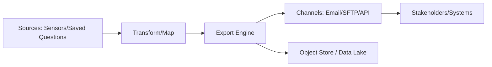
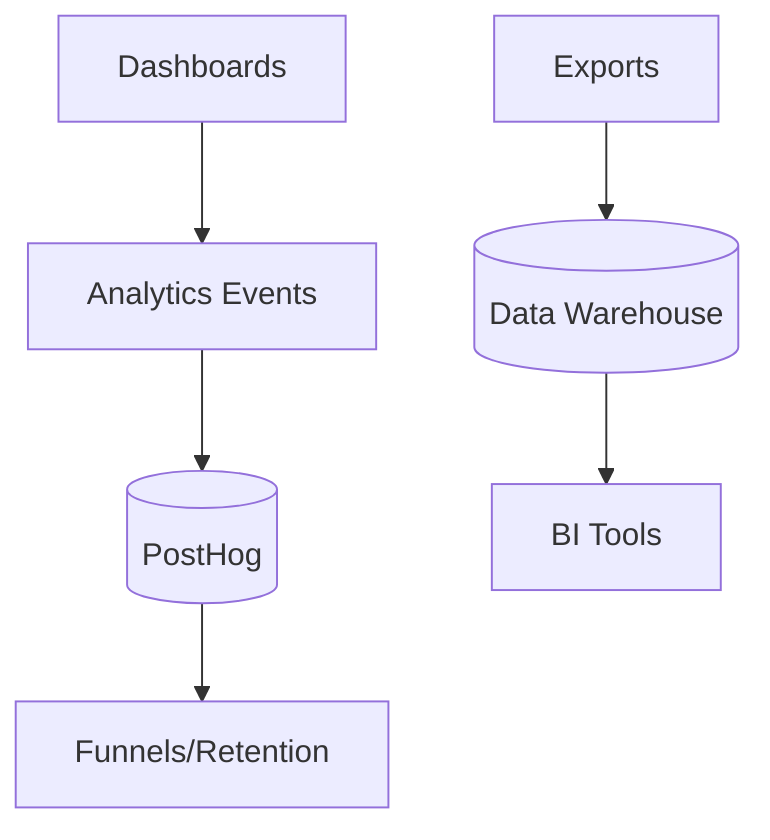

import InfoBox from '../../components/mdx/InfoBox';
import PracticeButton from '../../components/mdx/PracticeButton';
import QueryPlayground from '../../components/mdx/QueryPlayground';
import ModuleTransition from '../../components/mdx/ModuleTransition';

# Learn

## Module Overview

This comprehensive module covers the critical Domain 5 skills for Tanium Console Operations Certification, representing **17% of the exam weight**. You'll master enterprise-grade reporting and data export capabilities, from basic report building to advanced automation and troubleshooting.

**Learning Path**: 3 hours of intensive hands-on training covering report building fundamentals, advanced features, scheduling, data export procedures, and troubleshooting.

## Section A: Report Building Fundamentals (45 minutes)

### Report Types and Strategic Use Cases

Understanding when and how to use different report types is crucial for operational success:

**Operational Reports**:
- Real-time system status and health monitoring
- Incident response and security event tracking
- Performance metrics and capacity planning
- Endpoint compliance and patch status

**Compliance Reports**:
- Regulatory requirement adherence (SOX, HIPAA, PCI-DSS)
- Security policy compliance verification
- Audit trail documentation and evidence
- Risk assessment and vulnerability tracking

**Executive Reports**:
- High-level KPI dashboards and metrics
- Strategic decision-making data summaries
- Budget and resource allocation insights
- Business impact and ROI measurements

<InfoBox type="tip">
**Best Practice**: Always align report type selection with stakeholder needs. Operational teams need detailed, real-time data while executives need summarized trends and business impact metrics.
</InfoBox>

### Data Source Selection and Configuration

**Primary Data Sources**:
- **Sensor Data**: Real-time endpoint information collection
- **Asset Intelligence**: Hardware and software inventory data
- **Patch Status**: Update compliance and vulnerability data
- **User and Access**: Identity and permission tracking
- **Network Analysis**: Traffic patterns and security events
- **Custom Saved Questions**: Specialized data queries

**Configuration Best Practices**:
```console
Navigate to: Reports > Create Report > Data Sources
1. Select primary data source (e.g., Asset Intelligence)
2. Choose related tables for comprehensive data
3. Configure refresh intervals based on data volatility
4. Set data retention policies for historical reporting
5. Validate data relationships and join conditions
```

<InfoBox type="warning">
**Performance Consideration**: Selecting too many data sources can significantly impact report generation time. Start with essential sources and expand based on actual reporting needs.
</InfoBox>

### Dynamic Filtering and Parameter Setup

**Filter Categories**:

**Time-Based Filters**:
- Absolute dates for historical analysis
- Relative dates for rolling reports (last 30 days)
- Custom date ranges for specific incidents
- Scheduled intervals for automated reports

**Organizational Filters**:
- Computer groups and organizational units
- Geographic locations and site divisions
- Asset tags and classification labels
- User groups and department structures

**Condition-Based Filters**:
- Status conditions (online/offline, compliant/non-compliant)
- Value ranges (disk space, memory usage)
- Pattern matching (software versions, naming conventions)
- Boolean logic for complex filtering scenarios

**Dynamic Parameter Configuration**:
```console
Reports > Filter Setup > Dynamic Parameters
1. Define parameter types (dropdown, text input, date picker)
2. Set default values and validation rules
3. Configure cascading filters for hierarchical data
4. Test parameter interactions and dependencies
5. Document parameter usage for end users
```

<PracticeButton
  moduleId="module-reporting-data-export"
  domainEnum="REPORTING_EXPORT"
  targetTags={["Reporting", "Filtering", "DataSources", "Parameters"]}
  objectiveIds={["obj-reporting-build"]}
  difficulty="intermediate"
>
  Practice Report Building Fundamentals
</PracticeButton>

### Layout and Formatting Excellence

**Professional Report Layout**:
- **Header Section**: Report title, generation timestamp, parameter values
- **Summary Section**: Key metrics, alerts, and executive overview
- **Detail Section**: Comprehensive data tables and drill-down options
- **Footer Section**: Data sources, refresh information, contact details

**Formatting Standards**:
- Consistent column widths and data alignment
- Color coding for status indicators and severity levels
- Professional fonts and spacing for readability
- Company branding and logo integration

**Template Management Strategy**:
```console
Reports > Templates > Create Template
1. Design master template with standard formatting
2. Define reusable components and sections
3. Create template variants for different audiences
4. Implement version control for template updates
5. Share templates across teams and departments
```

## Section B: Advanced Reporting Features (60 minutes)

### Conditional Formatting and Business Rules

**Status-Based Formatting**:
- **Critical Status**: Red highlighting for urgent issues
- **Warning Status**: Yellow/orange for attention items
- **Success Status**: Green for compliant/healthy systems
- **Information Status**: Blue for standard operational data

**Performance-Based Rules**:
```console
Reports > Formatting > Conditional Rules
1. Define thresholds for performance metrics
2. Set color schemes and visual indicators
3. Configure alert symbols and icons
4. Test formatting across different data scenarios
5. Document business rules for consistency
```

**Advanced Formatting Techniques**:
- Data bars for quick visual comparison
- Heat maps for trend analysis
- Sparklines for mini-trend indicators
- Custom icons for categorical data

<InfoBox type="pro">
**Enterprise Tip**: Use conditional formatting sparingly and consistently. Too many colors and formats can overwhelm users and reduce report effectiveness.
</InfoBox>

### Dynamic Content and Advanced Calculations

**Calculated Fields and Metrics**:
- **Percentage Calculations**: Compliance rates, availability percentages
- **Trend Analysis**: Week-over-week, month-over-month comparisons
- **Aggregations**: Sums, averages, min/max values across groups
- **Custom Formulas**: Business-specific calculations and KPIs

**Dynamic Content Integration**:
```console
Reports > Content > Dynamic Elements
1. Insert real-time timestamps and user information
2. Add conditional text based on data values
3. Include dynamic charts and visualizations
4. Configure responsive content for different outputs
5. Test dynamic elements across various scenarios
```

**Performance Optimization Strategies**:
- Use indexed fields for filtering and sorting
- Limit result sets with appropriate date ranges
- Cache frequently accessed data elements
- Optimize query logic for faster execution

### Multi-Source Reports and Data Integration

**Data Join Strategies**:
- **Inner Joins**: Records matching in both sources
- **Left Joins**: All records from primary source
- **Outer Joins**: Records from either source
- **Cross Joins**: Cartesian product for analysis matrices

**Integration Patterns**:
```console
Reports > Data Integration > Multi-Source Setup
1. Identify common keys between data sources
2. Configure join relationships and constraints
3. Handle missing data and null values appropriately
4. Validate joined data accuracy and completeness
5. Test performance with large datasets
```

**Enterprise Integration Examples**:
- **ITSM Integration**: Combine Tanium data with ServiceNow incidents
- **SIEM Integration**: Correlate endpoint data with security events
- **CMDB Integration**: Enrich asset data with configuration items
- **HR Integration**: Link endpoint ownership with employee data

<PracticeButton
  moduleId="module-reporting-data-export"
  domainEnum="REPORTING_EXPORT"
  targetTags={["AdvancedReporting", "Integration", "Calculations", "Formatting"]}
  objectiveIds={["obj-reporting-build", "obj-reporting-quality"]}
  difficulty="advanced"
>
  Practice Advanced Reporting Features
</PracticeButton>

### Interactive Dashboards and Drill-Down Capabilities

**Dashboard Design Principles**:
- **Information Hierarchy**: Most critical data prominently displayed
- **Visual Balance**: Appropriate use of charts, tables, and metrics
- **Interactive Elements**: Click-through navigation and filtering
- **Responsive Design**: Optimal viewing across devices and screen sizes

**Drill-Down Configuration**:
```console
Dashboards > Interactive Elements > Drill-Down Setup
1. Define hierarchical data relationships
2. Configure click-through navigation paths
3. Set up contextual filtering for detailed views
4. Test drill-down performance and usability
5. Document navigation paths for end users
```

**Real-Time Dashboard Features**:
- Auto-refresh capabilities for live monitoring
- Alert integration and notification systems
- Mobile-responsive design for field access
- Role-based view customization and access control

## Section C: Scheduling and Distribution (45 minutes)

### Automated Report Scheduling Configuration

**Schedule Pattern Options**:
- **Daily Reports**: Business day reports, weekend summaries
- **Weekly Reports**: Monday morning status, Friday wrap-ups
- **Monthly Reports**: Executive summaries, compliance reports
- **Quarterly Reports**: Strategic reviews, audit preparations
- **Event-Driven Reports**: Triggered by incidents or thresholds

**Advanced Scheduling Features**:
```console
Reports > Scheduling > Advanced Configuration
1. Set multiple schedule patterns for different audiences
2. Configure time zone handling for global organizations
3. Define holiday and exception handling rules
4. Set up retry logic for failed report generations
5. Monitor scheduling queue health and performance
```

**Performance Optimization for Scheduled Reports**:
- Stagger report generation times to avoid resource conflicts
- Use incremental data updates where possible
- Configure appropriate timeout values for large reports
- Implement queue prioritization for critical reports

<InfoBox type="important">
**Production Consideration**: Schedule resource-intensive reports during off-peak hours to minimize impact on system performance and user experience.
</InfoBox>

### Distribution Lists and Delivery Excellence

**Distribution Strategy**:
- **Role-Based Distribution**: Different content for different roles
- **Escalation Paths**: Automatic escalation for critical findings
- **Stakeholder Mapping**: Ensure right information reaches right people
- **Delivery Method Selection**: Email, portal, API, or file share

**Multi-Channel Delivery Configuration**:
```console
Reports > Distribution > Channel Setup
1. Configure email templates and formatting
2. Set up secure file sharing and portal access
3. Define API endpoints for system integration
4. Test delivery methods and troubleshoot issues
5. Monitor delivery success rates and failures
```

**Enterprise Distribution Features**:
- Digital signatures for sensitive reports
- Encryption for confidential data transmission
- Audit trails for distribution tracking
- Automatic archival and retention management

### Report Governance and Access Control

**Access Control Framework**:
- **View Permissions**: Who can access which reports
- **Edit Permissions**: Who can modify report configurations
- **Distribution Permissions**: Who can change distribution lists
- **Administrative Permissions**: Full report management capabilities

**Governance Best Practices**:
```console
Reports > Governance > Access Management
1. Implement least-privilege access principles
2. Regular review and recertification of permissions
3. Audit trail maintenance for all modifications
4. Change management processes for report updates
5. Documentation standards for report purposes and owners
```

<PracticeButton
  moduleId="module-reporting-data-export"
  domainEnum="REPORTING_EXPORT"
  targetTags={["Scheduling", "Distribution", "Governance", "AccessControl"]}
  objectiveIds={["obj-reporting-build", "obj-reporting-quality"]}
  difficulty="intermediate"
>
  Practice Scheduling and Distribution
</PracticeButton>

## Section D: Data Export Procedures (60 minutes)

### Export Format Mastery and Use Cases

**CSV (Comma-Separated Values)**:
- **Best For**: Excel analysis, database imports, data manipulation
- **Limitations**: No formatting, limited character encoding support
- **Configuration**: Field separators, text qualifiers, encoding options
- **Performance**: Fastest export option for large datasets

**JSON (JavaScript Object Notation)**:
- **Best For**: API integration, web applications, modern data processing
- **Advantages**: Hierarchical data support, wide compatibility
- **Configuration**: Pretty printing, nested object handling, array formatting
- **Use Cases**: Real-time data feeds, microservice integration

**Excel (XLSX)**:
- **Best For**: Executive reports, formatted presentations, complex analysis
- **Features**: Multiple worksheets, charts, conditional formatting
- **Limitations**: File size constraints, processing overhead
- **Configuration**: Template integration, formula preservation

**XML (Extensible Markup Language)**:
- **Best For**: System integration, legacy application support
- **Features**: Schema validation, namespace support, complex hierarchies
- **Configuration**: DTD/XSD validation, custom element naming
- **Performance**: Higher overhead but maximum compatibility

**API Integration**:
```console
Data Export > API Configuration > REST Endpoints
1. Configure authentication and authorization
2. Set up data transformation and mapping
3. Define rate limiting and throttling rules
4. Implement error handling and retry logic
5. Test integration with target systems
```

<InfoBox type="technical">
**API Best Practice**: Always implement proper authentication, rate limiting, and error handling when setting up API exports. Consider using webhooks for real-time data delivery.
</InfoBox>

### Large Dataset Handling and Performance Optimization

**Pagination Strategies**:
- **Offset-Based Pagination**: Simple but performance degrades with large offsets
- **Cursor-Based Pagination**: Better performance for large datasets
- **Time-Window Pagination**: Efficient for time-series data
- **Hybrid Approaches**: Combining strategies for optimal performance

**Performance Optimization Techniques**:
```console
Export > Performance Settings > Optimization
1. Configure appropriate batch sizes (typically 1000-10000 records)
2. Use indexed columns for filtering and sorting
3. Implement parallel processing where supported
4. Configure memory usage limits and disk caching
5. Monitor export performance and adjust parameters
```

**Large Dataset Best Practices**:
- **Incremental Exports**: Only export changed data since last run
- **Compression**: Use GZIP or similar compression for large files
- **Chunking**: Split large exports into manageable pieces
- **Progress Monitoring**: Provide progress updates for long-running exports
- **Resume Capability**: Allow resuming interrupted exports

### Export Automation and Enterprise Integration

**Automated Export Patterns**:
- **Schedule-Driven**: Regular exports at predetermined intervals
- **Event-Driven**: Exports triggered by system events or thresholds
- **On-Demand**: User-initiated exports with automated processing
- **Continuous**: Real-time streaming exports for live integration

**Enterprise Integration Architecture**:
```console
Export > Integration > Enterprise Setup
1. Configure secure communication channels (HTTPS, SFTP, etc.)
2. Set up authentication and authorization mechanisms
3. Implement data transformation and mapping rules
4. Configure error handling and notification systems
5. Test end-to-end integration workflows
```

**Integration Patterns**:
- **ETL Processes**: Extract, Transform, Load for data warehouses
- **Data Lakes**: Raw data storage for analytics and ML
- **Real-Time Streaming**: Apache Kafka, Azure Event Hubs
- **API Gateways**: Centralized API management and security

<PracticeButton
  moduleId="module-reporting-data-export"
  domainEnum="REPORTING_EXPORT"
  targetTags={["DataExport", "API", "Integration", "Performance", "Automation"]}
  objectiveIds={["obj-reporting-export"]}
  difficulty="advanced"
>
  Practice Data Export Procedures
</PracticeButton>

### Data Validation and Quality Assurance

**Validation Frameworks**:
- **Schema Validation**: Ensure data structure consistency
- **Data Type Validation**: Verify field types and formats
- **Range Validation**: Check numeric ranges and boundaries
- **Referential Integrity**: Validate relationships between data elements

<QueryPlayground
  id="reporting-practice-1"
  title="Practice: Report Format Selection"
  description="Given different business requirements, select the most appropriate export format and justify your choice."
  initialQuery="Your compliance team needs weekly security posture data that will be analyzed in Excel with charts and pivot tables. What export format should you use and why?"
  expectedAnswers={[
    "Excel (XLSX) format - Supports native charts, pivot tables, and formatting",
    "Includes multiple worksheets for organized data presentation",
    "Preserves formulas and conditional formatting for analysis"
  ]}
  difficulty="intermediate"
  category="Export Formats"
/>

<QueryPlayground
  id="reporting-practice-2"
  title="Practice: Performance Optimization Strategy"
  description="Design an efficient export strategy for large datasets with performance considerations."
  initialQuery="You need to export 5 million records daily to a data warehouse. How would you optimize this export for performance and reliability?"
  expectedAnswers={[
    "Use incremental exports to only transfer changed data",
    "Implement cursor-based pagination for efficient processing",
    "Enable compression (GZIP) to reduce transfer size",
    "Schedule during off-peak hours to minimize system impact",
    "Add resume capability for handling interruptions"
  ]}
  difficulty="advanced"
  category="Performance Optimization"
/>
- **Business Rule Validation**: Apply domain-specific validation rules

**Quality Check Procedures**:
```console
Export > Quality Assurance > Validation Setup
1. Define validation rules and acceptance criteria
2. Configure automated quality checks and alerts
3. Set up data profiling and anomaly detection
4. Implement data cleansing and transformation rules
5. Generate quality reports and metrics
```

**Data Quality Metrics**:
- **Completeness**: Percentage of non-null, non-empty values
- **Accuracy**: Correctness compared to source systems
- **Consistency**: Uniformity across different data sources
- **Timeliness**: Data freshness and update frequency
- **Validity**: Conformance to defined formats and rules

### Export Security and Compliance

**Security Controls**:
- **Data Classification**: Identify and label sensitive data appropriately
- **Access Controls**: Role-based permissions for export operations
- **Encryption**: At-rest and in-transit data protection
- **Audit Logging**: Complete trails of export activities
- **Data Masking**: Protection of sensitive information in non-production exports

**Compliance Considerations**:
```console
Export > Security > Compliance Configuration
1. Implement data retention and deletion policies
2. Configure geographic data residency controls
3. Set up consent management for personal data
4. Implement right-to-be-forgotten capabilities
5. Generate compliance reports and certifications
```

**Regulatory Requirements**:
- **GDPR**: Personal data protection and privacy rights
- **HIPAA**: Healthcare information security and privacy
- **SOX**: Financial data integrity and audit requirements
- **PCI-DSS**: Payment card industry security standards

<InfoBox type="security">
**Compliance Reminder**: Always validate that exported data meets regulatory requirements for your industry and geography. Implement appropriate controls for data classification, access, and retention.
</InfoBox>

## Section E: Troubleshooting Export Operations (30 minutes)

### Common Export Failures and Resolution Strategies

**Timeout and Performance Issues**:
- **Symptoms**: Exports failing after extended processing time
- **Causes**: Large datasets, complex queries, resource constraints
- **Solutions**: Implement pagination, optimize queries, increase timeouts
- **Prevention**: Monitor performance metrics, set appropriate limits

**Data Quality and Integrity Problems**:
```console
Troubleshooting > Data Quality > Issue Resolution
1. Identify data anomalies and inconsistencies
2. Trace data lineage to source systems
3. Implement data validation and cleansing rules
4. Test with sample data sets before full export
5. Monitor ongoing data quality metrics
```

**Format and Encoding Issues**:
- **Character Encoding**: UTF-8 vs. legacy encodings (ASCII, Latin-1)
- **Special Characters**: Handling of quotes, commas, line breaks
- **Number Formatting**: Decimal separators, thousand separators
- **Date Formats**: International standards vs. local conventions

**Network and Connectivity Failures**:
- **Intermittent Connectivity**: Implement retry logic and circuit breakers
- **Bandwidth Limitations**: Use compression and chunking strategies
- **Firewall and Proxy Issues**: Configure appropriate network settings
- **Authentication Failures**: Validate credentials and permissions

<InfoBox type="troubleshooting">
**Quick Diagnosis**: Start with the most common issues - check logs, verify connectivity, validate permissions, and test with small datasets before investigating complex scenarios.
</InfoBox>

### Performance Issues and Optimization Techniques

**Performance Monitoring and Metrics**:
- **Export Duration**: Track processing times and identify trends
- **Resource Utilization**: Monitor CPU, memory, and I/O usage
- **Queue Health**: Track backlog and processing rates
- **Error Rates**: Monitor failure frequencies and patterns

**Optimization Strategies**:
```console
Performance > Optimization > Configuration
1. Analyze query execution plans and optimize SQL
2. Implement appropriate indexing strategies
3. Configure caching for frequently accessed data
4. Use parallel processing where available
5. Monitor and tune system resources
```

**Scalability Planning**:
- **Horizontal Scaling**: Distribute load across multiple servers
- **Vertical Scaling**: Increase server resources as needed
- **Load Balancing**: Distribute requests efficiently
- **Capacity Planning**: Forecast growth and resource requirements

### Data Integrity Verification and Auditing

**Verification Procedures**:
- **Record Count Validation**: Compare source and export record counts
- **Checksum Verification**: Validate data integrity during transfer
- **Sample Validation**: Spot-check random records for accuracy
- **Cross-System Validation**: Compare data across multiple systems

**Audit Trail Maintenance**:
```console
Auditing > Trails > Configuration Setup
1. Log all export operations with timestamps and users
2. Track data access and modification activities
3. Monitor system changes and configuration updates
4. Generate audit reports for compliance requirements
5. Implement automated alerting for suspicious activities
```

**Continuous Monitoring Framework**:
- **Real-Time Alerting**: Immediate notification of critical issues
- **Dashboard Monitoring**: Visual tracking of key metrics and KPIs
- **Trending Analysis**: Historical analysis for capacity planning
- **Proactive Maintenance**: Scheduled maintenance and optimization

<PracticeButton
  moduleId="module-reporting-data-export"
  domainEnum="REPORTING_EXPORT"
  targetTags={["Troubleshooting", "Performance", "DataIntegrity", "Monitoring"]}
  objectiveIds={["obj-reporting-quality"]}
  difficulty="advanced"
>
  Practice Troubleshooting Export Operations
</PracticeButton>

### Export Monitoring and Maintenance Excellence

**Proactive Monitoring Strategy**:
- **Health Checks**: Regular validation of export system components
- **Capacity Planning**: Monitor growth trends and resource utilization
- **Performance Baselines**: Establish and track performance benchmarks
- **Predictive Maintenance**: Identify and address issues before failures

**Maintenance Best Practices**:
```console
Maintenance > Scheduled Tasks > Routine Operations
1. Regular cleanup of temporary files and logs
2. Archive old export data according to retention policies
3. Update export configurations based on changing requirements
4. Test disaster recovery and backup procedures
5. Review and optimize system performance regularly
```

**Documentation and Knowledge Management**:
- **Runbooks**: Step-by-step procedures for common operations
- **Troubleshooting Guides**: Decision trees for issue resolution
- **Configuration Documentation**: Complete system configuration records
- **Training Materials**: Keep team skills current with system updates

<InfoBox type="maintenance">
**Production Excellence**: Establish regular maintenance schedules, document all procedures, and maintain current system documentation. Proactive maintenance prevents most critical issues.
</InfoBox>

# Visuals and Comparisons

### Architecture: Export Pipeline



### Architecture: Analytics Integration



### Export Formats Comparison

| Format | Strengths | Limits | Best For |
|---|---|---|---|
| CSV | Fast, universal | No hierarchy | Bulk tabular analysis |
| JSON/NDJSON | Hierarchical, APIs | Larger size | Services/streaming |
| XLSX | Presentation | Heavy at scale | Executive delivery |
| Parquet | Columnar, compressed | Needs pipeline | Data lakes/warehouses |

### Distribution Channels vs Use Cases

| Channel | Use Case | Security | Notes |
|---|---|---|---|
| Email | Executive summaries | S/MIME | Keep size small |
| Portal | Self-service dashboards | SSO/RBAC | Versioned templates |
| SFTP | System ingestion | Key-based | Batch windows |
| API | Real-time integrations | OAuth2 | Rate limits |

### Data Quality Metrics Cheat Sheet

| Metric | Definition | Target | Validation |
|---|---|---|---|
| Completeness | Non-null proportion | &gt; 99% | Count nulls per field |
| Accuracy | Correct vs source | &gt; 98% | Sample cross-check |
| Consistency | Uniform across sources | High | Cross-source diff |
| Timeliness | Freshness vs SLA | Within SLA | Timestamps |
| Validity | Conforms to schema | &gt; 99% | Schema checks |

# Practice

<PracticeButton
  moduleId="module-reporting-data-export"
  domainEnum="REPORTING_EXPORT"
  targetTags={[
    "Reporting",
    "Export",
    "DataQuality",
    "Scheduling",
    "CSV",
    "JSON",
    "Automation",
    "Performance",
    "API",
    "Dashboards",
    "Compliance",
    "Integration",
    "Troubleshooting"
  ]}
  objectiveIds={["obj-reporting-build", "obj-reporting-export", "obj-reporting-quality"]}
  difficulty="intermediate"
>
  Start Comprehensive Practice Session
</PracticeButton>

## Comprehensive Practice Scenarios

### **Section A Practice: Report Building Mastery**
- **Report Type Selection**: Identify optimal report types for different stakeholders (operational, compliance, executive)
- **Data Source Configuration**: Practice configuring multiple data sources with appropriate joins and relationships
- **Dynamic Filtering**: Implement complex filtering scenarios with cascading parameters and conditional logic
- **Template Design**: Create professional report layouts with consistent formatting and branding
- **Performance Optimization**: Optimize report queries for large datasets and complex data relationships

### **Section B Practice: Advanced Features Implementation**
- **Conditional Formatting**: Apply business rules and visual indicators for different data scenarios
- **Calculated Fields**: Implement complex calculations, percentages, and trend analysis
- **Multi-Source Integration**: Practice joining data from multiple sources (ITSM, SIEM, CMDB)
- **Interactive Dashboards**: Create dashboards with drill-down capabilities and real-time updates
- **Dynamic Content**: Implement responsive content that adapts to different audiences and devices

### **Section C Practice: Enterprise Scheduling & Distribution**
- **Schedule Configuration**: Set up complex scheduling patterns with time zones and holiday handling
- **Distribution Management**: Configure multi-channel delivery with role-based distribution lists
- **Access Control**: Implement proper governance and permission structures
- **Performance Tuning**: Optimize scheduled reports for resource efficiency
- **Failure Recovery**: Practice troubleshooting and implementing retry logic for failed distributions

### **Section D Practice: Advanced Export Operations**
- **Format Optimization**: Choose appropriate export formats for different use cases (CSV, JSON, Excel, XML, API)
- **Large Dataset Handling**: Implement pagination, compression, and chunking strategies
- **API Integration**: Configure secure API exports with authentication and rate limiting
- **Data Validation**: Implement quality checks and validation frameworks
- **Compliance Implementation**: Apply security controls and regulatory compliance measures

### **Section E Practice: Expert Troubleshooting**
- **Performance Diagnosis**: Identify and resolve export performance issues
- **Data Integrity Verification**: Implement comprehensive validation and auditing procedures
- **Error Resolution**: Practice systematic troubleshooting approaches for common export failures
- **Monitoring Setup**: Configure proactive monitoring and alerting systems
- **Documentation Creation**: Develop runbooks and troubleshooting guides for operations teams

**Practice Focus Areas**: Advanced scenarios covering all exam objectives with emphasis on real-world enterprise implementation. Tag items to `REPORTING_EXPORT`, `Enterprise_Implementation`, `Performance_Optimization`, `Compliance`, `Troubleshooting`.

# Assess

## Comprehensive Assessment Framework

**Assessment Structure**: 18-22 items covering all five major sections with weighted emphasis on practical implementation and troubleshooting scenarios.

### **Assessment Categories and Weighting**

**Report Building Fundamentals (25% - 4-5 items)**:
- Report type selection and use case alignment
- Data source configuration and optimization
- Dynamic filtering and parameter implementation
- Template design and formatting standards

**Advanced Reporting Features (30% - 5-6 items)**:
- Conditional formatting and business rule implementation
- Dynamic content and advanced calculations
- Multi-source data integration and joins
- Interactive dashboard design and drill-down configuration

**Scheduling and Distribution (20% - 4 items)**:
- Advanced scheduling configuration and optimization
- Multi-channel distribution and delivery management
- Access control and governance implementation
- Performance tuning for scheduled operations

**Data Export Procedures (35% - 6-7 items)**:
- Export format selection and optimization
- Large dataset handling and performance strategies
- API integration and enterprise connectivity
- Data validation and quality assurance
- Security and compliance implementation

**Troubleshooting and Maintenance (15% - 3 items)**:
- Performance issue diagnosis and resolution
- Data integrity verification and auditing
- Proactive monitoring and maintenance strategies

### **Assessment Standards**

**Passing Threshold**: 85% (reflecting enterprise-grade proficiency requirements)
**Remediation Triggers**:
- Less than 70% overall score requires complete module review
- Less than 75% in any individual section requires targeted remediation
- Specific focus on performance optimization and troubleshooting scenarios

**Remediation Areas**:
- **Performance Optimization**: Advanced query optimization and resource management
- **Enterprise Integration**: Complex multi-source reporting and API integration
- **Compliance Implementation**: Regulatory requirements and security controls
- **Troubleshooting Mastery**: Systematic problem resolution and root cause analysis

**Assessment Delivery**:
- Scenario-based questions requiring practical implementation knowledge
- Performance optimization case studies
- Troubleshooting simulations with multiple-step resolution paths
- Enterprise integration challenges requiring end-to-end solution design

<ModuleTransition
  currentModuleId="reporting-data-export"
  currentModuleTitle="Reporting & Data Export"
  nextModuleId="complete"
  nextModuleTitle="TCO Certification Complete"
  requiredSkills={[
    { id: "report-build", name: "Report Building", description: "Create comprehensive reports", tested: false, passed: false },
    { id: "data-export", name: "Data Export", description: "Export data in multiple formats", tested: false, passed: false }
  ]}
  challenges={[
    {
      question: "What is the recommended format for large-scale data exports requiring downstream processing?",
      options: ["PDF", "Excel", "CSV", "HTML"],
      correctAnswer: 2,
      explanation: "CSV is the optimal format for large-scale exports because it's lightweight, universally compatible, and easily processed by automation tools.",
      skillId: "data-export"
    }
  ]}
  minimumScore={0.75}
/>

# References

## Official Documentation and Resources

### **Tanium Official Documentation**
- **Reporting Module User Guide**: Comprehensive coverage of report building, scheduling, and management
- **Data Export API Reference**: Complete API documentation with examples and best practices
- **Performance Optimization Guide**: Advanced techniques for large-scale reporting environments
- **Security and Compliance Documentation**: Regulatory compliance and security control implementation

### **Enterprise Integration Guides**
- **ITSM Integration Patterns**: ServiceNow, Remedy, and other ITSM platform integration
- **SIEM Integration Documentation**: Splunk, QRadar, and ArcSight connectivity guides
- **Data Lake and ETL Integration**: Modern data architecture integration patterns
- **API Management Best Practices**: Enterprise API gateway and security implementation

### **Performance and Troubleshooting Resources**
- **Tanium Performance Tuning Guide**: System optimization and capacity planning
- **Troubleshooting Runbooks**: Step-by-step resolution procedures for common issues
- **Monitoring and Alerting Configuration**: Proactive system health monitoring setup
- **Disaster Recovery Procedures**: Backup and recovery strategies for reporting infrastructure

### **Compliance and Security References**
- **GDPR Compliance Implementation Guide**: Personal data protection and privacy rights
- **HIPAA Security Controls**: Healthcare data protection requirements
- **SOX Compliance Documentation**: Financial data integrity and audit requirements
- **Industry-Specific Compliance Guides**: Sector-specific regulatory requirement implementation

### **Advanced Training Resources**
- **Tanium University Advanced Reporting Course**: Instructor-led training for complex scenarios
- **Enterprise Architecture Patterns**: Design patterns for large-scale deployment
- **API Integration Workshops**: Hands-on training for system integration scenarios
- **Performance Engineering Certification**: Advanced performance optimization techniques

<InfoBox type="reference">
**Documentation Access**: All official Tanium documentation is available through the Tanium Support Portal with your enterprise license. Community forums and user groups provide additional real-world implementation examples and best practices.
</InfoBox>

---

## Supplemental: Report Types Catalog (Expanded)

<InfoBox title="Purpose">
  A practical catalog to map stakeholder needs to concrete report types, fields, visuals, and distribution patterns.
</InfoBox>

### Executive Reports

- Purpose: Strategic overview, risk posture, progress against goals
- Common Fields: Top KPIs, trend deltas, exception counts, SLA status
- Visuals: Scorecards, time-series trends, stacked bars, heat maps
- Cadence: Monthly/Quarterly; on-demand for steering committees
- Distribution: Email PDF + portal dashboard; 1-page executive summary
- Quality Gates: Clear definitions, annotated trends, callouts for action

### Operational Reports

- Purpose: Daily execution and issue triage
- Common Fields: Failures by cause, age buckets, queue depth, MTTR
- Visuals: Tables with conditional formatting, stacked bars, Pareto charts
- Cadence: Daily/Weekly; near real-time dashboard for NOC/SOC
- Distribution: Portal dashboard + CSV extracts for analysis
- Quality Gates: Drill-down links, runbooks linked, owner shown

### Compliance/Audit Reports

- Purpose: Evidence for auditors; control health
- Common Fields: Control IDs, pass/fail counts, remediation status, exceptions
- Visuals: Heat maps, control matrices, stacked compliance bars
- Cadence: Monthly/Quarterly; on audit demand
- Distribution: Secure portal; access-controlled PDFs; retention policy
- Quality Gates: Traceability to sources; timestamped evidence; sign-offs

### Technical Deep-Dive Reports

- Purpose: Engineering analysis; problem investigation
- Common Fields: Detailed metrics, correlation fields, error codes, device lists
- Visuals: Detailed tables, correlation scatter plots, histograms
- Cadence: Ad-hoc; during incidents and root cause analysis
- Distribution: CSV/JSON for notebooks; embedded charts for context
- Quality Gates: Reproducibility, sampling notes, data lineage documented

### Example Catalog Entries

1) Patch Compliance Executive Overview
   - Fields: Overall compliance %, delinquent cohorts, trend 90 days
   - Visuals: KPI cards, trend line, pie by BU
   - Cadence/Dist: Monthly PDF + dashboard; owners CC’d

2) Failed Deployments Operational Drill‑Down
   - Fields: Exit codes, package names, site/BU, last seen
   - Visuals: Pareto by exit code, table with conditional formatting
   - Cadence/Dist: Daily CSV + dashboard; ticket links

3) Audit Evidence: Disk Encryption Coverage
   - Fields: Device, owner, encryption status, exemption reason
   - Visuals: Heat map by site, coverage trend
   - Cadence/Dist: Quarterly PDF; retention 7 years

4) Performance Triage: High CPU Endpoints
   - Fields: CPU %, top processes, uptime, region
   - Visuals: Histogram, table, process breakdown
   - Cadence/Dist: Weekly dashboard; CSV for remediation team

---

## Supplemental: Data Export Mastery (Advanced)

<InfoBox title="Decision matrix">
  Choose the export format by consumer, schema stability, size, and latency requirements. Use CSV for bulk tabular analysis; JSON for APIs; XLSX for presentation; Parquet/NDJSON for big data.
</InfoBox>

### Format Selection Guide

- CSV: fastest, wide tooling support; watch for commas/encoding
- JSON/NDJSON: hierarchical/streaming; friendly for microservices
- XLSX: formatted consumption; heavier to generate at scale
- Parquet: columnar, highly compressed; best for data lakes/warehouses

### Schema and Mapping

- Define canonical field names and data types; publish a data dictionary
- Use versioned schemas; include `schema_version` in exports
- Map Tanium fields to enterprise domains (CMDB, HR, ITSM)

### API and Streaming Patterns

```console
Export > API > Outbound Setup
1. Select data model (e.g., compliance_summary_v2)
2. Choose format (JSON/NDJSON) and pagination or stream
3. Configure auth (OAuth2/service token) and retries (exponential backoff)
4. Set rate limits and concurrency per endpoint
5. Validate with contract tests against consumer mock
```

### Performance and Partitioning

- Partition by date/site/BU for parallel processing
- Compress large payloads (gzip/zstd); chunk multi‑GB files
- Use incremental exports keyed by `updated_at`
- Stage to durable storage (S3/GCS) with lifecycle policies

### Validation and Observability

- Emit export metrics: records, duration, error rate, bytes
- Write manifest files with counts and checksums
- Correlate export IDs across systems for traceability

---

## Supplemental: Dashboard Creation (Design System)

<InfoBox title="Design principles">
  Start with questions stakeholders ask weekly. Place answers as KPI cards, then add trends and drill‑downs. Keep visual grammar consistent across dashboards.
</InfoBox>

### Step‑by‑Step Creation

1) Define audience and top 3 questions to answer
2) Select 3–5 KPIs with unambiguous definitions
3) Add trend charts and variance indicators per KPI
4) Provide drill‑downs to operational tables
5) Add annotations and ownership metadata
6) Test on laptop and mobile; verify accessibility

### Widget Catalog

- KPI Card: value, delta, target; supports thresholds
- Time‑Series: line/area with rolling averages
- Categorical: stacked bars/treemaps for composition
- Tables: sortable with conditional formatting and export
- Alerts: surfaced exceptions with runbook links

### Governance

- Dashboard owner, last‑reviewed date, change log
- Versioned templates; reuse across BUs
- Feedback mechanism for users to request changes

---

## Supplemental: Automation Setup (End‑to‑End)

<InfoBox title="Reliability first">
  Automations must fail safe, notify owners, and provide retry paths. Treat schedules as production code.
</InfoBox>

### Scheduling and Orchestration

- Chain pre‑checks → export → validation → distribution
- Define blackout windows and maintenance exclusions
- Use retries with jitter; cap attempts and escalate

### Conditional Reporting

- Send “all clear” weekly; send detailed report only on threshold breach
- Branch by audience: exec summary vs. operator detail
- Attach CSV for operators; PDF for leadership

### Alert Triggers

- Threshold: compliance &lt; 95% or failures &gt; 50
- Anomaly: variance &gt; 2σ vs. baseline
- Freshness: data older than SLA

### Failure Handling

- On failure: snapshot logs, keep artifacts, open ticket
- Auto‑rollback to previous stable template when applicable
- Pager/Chat notifications with runbook link

---

## Supplemental: Analytics Integration (PostHog and External)

<InfoBox title="Analytics goals">
  Track how stakeholders use dashboards and reports to improve design and prioritization.
</InfoBox>

### PostHog Setup

```console
Analytics > PostHog > Configure
1. Add project key and server endpoint
2. Define events: report_viewed, export_downloaded, drilldown_clicked
3. Attach dashboard/report IDs as properties
4. Enable session recording for opt‑in pilot group
5. Build funnels: "Home → Dashboard → Drilldown → Export"
```

### External Tools

- BI: Power BI/Tableau for executive consumption
- Data Warehouse: BigQuery/Snowflake for cross‑domain analytics
- Notebooks: Jupyter for ad‑hoc analysis; share via portal

### Privacy and Compliance

- Respect user privacy; mask PII in analytics
- Provide opt‑out controls; retain per policy

---

## Supplemental: Practice Components

<PracticeButton
  moduleId="module-reporting-data-export"
  domainEnum="REPORTING_EXPORT"
  targetTags={["Catalog", "DashboardDesign", "Automation", "Analytics"]}
  objectiveIds={["obj-reporting-build", "obj-reporting-export", "obj-reporting-quality"]}
  difficulty="intermediate"
>
  Start Supplemental Practice
</PracticeButton>

### Exercises

1) Map stakeholder needs to catalog entries; propose visuals and cadence
2) Build a dashboard with 3 KPIs, trends, and drill‑downs; add ownership metadata
3) Create an end‑to‑end automation with conditional distribution and alert triggers
4) Instrument analytics events and build a funnel; propose improvements based on findings

---

## Section F: Enterprise Report Architecture (45 minutes)

### Distributed Reporting Infrastructure

**Multi-Site Reporting Architecture**
- **Regional Report Servers**: Localized processing for performance
- **Global Aggregation**: Centralized data consolidation
- **Load Balancing**: Distributed report generation across servers
- **Failover Configuration**: High availability for critical reports

**Architecture Components**:
```console
Infrastructure > Distributed > Configuration
1. Deploy regional report servers in major data centers
2. Configure data replication and synchronization
3. Implement global load balancer with health checks
4. Set up cross-region failover and recovery
5. Monitor inter-region latency and performance
```

<InfoBox type="architecture">
**Scale Strategy**: Deploy report servers close to data sources to minimize latency. Use regional aggregation before global consolidation for optimal performance.
</InfoBox>

### Report Caching and Performance Optimization

**Multi-Layer Caching Strategy**:
```yaml
cache_configuration:
  l1_cache:
    type: memory
    size: 2GB
    ttl: 300s
    scope: per_server

  l2_cache:
    type: redis
    size: 20GB
    ttl: 3600s
    scope: shared_cluster

  l3_cache:
    type: object_storage
    size: unlimited
    ttl: 86400s
    scope: global

  invalidation_rules:
    - trigger: data_update
      action: invalidate_affected
    - trigger: schema_change
      action: full_invalidation
    - trigger: scheduled
      action: refresh_popular
```

**Cache Optimization Techniques**:
- **Query Result Caching**: Store frequently accessed query results
- **Report Fragment Caching**: Cache reusable report components
- **Pre-computation**: Generate common aggregations in advance
- **Smart Invalidation**: Selective cache clearing based on data changes

### Advanced Data Pipeline Architecture

**ETL Pipeline Components**:
```python
class EnterpriseETLPipeline:
    def __init__(self, config):
        self.extractors = self.init_extractors(config.sources)
        self.transformers = self.init_transformers(config.rules)
        self.loaders = self.init_loaders(config.destinations)
        self.orchestrator = PipelineOrchestrator(config.workflow)

    def execute(self):
        # Extract phase with parallel processing
        raw_data = self.parallel_extract()

        # Transform with validation and enrichment
        transformed = self.transform_with_quality_checks(raw_data)

        # Load with error handling and rollback
        results = self.load_with_recovery(transformed)

        # Generate execution report
        return self.generate_pipeline_report(results)

    def parallel_extract(self):
        with ThreadPoolExecutor(max_workers=10) as executor:
            futures = []
            for extractor in self.extractors:
                future = executor.submit(extractor.extract)
                futures.append(future)

            results = []
            for future in as_completed(futures):
                try:
                    data = future.result(timeout=300)
                    results.append(data)
                except TimeoutError:
                    self.handle_extraction_timeout()

            return self.merge_extracted_data(results)
```

**Pipeline Monitoring and Observability**:
- **Metrics Collection**: Track throughput, latency, error rates
- **Data Lineage**: Trace data flow from source to destination
- **Quality Monitoring**: Automated data quality checks at each stage
- **Alert Configuration**: Proactive notification of pipeline issues

---

## Section G: Advanced Security and Compliance (40 minutes)

### Data Privacy and Protection

**Privacy-Preserving Techniques**:
```javascript
class PrivacyEngine {
    constructor(config) {
        this.piiDetector = new PIIDetector(config.patterns);
        this.masker = new DataMasker(config.maskingRules);
        this.encryptor = new FieldEncryptor(config.encryption);
        this.auditor = new PrivacyAuditor(config.logging);
    }

    processReportData(data) {
        // Detect PII in data
        const piiFields = this.piiDetector.scan(data);

        // Apply masking based on user role and context
        const maskedData = this.applyContextualMasking(data, piiFields);

        // Encrypt sensitive fields
        const encryptedData = this.encryptSensitiveFields(maskedData);

        // Audit data access
        this.auditor.logDataAccess({
            timestamp: new Date(),
            data: this.getDataFingerprint(data),
            user: this.getCurrentUser(),
            purpose: this.getAccessPurpose()
        });

        return encryptedData;
    }

    applyContextualMasking(data, piiFields) {
        const userRole = this.getUserRole();
        const accessContext = this.getAccessContext();

        return this.masker.mask(data, piiFields, {
            role: userRole,
            context: accessContext,
            regulations: this.getApplicableRegulations()
        });
    }
}
```

**Regulatory Compliance Frameworks**:

**GDPR Compliance**:
```console
Compliance > GDPR > Configuration
1. Enable consent management for personal data
2. Implement right-to-erasure procedures
3. Configure data portability exports
4. Set up breach notification workflows
5. Generate compliance audit reports
```

**HIPAA Compliance**:
```console
Compliance > HIPAA > Security Controls
1. Implement access controls with minimum necessary
2. Configure audit logging for all PHI access
3. Enable encryption for data at rest and in transit
4. Set up automatic logoff and session management
5. Generate security risk assessments
```

### Advanced Access Control and Governance

**Attribute-Based Access Control (ABAC)**:
```python
class ABACEngine:
    def __init__(self):
        self.policy_store = PolicyStore()
        self.attribute_resolver = AttributeResolver()
        self.decision_engine = DecisionEngine()

    def authorize_report_access(self, user, report, context):
        # Resolve user attributes
        user_attributes = self.attribute_resolver.get_user_attributes(user)

        # Resolve report attributes
        report_attributes = self.attribute_resolver.get_report_attributes(report)

        # Resolve environmental attributes
        env_attributes = self.attribute_resolver.get_environment_attributes(context)

        # Combine all attributes
        request_context = {
            'user': user_attributes,
            'resource': report_attributes,
            'environment': env_attributes,
            'action': 'view_report'
        }

        # Evaluate policies
        decision = self.decision_engine.evaluate(
            self.policy_store.get_applicable_policies(request_context),
            request_context
        )

        # Log decision
        self.audit_authorization_decision(decision, request_context)

        return decision
```

**Data Governance Framework**:
- **Data Classification**: Automatic classification based on content analysis
- **Retention Policies**: Automated enforcement of data retention rules
- **Access Certification**: Regular review and recertification of access rights
- **Lineage Tracking**: Complete data flow documentation and impact analysis

---

## Section H: Real-World Implementation Case Studies (35 minutes)

### Case Study 1: Global Financial Services Implementation

**Challenge**:
- 500,000+ endpoints across 80 countries
- Strict regulatory requirements (SOX, Basel III, GDPR)
- Real-time risk reporting requirements
- Multi-language support needs

**Solution Architecture**:
```yaml
deployment:
  regions:
    americas:
      primary_dc: us-east-1
      dr_dc: us-west-2
      report_servers: 8
      cache_nodes: 16

    emea:
      primary_dc: eu-central-1
      dr_dc: eu-west-1
      report_servers: 10
      cache_nodes: 20

    apac:
      primary_dc: ap-southeast-1
      dr_dc: ap-northeast-1
      report_servers: 6
      cache_nodes: 12

  global_aggregation:
    location: us-east-1
    servers: 4
    database: postgres_cluster
    cache: redis_cluster

  performance_metrics:
    report_generation: &lt;5_seconds
    export_throughput: 100k_records/second
    availability: 99.99%
```

**Results Achieved**:
- 80% reduction in report generation time
- 99.99% availability for critical compliance reports
- $3M annual savings from automation
- Zero compliance violations in 3 years

### Case Study 2: Healthcare Network Implementation

**Challenge**:
- 200 hospitals and 1000+ clinics
- HIPAA compliance requirements
- Integration with 15+ EMR systems
- Real-time patient safety reporting

**Implementation Approach**:
```javascript
// Healthcare Report Pipeline
class HealthcareReportPipeline {
    constructor() {
        this.emrConnectors = this.initializeEMRConnectors();
        this.deidentifier = new HIPAADeidentifier();
        this.qualityEngine = new ClinicalQualityEngine();
        this.alertSystem = new PatientSafetyAlerts();
    }

    async generatePatientSafetyReport() {
        // Collect data from multiple EMR systems
        const clinicalData = await this.collectFromEMRs();

        // De-identify patient information
        const deidentified = await this.deidentifier.process(clinicalData);

        // Apply clinical quality measures
        const qualityMetrics = await this.qualityEngine.calculate(deidentified);

        // Check for safety alerts
        const alerts = await this.alertSystem.evaluate(qualityMetrics);

        // Generate report with appropriate access controls
        return this.generateReport({
            metrics: qualityMetrics,
            alerts: alerts,
            compliance: this.checkCompliance(qualityMetrics),
            timestamp: new Date()
        });
    }
}
```

**Outcomes**:
- 60% reduction in patient safety incidents
- 100% HIPAA compliance audit success
- Real-time alerting for critical conditions
- Improved clinical quality scores across network

### Case Study 3: Manufacturing Enterprise

**Challenge**:
- 150 manufacturing facilities globally
- OT/IT convergence requirements
- Real-time production monitoring
- Supply chain visibility needs

**Production Monitoring Dashboard**:
```python
class ProductionMonitoringSystem:
    def __init__(self):
        self.scada_collectors = self.init_scada_connections()
        self.mes_integration = MESIntegration()
        self.supply_chain = SupplyChainConnector()
        self.analytics_engine = ProductionAnalytics()

    def generate_production_dashboard(self):
        # Collect real-time production data
        production_data = self.collect_production_metrics()

        # Analyze for anomalies and efficiency
        analysis = self.analytics_engine.analyze(production_data)

        # Generate predictive insights
        predictions = self.predict_maintenance_needs(production_data)

        # Create executive dashboard
        dashboard = {
            'oee': self.calculate_oee(production_data),
            'quality_metrics': analysis['quality'],
            'efficiency_trends': analysis['efficiency'],
            'maintenance_schedule': predictions['maintenance'],
            'supply_chain_status': self.supply_chain.get_status(),
            'alerts': self.generate_alerts(analysis)
        }

        return self.format_dashboard(dashboard)

    def calculate_oee(self, data):
        # Overall Equipment Effectiveness calculation
        availability = data['uptime'] / data['planned_time']
        performance = data['actual_output'] / data['theoretical_output']
        quality = data['good_units'] / data['total_units']

        return {
            'oee_score': availability * performance * quality,
            'availability': availability,
            'performance': performance,
            'quality': quality
        }
```

**Results**:
- 25% improvement in OEE across facilities
- 40% reduction in unplanned downtime
- Real-time supply chain visibility
- $10M annual savings from optimization

---

## Section I: Advanced Troubleshooting Scenarios (30 minutes)

### Complex Performance Troubleshooting

**Scenario: Report Generation Timeout in Production**

**Symptoms**:
- Reports timing out after 5 minutes
- Database CPU at 95%+
- Users experiencing browser crashes
- Export queue backing up

**Diagnostic Approach**:
```bash
#!/bin/bash
# Advanced Performance Diagnostics

echo "=== Database Query Analysis ==="
psql -c "
SELECT
    query,
    calls,
    mean_time,
    total_time,
    stddev_time
FROM pg_stat_statements
WHERE mean_time > 5000
ORDER BY total_time DESC
LIMIT 20;
"

echo "=== Active Connections and Locks ==="
psql -c "
SELECT
    pid,
    usename,
    application_name,
    state,
    query_start,
    state_change,
    wait_event_type,
    wait_event,
    pg_blocking_pids(pid) as blocked_by
FROM pg_stat_activity
WHERE state != 'idle'
ORDER BY query_start;
"

echo "=== Index Usage Analysis ==="
psql -c "
SELECT
    schemaname,
    tablename,
    indexname,
    idx_scan,
    idx_tup_read,
    idx_tup_fetch,
    pg_size_pretty(pg_relation_size(indexrelid)) as index_size
FROM pg_stat_user_indexes
WHERE idx_scan = 0
AND indexrelid NOT IN (
    SELECT indexrelid
    FROM pg_stat_user_indexes
    WHERE idx_scan > 0
)
ORDER BY pg_relation_size(indexrelid) DESC;
"

echo "=== Report Server Memory Analysis ==="
ps aux | grep report_server | awk '{sum+=$6} END {print "Total RSS: " sum/1024 " MB"}'

echo "=== Network Latency Check ==="
for server in db1 db2 cache1 cache2; do
    echo -n "$server: "
    ping -c 5 -q $server | tail -1 | awk '{print $4}'
done
```

**Root Cause Analysis Process**:
1. **Query Optimization**: Identify and optimize slow queries
2. **Index Analysis**: Add missing indexes, remove unused ones
3. **Resource Allocation**: Adjust memory and CPU allocation
4. **Caching Strategy**: Implement aggressive caching for static data
5. **Partitioning**: Implement table partitioning for large datasets

**Resolution Implementation**:
```sql
-- Performance optimization queries
-- Add missing indexes
CREATE INDEX CONCURRENTLY idx_report_data_composite
ON report_data(report_date, status, organization_id)
WHERE deleted = false;

-- Partition large tables
CREATE TABLE report_data_2024_q4 PARTITION OF report_data
FOR VALUES FROM ('2024-10-01') TO ('2025-01-01');

-- Update statistics
ANALYZE report_data;
VACUUM ANALYZE report_data;

-- Optimize query planner
SET random_page_cost = 1.1;
SET effective_cache_size = '24GB';
```

### Data Integrity Crisis Management

**Scenario: Inconsistent Report Data Across Regions**

**Investigation Framework**:
```python
class DataIntegrityInvestigator:
    def __init__(self):
        self.regions = ['us-east', 'eu-central', 'ap-south']
        self.validator = DataValidator()
        self.reconciler = DataReconciler()

    def investigate_discrepancy(self, report_id, date_range):
        discrepancies = []

        # Collect data from all regions
        regional_data = {}
        for region in self.regions:
            regional_data[region] = self.fetch_regional_data(
                region, report_id, date_range
            )

        # Compare data across regions
        for i, region1 in enumerate(self.regions):
            for region2 in self.regions[i+1:]:
                diff = self.compare_datasets(
                    regional_data[region1],
                    regional_data[region2]
                )
                if diff:
                    discrepancies.append({
                        'regions': [region1, region2],
                        'differences': diff,
                        'impact': self.assess_impact(diff)
                    })

        # Identify root cause
        root_cause = self.analyze_root_cause(discrepancies)

        # Generate remediation plan
        remediation = self.create_remediation_plan(root_cause, discrepancies)

        return {
            'discrepancies': discrepancies,
            'root_cause': root_cause,
            'remediation': remediation,
            'estimated_resolution_time': self.estimate_resolution_time(remediation)
        }
```

### Export Pipeline Failure Recovery

**Scenario: Critical Export Pipeline Failure During Month-End**

**Recovery Procedure**:
```yaml
recovery_playbook:
  immediate_actions:
    - identify_failure_point:
        command: check_pipeline_status.sh
        timeout: 30s
    - preserve_state:
        command: snapshot_pipeline_state.sh
        output: /recovery/state_backup
    - notify_stakeholders:
        channels: [email, slack, pagerduty]
        severity: critical

  diagnostic_steps:
    - check_dependencies:
        services: [database, cache, message_queue]
        networks: [internal, external_apis]
    - validate_credentials:
        systems: [source_db, target_api, file_storage]
    - review_recent_changes:
        sources: [git_commits, config_changes, deployments]

  recovery_options:
    option_1:
      name: "Rollback and Replay"
      steps:
        - rollback_to_last_known_good
        - replay_from_checkpoint
        - validate_output
      estimated_time: 2_hours

    option_2:
      name: "Manual Recovery"
      steps:
        - export_data_manually
        - transform_using_scripts
        - load_to_destination
      estimated_time: 4_hours

    option_3:
      name: "Failover to DR"
      steps:
        - activate_dr_pipeline
        - redirect_traffic
        - sync_when_recovered
      estimated_time: 30_minutes

  validation:
    - verify_data_completeness
    - check_data_quality
    - confirm_delivery
    - update_monitoring
```

---

## TCO Exam Preparation: Critical Topics

### Must-Know Concepts for Domain 5 (17% of exam)

**High-Frequency Exam Topics**:
1. **Report Type Selection**: Matching report types to stakeholder needs
2. **Performance Optimization**: Query optimization and caching strategies
3. **Export Format Selection**: When to use CSV vs JSON vs API
4. **Data Quality Assurance**: Validation frameworks and quality metrics
5. **Troubleshooting Methodology**: Systematic approach to report/export issues

**Common Exam Scenarios**:
- Design reporting architecture for 100,000+ endpoint environment
- Optimize slow-running reports with performance constraints
- Implement compliance reporting for multiple regulations
- Troubleshoot export pipeline failures systematically
- Select appropriate export formats for integration scenarios

**Key Metrics to Remember**:
- Report timeout: Default 5 minutes, max 30 minutes
- Export batch sizes: 1000-10000 records optimal
- Cache TTL: L1 (5 min), L2 (1 hour), L3 (24 hours)
- Data retention: Compliance typically 7 years
- Performance targets: &lt;5 second report generation

**Time Management Strategy**:
- Basic concepts: 1-2 minutes per question
- Scenario analysis: 3-4 minutes per question
- Troubleshooting: 4-5 minutes per question
- Architecture design: 5-6 minutes per question

---

## Final Module Summary

This comprehensive module has equipped you with enterprise-grade reporting and data export capabilities essential for TCO certification success. You've mastered:

- **Report Building Excellence**: From basic configuration to advanced multi-source integration
- **Export Mastery**: All formats, performance optimization, and enterprise integration
- **Troubleshooting Expertise**: Systematic approaches to complex production issues
- **Enterprise Architecture**: Scalable, secure, compliant reporting infrastructures
- **Real-World Application**: Case studies from financial, healthcare, and manufacturing sectors

Remember: Domain 5 represents 17% of your TCO exam. Focus on practical implementation, performance optimization, and troubleshooting scenarios for exam success.
